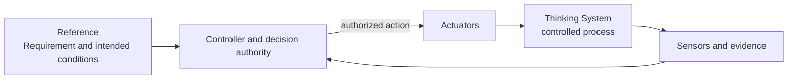
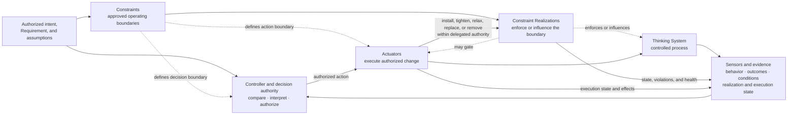
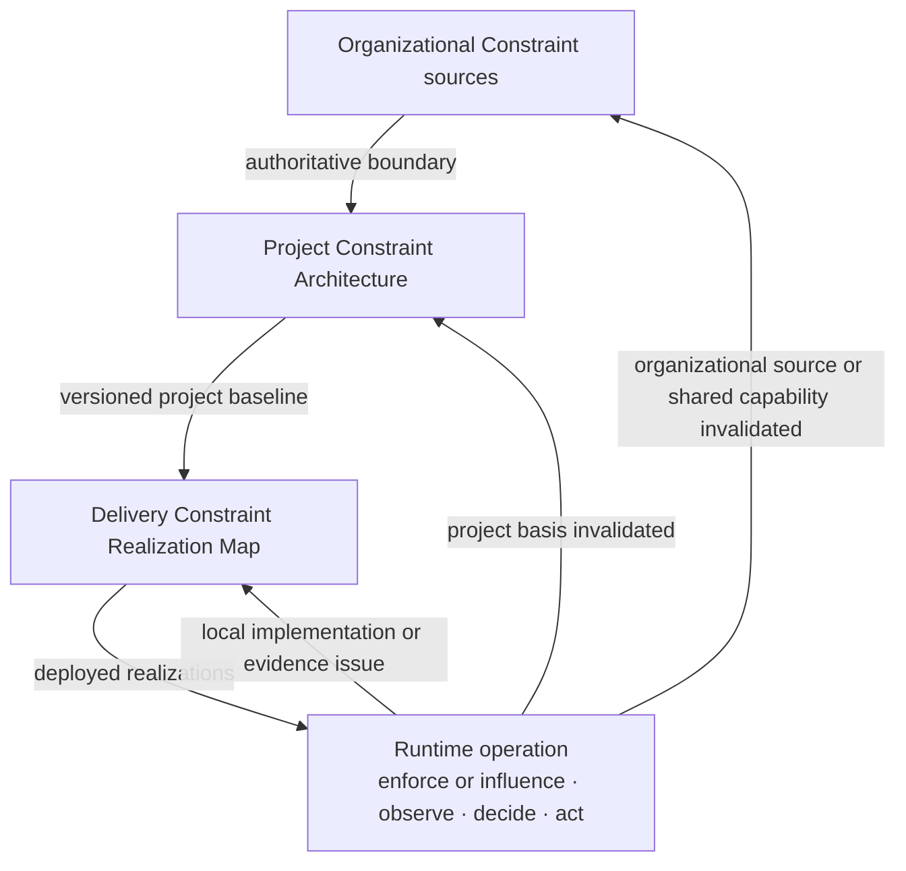

# Control-Loop Capability Anatomy

**Status:** Draft normative  
**Role:** Defines the logical capability families required to operate model-mediated behavior inside an explicitly bounded control architecture without prescribing one physical topology

## Purpose

UA separates two orthogonal models:

1. the [`Nested Control Lifecycle`](nested-control-lifecycle.md), which identifies where decisions are owned;
2. the **Control-Loop Capability Anatomy**, which identifies the functions needed to bound, observe, decide, and change operation.

The capability anatomy contains four families:

- **Constraints and their realizations** — define and operationalize approved boundaries;
- **Sensors and evidence** — observe behavior, outcomes, conditions, and control state;
- **Controllers and decision authority** — compare, interpret, select, and authorize;
- **Actuators and corrective action** — execute authorized change.

The first family is intentionally composite. A **Constraint** is an authoritative decision object: an approved condition limiting the allowed operating space. It is not itself an execution mechanism. A **Constraint Realization** is the technical or socio-technical mechanism that implements, enforces, or influences that boundary. UA groups them in one capability family because control is incomplete when either the approved boundary or its operational realization is missing. Constraint Realization is not a fifth capability family.

These are logical functions and relationships, not mandatory services, products, teams, layers, or one execution order. One component may perform several functions, and one function may be distributed.

## 1. Closed feedback loop

A feedback loop is closed when evidence about the controlled process reaches a decision function and an authorized action can affect the process again:

Constraints are not the feedback edge that closes this loop. A loop may remain closed while unsafe, over-authorized, economically destructive, or able to reach prohibited states.

## 2. Complete bounded UA control architecture

UA asks a broader question:

> Is the feedback loop operating inside an approved and credibly realized boundary, with bounded authority, useful evidence, effective Actuators, and a valid reassessment path?

The diagram expresses logical relationships, not one synchronous pipeline. Realizations may act before, during, or after a model invocation. Sensors may observe pre-release evidence, runtime behavior, downstream outcomes, realization state, Actuator execution, or operating conditions. Controllers may act synchronously or asynchronously. Actuators may change the model-mediated path, deterministic environment, deployment scope, realization, or wider socio-technical process.

## 3. Constraints

A **Constraint** is an approved condition limiting the allowed operating space.

Constraints may bound:

- states and transitions;
- actions and side effects;
- authority and autonomy;
- inputs, context, data, and provenance;
- tools, services, networks, and execution environments;
- output shape, type, structure, and allowed values;
- resource use, cost, latency, concurrency, duration, and exposure;
- deployment population, geography, domain, and operating conditions;
- Human Authority, approval, separation-of-duty, and escalation requirements.

A material Constraint should identify:

1. authoritative source or project-risk rationale;
2. subject and scope;
3. claimed hard or soft strength for that scope;
4. realization and enforcement or influence point;
5. assumptions supporting the claimed guarantee;
6. failure, bypass, conflict, and unavailable behavior;
7. proposal, approval, execution, override, and disable authority;
8. evidence about activation, violations, degradation, false blocks, and friction;
9. reassessment level when it changes.

When one source condition has different guarantee strengths across subjects, paths, or scopes, split it into separate Constraint records rather than marking one row as partly hard and partly soft.

### Hard Constraint

Hard or soft strength is a scoped claim about a Constraint together with its complete realized path. It is not an intrinsic property of policy prose, a requirement sentence, or an organizational source.

A **Hard Constraint** is a scoped Constraint whose complete realized path deterministically prevents or rejects violation within explicitly stated assumptions, scope, and enforcement boundaries.

The same source condition may be hard in one system path and soft in another because the realizations, assumptions, and reachable states differ.

Examples may include permission checks, typed-interface rejection, transaction preconditions, state-machine guards, tool allowlists, isolation boundaries, resource caps, and approval gates that technically prevent execution before approval.

A probabilistic detector, evaluator, prompt, model policy, or natural-language rule does not become hard merely because its failure behavior is documented.

### Soft Constraint

A **Soft Constraint** is a scoped Constraint whose realized path influences probabilistic behavior but does not guarantee that a prohibited state, action, or output remains unreachable.

Examples include prompts, natural-language policies, rubrics, demonstrations, model preferences, and probabilistic safety or semantic classifiers used without deterministic downstream blocking.

### Composite realization

One business Constraint may require several mechanisms. A requirement that unsupported claims must not reach a customer may combine approved-source restrictions, grounding instructions, a claim evaluator, deterministic blocking, Human Authority, and fallback Actuators.

The business Constraint is hard only for the scope in which the complete realized path deterministically prevents or rejects the prohibited outcome within stated assumptions. If part of the path only influences behavior, record the narrower hard boundary and the remaining soft boundary separately.

## 4. Constraint Realization

A **Constraint Realization** is the concrete technical or socio-technical mechanism through which a Constraint is implemented, configured, enforced or influenced, evidenced, and operated for a defined scope.

A realization may:

- reject an attempted action;
- make a state or transition unreachable;
- gate execution on approval;
- restrict data, tools, environment, resources, or exposure;
- influence probabilistic behavior;
- route uncertain cases to fallback or Human Authority.

A realization should expose active version, scope, health, assumptions, failure behavior, evidence, and change authority. A mechanism is not effective merely because it appears in architecture documentation.

## 5. Sensors and evidence

A **Sensor** produces evidence about behavior, outcomes, operating conditions, control performance, Constraint Realization state, or Actuator execution.

Sensors may observe:

- output structure and semantic quality;
- downstream outcomes;
- incidents, overrides, complaints, and near misses;
- drift across models, prompts, policies, context, tools, data, or populations;
- cost, latency, capacity, availability, and fallback load;
- realization activation, violations, bypass attempts, conflicts, degradation, or unavailability;
- false blocks and operational friction;
- Actuator execution and resulting state;
- Human Authority response time, capacity, and decision quality;
- inherited project or organizational assumptions.

A Sensor need not produce one objective truth value. It must produce evidence fit enough for a bounded decision and expose uncertainty, coverage, latency, and blind spots.

An evaluator normally performs a Sensor function. Logic selecting `block`, `canary`, or `release` performs a Controller function. The mechanism applying that decision performs an Actuator function.

## 6. Controllers and decision authority

A **Controller** compares or interprets evidence relative to an approved Requirement, assumptions, Constraints, and decision boundary, then selects or authorizes action.

A Controller may be deterministic software, bounded automated decision logic, a human decision-maker, a review or incident process, or a distributed socio-technical responsibility structure.

A Controller should identify:

- reference conditions and evidence received;
- decision owned and authority possessed;
- decisions requiring escalation;
- Constraints and realization changes it may authorize;
- Actuators it may invoke;
- expected decision latency;
- decision traceability.

A Prompt Registry, dashboard, workflow engine, HITL interface, evaluation service, or kill-switch endpoint is not automatically a Controller.

A Controller authorizes or selects change. It does not execute the change merely because one component contains both functions.

## 7. Actuators and corrective action

An **Actuator** executes an authorized change in operation.

Actuators may:

- change prompts, models, policies, context assembly, routing, or tool access;
- install, tighten, relax, replace, or remove a Constraint Realization within delegated authority;
- narrow deployment scope, authority, population, or data access;
- require Human Authority or switch to a manual path;
- enable, disable, pause, isolate, or contain a feature;
- apply fallback or degraded mode;
- roll back a model, prompt, policy, configuration, tool, realization, or deployment;
- correct downstream state or compensate affected parties;
- stop an action or shut down the system.

An API call, orchestration framework, data pipeline, feature flag, deployment operation, or human action is an Actuator only when it provides a real path from an authorized decision to changed operation.

## 8. Capability boundaries

### Constraint family

- A Constraint defines the approved boundary.
- A Constraint Realization implements, enforces, or influences that boundary.
- The operational capability depends on both being connected and traceable.

### Constraint versus Actuator

- A Constraint states what is allowed.
- An Actuator executes an authorized change.

An Actuator may change a realization. A realization may reject or block an attempted action.

### Controller versus Actuator

- A Controller decides, selects, or authorizes.
- An Actuator executes.

One component may perform both, but the distinction preserves decision rights, execution rights, evidence, latency, and failure behavior.

### Sensor versus gate

- Evaluator and metrics normally perform Sensor functions.
- Decision logic interpreting evidence performs a Controller function.
- The mechanism applying the decision performs an Actuator function.

## 9. Relationship to Requirements and Invariants

An **Invariant** is a condition that must remain true across relevant states or transitions.

A **Requirement** is the approved operating contract for a system, feature, or change.

An **Operating Envelope** is the approved range of conditions, authority, consequences, resources, and observed behavior under that Requirement.

Constraints express approved boundaries. Realizations help keep operation inside the Requirement and preserve Invariants. Neither replaces the complete Requirement.

## 10. Capability families across decision levels

### Organizational level

Supplies authoritative Constraint sources, shared capabilities, and decision rights.

### Project level

Interprets organizational Constraints, derives project-specific Constraints, assesses realization and evidence feasibility, and evaluates control economics.

### Delivery level

Links the project baseline and records one concrete Constraint Realization Map, configuration, verification, release scope, and local change authority.

### Runtime level

Exercises deployed realizations, records behavior and control health, routes evidence to Controllers, invokes Actuators, and triggers reassessment when an earlier decision basis is invalidated.

Constraint authority flows downward by reference. Realization becomes more concrete. Evidence flows upward when an earlier decision basis changes.

## 11. Interpretation of the presentation metaphor

The presentation *Designing Non-Deterministic Systems* describes Controller, Sensors, Constraints, and Actuators as brain, nerves, skeleton, and muscles.

UA retains the four-family distinction but does not adopt the slide as:

- a mandatory physical stack;
- a required vertical execution order;
- a permanent product-to-layer mapping;
- a literal claim that removing Constraints opens the feedback edge.

Removing effective sensing, decision, or actuation can leave a system open-loop or unable to correct. Removing explicit Constraints or credible realizations may leave a loop closed while unsafe, unauthorized, or economically unacceptable.

## 12. Capability completeness

A UA control architecture is incomplete when a required boundary, capability, authority path, or connection is missing or nominal.

Examples include:

- policy with no approved Constraint or credible realization;
- realization with no activation or health evidence;
- probabilistic detector represented as a Hard Constraint;
- telemetry with no Controller;
- Controller with no effective Actuator;
- Actuator unable to act within the consequence window;
- Human Authority without context, competence, time, independence, capacity, or power;
- runtime change outside delegated authority;
- closed feedback operating outside an approved boundary.

## 13. Non-prescription

UA does not require four services, one centralized Control Plane, one tool per capability family, fully automated control, one product taxonomy, one Constraint catalogue, one fail-open/fail-closed rule, one risk score, one evidence threshold, or one review cadence.

## Relationships

- [`glossary.md`](glossary.md) owns canonical definitions.
- [`nested-control-lifecycle.md`](nested-control-lifecycle.md) defines decision ownership and reassessment.
- [`../02-ai-control-plane/`](../02-ai-control-plane/) develops capability guidance.
- [`../01-patterns/project-control-architecture-and-viability-review.md`](../01-patterns/project-control-architecture-and-viability-review.md) applies the model at project level.
- [`../01-patterns/thinking-system-review.md`](../01-patterns/thinking-system-review.md) applies it at delivery level.
- [`../01-patterns/judgment-node-boundary.md`](../01-patterns/judgment-node-boundary.md) applies it around Model Judgment.
- [`../03-reference-architectures/`](../03-reference-architectures/) demonstrates compositions.
- [`../04-failure-modes/`](../04-failure-modes/) records recurring failures.
