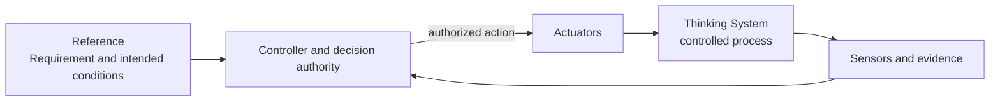
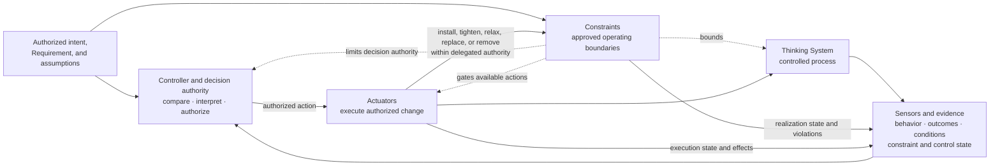
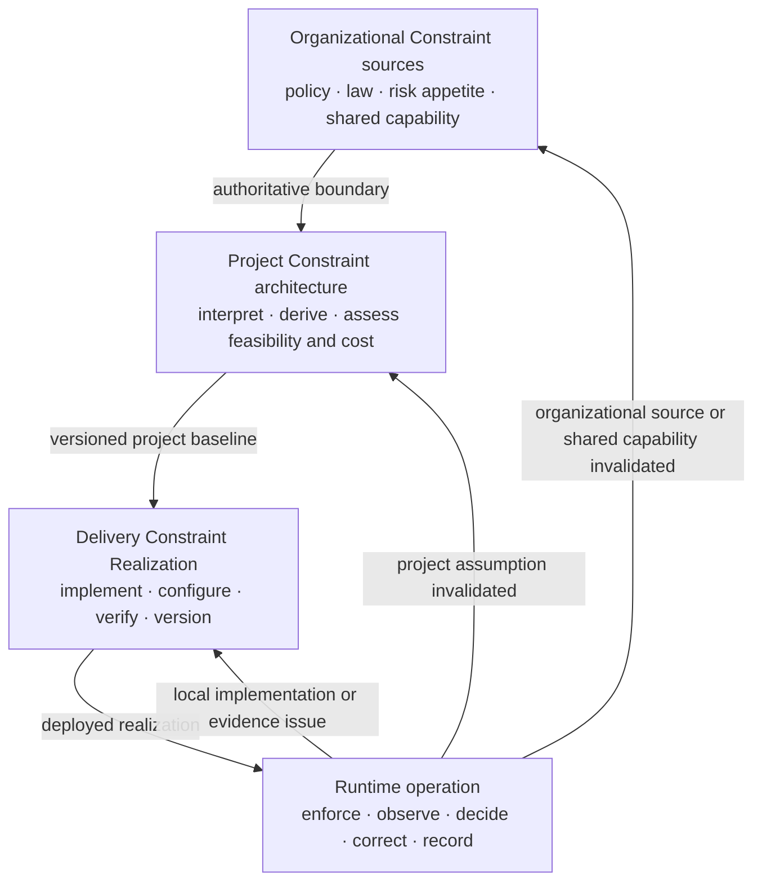

# Control-Loop Capability Anatomy

**Status:** Draft normative  
**Role:** Defines the logical capabilities required to operate model-mediated behavior inside an explicitly bounded control architecture without prescribing one physical topology

## Purpose

Uncertainty Architecture separates two orthogonal models:

1. the [`Nested Control Lifecycle`](nested-control-lifecycle.md), which identifies where decisions are owned across organizational, project, delivery, and runtime levels;
2. the **Control-Loop Capability Anatomy**, which identifies the functions needed to bound, observe, decide, and change operation.

The capability anatomy contains:

- **Constraints**;
- **Sensors and evidence**;
- **Controllers and decision authority**;
- **Actuators and corrective action**.

These are logical functions. They are not mandatory services, products, teams, deployment layers, or one required execution order. One component may realize several functions, and one function may be distributed across code, infrastructure, workflows, and Human Authority.

## 1. Closed feedback loop versus complete UA control architecture

A feedback loop is closed when evidence about the controlled process reaches a decision function and an authorized action can affect the process again:

Constraints are not the feedback edge that mathematically closes this loop. A loop may remain closed while still being unsafe, over-authorized, economically destructive, or able to reach prohibited states.

UA therefore requires a broader architectural question:

> Is the feedback loop operating inside an approved and enforceable operating boundary, with bounded authority, useful evidence, real corrective mechanisms, and a valid reassessment path?

The complete capability relationship is:

This diagram expresses logical relationships rather than a required synchronous sequence. Constraints may be realized before, during, or after a model invocation. Sensors may observe pre-release evidence, runtime behavior, downstream outcomes, constraint-realization state, actuator execution, or operating conditions. Controllers may act synchronously or asynchronously. Actuators may change the model-mediated path, deterministic environment, deployment scope, constraint realization, or wider socio-technical process.

## 2. Constraints

A **Constraint** is an approved condition that limits the allowed operating space.

Constraints may bound:

- states and transitions;
- actions and side effects;
- authority and autonomy;
- inputs, context, data, and provenance;
- tools, services, networks, and execution environments;
- output shape, type, structure, and allowed values;
- resource use, cost, latency, concurrency, duration, and exposure;
- deployment population, geography, domain, and operating conditions;
- Human Authority, approval, separation-of-duty, and escalation requirements.

A Constraint is not identical to the tool or mechanism that implements it. The concrete mechanism is a **Constraint Realization**.

A material Constraint should identify:

1. its authoritative source or project-risk rationale;
2. the subject and scope it bounds;
3. whether it is hard or soft;
4. its realization and enforcement point;
5. the assumptions under which the claimed guarantee holds;
6. failure, bypass, conflict, and unavailable behavior;
7. who may propose, approve, execute, override, or disable a change;
8. evidence about activation, violations, degradation, false blocks, and operational friction;
9. the decision level that must reassess when it changes.

### 2.1 Hard Constraint

A **hard Constraint** is a Constraint whose violation is deterministically prevented or rejected within explicitly stated system assumptions, scope, and enforcement boundaries.

Examples may include:

- permission checks;
- typed interfaces and schema rejection;
- transaction preconditions;
- deterministic state-machine guards;
- tool allowlists;
- data isolation and network boundaries;
- resource caps;
- mandatory approval gates that technically prevent execution before approval.

A probabilistic detector, evaluator, prompt, model policy, or natural-language rule does not become a hard Constraint merely because its failure behavior is documented.

### 2.2 Soft Constraint

A **soft Constraint** influences probabilistic behavior but cannot guarantee that a prohibited state, action, or output remains unreachable.

Examples may include:

- prompts and system instructions;
- natural-language policies;
- rubrics and style guidance;
- demonstrations and model preferences;
- probabilistic safety or semantic classifiers used without a deterministic downstream block.

Soft Constraints may be necessary and useful. They must not be represented as deterministic guarantees.

### 2.3 Composite realization

One business Constraint may require several mechanisms.

For example, a requirement that unsupported product claims must not reach a customer may combine:

- approved-source restrictions;
- grounding instructions;
- a claim-to-source evaluator;
- a deterministic block when required evidence is absent;
- Human Authority for unresolved cases;
- fallback or disable Actuators.

The business Constraint is hard only to the extent that the complete realized path deterministically prevents or rejects the prohibited outcome within stated assumptions. A probabilistic evaluator alone does not supply that guarantee.

## 3. Constraint Realization

A **Constraint Realization** is the concrete technical or socio-technical mechanism through which a Constraint is implemented, configured, enforced or influenced, evidenced, and operated for a defined scope.

A realization may:

- reject an attempted action;
- make a state or transition unreachable;
- gate execution on an approval;
- restrict data, tools, environment, or resources;
- influence probabilistic behavior;
- route an uncertain case to fallback or Human Authority.

A realization should expose its active version, scope, health, failure behavior, evidence, and change authority. A mechanism does not become effective merely because it exists in architecture documentation.

## 4. Sensors and evidence

A **Sensor** produces evidence about behavior, outcomes, operating conditions, control performance, Constraint Realization state, or actuator execution.

Sensors may observe:

- output structure and semantic quality;
- downstream business outcomes;
- incidents, overrides, complaints, and near misses;
- drift across models, prompts, policies, context, tools, data, or populations;
- cost, latency, capacity, availability, and fallback load;
- constraint violations, bypass attempts, conflicts, degradation, or unavailability;
- false blocks and operational friction;
- actuator execution and resulting system state;
- Human Authority response time, capacity, and decision quality;
- assumptions inherited from project or organizational decisions.

A Sensor is not required to produce one objective truth value. It must produce evidence fit enough for a bounded decision and make uncertainty, coverage, latency, and blind spots visible.

An evaluator is normally a Sensor. A gate that interprets evaluation evidence and selects `block`, `canary`, or `release` performs a Controller function. The mechanism that deploys, blocks, rolls back, or narrows exposure performs an Actuator function.

Observation becomes control only when evidence reaches a Controller with authority and an available corrective path.

## 5. Controllers and decision authority

A **Controller** compares or interprets evidence relative to an approved Requirement, operating assumptions, Constraints, and decision boundary, then selects or authorizes corrective action.

A Controller may be:

- deterministic software;
- bounded automated decision logic;
- a human decision-maker;
- a release, review, or incident process;
- a distributed socio-technical responsibility structure.

A Controller should identify:

- the reference conditions and evidence it receives;
- the decision it owns;
- the authority it possesses;
- the decisions it must escalate;
- the Constraints it may change and those it may not change;
- the Actuators it may invoke;
- expected decision latency;
- how material decisions remain traceable.

A Prompt Registry, dashboard, workflow engine, HITL interface, evaluation service, or kill-switch endpoint is not automatically a Controller. It contributes to the Controller capability only when it participates in an explicit decision function with real authority.

A Controller authorizes or selects change. It does not perform the physical or procedural execution merely because the same software component contains both functions.

## 6. Actuators and corrective action

An **Actuator** executes an authorized change in system behavior or operating conditions.

Actuators may:

- change prompts, models, policies, context assembly, routing, or tool access;
- install, tighten, relax, replace, or remove a Constraint Realization within delegated authority;
- narrow deployment scope, authority, population, or data access;
- require Human Authority or switch to a manual path;
- enable, disable, pause, isolate, or contain a feature;
- apply fallback or degraded mode;
- roll back a model, prompt, policy, configuration, tool, or deployment;
- correct downstream state or compensate affected parties;
- stop an action or shut down the system.

An API call, orchestration framework, data pipeline, feature flag, deployment mechanism, or human action is an Actuator only when it provides a real path from an authorized decision to changed operation.

## 7. Capability boundaries

### Constraint versus Constraint Realization

- A **Constraint** defines the approved boundary.
- A **Constraint Realization** implements or influences that boundary for a defined scope.

### Constraint versus Actuator

- A **Constraint** states what is allowed.
- An **Actuator** executes an authorized change.

An Actuator may change a Constraint Realization within delegated authority. A Constraint Realization may reject or block an attempted action. The functions remain distinguishable even when one component performs both.

### Controller versus Actuator

- A **Controller** decides, selects, or authorizes.
- An **Actuator** executes.

A component may contain both functions, but analysis should preserve the boundary so decision rights, execution rights, evidence, latency, and failure behavior remain visible.

### Sensor versus gate

- An evaluator or monitor normally produces evidence as a Sensor.
- Decision logic that interprets evidence and selects an outcome performs a Controller function.
- The mechanism that applies that outcome performs an Actuator function.

## 8. Relationship to Invariants, Requirements, and Operating Envelopes

An **Invariant** is a condition that must remain true across relevant states or transitions.

A **Requirement** is the approved operating contract for a system, feature, or change.

An **Operating Envelope** is the approved range of conditions, authority, consequences, resource use, and observed behavior within which the Requirement permits operation.

Constraints express approved boundaries and are realized to keep operation within the Requirement and preserve relevant Invariants. They do not replace the complete Requirement, which may also define intended outcomes, acceptable variation, evidence expectations, authority, resource limits, and failure handling.

## 9. Capabilities across the four decision levels

The same capabilities appear at different levels without making those levels identical.

### Organizational level

The organization supplies authoritative Constraint sources, shared capabilities, and decision rights, such as prohibited uses, legal obligations, approved vendors, identity services, audit, incident processes, Human Authority, and shutdown capability.

### Project level

The project interprets organizational Constraints, derives project-specific Constraints from material risk scenarios, assesses whether realization and evidence are feasible, and includes build, run, review, fallback, and incident cost in the viability decision.

### Delivery level

The delivery review links the project baseline and records concrete Constraint Realization, configuration, verification, release scope, and local change authority. It may narrow but must not silently weaken or expand project authorization.

### Runtime level

Runtime exercises the deployed realizations, records behavior and control health, routes evidence to authorized Controllers, invokes available Actuators, and triggers delivery reassessment, project reauthorization, or organizational review when an earlier decision basis is invalidated.

Constraint authority flows downward by reference. Realization becomes more concrete. Evidence flows upward when enforcement fails, a Constraint becomes infeasible or too costly, the operating context changes, or an earlier authorization basis is invalidated.

## 10. Interpretation of the presentation metaphor

The presentation *Designing Non-Deterministic Systems* describes Controller, Sensors, Constraints, and Actuators through the metaphors of brain, nerves, skeleton, and muscles.

UA retains the four-function distinction but does not adopt the slide as:

- a mandatory physical stack;
- a required vertical execution order;
- a permanent product-to-layer mapping;
- a literal claim that removing Constraints opens the feedback edge.

Removing sensing, decision, or effective actuation can leave the system open-loop or unable to correct. Removing explicit Constraints can leave a loop closed while allowing unsafe, unauthorized, or economically unacceptable operation. The source metaphor is explanatory; this document is the canonical relationship model.

## 11. Capability completeness

A UA control architecture is incomplete when a required capability, boundary, authority path, or connection is missing or nominal.

Examples include:

- a policy with no approved Constraint or credible realization;
- a realization with no evidence that it is active or effective;
- a probabilistic detector presented as a hard guarantee;
- telemetry with no Controller or decision authority;
- a Controller with no Actuator capable of executing its decision;
- an Actuator that cannot act within the required time;
- Human Authority without information, competence, time, independence, capacity, or intervention power;
- a runtime Controller allowed to authorize or execute changes outside delegated authority;
- a closed feedback loop that operates outside an approved boundary.

## 12. Non-prescription

UA does not require:

- four separate services;
- one centralized AI Control Plane;
- one tool per capability;
- fully automated control;
- one universal product taxonomy;
- one universal Constraint catalogue;
- one mandatory fail-open or fail-closed policy;
- one risk score, evidence threshold, or review cadence.

Implementations should identify approved boundaries, realization, guarantee, evidence, decision authority, execution path, and failure behavior rather than classify products by marketing category.

## Relationships

- [`glossary.md`](glossary.md) provides concise canonical definitions.
- [`nested-control-lifecycle.md`](nested-control-lifecycle.md) defines decision ownership, inheritance, and upward reassessment.
- [`../02-ai-control-plane/`](../02-ai-control-plane/) develops capability-specific and implementation-oriented guidance.
- [`../01-patterns/project-control-architecture-and-viability-review.md`](../01-patterns/project-control-architecture-and-viability-review.md) applies the model to project feasibility and authorization.
- [`../01-patterns/thinking-system-review.md`](../01-patterns/thinking-system-review.md) applies it to delivery readiness, completion, release, and reassessment.
- [`../01-patterns/judgment-node-boundary.md`](../01-patterns/judgment-node-boundary.md) applies it around consequential Model Judgment.
- [`../03-reference-architectures/`](../03-reference-architectures/) demonstrates non-prescriptive compositions.
- [`../04-failure-modes/`](../04-failure-modes/) records recurring capability and control failures.
