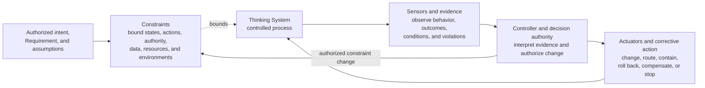
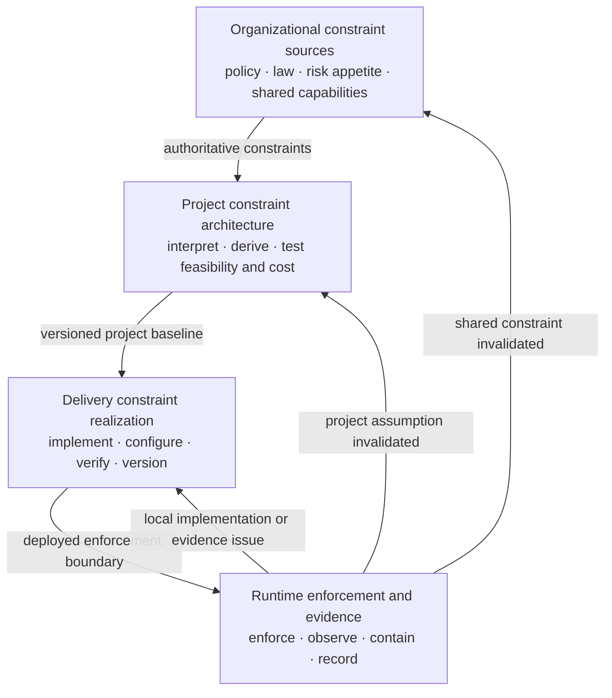

# Control-Loop Capability Anatomy

**Status:** Draft normative  
**Role:** Defines the four capability classes required to make model-mediated behavior governable without prescribing one physical system topology

## Purpose

Uncertainty Architecture distinguishes two orthogonal structures:

1. the **Nested Control Lifecycle**, which identifies where decisions are owned across organizational, project, delivery, and runtime levels;
2. the **control-loop capability anatomy**, which identifies the capabilities required to make those decisions operational.

The capability anatomy consists of:

- **Constraints**;
- **Sensors and evidence**;
- **Controllers and decision authority**;
- **Actuators and corrective action**.

These are logical capability classes. They are not mandatory services, products, teams, or deployment layers. One implementation component may realize several capabilities, and one capability may be distributed across code, infrastructure, workflows, and Human Authority.

## Core model

A Thinking System is controlled only when the approved operating space is bounded, relevant behavior and conditions are observable, evidence reaches decision authority, and authorized decisions can materially change operation.



The diagram expresses logical relationships rather than one required execution order. Constraints may be applied before, during, or after a model invocation. Sensors may observe pre-release evidence, runtime behavior, downstream outcomes, control health, or operating conditions. Controllers may act synchronously or asynchronously. Actuators may change the model-mediated path, the deterministic environment, the deployment scope, or the wider socio-technical process.

## 1. Constraints

A **Constraint** is a condition intended to limit behavior or reduce the reachable operating space.

Constraints may bound:

- allowed states and transitions;
- actions and side effects;
- authority and autonomy;
- inputs, context, data, and provenance;
- tools, services, networks, and execution environments;
- output shape, type, structure, and allowed values;
- resource use, cost, latency, concurrency, duration, and exposure;
- deployment population, geography, domain, and operating conditions;
- Human Authority, approval, separation-of-duty, and escalation requirements.

A constraint should identify:

1. its authoritative source;
2. the subject and scope it bounds;
3. whether it is hard or soft;
4. where and how it is enforced or realized;
5. its failure behavior;
6. who may change, override, or disable it;
7. which evidence shows enforcement, violations, degradation, or operational friction;
8. which higher-level decision must be reassessed when it changes.

### Hard and soft constraints

A **hard constraint** is enforced deterministically or through a mechanism with explicit failure behavior. Examples include permission checks, typed interfaces, schema validation, transaction preconditions, tool allowlists, rate limits, data isolation, network boundaries, and mandatory approval gates.

A **soft constraint** influences probabilistic behavior without guaranteeing compliance. Examples include prompts, policies expressed only as natural-language instructions, rubrics, style guidance, and model preferences.

Soft constraints may be useful and necessary, but they must not be represented as hard guarantees. Consequential invariants require deterministic enforcement where feasible.

## 2. Sensors and evidence

A **Sensor** is a mechanism that produces evidence about behavior, outcomes, operating conditions, control performance, or constraint state.

Sensors may observe:

- output structure and semantic quality;
- downstream business outcomes;
- incidents, overrides, complaints, and near misses;
- drift across models, prompts, policies, context, tools, data, or populations;
- cost, latency, capacity, availability, and fallback load;
- constraint violations, bypass attempts, conflicts, degradation, or unavailability;
- Human Authority response time, review capacity, and decision quality;
- assumptions inherited from project or organizational decisions.

A sensor is not required to produce one objective truth value. It must produce evidence fit enough for a bounded decision and explicit about uncertainty, coverage, latency, and blind spots.

Observation becomes control only when evidence reaches a Controller with authority and an available corrective path.

## 3. Controllers and decision authority

A **Controller** interprets evidence relative to an approved Requirement, operating assumptions, constraints, and decision boundary, then authorizes or selects corrective action.

A controller may be:

- deterministic software;
- a bounded automated policy engine;
- a human decision-maker;
- a review or incident process;
- a distributed socio-technical responsibility structure.

A controller must identify:

- the evidence it receives;
- the decision it owns;
- the authority it possesses;
- the decisions it must escalate;
- the constraints it may change and those it may not change;
- the actuators it can invoke;
- the expected decision latency;
- how material decisions remain traceable.

A Prompt Registry, evaluation dashboard, workflow engine, Human-in-the-Loop interface, or kill-switch endpoint is not automatically a Controller. It becomes part of the controller capability only when it participates in an explicit decision function with real authority.

## 4. Actuators and corrective action

An **Actuator** is a mechanism capable of materially changing system behavior or operating conditions in response to an authorized decision.

Actuators may:

- change prompts, models, policies, context assembly, routing, or tool access;
- narrow deployment scope, authority, population, or data access;
- require Human Authority or switch to a manual path;
- enable, disable, pause, isolate, or contain a feature;
- apply fallback or degraded mode;
- roll back a model, prompt, policy, configuration, tool, or deployment;
- correct downstream state or compensate affected parties;
- stop an action or shut down the system.

An API call, orchestration framework, data pipeline, feature flag, or human action is an actuator only when it provides a real path from an authorized decision to changed behavior.

## Constraint and actuator boundary

Constraints and actuators are related but not interchangeable.

- A **constraint** defines or enforces the allowed operating space.
- An **actuator** executes an authorized change in behavior or operating conditions.

An actuator may install, remove, tighten, relax, or switch a constraint. A constraint may itself block an attempted action. The classification depends on the function being described.

Example:

```text
Policy: customer data must remain inside an approved region
→ Constraint source: organizational data-residency rule
→ Constraint realization: regional deployment and network policy
→ Sensor: configuration audit and cross-region transfer evidence
→ Controller: authorized security or architecture decision function
→ Actuator: deployment change, routing change, isolation, or shutdown
```

A single technical component can therefore realize more than one capability:

- a schema validator realizes a structural constraint;
- its violation log realizes a sensor;
- a feature flag that disables the validator or affected path realizes an actuator;
- the authority deciding whether the schema may change realizes the controller function.

## Relationship to invariants and Requirements

An **Invariant** is a condition that must remain true across relevant system states or transitions.

A **Requirement** is the approved operating contract for a system, feature, or change.

Constraints are mechanisms or conditions used to keep behavior within the Requirement and preserve relevant invariants. They do not replace the complete Requirement, which may also define intended outcomes, acceptable behavioral variation, evidence expectations, authority, resource limits, and failure handling.

## Capabilities across the four control levels

The same four capability classes appear at different decision levels without making those levels identical.

### Organizational level

The organization supplies authoritative constraints and shared capabilities, such as prohibited uses, legal and contractual rules, approved vendors, identity systems, audit services, incident processes, Human Authority, and shutdown capability.

### Project level

The project interprets organizational constraints for the proposed Thinking System, derives project-specific constraints from material risk scenarios, assesses whether enforcement and evidence are feasible, and includes build, run, review, and incident cost in the viability decision.

### Delivery level

The delivery review realizes inherited constraints through concrete architecture, configuration, interfaces, permissions, gates, tests, deployment limits, and ownership. It may narrow but must not silently weaken or expand the project authorization.

### Runtime level

Runtime operation exercises constraint enforcement, records violations and control health, applies authorized corrective action, and routes evidence to local delivery reassessment, project reauthorization, or organizational review.



Constraints flow downward by authority and reference, but their realization becomes more concrete at each level. Evidence flows upward when enforcement fails, a constraint becomes infeasible or too costly, the operating context changes, or the basis of an earlier authorization is invalidated.

## Capability completeness

A control design is incomplete when any required capability is missing or merely nominal.

Typical incomplete loops include:

- a policy with no enforceable constraint or escalation path;
- a constraint with no evidence that it is active or effective;
- telemetry with no controller and no decision authority;
- a controller with no actuator capable of changing behavior;
- an actuator that cannot be invoked within the required response time;
- a hard invariant delegated only to a probabilistic instruction;
- Human Authority without information, competence, time, independence, capacity, or intervention power;
- a runtime controller allowed to change a project or organizational boundary without reauthorization.

## Non-prescription

UA does not require:

- four separate services;
- one centralized AI Control Plane;
- one tool per capability;
- fully automated control;
- one universal taxonomy of products or vendors;
- one universal set of constraints;
- one mandatory fail-open or fail-closed policy for every context;
- one risk score, evidence threshold, or review cadence.

Implementations should identify functions, guarantees, authority, evidence, and failure behavior rather than classify products by marketing category.

## Relationships

- [`glossary.md`](glossary.md) provides concise canonical definitions.
- [`nested-control-lifecycle.md`](nested-control-lifecycle.md) defines decision ownership, inheritance, and upward reassessment across the four control levels.
- [`../02-ai-control-plane/`](../02-ai-control-plane/) develops the capabilities and implementation-oriented guidance.
- [`../01-patterns/project-control-architecture-and-viability-review.md`](../01-patterns/project-control-architecture-and-viability-review.md) applies the capability model to project feasibility and authorization.
- [`../01-patterns/thinking-system-review.md`](../01-patterns/thinking-system-review.md) applies it to delivery readiness, completion, release, and reassessment.
- [`../01-patterns/judgment-node-boundary.md`](../01-patterns/judgment-node-boundary.md) applies it around consequential Model Judgment.
- [`../03-reference-architectures/`](../03-reference-architectures/) demonstrates non-prescriptive compositions.
- [`../04-failure-modes/`](../04-failure-modes/) records recurring capability and control failures.
