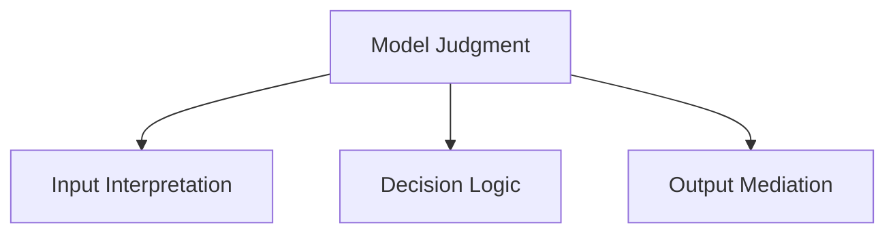
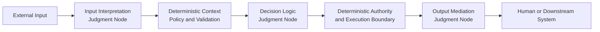

# Model Judgment Placement

## Status

This document is **draft normative**. It defines the functional placement taxonomy used to identify where Model Judgment influences the behavior of a Thinking System.

The presentation *Designing Non-Deterministic Systems: Maintaining Engineering Rigor in the AI Era* is a synthesis source for this formulation. The source remains historical research evidence; this document is the explicit framework decision that translates the relevant ideas into current UA terminology.

## 1. Purpose

Before a team can define controls around Model Judgment, it must be able to identify where that judgment occurs and what part of system behavior it can change.

UA classifies Model Judgment by **functional placement**:

- **Input Interpretation**;
- **Decision Logic**;
- **Output Mediation**.

These classes describe what Model Judgment does in a workflow. They do not prescribe a three-stage architecture, a fixed pipeline, or one deployment topology.

## 2. Placement taxonomy

### 2.1 Input Interpretation

**Input Interpretation** is Model Judgment that converts ambiguous, unstructured, incomplete, or context-dependent input into a representation that the rest of the system can use.

It may produce:

- intent or request classification;
- extracted entities or structure;
- normalized or enriched context;
- interpretation of natural-language instructions;
- identification of relevant policy, domain, or workflow context.

Input Interpretation may affect what the system believes the user asked, which context is selected, and which deterministic path becomes available. It therefore requires explicit boundaries even when the downstream execution remains deterministic.

### 2.2 Decision Logic

**Decision Logic** is Model Judgment that influences or selects a decision, path, priority, plan, tool, or action.

It may affect:

- routing;
- ranking or prioritization;
- planning or decomposition;
- selection among alternatives;
- tool choice;
- action recommendation;
- initiation of an action within an allowed authority boundary.

Decision Logic does not imply unlimited autonomy. A Judgment Node may recommend an action, select from a bounded set, or initiate execution only after deterministic validation or Human Authority.

### 2.3 Output Mediation

**Output Mediation** is Model Judgment that creates, adapts, filters, summarizes, explains, or transforms information for a human or downstream system.

It may affect:

- wording, structure, tone, or level of detail;
- synthesis or summarization;
- explanation of verified data or decisions;
- filtering or redaction;
- translation or transformation between representations;
- presentation of uncertainty, limitations, or confidence.

Output Mediation can be consequential even when it does not change the underlying data. Presentation may alter what a person understands, trusts, discloses, approves, or does next.

## 3. Illustrative placement composition

This is an illustrative composition. Any Judgment Node may be absent, repeated, or combined with another function.

## 4. Taxonomy rules

The following rules prevent the taxonomy from becoming a misleading topology:

1. All three placement classes are optional.
2. A workflow may contain multiple Judgment Nodes of the same class.
3. One Judgment Node may perform more than one placement function.
4. One business decision may span several Judgment Nodes and deterministic components.
5. Deterministic code around a node does not make the node's judgment deterministic.
6. A model invocation is not automatically a consequential Judgment Node. The relevant question is whether its judgment can materially change an output, decision, path, or action.
7. Placement does not determine risk level.

## 5. Placement, authority, and consequence

Risk depends on more than where Model Judgment appears. A placement must be reviewed together with:

- the authority available to the node;
- the decisions, actions, or outputs it can change;
- the people, systems, or resources affected downstream;
- the reversibility of its effects;
- the strength of deterministic constraints;
- the quality and latency of evidence;
- the available fallback, containment, escalation, rollback, or shutdown path.

An Output Mediation node that drafts an internal note may be low consequence. The same placement producing legally significant instructions may be high consequence. An Input Interpretation node may appear early in a workflow yet control identity, authorization, or routing for everything that follows.

## 6. Architectural identification

A system or design claiming alignment with UA SHOULD be able to identify, for each materially consequential use of Model Judgment:

1. where the judgment occurs;
2. which placement function or functions it performs;
3. which inputs and context it receives;
4. which decisions, actions, paths, or outputs it can change;
5. which authority it possesses;
6. which deterministic boundaries and invariants constrain it.

The detailed boundary record is defined by the [`Judgment Node Boundary`](../01-patterns/judgment-node-boundary.md) pattern. This doctrine defines the functional taxonomy; the pattern defines how a team makes a consequential node reviewable and operable.

## 7. Relationship to other UA concepts

- [`glossary.md`](glossary.md) contains the canonical concise definitions of Model Judgment, Judgment Node, and the three placement classes.
- [`requirements-correctness-and-bugs.md`](requirements-correctness-and-bugs.md) defines the operating contract against which model-mediated behavior is evaluated.
- [`../01-patterns/judgment-node-boundary.md`](../01-patterns/judgment-node-boundary.md) applies this taxonomy through an explicit boundary pattern.
- [`../02-ai-control-plane/`](../02-ai-control-plane/) defines the capabilities used to constrain, observe, and correct model-mediated behavior.
- [`../03-reference-architectures/`](../03-reference-architectures/) may demonstrate non-prescriptive compositions of the placement classes.
