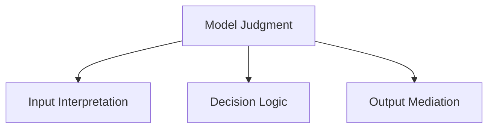
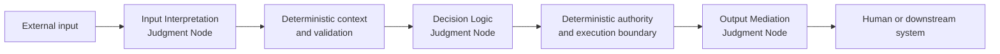

# Model Judgment Placement

## Status

This document is **draft normative**. It defines the functional placement taxonomy used to identify where Model Judgment influences the behavior of a Thinking System.

The presentation *Designing Non-Deterministic Systems: Maintaining Engineering Rigor in the AI Era* is a synthesis source for this formulation. Repository review is grounded in the maintainer-supplied PDF export preserved under `content/raw/`; an editable PPTX is not preserved or independently verified. The linked source-intake note records the framework-transfer decisions.

## 1. Purpose

Before a team can define controls around Model Judgment, it must identify where that judgment occurs and what part of system behavior it can change.

UA classifies Model Judgment by **functional placement**:

- **Input Interpretation**;
- **Decision Logic**;
- **Output Mediation**.

These classes describe what Model Judgment does in a workflow. They do not prescribe a three-stage architecture, fixed pipeline, deployment topology, or control-loop sequence.

## 2. Placement taxonomy

This is a taxonomy diagram. It classifies functions and intentionally omits Constraints, Sensors, Controllers, and Actuators.

### 2.1 Input Interpretation

**Input Interpretation** is Model Judgment that converts ambiguous, unstructured, incomplete, or context-dependent input into a representation that the rest of the system can use.

It may produce:

- intent or request classification;
- extracted entities or structure;
- normalized or enriched context;
- interpretation of natural-language instructions;
- identification of relevant policy, domain, or workflow context.

Input Interpretation may affect what the system believes the user asked, which context is selected, and which deterministic path becomes available. It therefore requires explicit boundaries even when downstream execution remains deterministic.

### 2.2 Decision Logic

**Decision Logic** is Model Judgment that influences or selects a decision, path, priority, plan, tool, or action.

It may affect:

- routing;
- ranking or prioritization;
- planning or decomposition;
- selection among alternatives;
- tool choice;
- action recommendation;
- initiation of an action within an allowed authority boundary.

Decision Logic does not imply unlimited autonomy. A Judgment Node may recommend an action, select from a bounded set, or initiate execution only after the applicable Constraint Realizations, deterministic validation, or Human Authority permit it.

### 2.3 Output Mediation

**Output Mediation** is Model Judgment that creates, adapts, filters, summarizes, explains, or transforms information for a human or downstream system.

It may affect:

- wording, structure, tone, or level of detail;
- synthesis or summarization;
- explanation of verified data or decisions;
- filtering or redaction;
- translation or transformation between representations;
- presentation of uncertainty, limitations, or confidence.

Output Mediation can be consequential even when it does not change underlying data. Presentation may alter what a person understands, trusts, discloses, approves, or does next.

## 3. Illustrative placement composition

This is an illustrative placement composition only. Any Judgment Node may be absent, repeated, or combined with another function. The diagram intentionally omits the complete Constraint, Sensor, Controller, and Actuator paths and MUST NOT be read as a complete control architecture.

## 4. Taxonomy rules

1. All three placement classes are optional.
2. A workflow may contain multiple Judgment Nodes of the same class.
3. One Judgment Node may perform more than one placement function.
4. One business decision may span several Judgment Nodes and deterministic components.
5. Deterministic code around a node does not make the node's judgment deterministic.
6. A model invocation is not automatically a consequential Judgment Node. The relevant question is whether its judgment can materially change an output, decision, path, or action.
7. Placement does not determine risk, consequence, authority, or guarantee strength.
8. Placement classes are orthogonal to both the four decision levels and the four capability families.

## 5. Placement, authority, and consequence

A placement must be reviewed together with:

- applicable Constraints and the guarantee strength of their complete realized paths;
- the authority available to the node;
- decisions, actions, paths, or outputs it can change;
- people, systems, or resources affected downstream;
- reversibility and propagation of its effects;
- evidence quality, coverage, latency, and blind spots;
- Controller or Human Authority decision rights;
- available Actuators, fallback, containment, escalation, compensation, rollback, or shutdown;
- delivery reassessment and project reauthorization triggers.

An Output Mediation node drafting an internal note may be low consequence. The same placement producing legally significant instructions may be high consequence. An Input Interpretation node may appear early in a workflow yet influence identity, authorization, or routing for everything that follows.

## 6. Architectural identification

For each materially consequential use of Model Judgment, a system or design claiming alignment with UA SHOULD identify:

1. where the judgment occurs;
2. which placement function or functions it performs;
3. which inputs and approved context it receives;
4. which decisions, actions, paths, or outputs it can change;
5. which authority it possesses;
6. which Constraint IDs apply and how they are realized for this subject, path, and scope;
7. which evidence and control-health signals are produced;
8. which Controller or Human Authority may decide and which Actuator may execute change;
9. which fallback, containment, or escalation path exists;
10. which evidence triggers local reassessment or project reauthorization.

The detailed record is owned by the [`Judgment Node Boundary`](../01-patterns/judgment-node-boundary.md) inside the relevant delivery review. This doctrine defines placement taxonomy; it does not create a separate Judgment Node registry.

## Relationships

- [`glossary.md`](glossary.md) owns concise definitions of Model Judgment, Judgment Node, and the three placement classes.
- [`control-loop-anatomy.md`](control-loop-anatomy.md) defines Constraints and realizations, Sensors, Controllers, and Actuators.
- [`requirements-correctness-and-bugs.md`](requirements-correctness-and-bugs.md) defines the operating contract against which model-mediated behavior is evaluated.
- [`../01-patterns/judgment-node-boundary.md`](../01-patterns/judgment-node-boundary.md) makes a consequential node reviewable and operable.
- [`../02-ai-control-plane/`](../02-ai-control-plane/) develops capability-specific guidance.
- [`../03-reference-architectures/judgment-placement-examples.md`](../03-reference-architectures/judgment-placement-examples.md) demonstrates non-prescriptive isolated and composite applications.
- [`../content/research/notes/designing-nondeterministic-systems-source-intake.md`](../content/research/notes/designing-nondeterministic-systems-source-intake.md) records the presentation source relationship and framework-transfer decisions.
