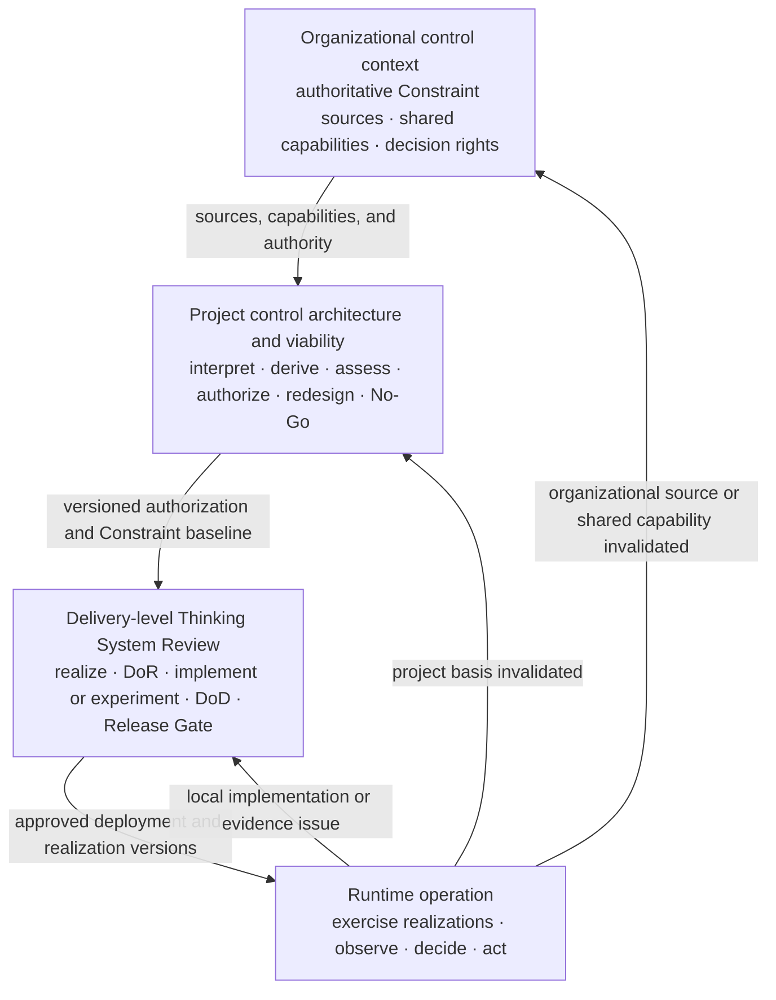
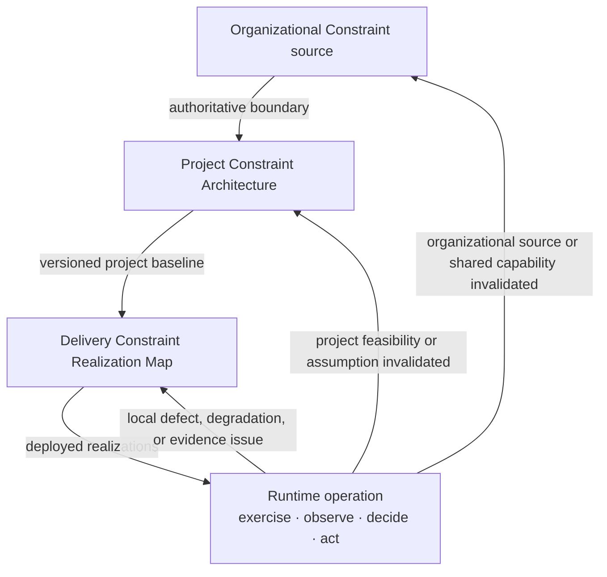
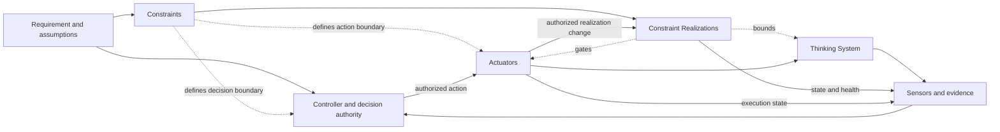

# Nested Control Lifecycle

**Status:** Draft normative  
**Role:** Defines how organizational, project, delivery, and runtime decisions connect without collapsing into one gate or governance process

## Purpose

UA uses four connected decision levels because different questions require different evidence, authority, time horizons, Constraint detail, and corrective actions.



A lower-level decision may refine or narrow a higher-level authorization. It must not silently expand it, weaken an inherited Hard Constraint, or transfer authority downward without authorization.

## 1. Organizational control context

The organizational level supplies authoritative Constraint sources, shared capabilities, and decision rights across projects.

Examples include prohibited uses, legal and contractual obligations, approved vendors and deployment modes, data and residency rules, identity and audit capabilities, incident response, Human Authority, and exception rights.

UA does not require one governance department or committee to own all of this context. Existing authoritative sources should be linked rather than duplicated.

## 2. Project control architecture and viability

The project level decides whether a proposed Thinking System has a credible, operable, and economically viable Constraint and control architecture.

The [`Project Control Architecture and Viability Review`](../01-patterns/project-control-architecture-and-viability-review.md) owns:

- business outcome and AI necessity;
- project boundary and intended Judgment landscape;
- material scenarios and consequences;
- interpretation of organizational Constraint sources;
- project-specific Constraints;
- required Constraint Realizations, Sensors, Controllers, Actuators, Human Authority, fallback, containment, compensation, rollback, and shutdown;
- evidence feasibility and feedback latency;
- operational capacity and control economics;
- project authorization, conditions, bounded research, redesign, deferral, escalation, or No-Go;
- one versioned Project Constraint Architecture for delivery inheritance;
- project reauthorization triggers.

A successful prototype is not project authorization.

## 3. Delivery-level review

The delivery level decides whether a bounded system, feature, or material change is ready, complete, and acceptable for a specific deployment context.

The [`Thinking System Review`](../01-patterns/thinking-system-review.md) owns:

- implementation-level Judgment Nodes;
- the delivery Requirement and Operating Envelope;
- one canonical Constraint Realization Map linked to the project baseline;
- Definition of Ready;
- bounded experiment or implementation;
- Definition of Done;
- the deployment-specific Release Gate;
- local runtime reassessment.

The delivery review may narrow authority, population, scope, data, deployment, resources, or operating conditions. It must not expand them or weaken an inherited Hard Constraint.

## 4. Runtime control and reassessment

Runtime exercises the deployed realization and produces evidence about:

- behavior and outcomes;
- realization activation, health, violations, bypass, conflict, degradation, and unavailability;
- false blocks and operational friction;
- Actuator execution and resulting state;
- Human Authority and fallback capacity;
- project and organizational assumptions.

Evidence reaches an authorized Controller. The Controller selects or authorizes action. Actuators execute correction, narrowing, fallback, containment, compensation, rollback, suspension, or shutdown.

Runtime evidence does not automatically escalate to the highest level. The affected level follows the decision basis invalidated.

## 5. Ownership and inheritance

```text
Organizational sources
→ Project Control Architecture and Viability Review
→ Thinking System Review
→ Runtime evidence and corrective action
```

Information flows downward by reference:

1. organizational sources, capabilities, and decision rights constrain the project;
2. the project interprets those sources, derives project Constraints, and creates one versioned authorization baseline;
3. delivery links that baseline and records one concrete Constraint Realization Map;
4. runtime links active source, project, delivery, realization, and deployment versions.

Evidence flows upward when required:

```text
Local implementation, realization, configuration, or evidence issue
→ delivery reassessment

Project risk, authority, Constraint feasibility, evidence, capacity, or economics changed
→ project reauthorization

Authoritative source, decision right, or shared capability changed
→ organizational review
```

## 6. Constraint inheritance and realization

Constraints do not move downward as copied policy prose. Their authority is inherited while realization becomes more concrete.



A material Constraint should remain traceable through source, subject, scope, strength, realization, assumptions, failure behavior, evidence, active version, decision authority, execution path, and reassessment trigger.

A lower-level Controller may authorize only changes inside delegated authority. An Actuator executes the change to operation or a Constraint Realization. Technical configurability does not authorize relaxation of a project or organizational boundary.

## 7. Reassessment logic

### Delivery reassessment

Typical local triggers include:

- implementation or realization defect;
- stale, bypassed, degraded, conflicting, or unavailable realization;
- deployment-specific evidence regression;
- bounded configuration change inside project authorization;
- false blocks, fallback load, latency, or friction correctable without changing the project case.

### Project reauthorization

Typical triggers include:

- increased autonomy or tool authority;
- expanded population, data, domain, geography, deployment, or consequence;
- proposed relaxation, replacement, or removal of a project Hard Constraint;
- new Constraint materially changing architecture or economics;
- degraded Human Authority or fallback capacity;
- evidence that required realization or control is ineffective, bypassable, too slow, or infeasible;
- material vendor, model, context, data, tool, or dependency change;
- control cost or residual risk outside authorization.

### Organizational review

Typical triggers include:

- authoritative source or decision right changes;
- shared capability becomes unavailable or weaker;
- a project requires an organizational exception;
- a project exposes a cross-project failure mechanism;
- risk appetite, approved vendors, deployment modes, or geographies must change.

## 8. Relationship to the AI Control Plane

The lifecycle defines **where decisions are owned**. The capability model defines **which functions make them operational**.



Constraints are not the feedback edge. A loop may remain closed while unsafe, over-authorized, or economically unacceptable.

## 9. Practical SMB path

```text
Link organizational sources, capabilities, and decision rights
→ complete one Project Control Architecture and Viability Review
→ issue one versioned Project Constraint Architecture and authorization
→ complete one Thinking System Review for each bounded delivery scope
→ maintain one canonical Constraint Realization Map
→ pass a deployment-specific Release Gate
→ operate through the approved capability path
→ reassess the delivery, project, or organizational decision when evidence invalidates its basis
```

Separate Constraint Registers, Judgment Node registries, gate files, or responsibility matrices are optional only when independent ownership or lifecycle genuinely requires them.

## Invariants

1. Project authorization and delivery release are distinct.
2. A lower level may narrow but must not expand a higher-level authorization.
3. A lower-level implementation must not weaken an inherited Hard Constraint.
4. Higher-level context is inherited by reference.
5. Project and delivery each maintain one canonical Constraint record for their decision surface.
6. Runtime evidence remains connected to active versions.
7. Reassessment follows the basis invalidated by evidence.
8. Telemetry without decision authority and an effective Actuator path is observation, not control.
9. A declared Constraint without credible realization, evidence, failure behavior, and authority is not operable.
10. Human Authority must be substantive where required.
11. No-Go, narrowing, rollback, compensation, suspension, and shutdown are valid outcomes.
12. The complete control perimeter must remain technically, operationally, and economically viable.

## Relationships

- [`uncertainty-in-the-controlled-object.md`](uncertainty-in-the-controlled-object.md) explains the controlled-object shift.
- [`control-loop-anatomy.md`](control-loop-anatomy.md) defines capability relationships.
- [`../01-patterns/project-control-architecture-and-viability-review.md`](../01-patterns/project-control-architecture-and-viability-review.md) owns project authorization.
- [`../01-patterns/thinking-system-review.md`](../01-patterns/thinking-system-review.md) owns delivery realization and release.
- [`../02-ai-control-plane/`](../02-ai-control-plane/) develops capability guidance.
- [`../03-reference-architectures/`](../03-reference-architectures/) demonstrates applications.
- [`../SPECIFICATION.md`](../SPECIFICATION.md) defines status and conformance.
