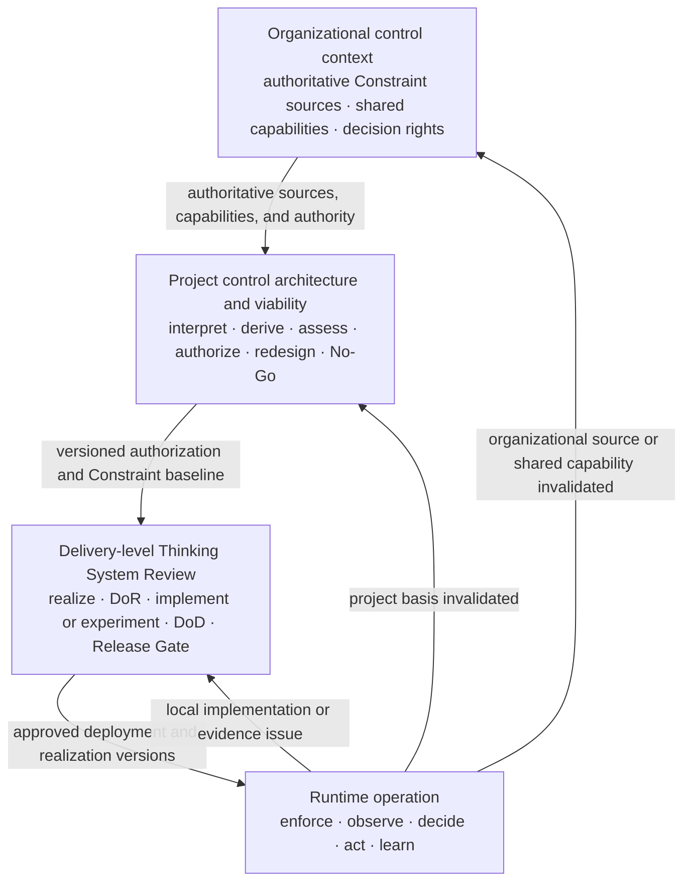
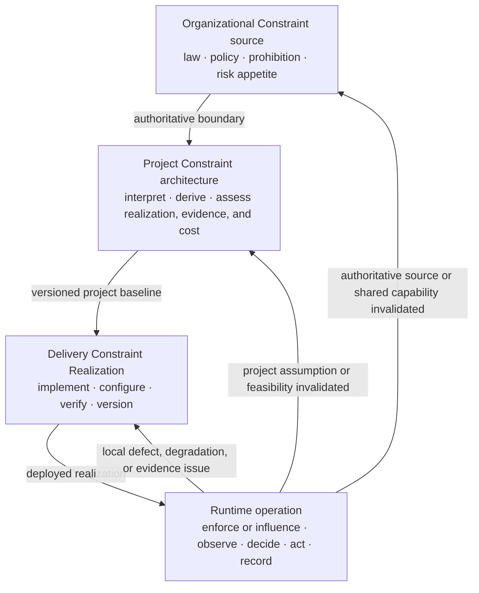
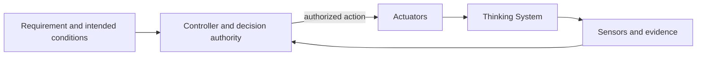
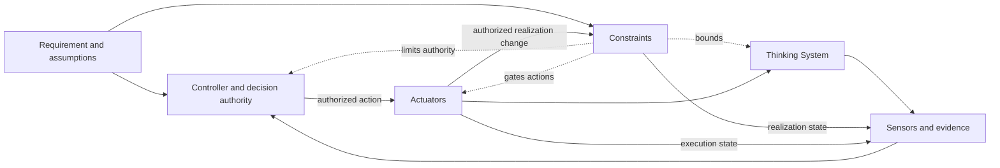

# Nested Control Lifecycle

**Status:** Draft normative  
**Role:** Defines how organizational, project, delivery, and runtime decisions connect without collapsing into one gate or governance process

## Purpose

Uncertainty Architecture uses four connected decision levels because different questions require different evidence, authority, time horizons, Constraint detail, and corrective actions.

The lifecycle is a structure of decisions, not a hierarchy of documents:



A lower-level decision may refine or narrow a higher-level authorization. It must not silently expand it, weaken an inherited Hard Constraint, or transfer decision authority downward without authorization.

Runtime evidence flows upward when it invalidates the assumptions, Constraints, capabilities, capacity, economics, or authority supporting an earlier decision.

## 1. Organizational control context

The organizational level supplies authoritative Constraint sources, shared capabilities, and decision rights across projects.

Examples include:

- prohibited uses and risk appetite;
- legal, privacy, security, safety, contractual, procurement, residency, and financial obligations;
- approved vendors, models, deployment modes, geographies, data classes, and tools;
- identity, audit, evaluation, incident, fallback, and shutdown capabilities;
- Human Authority and escalation rights;
- exception and organizational-change authority.

UA does not require one governance department or committee to own this context. Existing authoritative sources should be linked rather than duplicated.

The organizational level answers:

- What is prohibited, permitted, or conditionally permitted?
- Which shared capabilities and limitations already exist?
- Who may approve an exception or change an authoritative source?
- Which evidence requires organizational rather than project response?

## 2. Project control architecture and viability

The project level decides whether a proposed Thinking System has a credible, operable, and economically viable Constraint and control architecture.

The canonical decision surface is the [`Project Control Architecture and Viability Review`](../01-patterns/project-control-architecture-and-viability-review.md).

It owns:

- business outcome and AI necessity;
- project boundary and intended Judgment landscape;
- material scenarios and consequences;
- interpretation of organizational Constraint sources;
- project-specific Constraints;
- required Constraint Realizations, Sensors, Controllers, Actuators, Human Authority, fallback, containment, compensation, rollback, and shutdown;
- evidence feasibility and feedback latency;
- Human Authority and operational capacity;
- control economics and viability;
- project authorization, conditions, bounded research, redesign, escalation, deferral, or No-Go;
- one versioned project Constraint baseline for delivery inheritance;
- project reauthorization triggers.

A successful prototype is not project authorization. The relevant question is whether the complete socio-technical control path can be built and operated within the accepted boundary.

## 3. Delivery-level review

The delivery level decides whether a bounded whole system, feature, or material change is ready, complete, and acceptable for a specific deployment context.

The canonical decision surface is the [`Thinking System Review`](../01-patterns/thinking-system-review.md).

It owns:

- implementation-level Judgment Nodes;
- the delivery Requirement and Operating Envelope;
- one canonical Constraint Realization Map linked to the project baseline;
- Definition of Ready;
- bounded experiment or implementation;
- Definition of Done;
- the deployment-specific Release Gate;
- local runtime reassessment.

The delivery review may narrow authority, population, scope, data, deployment, resources, or operating conditions. It must not silently expand them or relax an inherited Hard Constraint.

DoR, DoD, Release Gate, and runtime sections reference the canonical realization map rather than redefining the same Constraint repeatedly.

## 4. Runtime control and reauthorization

Runtime is where the approved capability path is exercised and where assumptions meet evidence.

Runtime operation includes:

- exercising deployed Constraint Realizations;
- observing outputs, outcomes, operating conditions, realization state, violations, bypass attempts, Actuator execution, control health, and operational friction;
- routing evidence to an authorized Controller;
- selecting or authorizing action through that Controller;
- executing correction, fallback, containment, compensation, rollback, narrowing, suspension, or shutdown through Actuators;
- preserving traceability among source, realization, evidence, decision, execution, and resulting state;
- determining which earlier decision must be reassessed.

Runtime evidence does not automatically escalate to the highest level. The affected level follows the basis invalidated.

## Decision ownership and inheritance

Use this ownership chain:

```text
Organizational sources
→ Project Control Architecture and Viability Review
→ Thinking System Review
→ Runtime evidence and corrective action
```

Information flows downward by reference:

1. organizational sources, shared capabilities, and decision rights constrain the project;
2. the project interprets those sources, derives project Constraints, and creates one versioned authorization baseline;
3. delivery links that baseline and records one concrete Constraint Realization Map;
4. runtime links active source, project, delivery, realization, and deployment versions.

Evidence flows upward when needed:

```text
Local implementation, realization, configuration, or evidence issue
→ delivery reassessment

Project risk, authority, Constraint feasibility, evidence, capacity, or economic basis changed
→ project reauthorization

Authoritative source, decision right, or shared organizational capability changed
→ organizational review
```

## Constraint inheritance and realization

Constraints do not move downward as copied policy prose. Their authority is inherited while their realization becomes more concrete.



A material Constraint should remain traceable through:

- source and authority;
- subject and scope;
- hard or soft strength;
- realization and assumptions;
- failure, bypass, conflict, and unavailable behavior;
- evidence and control health;
- decision and execution authority;
- active versions and deployment scope;
- reassessment trigger.

A lower-level Controller may select or authorize changes only inside delegated authority. An Actuator executes the change. Technical configurability does not authorize relaxation of a project or organizational boundary.

## Reauthorization logic

Reauthorization is evidence-triggered, not merely scheduled.

### Delivery reassessment

Typical local triggers include:

- evaluation regression;
- implementation or Constraint Realization defect;
- stale, misconfigured, bypassed, degraded, or unavailable realization;
- deployment-specific threshold or resource-boundary breach;
- bounded configuration change inside project authorization;
- false blocks, fallback load, latency, or friction correctable without changing the project case.

### Project reauthorization

Typical triggers include:

- increased autonomy or tool authority;
- expansion to new population, data, domain, geography, language, product, deployment, or consequence;
- proposed relaxation, replacement, or removal of a project Hard Constraint;
- new Constraint materially changing the architecture;
- degraded Human Authority or fallback capacity;
- evidence that required realization or control is ineffective, bypassable, too slow, or infeasible;
- material model, vendor, architecture, context-source, tool, or dependency change;
- control cost, false-block burden, review load, fallback load, incident burden, or latency invalidating project economics;
- residual risk outside project authorization.

### Organizational review

Typical triggers include:

- authoritative source or decision right changes;
- shared capability becomes unavailable or weaker;
- a project requires an exception to an organizational boundary;
- a project exposes a cross-project failure mechanism;
- risk appetite, approved vendors, deployment modes, or geographies must change.

## Relationship to the AI Control Plane

The lifecycle defines **where decisions are owned**. The [`Control-Loop Capability Anatomy`](control-loop-anatomy.md) and [`AI Control Plane`](../02-ai-control-plane/) define **which functions make those decisions operational**.

A feedback loop is closed through sensing, decision, and effective actuation:



A complete UA control architecture also makes the approved operating boundary explicit:



Constraints are not the feedback edge itself. A feedback loop may remain closed while unsafe, over-authorized, or economically unacceptable.

## Practical SMB operating path

The default path uses existing organizational sources plus two living reviews:

```text
Link organizational sources, capabilities, and decision rights
→ complete one Project Control Architecture and Viability Review
→ issue one versioned project authorization and Constraint baseline
→ complete one Thinking System Review for each bounded delivery scope
→ maintain one canonical delivery Constraint Realization Map
→ pass the deployment-specific Release Gate
→ operate through the approved capability path
→ reassess the delivery, project, or organizational decision when evidence invalidates its basis
```

Separate Constraint Registers, Judgment Node registries, gate files, or responsibility matrices are optional only when independent ownership or lifecycle genuinely requires them.

## Invariants

1. Project authorization and delivery release are distinct.
2. A lower level may narrow but must not silently expand a higher-level authorization.
3. A lower-level implementation must not silently weaken an inherited Hard Constraint.
4. Higher-level context is inherited by reference.
5. Project and delivery each maintain one canonical Constraint record for their decision surface.
6. Runtime evidence remains connected to active source, project, delivery, realization, and deployment versions.
7. Reassessment follows the basis invalidated by evidence.
8. Telemetry without decision authority and an effective Actuator path is observation, not control.
9. A declared Constraint without credible realization, evidence, failure behavior, and authority is not operable.
10. Human Authority must be substantive where required.
11. No-Go, narrowing, rollback, suspension, compensation, and shutdown are valid outcomes.
12. The full control perimeter must remain technically, operationally, and economically viable.

## Relationships

- [`uncertainty-in-the-controlled-object.md`](uncertainty-in-the-controlled-object.md) explains the controlled-object shift.
- [`control-loop-anatomy.md`](control-loop-anatomy.md) defines capability relationships.
- [`project-control-architecture-and-viability-review.md`](../01-patterns/project-control-architecture-and-viability-review.md) owns project authorization and the project Constraint baseline.
- [`thinking-system-review.md`](../01-patterns/thinking-system-review.md) owns delivery realization and release.
- [`02-ai-control-plane/`](../02-ai-control-plane/) develops capability-specific guidance.
- [`03-reference-architectures/`](../03-reference-architectures/) demonstrates non-prescriptive applications.
- [`SPECIFICATION.md`](../SPECIFICATION.md) defines status and conformance.
