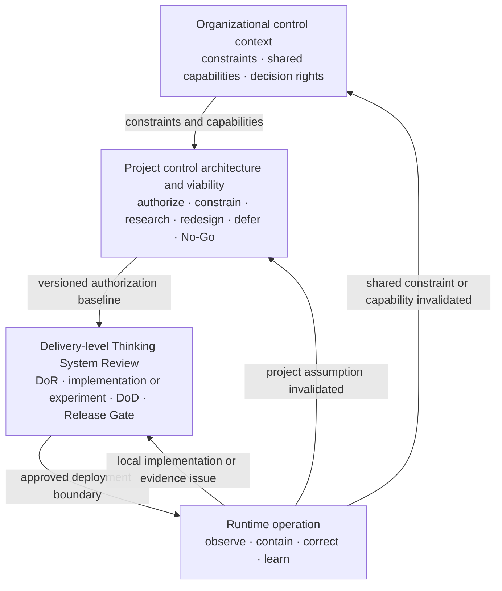
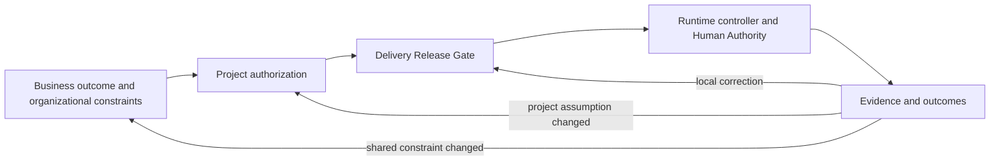

# Nested Control Lifecycle

**Status:** Draft normative  
**Role:** Defines how organizational, project, delivery, and runtime control decisions connect without collapsing into one gate or one governance process

## Purpose

Uncertainty Architecture uses four connected control levels because different questions require different evidence, authority, time horizons, and corrective actions.

The lifecycle is not a hierarchy of documents. It is a hierarchy of decisions:



A lower-level decision may refine a higher-level authorization. It must not silently expand it. Runtime evidence flows upward when it invalidates the assumptions that supported a delivery, project, or organizational decision.

## The four levels

### 1. Organizational control context

The organizational level supplies constraints and capabilities shared across projects. Examples include prohibited uses, risk appetite, legal and contractual constraints, approved vendors and deployment models, identity and audit services, incident processes, shared evaluation infrastructure, and available Human Authority.

UA does not require one governance department or committee to own this context. Existing authoritative sources should be linked rather than duplicated in UA artifacts.

The organizational level answers:

- What is prohibited or conditionally permitted?
- Which shared capabilities exist, and what are their limits?
- Which data, jurisdictions, vendors, and deployment models are allowed?
- Which decision rights and escalation paths already exist?
- Which change would require organizational review rather than a local project response?

### 2. Project control architecture and viability

The project level decides whether the proposed Thinking System has a credible, operable, and economically viable control architecture.

The canonical decision surface is the [`Project Control Architecture and Viability Review`](../01-patterns/project-control-architecture-and-viability-review.md).

It owns:

- the intended business outcome and the reason Model Judgment is needed;
- material consequence and risk scenarios;
- the intended Judgment, autonomy, and authority landscape;
- deterministic invariants and prohibited authority;
- required control capabilities and shared dependencies;
- evidence feasibility and feedback latency;
- Human Authority and operational capacity;
- build, run, review, and incident cost of the control perimeter;
- authorization, conditions, bounded research, redesign, escalation, deferral, or No-Go;
- the versioned baseline inherited by delivery reviews;
- project reauthorization triggers.

A successful prototype is not project authorization. The relevant question is whether the complete socio-technical control system can be built and operated within the accepted risk and economic boundary.

### 3. Delivery-level review

The delivery level decides whether a bounded whole system, feature, or material change is ready, complete, and acceptable for a stated deployment context.

The canonical decision surface is the [`Thinking System Review`](../01-patterns/thinking-system-review.md).

It owns:

- implementation-level Judgment Nodes;
- the applicable Requirement and Operating Envelope;
- model-mediated Definition of Ready;
- bounded experimentation or implementation;
- model-mediated Definition of Done;
- the deployment-specific Release Gate;
- local runtime reassessment.

A delivery review inherits the project authorization by reference. It may narrow authority, population, scope, data, or deployment conditions. It must not silently expand them.

### 4. Runtime control and reauthorization

Runtime is where the authorized control architecture is exercised and where assumptions meet evidence.

Runtime control includes:

- observing outputs, outcomes, drift, incidents, and operating conditions;
- interpreting evidence through an authorized Controller;
- applying correction, fallback, containment, compensation, rollback, or shutdown;
- preserving traceability between evidence, decisions, and system changes;
- determining which decision must be reassessed.

Runtime evidence does not automatically require escalation to the highest level. The affected level follows the assumption that was invalidated.

## Decision ownership and inheritance

Use this ownership chain:

```text
Organizational sources
→ Project Control Architecture and Viability Review
→ Thinking System Review
→ Runtime evidence and corrective action
```

Information flows downward by reference:

1. organizational constraints and shared capabilities constrain the project;
2. the project review creates a versioned authorization and inheritance package;
3. delivery reviews link that version and refine local implementation detail;
4. runtime records link the delivery and project decisions under which the system operates.

Evidence flows upward when needed:

```text
Local implementation or evidence issue
→ delivery reassessment

Risk, authority, capacity, evidence, or economic assumption changed
→ project reauthorization

Shared constraint, policy, or capability changed
→ organizational review
```

## Reauthorization logic

Reauthorization is not a scheduled ceremony. It is a response to evidence that changes the basis of an earlier decision.

Typical delivery reassessment triggers include:

- a local evaluation regression;
- a control implementation defect;
- a deployment-specific threshold breach;
- a bounded change that remains inside the authorized project envelope.

Typical project reauthorization triggers include:

- increased autonomy or tool authority;
- expansion to new users, populations, data classes, domains, geographies, or consequence levels;
- degraded Human Authority or operational capacity;
- evidence that required controls are ineffective or too slow;
- material change in model, vendor, architecture, or dependency risk;
- control cost, review burden, incident burden, or latency that invalidates project economics;
- residual risk outside the authorized project boundary.

Typical organizational review triggers include:

- a shared control capability becomes unavailable or materially weaker;
- a legal, contractual, privacy, security, or safety constraint changes;
- a project reveals a cross-project failure mechanism;
- the organization must change risk appetite, approved vendors, or decision rights.

## Relationship to the AI Control Plane

The lifecycle defines **where decisions are owned**. The [`AI Control Plane`](../02-ai-control-plane/) defines **which capabilities make those decisions operational**.



At every level, observation alone is insufficient. Evidence becomes control only when it reaches decision authority and that authority can change, constrain, contain, compensate, roll back, or stop behavior.

## Practical SMB operating path

UA deliberately avoids multiplying governance artifacts. The default SMB path uses existing organizational sources plus two living reviews:

```text
Link organizational constraints and shared capabilities
→ complete one Project Control Architecture and Viability Review
→ issue a versioned project authorization and inheritance package
→ complete a Thinking System Review for each bounded delivery scope
→ pass the deployment-specific Release Gate
→ operate through the approved control loop
→ reassess the delivery, project, or organizational decision when evidence invalidates its assumptions
```

This does not require a separate governance board protocol, Judgment Node registry, responsibility matrix, risk map, Project Launch Gate file, or Release Decision Record when the two reviews and linked evidence provide sufficient traceability.

## Invariants

1. Project authorization and delivery release are distinct decisions.
2. A lower-level review may narrow but must not silently expand a higher-level authorization.
3. Higher-level context should be inherited by reference rather than copied into every artifact.
4. Runtime evidence must remain connected to the decisions and assumptions under which the system operates.
5. Reassessment follows the assumption invalidated by evidence.
6. Telemetry without decision authority and corrective action is observation, not control.
7. Human Authority must be substantive where human intervention is part of the approved control architecture.
8. No-Go, rollback, narrowing, suspension, and shutdown are valid control outcomes.
9. The full control perimeter must remain technically, operationally, and economically viable.

## Relationships

- [`uncertainty-in-the-controlled-object.md`](uncertainty-in-the-controlled-object.md) explains why runtime Model Judgment changes the controlled object.
- [`project-control-architecture-and-viability-review.md`](../01-patterns/project-control-architecture-and-viability-review.md) owns project viability, authorization, inheritance, and reauthorization.
- [`thinking-system-review.md`](../01-patterns/thinking-system-review.md) owns delivery readiness, completion, release, and local reassessment.
- [`02-ai-control-plane/`](../02-ai-control-plane/) defines the distributed capabilities required to observe, decide, and intervene.
- [`03-reference-architectures/`](../03-reference-architectures/) demonstrates non-prescriptive applications of the lifecycle.
- [`SPECIFICATION.md`](../SPECIFICATION.md) defines status, conformance, and change control.
