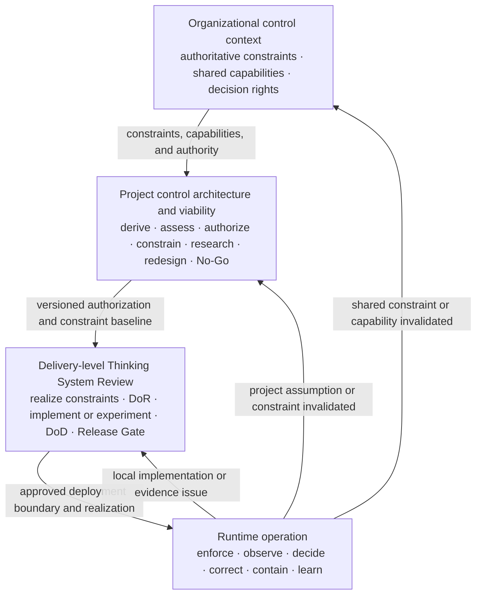
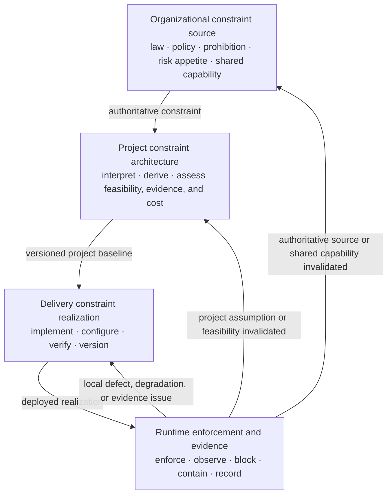
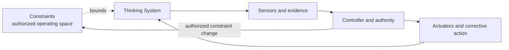

# Nested Control Lifecycle

**Status:** Draft normative  
**Role:** Defines how organizational, project, delivery, and runtime control decisions connect without collapsing into one gate or one governance process

## Purpose

Uncertainty Architecture uses four connected control levels because different questions require different evidence, authority, time horizons, constraint realization, and corrective actions.

The lifecycle is not a hierarchy of documents. It is a hierarchy of decisions:



A lower-level decision may refine or narrow a higher-level authorization. It must not silently expand it, weaken inherited hard constraints, or transfer decision authority to a lower level. Runtime evidence flows upward when it invalidates the assumptions, constraints, capabilities, or authority boundaries that supported a delivery, project, or organizational decision.

## The four levels

### 1. Organizational control context

The organizational level supplies authoritative constraints and capabilities shared across projects. Examples include prohibited uses, risk appetite, legal and contractual constraints, approved vendors and deployment models, identity and audit services, data classifications and geographies, incident processes, shared evaluation infrastructure, and available Human Authority.

UA does not require one governance department or committee to own this context. Existing authoritative sources should be linked rather than duplicated in UA artifacts.

The organizational level answers:

- What is prohibited or conditionally permitted?
- Which data, jurisdictions, vendors, models, tools, and deployment modes are allowed?
- Which shared constraint, identity, evaluation, audit, incident, fallback, and shutdown capabilities exist, and what are their limits?
- Which decision rights and escalation paths already exist?
- Who may approve an exception or change to an organizational constraint?
- Which change would require organizational review rather than a local project response?

### 2. Project control architecture and viability

The project level decides whether the proposed Thinking System has a credible, operable, and economically viable control architecture.

The canonical decision surface is the [`Project Control Architecture and Viability Review`](../01-patterns/project-control-architecture-and-viability-review.md).

It owns:

- the intended business outcome and the reason Model Judgment is needed;
- material consequence and risk scenarios;
- the intended Judgment, autonomy, and authority landscape;
- deterministic invariants and prohibited authority;
- interpretation of applicable organizational constraints;
- derivation of project-specific constraints from risk scenarios and operating assumptions;
- required Constraint, Sensor, Controller, Actuator, Human Authority, fallback, containment, rollback, compensation, and shutdown capabilities;
- evidence feasibility and feedback latency;
- Human Authority and operational capacity;
- build, run, review, enforcement, fallback, and incident cost of the control perimeter;
- authorization, conditions, bounded research, redesign, escalation, deferral, or No-Go;
- the versioned authorization and constraint baseline inherited by delivery reviews;
- project reauthorization triggers.

A successful prototype is not project authorization. The relevant question is whether the complete socio-technical control system, including constraint realization and evidence, can be built and operated within the accepted risk and economic boundary.

### 3. Delivery-level review

The delivery level decides whether a bounded whole system, feature, or material change is ready, complete, and acceptable for a stated deployment context.

The canonical decision surface is the [`Thinking System Review`](../01-patterns/thinking-system-review.md).

It owns:

- implementation-level Judgment Nodes;
- the applicable Requirement and Operating Envelope;
- realization of inherited and locally derived constraints through architecture, interfaces, permissions, configuration, gates, deployment boundaries, and Human Authority;
- model-mediated Definition of Ready;
- bounded experimentation or implementation;
- verification of constraint enforcement, failure behavior, evidence, and change authority;
- model-mediated Definition of Done;
- the deployment-specific Release Gate;
- local runtime reassessment.

A delivery review inherits the project authorization and constraints by reference. It may narrow authority, population, scope, data, deployment, resource, or operating conditions. It must not silently expand them or relax a hard project or organizational boundary.

### 4. Runtime control and reauthorization

Runtime is where the authorized control architecture is exercised and where assumptions, constraints, and capabilities meet evidence.

Runtime control includes:

- enforcing the deployed constraint realization;
- observing outputs, outcomes, drift, incidents, operating conditions, constraint violations, bypass attempts, control health, and operational friction;
- interpreting evidence through an authorized Controller;
- applying correction, fallback, containment, compensation, rollback, narrowing, suspension, or shutdown through available Actuators;
- preserving traceability between constraint sources, active versions, evidence, decisions, actuator execution, and system changes;
- determining which decision must be reassessed.

Runtime evidence does not automatically require escalation to the highest level. The affected level follows the assumption, constraint, capability, or authority boundary that was invalidated.

## Decision ownership and inheritance

Use this ownership chain:

```text
Organizational sources
→ Project Control Architecture and Viability Review
→ Thinking System Review
→ Runtime evidence and corrective action
```

Information flows downward by reference:

1. organizational constraints, shared capabilities, and decision rights constrain the project;
2. the project review interprets those sources, derives project-specific constraints, and creates a versioned authorization and inheritance package;
3. delivery reviews link that version and realize the constraints for a bounded implementation and deployment scope;
4. runtime records link the active constraint, delivery, and project versions under which the system operates.

Evidence flows upward when needed:

```text
Local implementation, configuration, enforcement, or evidence issue
→ delivery reassessment

Risk, authority, constraint feasibility, capacity, evidence, or economic assumption changed
→ project reauthorization

Shared constraint, policy, decision right, or organizational capability changed
→ organizational review
```

## Constraint inheritance and realization

Constraints do not move downward as copied text alone. Their authority is inherited, while their realization becomes more concrete at each level.



A constraint should remain traceable through:

- source and decision authority;
- subject and scope;
- hard or soft classification;
- realization and enforcement point;
- failure behavior;
- evidence and control health;
- change or override authority;
- active version and deployment scope;
- reassessment trigger.

A lower-level Controller may change only constraints inside its delegated authority. Technical configurability does not authorize relaxation of a project or organizational boundary.

## Reauthorization logic

Reauthorization is not a scheduled ceremony. It is a response to evidence that changes the basis of an earlier decision.

Typical delivery reassessment triggers include:

- a local evaluation regression;
- a constraint, control, or implementation defect;
- stale, misconfigured, bypassed, degraded, or unavailable enforcement;
- a deployment-specific threshold or resource-boundary breach;
- a bounded configuration change that remains inside the authorized project envelope;
- excessive false blocks, fallback load, latency, or local operational friction that can be corrected without changing the project case.

Typical project reauthorization triggers include:

- increased autonomy or tool authority;
- expansion to new users, populations, data classes, domains, geographies, languages, products, or consequence levels;
- proposed relaxation of a project hard constraint;
- a new or materially changed constraint that alters the control architecture;
- degraded Human Authority or operational capacity;
- evidence that required constraints or controls are ineffective, bypassable, too slow, or operationally infeasible;
- material change in model, vendor, architecture, context source, tool, deployment, or dependency risk;
- control cost, false-block burden, review burden, fallback load, incident burden, or latency that invalidates project economics;
- residual risk outside the authorized project boundary.

Typical organizational review triggers include:

- a shared constraint or control capability becomes unavailable or materially weaker;
- a legal, contractual, privacy, security, safety, procurement, residency, or financial constraint changes;
- a project requires an exception to an organizational prohibition or boundary;
- a project reveals a cross-project constraint or failure mechanism;
- the organization must change risk appetite, approved vendors, deployment modes, or decision rights.

## Relationship to the AI Control Plane

The lifecycle defines **where decisions are owned**. The [`Control-Loop Capability Anatomy`](control-loop-anatomy.md) and [`AI Control Plane`](../02-ai-control-plane/) define **which capabilities make those decisions operational**.

At every level, control requires four logical functions:

- **Constraints** — what is allowed and how the operating space is bounded;
- **Sensors and evidence** — what is observed about behavior, outcomes, conditions, violations, and control health;
- **Controllers and decision authority** — who or what interprets the evidence and owns the decision;
- **Actuators and corrective action** — how an authorized decision changes operation.



Observation alone is insufficient. A policy or constraint declaration without realization is insufficient. A Controller without an available Actuator is insufficient. Control exists only when the required capabilities and authority path form an operable loop.

## Practical SMB operating path

UA deliberately avoids multiplying governance artifacts. The default SMB path uses existing organizational sources plus two living reviews:

```text
Link organizational constraints, capabilities, and decision rights
→ complete one Project Control Architecture and Viability Review
→ issue a versioned project authorization and constraint inheritance package
→ complete a Thinking System Review for each bounded delivery scope
→ realize and verify inherited constraints
→ pass the deployment-specific Release Gate
→ operate through the approved control loop
→ reassess the delivery, project, or organizational decision when evidence invalidates its assumptions or boundaries
```

This does not require a separate governance board protocol, Constraint Register, Judgment Node registry, responsibility matrix, risk map, Project Launch Gate file, or Release Decision Record when the two reviews and linked evidence provide sufficient traceability.

## Invariants

1. Project authorization and delivery release are distinct decisions.
2. A lower-level review may narrow but must not silently expand a higher-level authorization.
3. A lower-level implementation must not silently weaken an inherited hard constraint.
4. Higher-level context should be inherited by reference rather than copied into every artifact.
5. Runtime evidence must remain connected to the constraint, delivery, project, and organizational decisions under which the system operates.
6. Reassessment follows the assumption, constraint, capability, or authority boundary invalidated by evidence.
7. Telemetry without decision authority and corrective action is observation, not control.
8. A declared constraint without realization, evidence, failure behavior, and authority is not an operable boundary.
9. Human Authority must be substantive where human intervention is part of the approved control architecture.
10. No-Go, rollback, narrowing, suspension, and shutdown are valid control outcomes.
11. The full control perimeter must remain technically, operationally, and economically viable.

## Relationships

- [`uncertainty-in-the-controlled-object.md`](uncertainty-in-the-controlled-object.md) explains why runtime Model Judgment changes the controlled object.
- [`control-loop-anatomy.md`](control-loop-anatomy.md) defines Constraints, Sensors, Controllers, and Actuators as the four logical capability classes.
- [`project-control-architecture-and-viability-review.md`](../01-patterns/project-control-architecture-and-viability-review.md) owns project viability, constraint architecture, authorization, inheritance, and reauthorization.
- [`thinking-system-review.md`](../01-patterns/thinking-system-review.md) owns delivery readiness, constraint realization, completion, release, and local reassessment.
- [`02-ai-control-plane/`](../02-ai-control-plane/) develops the distributed capabilities required to bound, observe, decide, and intervene.
- [`03-reference-architectures/`](../03-reference-architectures/) demonstrates non-prescriptive applications of the lifecycle.
- [`SPECIFICATION.md`](../SPECIFICATION.md) defines status, conformance, and change control.
