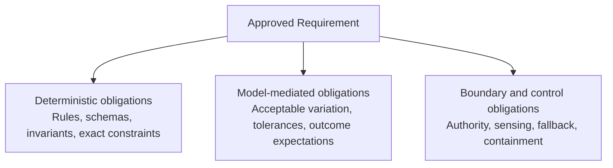
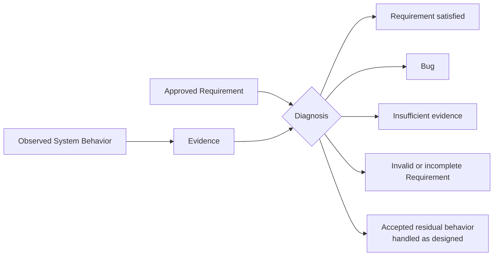
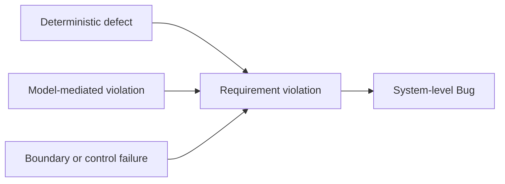

# Requirements, Correctness, and Bugs in Thinking Systems

## Status

This document is **draft normative**. It defines the canonical relationship between Requirements, Operating Envelopes, Correctness, and Bugs when probabilistic Model Judgment performs part of the behavior of a Thinking System.

The presentation *Designing Non-Deterministic Systems: Maintaining Engineering Rigor in the AI Era* is a synthesis source for this formulation. The source remains historical research evidence; this document is the explicit framework decision that translates the relevant ideas into current UA terminology.

## 1. Mixed-system framing

Thinking Systems are mixed systems composed of:

- **deterministic responsibilities** that must remain explicit, inspectable, and testable;
- **model-mediated responsibilities** in which probabilistic Model Judgment interprets, selects, generates, ranks, plans, or otherwise influences behavior;
- **boundary and control responsibilities** that constrain authority, provide context, observe behavior, and define fallback, escalation, containment, rollback, or shutdown.

UA extends rather than replaces classical software-engineering contracts. Deterministic rules, schemas, interfaces, permissions, state transitions, and invariants still require conventional specification and testing. Model-mediated behavior adds obligations that cannot always be represented as one exact output for one input.

## 2. Requirement

> **A Requirement is an approved operating contract for a system, feature, or change.**

Depending on the system and consequence level, a Requirement may include:

- the intended outcome;
- deterministic obligations;
- model-mediated obligations;
- invariants;
- authority boundaries;
- acceptable operating conditions;
- resource constraints;
- evidence expectations;
- required failure handling.

An **Operating Envelope** is part of a Requirement, not a synonym for the complete Requirement. It describes the approved region within which relevant conditions, authority, resource use, behavior, and outcomes remain acceptable. It does not by itself replace the intended outcome, deterministic obligations, evidence expectations, or failure-handling duties that may also form the operating contract.

A Requirement MUST distinguish hard obligations from probabilistic expectations where that distinction is material. Example thresholds, sample sizes, scores, confidence levels, cost limits, or review cadences do not become universal requirements merely because they appear in a source or reference architecture.

### Mixed Requirement

## 3. Correctness

> **Correctness is the condition in which observed system behavior satisfies the approved Requirement.**

Correctness remains a system property. It is not equivalent to model quality, one successful output, or a green deterministic test suite.

For deterministic obligations, compliance can often be evaluated directly against an explicit rule, result, schema, transition, or invariant. For model-mediated obligations, establishing compliance may require evidence across relevant scenarios, behavioral variation, operating conditions, and control performance.

The required evidence depends on the Requirement and decision context. No universal metric, sample size, benchmark, evaluator, or confidence interval proves correctness for every Thinking System.

## 4. Evidence and diagnosis

Observed behavior does not diagnose itself. Evidence must be interpreted against the approved Requirement.

A diagnosis SHOULD distinguish at least the following outcomes:

- the Requirement is satisfied;
- the implemented system violated the Requirement;
- the available evidence is insufficient;
- the Requirement is invalid, incomplete, or ambiguous;
- the observed behavior falls within explicitly accepted residual behavior and was handled as required.

An undesirable output, evaluation result, incident, or Deviation Signal is evidence. It is not automatically a Bug. The observed condition may be within an accepted residual-risk region, correctly contained, outside the system's stated responsibility, or too weakly evidenced to establish a Requirement violation.

## 5. Bug

> **A Bug is a violation of an approved Requirement caused or permitted by the implemented system.**

The Bug is the system-level Requirement violation. Its source may be located in deterministic implementation, Model Judgment, or the boundaries and controls around them.

### 5.1 Deterministic defect

A **Deterministic Defect** is a reproducible violation of an explicit rule, invariant, state transition, schema, interface, permission, or deterministic output contract.

Examples include an incorrect calculation, an invalid state transition, a broken authorization check, or failure to enforce a required invariant.

### 5.2 Model-mediated violation

A **Model-Mediated Violation** occurs when behavior produced through Model Judgment leaves approved operating conditions or tolerances, produces a prohibited outcome, or otherwise violates a model-mediated obligation in the Requirement.

Variation by itself is not a violation. The relevant question is whether the implemented system caused or permitted behavior outside the approved contract.

### 5.3 Boundary or control failure

A **Boundary or Control Failure** occurs when a Requirement violation is caused or permitted by an incorrect or missing context, authority boundary, constraint, sensor, controller, validation gate, fallback, escalation, containment, rollback, or shutdown responsibility.

A model output may be locally plausible while the system still contains a Bug because the surrounding system supplied invalid context, granted excessive authority, failed to detect a material deviation, or failed to execute the required corrective response.

### Defect source versus system outcome

These are diagnostic categories for locating the source of a Requirement violation. They are not three separate definitions of a Bug, and more than one category may contribute to the same system-level Bug.

## 6. Relationship to readiness, completion, and release

Requirement, Correctness, and Bug diagnosis inform three distinct engineering decisions:

- **Definition of Ready (DoR)** asks whether the work is sufficiently framed to begin implementation or bounded experimentation.
- **Definition of Done (DoD)** asks whether the implementation and required evidence are sufficiently complete.
- **Release Gate** asks whether the available evidence and residual risk are acceptable for a specific deployment context.

DoR, DoD, and Release Gate remain distinct. Detailed checklists, decision outcomes, delivery flow, responsibility allocation, evidence-package structure, and practical records belong in reusable patterns and artifacts rather than in this doctrine document.

## 7. Relationship to other UA concepts

- [`glossary.md`](glossary.md) contains the canonical concise definitions used by this document.
- [`../01-patterns/`](../01-patterns/) contains reusable technical and socio-technical responses that apply this doctrine.
- [`../02-ai-control-plane/`](../02-ai-control-plane/) defines capabilities used to constrain, observe, evaluate, and correct model-mediated behavior.
- [`../04-failure-modes/`](../04-failure-modes/) distinguishes recurring mechanisms of control loss from individual Bug instances.
- [`../content/research/notes/designing-nondeterministic-systems-source-intake.md`](../content/research/notes/designing-nondeterministic-systems-source-intake.md) records the presentation source and its normalization state.
