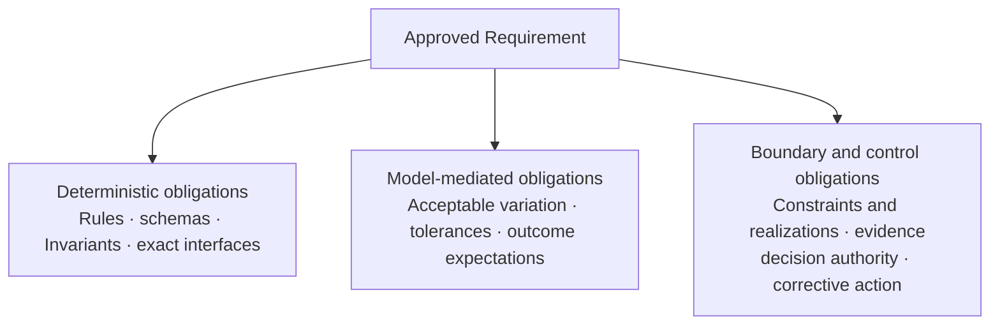
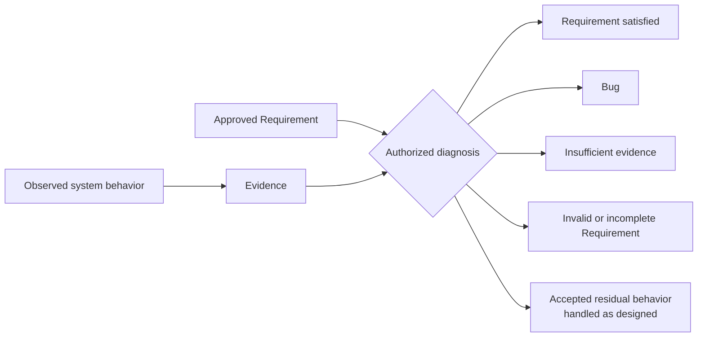
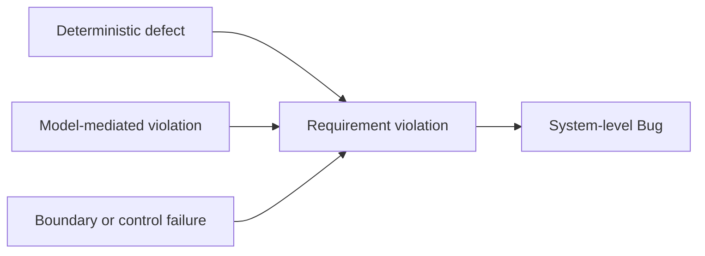

# Requirements, Correctness, and Bugs in Thinking Systems

## Status

This document is **draft normative**. It defines the canonical relationship between Requirements, Operating Envelopes, Correctness, and Bugs when probabilistic Model Judgment performs part of the behavior of a Thinking System.

The presentation *Designing Non-Deterministic Systems: Maintaining Engineering Rigor in the AI Era* is a synthesis source for this formulation. Repository review is grounded in the maintainer-supplied PDF export preserved under `content/raw/`; an editable PPTX is not preserved or independently verified. The linked source-intake note records the explicit framework-transfer decisions.

## 1. Mixed-system framing

Thinking Systems are mixed systems composed of:

- **deterministic responsibilities** that must remain explicit, inspectable, and testable;
- **model-mediated responsibilities** in which probabilistic Model Judgment interprets, selects, generates, ranks, plans, or otherwise influences behavior;
- **boundary and control responsibilities** that define Constraints and their realizations, produce evidence, preserve decision authority, and provide fallback, escalation, containment, compensation, rollback, or shutdown.

UA extends rather than replaces classical software-engineering contracts. Deterministic rules, schemas, interfaces, permissions, state transitions, and Invariants still require conventional specification and testing. Model-mediated behavior adds obligations that cannot always be represented as one exact output for one input.

## 2. Requirement

> **A Requirement is an approved operating contract for a system, feature, or change.**

Depending on the system and consequence level, a Requirement may include:

- the intended outcome;
- deterministic obligations;
- model-mediated obligations;
- Invariants and Constraints;
- authority boundaries;
- acceptable operating conditions;
- resource boundaries;
- evidence expectations;
- required failure handling.

An **Operating Envelope** is part of a Requirement, not a synonym for the complete Requirement. It describes the approved region within which relevant conditions, authority, resource use, behavior, and outcomes remain acceptable. It does not by itself replace the intended outcome, deterministic obligations, evidence expectations, or failure-handling duties that may also form the operating contract.

A Requirement MUST distinguish hard obligations from probabilistic expectations where that distinction is material. A Hard Constraint claim requires a scoped complete realized path that deterministically prevents or rejects violation within stated assumptions and enforcement boundaries. Example thresholds, sample sizes, scores, confidence levels, cost limits, or review cadences do not become universal requirements merely because they appear in a source or reference architecture.

### Mixed Requirement

This diagram decomposes Requirement content. It is not a control-loop topology and does not replace the [`Control-Loop Capability Anatomy`](control-loop-anatomy.md).

## 3. Correctness

> **Correctness is the condition in which observed system behavior satisfies the approved Requirement.**

Correctness remains a system property. It is not equivalent to model quality, one successful output, or a green deterministic test suite.

For deterministic obligations, compliance can often be evaluated directly against an explicit rule, result, schema, transition, Invariant, or Hard Constraint realization. For model-mediated obligations, establishing compliance may require evidence across relevant scenarios, behavioral variation, operating conditions, and control performance.

The required evidence depends on the Requirement and decision context. No universal metric, sample size, benchmark, evaluator, or confidence interval proves correctness for every Thinking System.

## 4. Evidence and diagnosis

Observed behavior does not diagnose itself. Evidence must be interpreted against the approved Requirement by a decision function with appropriate authority.

This is a diagnosis view rather than a complete runtime control loop. Corrective execution remains the responsibility of an Actuator connected to the relevant Controller or Human Authority.

A diagnosis SHOULD distinguish at least the following outcomes:

- the Requirement is satisfied;
- the implemented system violated the Requirement;
- the available evidence is insufficient;
- the Requirement is invalid, incomplete, or ambiguous;
- the observed behavior falls within explicitly accepted residual behavior and was handled as required.

An undesirable output, evaluation result, incident, or Deviation Signal is evidence. It is not automatically a Bug. The observed condition may be within an accepted residual-risk region, correctly contained, outside the system's stated responsibility, or too weakly evidenced to establish a Requirement violation.

## 5. Bug

> **A Bug is a system-level violation of an approved Requirement caused or permitted by the implemented system.**

Its source may be located in deterministic implementation, Model Judgment, data or context, a Constraint or its realization, evidence, decision authority, an Actuator, an external dependency, or interaction among them.

### 5.1 Deterministic defect

A **Deterministic Defect** is a defect in explicitly encoded logic, configuration, interface, state handling, permission enforcement, Constraint Realization, or another deterministic responsibility.

Examples include an incorrect calculation, invalid state transition, broken authorization check, stale schema, bypassable policy gate, or failure to preserve an Invariant.

### 5.2 Model-mediated violation

A **Model-Mediated Violation** occurs when behavior produced through Model Judgment leaves approved operating conditions or tolerances, produces a prohibited outcome, or otherwise violates a model-mediated obligation in the Requirement.

Variation by itself is not a violation. The relevant question is whether the implemented system caused or permitted behavior outside the approved contract.

### 5.3 Boundary or control failure

A **Boundary or Control Failure** occurs when a Requirement violation is caused or permitted by an incorrect or missing context, authority boundary, Constraint, Constraint Realization, Sensor, Controller, Actuator, Human Authority, fallback, escalation, containment, compensation, rollback, or shutdown responsibility.

A model output may be locally plausible while the system still contains a Bug because the surrounding system supplied invalid context, granted excessive authority, failed to realize an approved boundary, failed to detect a material deviation, or failed to execute the required response.

### Defect source versus system outcome

This is a diagnostic classification, not a control topology. More than one source may contribute to the same Bug.

## 6. Relationship to readiness, completion, and release

Requirement, Correctness, and Bug diagnosis inform three distinct delivery decisions:

- **Definition of Ready (DoR)** asks whether the work is sufficiently framed to begin implementation or bounded experimentation.
- **Definition of Done (DoD)** asks whether the implementation and required evidence are sufficiently complete.
- **Release Gate** asks whether realized Constraints, available evidence, residual risk, operational capacity, and the proposed deployment are acceptable under the project authorization.

DoR, DoD, and Release Gate remain distinct. Their practical records belong in the [`Thinking System Review`](../01-patterns/thinking-system-review.md), not in this doctrine document.

## Relationships

- [`glossary.md`](glossary.md) owns canonical concise definitions.
- [`control-loop-anatomy.md`](control-loop-anatomy.md) defines Constraints and realizations, Sensors, Controllers, and Actuators.
- [`../01-patterns/thinking-system-review.md`](../01-patterns/thinking-system-review.md) owns delivery readiness, completion, release, and local reassessment.
- [`../02-ai-control-plane/`](../02-ai-control-plane/) develops capability-specific guidance.
- [`../04-failure-modes/`](../04-failure-modes/) distinguishes recurring mechanisms of control loss from individual Bug instances.
- [`../content/research/notes/designing-nondeterministic-systems-source-intake.md`](../content/research/notes/designing-nondeterministic-systems-source-intake.md) records the presentation source relationship and framework-transfer decisions.
