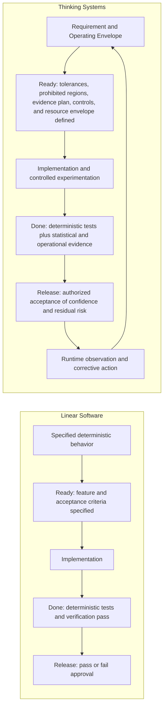
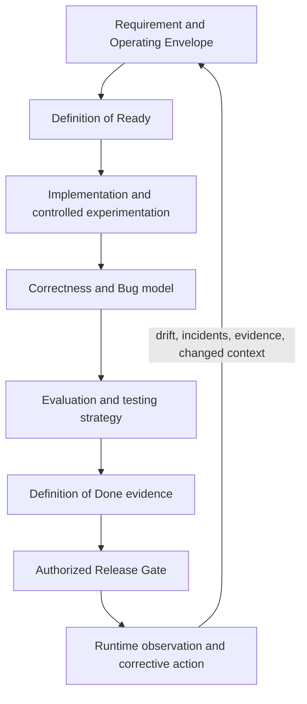

# Requirements, Correctness, Bugs, and Delivery Gates in Thinking Systems

## Status

This document is **draft normative**. It defines a candidate doctrine for requirements, correctness, bugs, readiness, completion, and release when probabilistic Model Judgment performs part of the business logic of a Thinking System.

The presentation *Designing Non-Deterministic Systems: Maintaining Engineering Rigor in the AI Era* is a synthesis source for this formulation. The source remains historical research evidence; this document is the explicit framework decision that translates the relevant ideas into current UA terminology.

## 1. Core relationship

A **Requirement** defines the approved operating contract of a system.

**Correctness** is the condition in which observed system behavior satisfies that contract.

A **Bug** is a violation of an approved Requirement caused or permitted by the implemented system.

A **Definition of Ready (DoR)** is the entry gate that determines whether the operating contract and the plan for establishing compliance are sufficiently explicit to begin implementation or controlled experimentation.

A **Definition of Done (DoD)** is the completion gate that determines whether the implemented change has sufficient evidence, operability, and recovery support to be considered complete for a defined release context.

A **Release Gate** is the separate decision in which authorized decision-makers accept, reject, limit, or condition release based on DoD evidence, residual risk, and operating context.

This relationship applies to both Linear Software and Thinking Systems. What changes is how the Requirement can be specified, how compliance must be evaluated, and what evidence is needed at each gate.

## 2. From a binary validation contract to a statistical quality contract

The presentation contrasts traditional delivery assumptions with the contracts required when probabilistic Model Judgment performs consequential work. UA preserves that distinction because it explains why DoR, DoD, cost, and release criteria must change together.

| Delivery concern | Linear Software / traditional contract | Thinking Systems / statistical quality contract |
|---|---|---|
| **Validation contract** | **Binary validation contract.** A defined input and condition are expected to produce a specified result, so compliance can often be expressed as pass or fail. | **Statistical quality contract.** The Requirement defines an approved Operating Envelope, and evidence establishes whether relevant behavior, outcomes, and control performance remain inside it with sufficient confidence for the decision context. |
| **Ready** | Feature behavior and deterministic acceptance criteria are specified. | Intended outcomes, uncertainty surfaces, business tolerance bounds, prohibited regions, evidence strategy, control responses, and decision authority are explicit and traceable. |
| **Cost / budget** | Compute and runtime cost are often assumed stable or treated outside feature readiness. | Token, compute, latency, and other material resource use are bounded through a measurable cost or resource envelope before implementation or controlled experimentation begins. |
| **Done** | Applicable unit, integration, and manual checks pass against fixed outputs and deterministic acceptance criteria. | Deterministic tests pass, and evaluation evidence at an adequate scale supports that quality, drift, prohibited behavior, resource use, and other Requirement-derived measures remain within approved bounds. |
| **Release** | A pass/fail decision follows implementation review, test completion, and approval. | Authorized decision-makers accept, reject, limit, phase, or condition release based on the evidence, uncertainty, confidence, residual risk, scope, and operating context. |

The distinction is not that Linear Software never uses statistics or that Thinking Systems abandon deterministic validation. Thinking Systems combine both: deterministic rules and invariants still use pass/fail validation, while model-mediated behavior requires evidence about distributions, uncertainty, and control performance.

The relationship can be represented as two different delivery contracts:

The phrases **risk profile is digitized**, **large-sample runs prove**, and **confidence interval is accepted** are useful presentation shorthand, but UA narrows them as follows:

- risk, tolerances, assumptions, and prohibited regions must be explicit and traceable, but no single digital representation is mandatory;
- evaluation scale and sample adequacy must be justified by the Requirement and decision context, but no universal sample size proves correctness;
- confidence intervals may be part of the evidence, but they are neither universally required nor sufficient by themselves;
- the release decision accepts bounded evidence and residual risk for a stated scope and period; it does not certify permanent correctness.

## 3. Requirements in Linear Software

For explicitly encoded deterministic behavior, a Requirement may prescribe one expected output, transition, or rule for defined inputs and conditions.

Correctness can often be evaluated by comparing the observed result directly with that expected result.

A violation is typically reproducible as a deterministic deviation from the specified behavior.

## 4. Requirements in Thinking Systems

When an LLM or another probabilistic model performs interpretation, classification, generation, planning, ranking, or action selection that contributes to business logic, one exact acceptable output cannot always be specified in advance.

A Requirement for Model Judgment therefore SHOULD define the approved **Operating Envelope** within which behavioral variation is acceptable for the intended business context.

Depending on the system and consequence level, the operating contract may include:

- intended outcomes;
- invariants that must never be delegated to probabilistic judgment alone;
- permitted behavioral variation;
- prohibited behaviors or regions;
- authority and action boundaries;
- business tolerances for relevant outcome distributions;
- evidence and evaluation expectations;
- cost, latency, compute, token, or other resource envelopes when material;
- required handling when behavior is uncertain or outside approved bounds;
- fallback, escalation, containment, rollback, or shutdown obligations.

The envelope MUST be derived from context and risk. A numerical threshold, sample size, evaluation score, confidence level, cost limit, or review cadence is not universal merely because it appears in an example or source.

## 5. Correctness under probabilistic business logic

Thinking Systems do not eliminate the concept of correctness. They change how correctness must be specified and demonstrated.

For a stochastic component that performs business logic, correctness cannot normally be reduced to whether one sampled output matches one predetermined answer.

Correctness is instead evaluated from evidence that the implemented system:

1. preserves required invariants;
2. keeps relevant behavior and outcomes within the approved Operating Envelope;
3. detects material deviations with sufficient evidence for the decision context;
4. executes the required control response when acceptable bounds are exceeded or cannot be established;
5. remains within approved operational and resource constraints where those constraints are part of the Requirement.

This makes correctness a system property. It depends on the model-mediated behavior together with deterministic boundaries, sensors, controllers, decision rights, resource controls, and corrective mechanisms.

## 6. Canonical definition of Bug

> **A Bug is a violation of an approved Requirement caused or permitted by the implemented system.**

In Linear Software, this commonly appears as an incorrect deterministic result or transition.

In a Thinking System, a Bug may appear when:

- observed model-mediated behavior materially exceeds an approved business tolerance;
- the behavior or outcome leaves the approved Operating Envelope;
- an invariant is violated;
- a prohibited action is allowed;
- a required boundary, sensor, controller, or corrective mechanism is absent or ineffective;
- the system fails to contain, escalate, fall back, roll back, or stop as required;
- the system materially exceeds an approved cost, latency, compute, token, or other resource boundary that forms part of the Requirement.

For an LLM that performs business logic, a statistically evidenced excursion beyond an approved business tolerance is therefore a Bug **when that tolerance is part of the approved Requirement and the implemented system causes or permits the violation**.

This preserves the presentation's essential point without treating every rare or undesirable model output as a defect.

## 7. Event, evidence, and diagnosis must remain distinct

An individual undesirable output or out-of-envelope observation is first an event and may generate a **Deviation Signal**.

It is not automatically sufficient to diagnose a Bug because:

- the event may fall within an explicitly accepted residual-risk region;
- the available sample may be too weak to establish a material tolerance breach;
- the Requirement or Operating Envelope may be incomplete, ambiguous, or invalid;
- the event may have been correctly detected and handled by the required containment path;
- the observed symptom may arise from an external condition outside the system's stated responsibility.

Diagnosis SHOULD determine whether the system violated its approved operating contract and why.

Relevant classifications may include:

- deterministic implementation defect;
- statistically material tolerance breach;
- missing or invalid Requirement;
- missing boundary or constraint;
- inadequate sensor or evaluation design;
- controller or decision-authority failure;
- containment or recovery failure;
- accepted distribution tail handled as designed;
- invalid assumption about the operating context.

The **Bug** is the Requirement violation. A statistical excursion, evaluation result, incident, or user report is evidence used to establish that violation and its cause.

## 8. Definition of Ready as an entry contract

The Definition of Ready is not proof that the proposed behavior is correct. It is the decision that the work is sufficiently framed to enter implementation or controlled experimentation without hiding consequential uncertainty.

For work involving Model Judgment, DoR SHOULD establish, in proportion to risk and autonomy:

- the intended business outcome and relevant users or affected parties;
- the location and authority of Model Judgment;
- deterministic invariants, prohibited actions, and hard constraints;
- the initial Operating Envelope and business tolerances to be tested or refined;
- consequential scenarios and known failure consequences;
- the evidence strategy, including evaluation methods and the rationale for sample adequacy;
- the cost, latency, compute, token, or other resource envelope when material;
- ownership and decision authority for requirement changes, tolerance acceptance, and escalation;
- required fallback, containment, rollback, shutdown, or human-review paths;
- assumptions and unresolved questions that remain explicit.

DoR MAY permit controlled experimentation when the final operating envelope cannot yet be known. In that case, it MUST distinguish exploratory hypotheses from approved production tolerances and define how evidence will be used to refine the Requirement.

Expressions such as "the risk profile is digitized" are implementation choices, not doctrine. UA requires the relevant risk and tolerance information to be explicit and traceable; it does not require one tool or data representation.

## 9. Definition of Done as an evidence and operability contract

The Definition of Done is not equivalent to one successful run, a green deterministic test suite, or completion of implementation tasks.

For work involving Model Judgment, DoD SHOULD require evidence, proportional to the release context, that:

- deterministic logic, boundaries, and invariants pass their applicable tests;
- evaluation results support the claim that relevant behavior remains within the approved Operating Envelope;
- the evaluation scope, dataset, sample size, confidence, uncertainty, and known limitations are visible;
- consequential scenarios and prohibited regions have been exercised where feasible;
- cost, latency, compute, token, or other material resource behavior remains within approved bounds;
- observability and Deviation Signals are available for relevant production behavior;
- required fallback, escalation, containment, rollback, shutdown, and Human Authority paths are implemented and tested at an appropriate level;
- versions, evidence, decisions, and assumptions are traceable;
- known residual risk and unresolved uncertainty are recorded;
- operational ownership exists for post-release observation and corrective action.

Large-sample evaluation MAY be necessary, but no universal sample size proves correctness. Metrics such as accuracy, drift, hallucination rate, cost, or confidence intervals are relevant only when they correspond to the approved Requirement and decision context.

Passing an evaluation gate supports a bounded completion claim. It does not prove universal correctness or eliminate the need for runtime control.

## 10. DoD and release are separate decisions

DoD answers:

> Has the change produced the required implementation, evidence, operability, and recovery support for the defined release context?

The Release Gate answers:

> Does an authorized decision-maker accept the available evidence and residual risk for this deployment, population, scope, and operating period?

A change MAY satisfy DoD and still be blocked, limited, phased, or conditioned at the Release Gate. Conversely, release pressure MUST NOT silently weaken DoD or redefine approved tolerances without an explicit Requirement and risk decision.

A confidence interval may be part of release evidence, but UA does not require confidence intervals for every system or accept them as sufficient by themselves. The appropriate evidence depends on consequences, reversibility, uncertainty, exposure, and the nature of the Requirement.

## 11. Consequences for engineering practice

Because Bug, readiness, completion, and release are derived from Requirement, changes to the requirement model propagate through the delivery system:

Traditional pass/fail tests remain appropriate for deterministic rules and invariants.

Model-mediated business logic additionally requires evidence about behavioral distributions, consequential scenarios, boundaries, resource use, and control performance. Passing an evaluation suite does not by itself prove universal correctness; it supports a bounded completion, release, or operating decision.

## 12. Relationship to other UA concepts

- [`glossary.md`](glossary.md) contains the canonical concise definitions of Requirement, Operating Envelope, Correctness, Bug, Definition of Ready, Definition of Done, Release Gate, and Deviation Signal.
- [`../02-ai-control-plane/`](../02-ai-control-plane/) defines the capabilities used to observe deviations and authorize corrective action.
- [`../01-patterns/`](../01-patterns/) may define reusable structures for specifying operating envelopes, evaluation gates, and release evidence.
- [`../04-failure-modes/`](../04-failure-modes/) distinguishes recurring mechanisms of control loss from individual defect instances.
- [`../content/research/notes/designing-nondeterministic-systems-source-intake.md`](../content/research/notes/designing-nondeterministic-systems-source-intake.md) records the presentation source and its normalization state.

## 13. Open questions

The following remain subject to further framework review:

- whether UA needs a separate canonical term for a statistically established tolerance breach;
- how requirement and gate evidence should be represented across different risk and autonomy levels;
- how accepted residual risk should be documented without normalizing avoidable defects;
- how conformance claims should distinguish design adequacy, completion evidence, release authorization, and observed production performance;
- whether reusable DoR and DoD artifacts belong in patterns, practical artifacts, or both.
