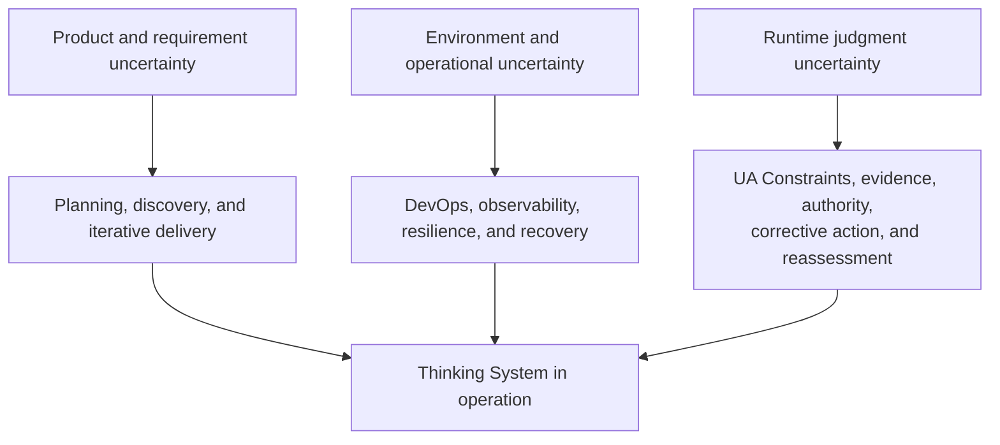
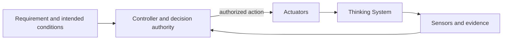
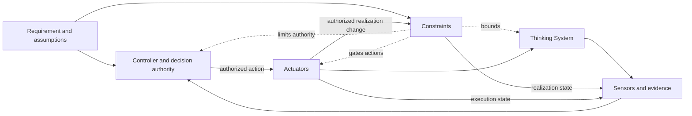
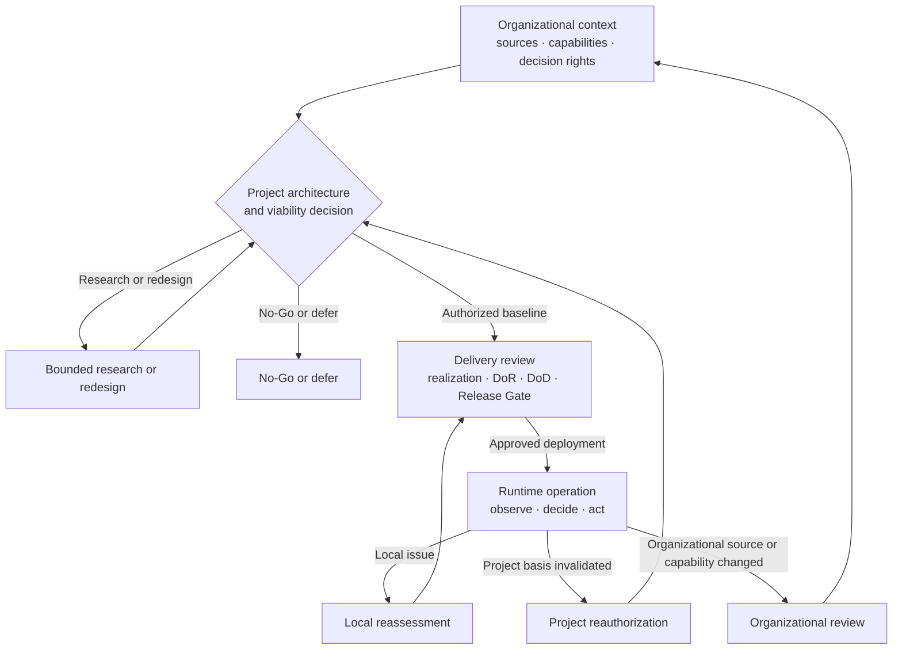

# Uncertainty in the Controlled Object

## Status

This document is **draft normative**. It defines why Thinking Systems require an additional control lifecycle and distinguishes project authorization, delivery realization and release, and runtime reassessment.

It does not define detailed project or delivery procedures, the complete capability anatomy, one universal Constraint catalogue, one risk score, one control-cost formula, or a mandatory organizational structure.

Canonical relationships among Constraints, Constraint Realizations, Sensors, Controllers, and Actuators belong to [`Control-Loop Capability Anatomy`](control-loop-anatomy.md). Project-level operationalization belongs to the [`Project Control Architecture and Viability Review`](../01-patterns/project-control-architecture-and-viability-review.md). Delivery-level realization, DoR, DoD, Release Gate, and reassessment belong to the [`Thinking System Review`](../01-patterns/thinking-system-review.md).

## 1. The controlled object has changed

Classical software is designed primarily around explicitly encoded behavior. At the level of an individual deterministic responsibility, the intended relationship is:

```text
y = f(x)
```

Given the same relevant input, code, configuration, and state, the system is expected to follow an inspectable path and produce the same result or an explicitly handled failure.

A model-mediated responsibility behaves differently:

```text
y ~ P(y | x, c, m)
```

where `c` represents relevant context and `m` represents the model and behavior-affecting configuration. The result is selected from a space of plausible behaviors rather than produced only through one locally explicit path.

A Thinking System is not wholly random. It remains a mixed system with deterministic obligations, Model Judgment, Constraints, evidence, decision authority, and corrective mechanisms. The change is that some consequential runtime behavior is produced through probabilistic judgment inside the system being engineered.

> **In a Thinking System, uncertainty is not only an external condition around delivery. Part of it is produced by the controlled object during operation.**

This is the controlled-object shift addressed by UA.

## 2. Useful variance is part of the capability

Model Judgment is introduced because variation can create value:

- interpreting ambiguous language;
- adapting to context;
- synthesizing incomplete information;
- selecting among plausible paths;
- generating outputs that cannot be enumerated in advance.

The engineering objective is not to eliminate every variation. Eliminating meaningful variation may also eliminate the capability for which the model was introduced.

The objective is to:

- preserve useful judgment;
- define where it may operate;
- define approved Constraints around states, actions, authority, data, tools, resources, environments, outputs, and Human Authority;
- realize critical Constraints through credible technical or socio-technical mechanisms;
- observe behavior, outcomes, realization state, Actuator execution, and control health;
- connect evidence to an authorized Controller;
- execute correction, containment, compensation, fallback, rollback, escalation, or shutdown through available Actuators;
- reassess an earlier decision when evidence invalidates its basis.

UA treats this as a system-control problem rather than a prompt-quality problem alone.

## 3. Different disciplines address different uncertainty

Software delivery has always operated under uncertainty, but the location of that uncertainty matters.

### Product and requirement uncertainty

Teams may not initially know what users need, which assumptions are valid, or which product outcome will create value. Plan-driven analysis and iterative product methods address this uncertainty in different ways.

### Environment and operational uncertainty

Systems operate across changing infrastructure, users, dependencies, traffic, and failure conditions. DevOps, observability, resilience engineering, and incident response address these operating conditions.

### Runtime judgment uncertainty

A Thinking System adds uncertainty inside execution of a business responsibility. Behavior may vary or shift because of:

- probabilistic model output;
- context composition;
- prompt, policy, or Soft Constraint sensitivity;
- provider routing or model updates;
- tool state;
- data distribution;
- Constraint source, realization, or configuration change;
- interactions among multiple Judgment Nodes.

This uncertainty can affect decisions, paths, actions, communications, cost, and liability.



The diagram distinguishes control problems. It does not assign each form of uncertainty exclusively to one discipline.

## 4. UA complements existing engineering disciplines

Agile and iterative methods help teams learn what to build. DevOps helps teams deliver, observe, and recover across changing environments.

Neither discipline, by itself, guarantees that a team has made explicit:

- where consequential Model Judgment occurs;
- what authority it possesses;
- which approved Constraints apply;
- where and how those Constraints are realized;
- which claims are hard and which are probabilistic influence;
- which business consequences Model Judgment may create;
- which variation is acceptable and which outcomes are prohibited;
- which evidence can detect material behavior or realization failure;
- which Controller owns the decision;
- which Actuator can execute correction within the required time;
- whether the complete control perimeter is technically, operationally, and economically viable.

UA does not replace product discovery, Agile delivery, software architecture, QA, security, DevOps, change management, or incident response. It connects them around a changed controlled object.

## 5. Control begins before feature implementation

A successful demonstration does not establish that a project has a deployable architecture.

Before committing to a consequential Thinking System, an organization needs a credible account of:

- the intended outcome and why Model Judgment is needed;
- the domain, stakeholders, and material scenarios;
- the intended Judgment and authority landscape;
- applicable organizational Constraint sources;
- project-specific Constraints derived from risk and operating assumptions;
- deterministic Invariants and prohibited authority;
- Operating Envelope assumptions;
- required Constraint Realizations, Sensors, Controllers, Actuators, Human Authority, fallback, containment, rollback, compensation, and shutdown;
- evidence feasibility and feedback latency;
- operational capacity;
- expected control build and run cost;
- conditions under which the AI path must not proceed.

These are categories of project reasoning, not a universal checklist or scoring formula.

A project that cannot identify credible ways to prevent or reject critical violations where required, detect material deviation, and execute correction does not yet have a deployable control architecture. A project whose control perimeter destroys expected value may be technically possible but economically non-viable.

## 6. Four capabilities and four decision levels

UA separates two orthogonal structures.

The [`Control-Loop Capability Anatomy`](control-loop-anatomy.md) identifies four logical capabilities:

- **Constraints** — approved conditions limiting the allowed operating space;
- **Sensors and evidence** — mechanisms observing behavior, outcomes, operating conditions, realization state, Actuator execution, and control health;
- **Controllers and decision authority** — functions comparing or interpreting evidence and selecting or authorizing action;
- **Actuators and corrective action** — mechanisms executing authorized changes to operation.

A **Constraint Realization** is the mechanism implementing, enforcing, or influencing a Constraint for a defined scope. Constraint and realization are not synonyms.

The [`Nested Control Lifecycle`](nested-control-lifecycle.md) identifies where decisions are owned:

1. organizational control context;
2. project control architecture and viability;
3. delivery-level review;
4. runtime control and reauthorization.

The capabilities do not map one-to-one onto the decision levels. Every level may use the same capability vocabulary while owning a different decision and authority boundary.

## 7. Closed feedback loop versus bounded UA control architecture

A feedback loop is closed when evidence reaches a Controller and an authorized Actuator can affect the controlled process:



A closed loop is not automatically safe, authorized, or economically acceptable. It may still reach prohibited states or operate outside an approved boundary.

A complete UA control architecture also makes Constraints and their realizations explicit:



Constraints are not the feedback edge itself. They bound the space in which the loop may operate.

## 8. Nested Control Lifecycle

### Organizational control context

The organization supplies authoritative Constraint sources, shared capabilities, and decision rights, such as:

- prohibited uses and risk appetite;
- legal, privacy, security, safety, procurement, residency, and contractual obligations;
- permitted vendors, models, data classes, geographies, and deployment modes;
- identity, audit, evaluation, incident, fallback, and shutdown capabilities;
- Human Authority and exception rights.

UA does not require these responsibilities to live in one policy or governance team.

### Project control architecture and viability

The project determines whether the proposed system has:

- a credible risk and consequence model;
- an intended Judgment and authority landscape;
- one traceable Project Constraint Architecture;
- feasible realizations and evidence;
- complete Sensor, Controller, Actuator, Human Authority, fallback, containment, rollback, compensation, and shutdown paths;
- sufficient operational capacity;
- acceptable residual risk;
- viable control economics.

The project decision may authorize, limit, redirect to research, require redesign, defer, escalate, or reject the AI path.

### Delivery-level review

The delivery review owns:

- implementation-level Judgment Nodes;
- the delivery Requirement and Operating Envelope;
- one canonical Constraint Realization Map linked to the project baseline;
- Definition of Ready;
- bounded experiment or implementation;
- Definition of Done;
- the deployment-specific Release Gate;
- local runtime reassessment.

A delivery review may narrow but must not silently expand project authorization or weaken an inherited Hard Constraint.

### Runtime control and reauthorization

Runtime exercises deployed realizations, observes behavior and control health, routes evidence to authorized Controllers, and executes selected actions through Actuators.

Runtime evidence may reveal that:

- a local implementation or realization needs correction;
- deployment scope must narrow;
- a project risk, authority, realization-feasibility, evidence, capacity, or economic assumption is invalid;
- Human Authority or fallback capacity is insufficient;
- an organizational source or shared capability changed;
- project reauthorization, organizational review, or shutdown is required.



The lifecycle is nested and iterative, not a mandatory sequence of meetings, departments, or services.

## 9. Constraint inheritance is not policy copying

Constraint authority flows downward while realization becomes more concrete:

```text
Organizational source
→ project interpretation and Project Constraint Architecture
→ delivery Constraint Realization Map
→ runtime operation, evidence, action, and reassessment
```

A material Constraint should remain traceable through source, subject, scope, strength, realization, assumptions, failure behavior, evidence, active version, decision authority, execution path, and reassessment trigger.

A runtime Controller may select or authorize only changes within delegated authority. An Actuator executes the change. Technical configurability does not authorize relaxation of a project or organizational boundary.

## 10. Project authorization is not delivery release

The project decision asks:

> Is there a credible, operable, and economically viable Constraint and control architecture for pursuing this Thinking System within a defined boundary?

The delivery Release Gate asks:

> Are the realized Constraints, available evidence, residual risk, operational capacity, and proposed deployment acceptable under the linked project authorization?

Passing a Release Gate does not expand project authority or relax inherited Hard Constraints. A material change in autonomy, population, data, domain, geography, deployment, tools, consequence, or project Constraint may require reauthorization.

## 11. Production contains a controlled evidence-generating component

Pre-release evidence cannot fully reproduce the production distribution of users, contexts, dependencies, and interactions.

> **Every material model-mediated release contains a controlled evidence-generating component.**

This does not mean production lacks a binding Requirement or that uncontrolled experimentation is acceptable.

A controlled release remains:

- bounded by an approved Requirement, Constraint baseline, and authority model;
- observable through behavior, outcome, realization-state, execution, and control-health evidence;
- limited in exposure where uncertainty justifies it;
- connected to named Controllers and effective Actuators;
- reversible, containable, or compensable where consequences require it;
- subject to reassessment when evidence changes.

Runtime learning supplements pre-release engineering. It does not excuse missing design or evidence.

## 12. Architectural Veto is part of engineering rigor

A responsible project decision may be not to build, not to automate, or not to grant the proposed authority.

Architectural Veto may be justified when:

- a critical Hard Constraint cannot be credibly realized within stated assumptions;
- a critical Requirement violation cannot be detected within the required time;
- consequences cannot be contained, reversed, compensated, or escalated acceptably;
- no viable deterministic or human fallback exists;
- required Human Authority lacks capacity, context, competence, independence, time, or real power;
- vendor, model, data, policy, permission, context, or realization volatility invalidates the control assumptions;
- required latency, compute, evaluation, enforcement, review, or operations destroy the business case;
- a legal, safety, security, privacy, residency, procurement, or contractual boundary prohibits the operation.

Positive expected value does not override a hard prohibition or unacceptable consequence boundary.

No-Go is a valid engineering outcome.

## 13. Framework implications

This doctrine is operationalized through two distinct patterns:

1. [`Project Control Architecture and Viability Review`](../01-patterns/project-control-architecture-and-viability-review.md);
2. [`Thinking System Review`](../01-patterns/thinking-system-review.md).

The project pattern creates one project Constraint baseline and authorization decision. The delivery pattern creates one concrete Constraint Realization Map and separate DoR, DoD, Release Gate, and reassessment decisions.

They remain connected without requiring duplicate risk maps, Constraint Registers, gate records, or governance protocols for the default SMB path.

## Invariants

1. Useful model-mediated variance may be preserved, but consequential deterministic responsibilities remain explicit.
2. Constraint and Constraint Realization remain distinct.
3. Hard Constraint claims require deterministic prevention or rejection within stated assumptions and scope.
4. Controller decision and Actuator execution remain distinct even when one component performs both.
5. Closed-loop feedback does not by itself establish safe or bounded operation.
6. Project authorization and delivery release remain separate.
7. Higher-level decisions are inherited by reference.
8. Invalidating evidence returns to the decision level whose basis changed.
9. Human Authority must be substantive where required.
10. The complete control perimeter must remain technically, operationally, and economically viable.

## Relationships

- [`control-loop-anatomy.md`](control-loop-anatomy.md) defines capability relationships.
- [`nested-control-lifecycle.md`](nested-control-lifecycle.md) defines decision ownership and reassessment.
- [`requirements-correctness-and-bugs.md`](requirements-correctness-and-bugs.md) defines Requirements, Correctness, Bugs, and diagnosis.
- [`model-judgment-placement.md`](model-judgment-placement.md) defines placement functions.
- [`../01-patterns/project-control-architecture-and-viability-review.md`](../01-patterns/project-control-architecture-and-viability-review.md) owns project authorization.
- [`../01-patterns/thinking-system-review.md`](../01-patterns/thinking-system-review.md) owns delivery realization and release.
- [`../02-ai-control-plane/`](../02-ai-control-plane/) develops capability-specific guidance.
