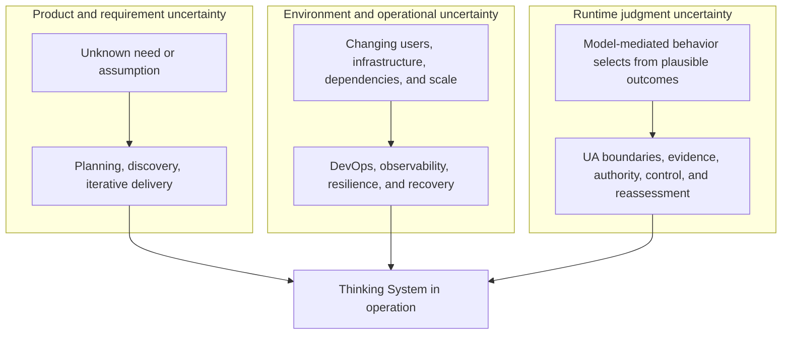
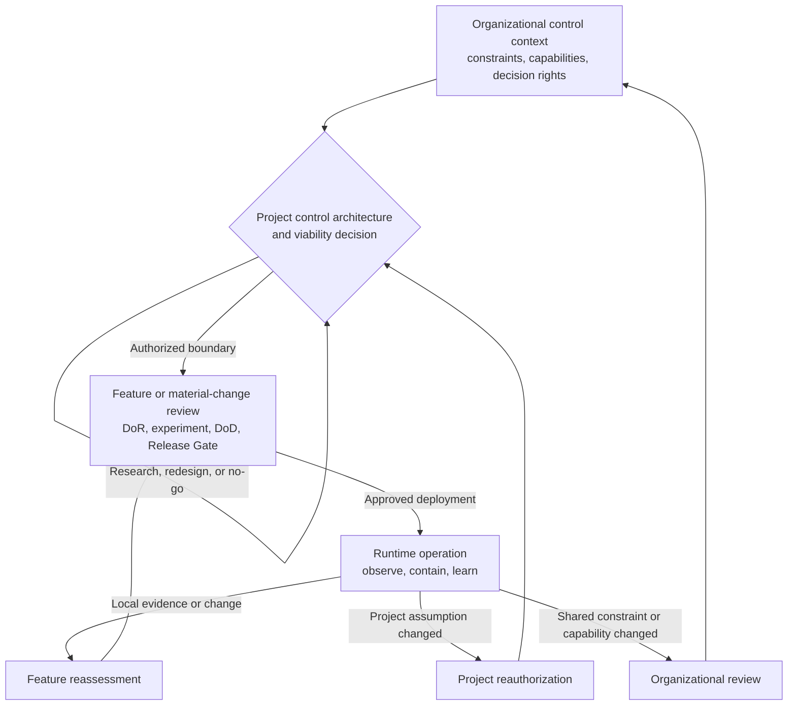

# Uncertainty in the Controlled Object

## Status

This document is **draft normative**. It defines why Thinking Systems require an additional control lifecycle and distinguishes project authorization, feature or change delivery, and runtime reauthorization.

It does not define the detailed project-review process, a risk-scoring method, a control-cost formula, or a mandatory organizational structure. Those operational elements belong in patterns and practical artifacts after separate review.

## 1. The controlled object has changed

Classical software is designed primarily around explicitly encoded behavior. At the level of an individual deterministic responsibility, the intended relationship is:

```text
y = f(x)
```

Given the same relevant input, code, configuration, and state, the system is expected to follow an inspectable path and produce the same result or an explicitly handled failure.

A model-mediated responsibility behaves differently:

```text
y ~ P(y | x, c, m)
```

where `c` represents relevant context and `m` represents the model and behavior-affecting configuration. The result is selected from a space of plausible behaviors rather than computed only through one locally explicit path.

A Thinking System is not wholly random. It remains a mixed system with deterministic obligations, Model Judgment, and boundaries and controls between them. The change is that some consequential runtime behavior is now produced through probabilistic judgment inside the system being engineered.

> **In a Thinking System, uncertainty is not only an external condition around delivery. Part of it is produced by the controlled object during operation.**

This is the controlled-object shift addressed by Uncertainty Architecture.

## 2. Useful variance is part of the capability

Model Judgment is introduced because variation can create value:

- interpreting ambiguous language;
- adapting to context;
- synthesizing incomplete information;
- selecting among plausible paths;
- generating outputs that cannot be enumerated in advance.

The engineering objective is therefore not to eliminate every variation. Eliminating all meaningful variation may also eliminate the capability for which the model was introduced.

The objective is to:

- preserve useful judgment;
- define where it may operate;
- prevent prohibited consequences;
- observe material behavior and outcomes;
- correct, contain, escalate, roll back, or stop the system when required.

UA treats this as a control problem rather than a prompt-quality problem alone.

## 3. Different engineering disciplines address different uncertainty

Software delivery has always operated under uncertainty, but the location of that uncertainty matters.

### 3.1 Product and requirement uncertainty

Teams may not initially know what users need, which assumptions are valid, or which product outcome will create value.

Plan-driven methods reduce this uncertainty through analysis and upfront planning. Iterative and Agile methods reduce it through shorter feedback cycles, incremental delivery, and learning.

### 3.2 Environment and operational uncertainty

A system must operate across changing infrastructure, users, devices, dependencies, traffic, deployment environments, and failure conditions.

DevOps, continuous delivery, observability, resilience engineering, and incident response reduce the delay between operational change, evidence, and corrective action.

### 3.3 Runtime judgment uncertainty

A Thinking System adds uncertainty inside the execution of a business responsibility. Even when the feature, code, and infrastructure are unchanged, behavior may vary or shift because of:

- probabilistic model output;
- context composition;
- prompt or policy sensitivity;
- provider routing or model updates;
- tool state;
- data distribution;
- interaction between multiple Judgment Nodes.

This uncertainty can directly affect decisions, paths, actions, communications, cost, and liability.



These concerns overlap. The diagram is a distinction of control problems, not a claim that one engineering movement owns only one form of uncertainty.

## 4. UA complements delivery and operations disciplines

Agile and related iterative methods help teams learn what to build and adapt when product assumptions change.

DevOps helps teams deliver, observe, and recover across changing operational environments.

Neither discipline, by itself, guarantees that a team has made explicit:

- where consequential Model Judgment occurs;
- what authority it possesses;
- which business consequences it may create;
- which variance is acceptable;
- which outcomes are prohibited;
- which evidence can detect material deviation;
- which Human Authority or automated controller may intervene;
- which mechanisms can constrain, contain, roll back, or stop behavior;
- whether the complete control system is economically viable.

UA does not replace product discovery, Agile delivery, software architecture, QA, security, DevOps, change management, or incident response. It adds a control lifecycle for model-mediated behavior and connects those existing disciplines around a changed controlled object.

## 5. Control begins before feature implementation

A successful demonstration does not establish that a project has a deployable architecture.

Before an organization commits to a consequential Thinking System, it needs a credible account of at least:

- the intended business outcome and why Model Judgment is needed;
- the domain, stakeholders, and material consequence scenarios;
- the expected Judgment landscape and authority boundaries;
- deterministic invariants and prohibited authority;
- assumptions about the Operating Envelope;
- required control capabilities and Human Authority;
- evidence feasibility and feedback latency;
- fallback, containment, rollback, escalation, and shutdown feasibility;
- operational capacity, including human-review capacity where relevant;
- the expected cost of building and operating the control system;
- conditions under which the AI path must not proceed.

These are not a universal checklist or scoring formula. They identify the categories of reasoning needed to decide whether a credible project-level control architecture can exist.

A project that cannot identify a plausible way to detect and contain its critical violations does not yet have a deployable control architecture. A project whose required control perimeter destroys its expected value may be technically possible but economically non-viable.

## 6. Nested control lifecycle

UA distinguishes four connected levels of control.

### 6.1 Organizational control context

The organization supplies constraints and capabilities that apply across projects, such as:

- risk appetite and prohibited uses;
- legal, privacy, security, and contractual constraints;
- available platform, identity, audit, evaluation, and incident capabilities;
- permitted vendors, data classes, and deployment models;
- available Human Authority and operational capacity;
- decision rights for pilots, releases, exceptions, and shutdown.

UA does not require these responsibilities to live in one policy or one governance team.

### 6.2 Project control architecture and viability

The project level determines whether a proposed Thinking System has:

- a credible risk and consequence model;
- an initial Judgment and authority landscape;
- a feasible control architecture;
- sufficient evidence and operational capacity;
- acceptable residual risk;
- viable control economics.

The result is a project-level authorization, limitation, redesign, research-only decision, escalation, or rejection of the AI path.

### 6.3 Feature and change delivery

Within an authorized project boundary, teams use the [`Thinking System Review`](../01-patterns/thinking-system-review.md) or an equivalent process for a specific feature or material change.

The feature-level review owns:

- consequential Judgment Nodes;
- the applicable Requirement and Operating Envelope;
- readiness for implementation or bounded experimentation;
- completion evidence;
- the deployment-specific Release Gate;
- feature-level reassessment triggers.

A feature review may inherit project-level constraints and shared controls rather than redefine the entire domain and project risk space.

### 6.4 Runtime control and reauthorization

Production creates evidence that pre-release environments cannot fully reproduce. Runtime observation may confirm the current decision or reveal that:

- a feature needs local correction or rollback;
- the deployment scope must be narrowed;
- a project assumption is invalid;
- Human Authority or operational capacity is insufficient;
- control cost or latency has become unacceptable;
- the project needs reauthorization or shutdown;
- an organizational constraint or shared capability must change.



The lifecycle is nested and iterative. It is not a mandatory sequence of meetings, documents, departments, or software components.

## 7. Project authorization is not feature release

A project-level decision and a feature-level Release Gate answer different questions.

### Project-level authorization

The project-level decision asks:

> Is there a credible, operable, and economically viable control architecture for pursuing this Thinking System within a defined boundary?

It may authorize only research, a bounded pilot, a constrained project, or full project delivery. It may also require redesign, escalation, or rejection of the AI path.

### Feature-level Release Gate

The feature-level Release Gate asks:

> Are the available evidence and residual risk acceptable for this specific deployment context, under the already stated project and organizational constraints?

Passing a feature Release Gate does not silently expand project authority. A feature that materially changes autonomy, authority, population, data, domain, tool access, or consequence may require project-level reauthorization.

## 8. Production contains a controlled experimental component

Pre-release evidence cannot fully reproduce the production distribution of users, contexts, dependencies, and interactions.

Therefore:

> **Every material model-mediated release contains a controlled evidence-generating component.**

This does not mean that production use has no binding Requirement or that uncontrolled experimentation on users is acceptable.

A controlled release should remain:

- bounded by an approved Requirement and authority model;
- observable through relevant evidence;
- limited in exposure where uncertainty justifies it;
- connected to named corrective action;
- reversible or containable where consequences require it;
- subject to reassessment when material evidence changes.

Runtime learning supplements pre-release engineering. It does not excuse the absence of pre-release control design.

## 9. Architectural veto is part of engineering rigor

A responsible project decision may be not to build, not to automate, or not to grant the proposed authority.

An architectural veto may be justified when, for example:

- a critical Requirement violation cannot be detected with sufficient reliability or within the required time;
- the consequence cannot be contained, reversed, compensated, or escalated acceptably;
- no viable deterministic fallback exists;
- required Human Authority lacks capacity, context, competence, time, or real decision power;
- vendor, model, data, or context volatility invalidates the intended control assumptions;
- required latency, compute, evaluation, review, and operational controls destroy the business case;
- a hard legal, safety, security, privacy, or contractual boundary prohibits the intended operation.

Positive expected value does not override a hard prohibition or an unacceptable consequence boundary.

No-Go is not a delivery failure. It is a valid output of control-oriented architecture.

## 10. Implications for the UA framework

This doctrine establishes the conceptual distinction needed for two related but separate patterns:

1. the current feature-level [`Thinking System Review`](../01-patterns/thinking-system-review.md);
2. a future project-level control-architecture and viability review.

The future project-level pattern should define how an SMB team can map material risk scenarios, derive required control capabilities, assess Human Authority and operational capacity, estimate control cost, make a project authorization decision, and identify reauthorization triggers without creating a large governance bureaucracy.

Until that pattern is accepted, this document does not create a mandatory Project Launch Gate, risk score, template, review board, or new repository module.

## 11. Non-prescription

UA does not require:

- replacing Agile, Scrum, DevOps, or an organization's existing SDLC;
- one universal lifecycle topology;
- one risk-scoring formula;
- one control-cost model;
- universal thresholds, evidence counts, or review cadences;
- mandatory specialist job titles;
- one governance department or committee;
- autonomous control where Human Authority is more appropriate;
- Human-in-the-Loop where deterministic containment is sufficient.

Organizations may integrate these control decisions into existing product, architecture, security, quality, delivery, change-management, financial, or incident processes, provided the boundaries, evidence, authority, corrective action, and decision state remain explicit and traceable.
