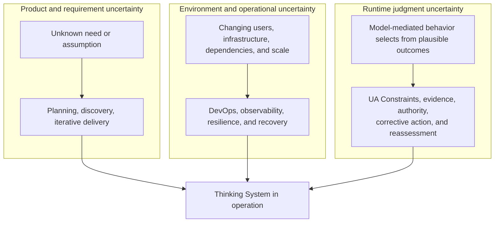
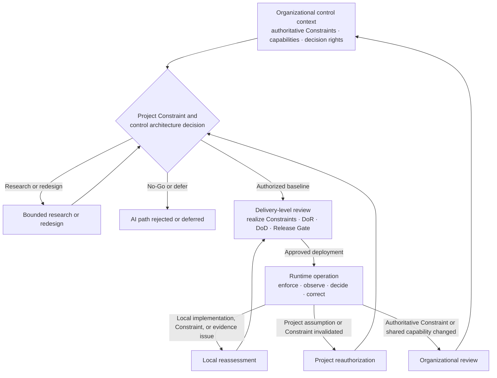

# Uncertainty in the Controlled Object

## Status

This document is **draft normative**. It defines why Thinking Systems require an additional control lifecycle and distinguishes project authorization, delivery-level realization and release, and runtime reauthorization.

It does not define the detailed project or delivery review procedures, the complete four-capability anatomy, a universal Constraint catalogue, a universal risk score, a universal control-cost formula, or a mandatory organizational structure. The four logical capability classes are defined in [`Control-Loop Capability Anatomy`](control-loop-anatomy.md). Project-level operationalization belongs to the [`Project Control Architecture and Viability Review`](../01-patterns/project-control-architecture-and-viability-review.md); delivery-level readiness, Constraint realization, completion, release, and reassessment belong to the [`Thinking System Review`](../01-patterns/thinking-system-review.md).

## 1. The controlled object has changed

Classical software is designed primarily around explicitly encoded behavior. At the level of an individual deterministic responsibility, the intended relationship is:

```text
y = f(x)
```

Given the same relevant input, code, configuration, and state, the system is expected to follow an inspectable path and produce the same result or an explicitly handled failure.

A model-mediated responsibility behaves differently:

```text
y ~ P(y | x, c, m)
```

where `c` represents relevant context and `m` represents the model and behavior-affecting configuration. The result is selected from a space of plausible behaviors rather than computed only through one locally explicit path.

A Thinking System is not wholly random. It remains a mixed system with deterministic obligations, Model Judgment, Constraints, evidence, decision authority, and corrective mechanisms. The change is that some consequential runtime behavior is now produced through probabilistic judgment inside the system being engineered.

> **In a Thinking System, uncertainty is not only an external condition around delivery. Part of it is produced by the controlled object during operation.**

This is the controlled-object shift addressed by Uncertainty Architecture.

## 2. Useful variance is part of the capability

Model Judgment is introduced because variation can create value:

- interpreting ambiguous language;
- adapting to context;
- synthesizing incomplete information;
- selecting among plausible paths;
- generating outputs that cannot be enumerated in advance.

The engineering objective is therefore not to eliminate every variation. Eliminating all meaningful variation may also eliminate the capability for which the model was introduced.

The objective is to:

- preserve useful judgment;
- define where it may operate;
- bound the reachable states, actions, authority, data, tools, resources, environments, and outputs;
- prevent prohibited consequences;
- observe material behavior, outcomes, Constraint state, and control health;
- connect evidence to decision authority;
- correct, contain, compensate, escalate, roll back, or stop the system when required.

UA treats this as a control problem rather than a prompt-quality problem alone.

## 3. Different engineering disciplines address different uncertainty

Software delivery has always operated under uncertainty, but the location of that uncertainty matters.

### 3.1 Product and requirement uncertainty

Teams may not initially know what users need, which assumptions are valid, or which product outcome will create value.

Plan-driven methods reduce this uncertainty through analysis and upfront planning. Iterative and Agile methods reduce it through shorter feedback cycles, incremental delivery, and learning.

### 3.2 Environment and operational uncertainty

A system must operate across changing infrastructure, users, devices, dependencies, traffic, deployment environments, and failure conditions.

DevOps, continuous delivery, observability, resilience engineering, and incident response reduce the delay between operational change, evidence, and corrective action.

### 3.3 Runtime judgment uncertainty

A Thinking System adds uncertainty inside the execution of a business responsibility. Even when the feature, code, and infrastructure are unchanged, behavior may vary or shift because of:

- probabilistic model output;
- context composition;
- prompt, policy, or soft-Constraint sensitivity;
- provider routing or model updates;
- tool state;
- data distribution;
- Constraint configuration or enforcement state;
- interaction between multiple Judgment Nodes.

This uncertainty can directly affect decisions, paths, actions, communications, cost, and liability.



These concerns overlap. The diagram is a distinction of control problems, not a claim that one engineering movement owns only one form of uncertainty.

## 4. UA complements delivery and operations disciplines

Agile and related iterative methods help teams learn what to build and adapt when product assumptions change.

DevOps helps teams deliver, observe, and recover across changing operational environments.

Neither discipline, by itself, guarantees that a team has made explicit:

- where consequential Model Judgment occurs;
- what authority it possesses;
- which states, actions, data, tools, resources, environments, and outputs must be constrained;
- which Constraints are hard and which are probabilistic influence;
- where material Constraints are realized and how they fail;
- which business consequences Model Judgment may create;
- which variance is acceptable;
- which outcomes are prohibited;
- which evidence can detect material deviation or Constraint failure;
- which Human Authority or automated Controller may intervene;
- which Actuators can constrain, change, contain, compensate, roll back, or stop behavior;
- whether the complete control system is technically, operationally, and economically viable.

UA does not replace product discovery, Agile delivery, software architecture, QA, security, DevOps, change management, or incident response. It adds a control lifecycle for model-mediated behavior and connects those existing disciplines around a changed controlled object.

## 5. Control begins before feature implementation

A successful demonstration does not establish that a project has a deployable architecture.

Before an organization commits to a consequential Thinking System, it needs a credible account of at least:

- the intended business outcome and why Model Judgment is needed;
- the domain, stakeholders, and material consequence scenarios;
- the expected Judgment landscape and authority boundaries;
- applicable organizational Constraint sources;
- project-specific Constraints derived from risk and operating assumptions;
- deterministic Invariants and prohibited authority;
- assumptions about the Operating Envelope;
- required Constraints, Sensors, Controllers, Actuators, and Human Authority;
- evidence feasibility and feedback latency;
- fallback, containment, compensation, rollback, escalation, and shutdown feasibility;
- operational capacity, including human-review capacity where relevant;
- the expected cost of building and operating the complete control perimeter;
- conditions under which the AI path must not proceed.

These are not a universal checklist or scoring formula. They identify the categories of reasoning needed to decide whether a credible project-level control architecture can exist.

A project that cannot identify a plausible way to enforce, detect, and contain its critical violations does not yet have a deployable control architecture. A project whose required Constraint and control perimeter destroys expected value may be technically possible but economically non-viable.

## 6. Four capabilities and four decision levels

UA separates two orthogonal structures.

The [`Control-Loop Capability Anatomy`](control-loop-anatomy.md) identifies the functions required for control:

- **Constraints** — define or enforce the allowed operating space;
- **Sensors and evidence** — observe behavior, outcomes, conditions, violations, and control health;
- **Controllers and decision authority** — interpret evidence and authorize decisions;
- **Actuators and corrective action** — execute authorized change.

The [`Nested Control Lifecycle`](nested-control-lifecycle.md) identifies where decisions are owned:

1. organizational control context;
2. project control architecture and viability;
3. delivery-level review;
4. runtime control and reauthorization.

The capability classes do not map one-to-one onto the decision levels. Every level may use the same capability vocabulary while owning a different decision and time horizon.

## 7. Nested Control Lifecycle

### 7.1 Organizational control context

The organization supplies authoritative Constraints, shared capabilities, and decision rights, such as:

- risk appetite and prohibited uses;
- legal, privacy, security, safety, procurement, residency, and contractual Constraints;
- available platform, identity, audit, evaluation, enforcement, incident, fallback, and shutdown capabilities;
- permitted vendors, models, data classes, geographies, and deployment modes;
- available Human Authority and operational capacity;
- decision rights for pilots, releases, exceptions, Constraint changes, and shutdown.

UA does not require these responsibilities to live in one policy or one governance team.

### 7.2 Project control architecture and viability

The project level determines whether a proposed Thinking System has:

- a credible risk and consequence model;
- an initial Judgment and authority landscape;
- a traceable project Constraint architecture;
- feasible Constraint realization and evidence;
- a complete capability path across Sensors, Controllers, and Actuators;
- sufficient Human Authority and operational capacity;
- acceptable residual risk;
- viable control economics.

The result is project authorization, limitation, redesign, research-only decision, escalation, deferral, or rejection of the AI path.

The [`Project Control Architecture and Viability Review`](../01-patterns/project-control-architecture-and-viability-review.md) owns this project-level decision surface and the versioned authorization and Constraint baseline inherited by delivery reviews.

### 7.3 Delivery-level review

Within an authorized project boundary, teams use the [`Thinking System Review`](../01-patterns/thinking-system-review.md) or an equivalent process for a bounded system, feature, or material change.

The delivery-level review owns:

- consequential Judgment Nodes;
- the applicable Requirement and Operating Envelope;
- concrete realization and versioning of inherited and local Constraints;
- readiness for implementation or bounded experimentation;
- implementation and completion evidence;
- the deployment-specific Release Gate;
- local runtime reassessment triggers.

A delivery review inherits project-level Constraints and shared capabilities by reference rather than redefining the entire domain, project risk space, capacity assumptions, and economics. It may narrow but must not silently weaken or expand the project boundary.

### 7.4 Runtime control and reauthorization

Runtime is where the approved capability loop is exercised.

Runtime may confirm the current decision or reveal that:

- a local implementation, configuration, or Constraint realization needs correction or rollback;
- deployment scope must be narrowed;
- a project risk, Constraint feasibility, authority, evidence, capacity, or economic assumption is invalid;
- Human Authority or fallback capacity is insufficient;
- an organizational Constraint or shared capability changed;
- project reauthorization, organizational review, or shutdown is required.



The lifecycle is nested and iterative. It is not a mandatory sequence of meetings, documents, departments, or software components.

## 8. Constraint inheritance is not policy copying

Authoritative Constraints flow downward, but their realization becomes more concrete at each level:

```text
Organizational source
→ project interpretation and derived Constraint architecture
→ delivery realization, configuration, verification, and release
→ runtime enforcement, evidence, corrective action, and reassessment
```

A material Constraint should remain traceable through source, subject, scope, hard or soft strength, realization, failure behavior, evidence, active version, change authority, and reassessment trigger.

A runtime component may change only Constraints inside delegated authority. Technical configurability does not authorize relaxing a project or organizational boundary.

## 9. Project authorization is not delivery release

### Project-level authorization

The project decision asks:

> Is there a credible, operable, and economically viable Constraint and control architecture for pursuing this Thinking System within a defined boundary?

It may authorize only research, a bounded pilot, constrained delivery, or broader project work. It may also require redesign, escalation, deferral, or rejection of the AI path.

### Delivery-level Release Gate

The delivery Release Gate asks:

> Are the realized Constraints, available evidence, and residual risk acceptable for this specific deployment context under the existing project and organizational boundary?

Passing a Release Gate does not silently expand project authority or relax inherited hard Constraints. A change in autonomy, authority, population, data, domain, geography, deployment mode, tool access, consequence, or project Constraint may require reauthorization.

## 10. Production contains a controlled evidence-generating component

Pre-release evidence cannot fully reproduce the production distribution of users, contexts, dependencies, and interactions.

> **Every material model-mediated release contains a controlled evidence-generating component.**

This does not mean production has no binding Requirement or that uncontrolled experimentation is acceptable.

A controlled release should remain:

- bounded by an approved Requirement, Constraint baseline, and authority model;
- observable through behavior, outcome, Constraint, and control-health evidence;
- limited in exposure where uncertainty justifies it;
- connected to named Controllers and corrective Actuators;
- reversible, containable, or compensable where consequences require it;
- subject to reassessment when evidence changes.

Runtime learning supplements pre-release engineering. It does not excuse the absence of pre-release Constraint and control design.

## 11. Architectural veto is part of engineering rigor

A responsible project decision may be not to build, not to automate, or not to grant the proposed authority.

An architectural veto may be justified when:

- a critical hard Constraint cannot be credibly realized or evidenced;
- a critical Requirement violation cannot be detected within the required time;
- the consequence cannot be contained, reversed, compensated, or escalated acceptably;
- no viable deterministic or human fallback exists;
- required Human Authority lacks capacity, context, competence, independence, time, or real decision power;
- vendor, model, data, policy, Constraint, permission, or context volatility invalidates the intended control assumptions;
- required latency, compute, enforcement, evaluation, review, and operational controls destroy the business case;
- a hard legal, safety, security, privacy, residency, procurement, or contractual boundary prohibits the intended operation.

Positive expected value does not override a hard prohibition or unacceptable consequence boundary.

No-Go is not a delivery failure. It is a valid output of control-oriented architecture.

## 12. Implications for the UA framework

This doctrine is operationalized through two related but distinct patterns:

1. the project-level [`Project Control Architecture and Viability Review`](../01-patterns/project-control-architecture-and-viability-review.md);
2. the delivery-level [`Thinking System Review`](../01-patterns/thinking-system-review.md).

The project pattern maps material risk scenarios, intended Model Judgment and authority, organizational and project Constraints, required capabilities, evidence feasibility, Human Authority, operational capacity, control cost, residual risk, authorization, delivery inheritance, and reauthorization triggers.

The delivery pattern refines the authorized boundary into implementation-level Judgment Nodes, Requirements, concrete Constraint realization, readiness, evidence, completion, a deployment-specific Release Gate, runtime enforcement, and local reassessment.

The patterns remain connected without duplicating ownership:

- project reviews establish and version the inherited authorization and Constraint baseline;
- delivery reviews link that baseline and record concrete realization;
- delivery or runtime evidence that invalidates a project basis returns to project reauthorization;
- organizational Constraint sources and shared capabilities remain owned by their existing authorities.

Neither pattern creates a mandatory committee, universal score, separate Constraint Register, separate gate record, or new top-level repository module.

## 13. Non-prescription

UA does not require:

- replacing Agile, Scrum, DevOps, or an organization's existing SDLC;
- one universal lifecycle or four-service topology;
- one Constraint catalogue, policy engine, risk formula, or control-cost model;
- universal thresholds, evidence counts, or review cadences;
- mandatory specialist job titles;
- one governance department or committee;
- autonomous control where Human Authority is more appropriate;
- Human-in-the-Loop where deterministic containment is sufficient.

Organizations may integrate these control decisions into existing product, architecture, security, quality, delivery, change-management, financial, policy, or incident processes, provided Constraint sources, realization, boundaries, evidence, authority, corrective action, decision state, inheritance, and reauthorization remain explicit and traceable.
