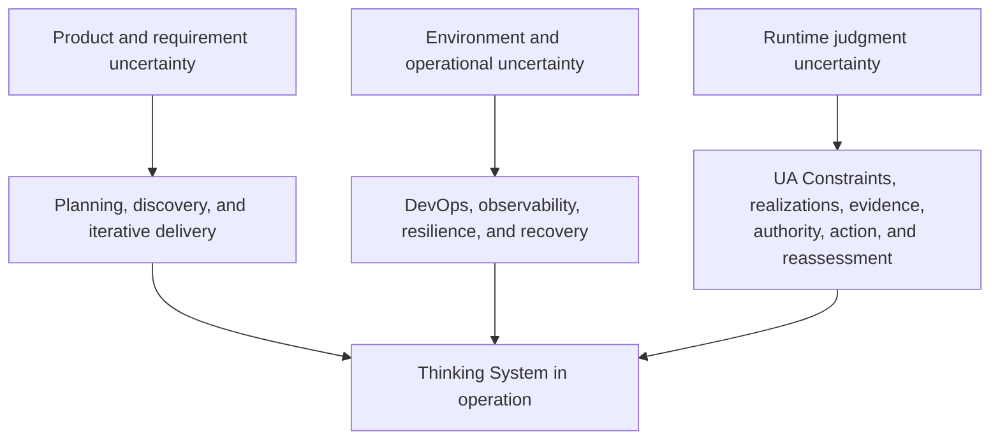
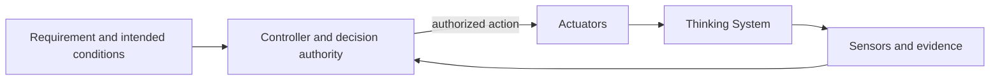
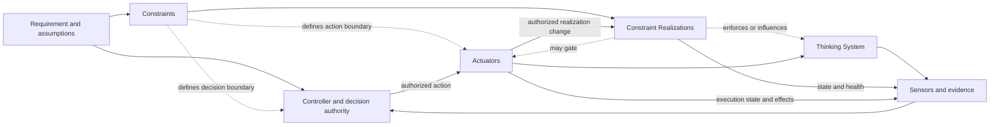
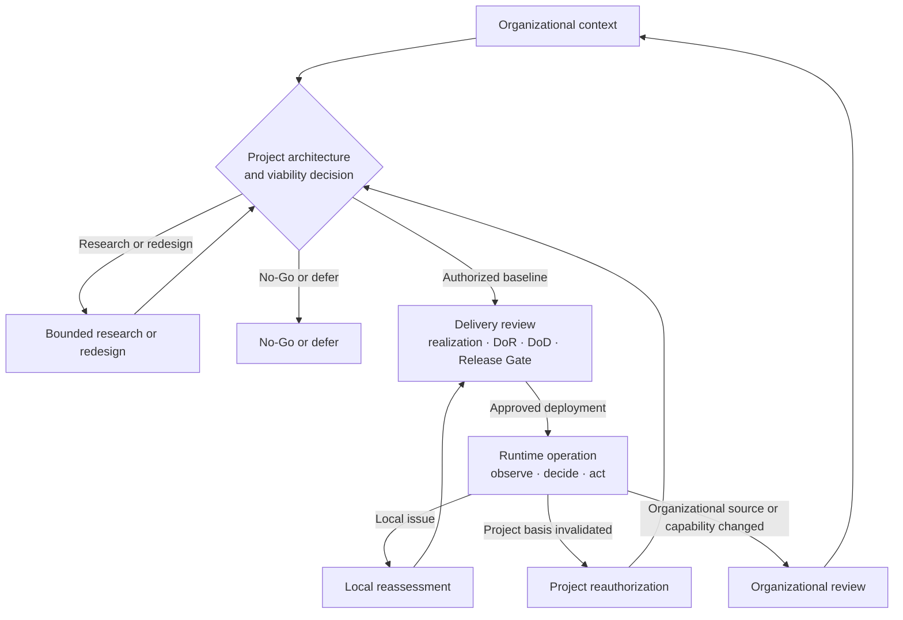

# Uncertainty in the Controlled Object

## Status

This document is **draft normative**. It explains why Thinking Systems require an additional control lifecycle and distinguishes project authorization, delivery realization and release, and runtime reassessment.

Detailed capability relationships belong to [`Control-Loop Capability Anatomy`](control-loop-anatomy.md). Project and delivery procedures belong to their owning patterns.

## 1. The controlled object has changed

Classical deterministic responsibility is intended to behave as:

```text
y = f(x)
```

A model-mediated responsibility behaves more like:

```text
y ~ P(y | x, c, m)
```

where `c` is relevant context and `m` is the model and behavior-affecting configuration.

A Thinking System is the changed controlled object created when one or more **Consequential Runtime Responsibilities** depend partly on probabilistic Model Judgment. The category can therefore appear in a first, simple model-enabled iteration; it does not require agentic autonomy, dynamic orchestration, multiple models, or a mature control architecture.

The change is not that all behavior becomes probabilistic. It is that part of the mapping from situation to consequential behavior is completed at runtime through Model Judgment rather than exhausted by explicitly authored logic. UA engineering then makes the surrounding deterministic obligations, Constraints and their realizations, evidence, decision authority, and corrective mechanisms explicit enough to control that object.

> **Uncertainty is no longer only outside the software. Part of it is produced by the controlled object during operation.**

## 2. Useful variance is part of the capability

Model Judgment is valuable because it can interpret ambiguous language, adapt to context, synthesize incomplete information, select among plausible paths, and generate outputs that cannot be enumerated in advance.

The objective is therefore not to erase variance. It is to:

- preserve useful judgment;
- define approved Constraints around it;
- realize critical boundaries credibly;
- observe behavior, outcomes, realization state, Actuator execution, and control health;
- connect evidence to authorized Controllers;
- execute correction, containment, fallback, compensation, rollback, escalation, or shutdown through Actuators;
- reassess earlier decisions when evidence invalidates their basis.

## 3. Different disciplines address different uncertainty

### Product and requirement uncertainty

Teams may not initially know what users need or which assumptions create value. Planning and iterative product methods address this uncertainty.

### Environment and operational uncertainty

Infrastructure, users, dependencies, traffic, and failure conditions change. DevOps, observability, resilience, and incident response address these conditions.

### Runtime judgment uncertainty

Thinking Systems add uncertainty inside execution through model output, context composition, prompt or Soft Constraint sensitivity, provider changes, tool state, data distribution, realization configuration, and interactions among Judgment Nodes.



UA complements rather than replaces existing engineering disciplines.

## 4. Control begins before implementation

A successful demonstration does not establish a deployable project architecture.

Before committing a Thinking System to production use, a project needs a credible account of:

- intended outcome and AI necessity;
- project boundary and material scenarios;
- intended Judgment and authority landscape;
- organizational and project Constraints;
- deterministic Invariants and prohibited authority;
- Operating Envelope assumptions;
- required Constraint Realizations, Sensors, Controllers, Actuators, Human Authority, fallback, containment, compensation, rollback, and shutdown;
- evidence feasibility and feedback latency;
- operational capacity and control economics;
- conditions under which the AI path must not proceed.

A project that cannot credibly prevent or reject critical violations where required, detect material deviation, and execute correction does not yet have a deployable control architecture.

## 5. Two orthogonal models

The [`Control-Loop Capability Anatomy`](control-loop-anatomy.md) identifies four capability families:

- Constraints and their realizations — approved boundaries and their operational mechanisms;
- Sensors and evidence — observation;
- Controllers and decision authority — comparison, interpretation, and authorization;
- Actuators and corrective action — execution of authorized change.

The Constraints family is intentionally composite. A Constraint is the authoritative boundary object; a Constraint Realization operationalizes it. Constraint Realization is not a fifth capability family.

The [`Nested Control Lifecycle`](nested-control-lifecycle.md) identifies:

1. organizational control context;
2. project control architecture and viability;
3. delivery-level review;
4. runtime control and reassessment.

The capability families do not map one-to-one onto the decision levels.

## 6. Closed feedback versus bounded operation

A feedback loop closes through sensing, decision, and actuation:



A closed loop may still be unsafe or over-authorized. A complete UA control architecture makes approved boundaries and realizations explicit:



The realization arrows describe possible functions. Each scoped Constraint claim identifies whether its complete realized path provides deterministic enforcement, probabilistic influence, or a composite path.

Constraints are not the feedback edge. They define the operating space; realizations make that boundary operational.

## 7. Four decision levels

### Organizational control context

Supplies authoritative Constraint sources, shared capabilities, and decision rights.

### Project control architecture and viability

The project determines whether a credible and viable architecture exists. The decision may authorize, limit, redirect to research, require redesign, defer, escalate, or reject the AI path.

### Delivery-level review

The delivery review owns implementation-level Judgment Nodes, the Requirement and Operating Envelope, one Constraint Realization Map, DoR, DoD, Release Gate, and local reassessment.

### Runtime control and reassessment

Runtime exercises deployed realizations, observes evidence, routes it to authorized Controllers, and executes selected actions through Actuators.



## 8. Constraint inheritance is not policy copying

```text
Organizational source
→ Project Constraint Architecture
→ Delivery Constraint Realization Map
→ Runtime operation, evidence, action, and reassessment
```

Constraint authority flows downward by reference. Realization becomes more concrete. Evidence flows upward when an earlier decision basis changes.

Hard or soft strength is scoped to a Constraint and its complete realized path. The same source condition may produce different claims for different subjects, paths, or scopes. Those claims must remain separate and traceable.

A runtime Controller may authorize only changes within delegated authority. An Actuator executes changes to operation or a Constraint Realization. Technical configurability does not authorize relaxation of a project or organizational boundary.

## 9. Project authorization is not delivery release

Project authorization asks whether a credible, operable, and economically viable architecture exists within a defined boundary.

The delivery Release Gate asks whether realized Constraints, available evidence, residual risk, operational capacity, and the proposed deployment are acceptable under that authorization.

A Release Gate does not expand project authority or relax inherited Hard Constraints.

## 10. Production contains a controlled evidence-generating component

Pre-release evidence cannot fully reproduce production users, contexts, dependencies, and interactions.

> **Every material model-mediated release contains a controlled evidence-generating component.**

This does not excuse uncontrolled experimentation. Production remains bounded by an approved Requirement, Constraint baseline, realization versions, evidence, Controller authority, effective Actuators, and reassessment triggers.

## 11. Architectural Veto

No-Go may be justified when:

- a critical Hard Constraint cannot be credibly realized;
- a critical violation cannot be detected within the consequence window;
- consequences cannot be contained, reversed, compensated, or escalated acceptably;
- no viable fallback exists;
- Human Authority lacks capacity or power;
- vendor, model, data, context, permission, or realization volatility invalidates control assumptions;
- required control cost destroys the business case;
- an authoritative legal, safety, security, privacy, residency, procurement, or contractual boundary prohibits operation.

Positive expected value does not override a hard prohibition. No-Go is a valid engineering outcome.

## 12. Framework implications

UA uses two connected but distinct patterns:

1. [`Project Control Architecture and Viability Review`](../01-patterns/project-control-architecture-and-viability-review.md);
2. [`Thinking System Review`](../01-patterns/thinking-system-review.md).

The project pattern creates one Project Constraint Architecture and authorization decision. The delivery pattern creates one Constraint Realization Map and separate DoR, DoD, Release Gate, and reassessment decisions.

Measured quality, distribution, cost, latency, or capacity tolerances remain part of the Requirement and Operating Envelope unless a separate scoped realization deterministically enforces a specific boundary.

## Invariants

1. Useful variance may be preserved, but consequential deterministic responsibilities remain explicit.
2. Constraint and Constraint Realization remain distinct.
3. Hard Constraint claims require a complete realized path that deterministically prevents or rejects violation within stated assumptions, subject, path, and scope.
4. Different guarantee strengths remain separate rather than collapsed into one mixed record.
5. Controller decision and Actuator execution remain distinct.
6. Closed-loop feedback does not establish bounded acceptable operation by itself.
7. Project authorization and delivery release remain separate.
8. Higher-level decisions are inherited by reference.
9. Invalidating evidence returns to the owning decision level.
10. Human Authority must be substantive where required.
11. The complete control perimeter must remain technically, operationally, and economically viable.

## Relationships

- [`control-loop-anatomy.md`](control-loop-anatomy.md) defines capability relationships.
- [`nested-control-lifecycle.md`](nested-control-lifecycle.md) defines decision ownership and reassessment.
- [`requirements-correctness-and-bugs.md`](requirements-correctness-and-bugs.md) defines Requirements and diagnosis.
- [`model-judgment-placement.md`](model-judgment-placement.md) defines placement functions.
- [`../01-patterns/project-control-architecture-and-viability-review.md`](../01-patterns/project-control-architecture-and-viability-review.md) owns project authorization.
- [`../01-patterns/thinking-system-review.md`](../01-patterns/thinking-system-review.md) owns delivery realization and release.
- [`../02-ai-control-plane/`](../02-ai-control-plane/) develops capability guidance.
