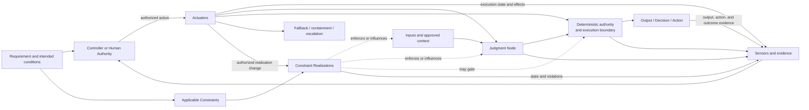
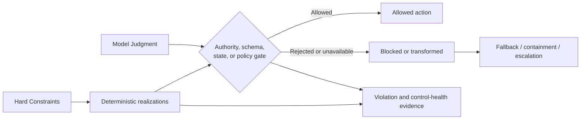

# Judgment Node Boundary

## Status

This document is **draft normative**. It defines a reusable pattern for making Judgment Nodes that perform or materially influence Consequential Runtime Responsibilities explicit, bounded, observable, and operable without requiring a separate registry or governance system.

## 1. Context

A Thinking System may contain one or more locations where Model Judgment influences an output, decision, path, action, or downstream state. UA calls each bounded location a **Judgment Node**.

The model call is rarely the complete boundary. Effective behavior also depends on:

- inputs and context;
- authority around the output;
- applicable Constraints and their sources;
- concrete Constraint Realizations;
- deterministic validation and execution;
- evidence about behavior, realization state, and Actuator execution;
- Controller and Human Authority;
- fallback, containment, escalation, rollback, or shutdown;
- change and reauthorization rights.

## 2. Problem

When a Judgment Node remains implicit, the team cannot reliably determine:

- what the model is expected to judge;
- what it must not decide or do;
- which context sources are authorized;
- how much authority it possesses;
- which Constraints are inherited and which are local;
- whether a claimed Hard Constraint is actually deterministic within stated assumptions;
- whether the approved boundary and its realization are being conflated;
- whether different strength claims are being mixed into one record;
- what evidence is required before and after release;
- who may decide, execute change, override, or escalate;
- how failure is contained or routed upward.

The result is an unreviewable boundary through which uncertainty can propagate into business consequences.

## 3. Forces and trade-offs

A useful boundary balances:

- **useful variance and Constraint strength**;
- **context richness and contamination risk**;
- **authority and recoverability**;
- **enforcement strength and viability**;
- **observability and cost**;
- **completeness and adoption effort**.

## 4. Solution

> **Every consequential Judgment Node SHOULD have an explicit boundary proportional to its authority, downstream impact, reversibility, realization difficulty, evidence uncertainty, and failure consequences.**

The boundary is a reviewable description of responsibility. It is not necessarily a separate service, runtime component, or document.

For the default SMB path, record the node inside the relevant [`Thinking System Review`](thinking-system-review.md) and reference the canonical delivery Constraint Realization Map rather than copying it.

## 5. Core boundary structure



The diagram is functional, not a required topology. The realization arrows describe possible functions, not a deterministic guarantee for every applicable Constraint. Each referenced Constraint row defines whether the realized path enforces, gates, or only influences behavior.

Evidence may be pre-release or runtime. Human Authority may perform the Controller function. One component may perform several functions, but Constraint, realization, decision, and execution responsibilities should remain distinguishable.

## 6. Minimal boundary

For an ordinary bounded use case, record:

- **Name and purpose**;
- **Placement** — Input Interpretation, Decision Logic, Output Mediation, or combination;
- **Inputs and approved context**;
- **Allowed authority**;
- **Applicable Constraint IDs** from the delivery realization map;
- **Unacceptable outcomes**;
- **Evidence and control-health signals**;
- **Controller or Human Authority**;
- **Fallback, containment, or escalation**;
- **Operational owner**;
- **Local change authority**;
- **Delivery reassessment or project reauthorization trigger**.

A minimal boundary is a proportional representation, not a reduced safety standard.

## 7. Extended boundary

Add detail when the node has material authority, difficult-to-reverse effects, broad exposure, regulated consequences, difficult realization, or high failure cost.

Possible extensions include:

- complete context provenance;
- model, prompt, policy, tool, permission, and configuration dependencies;
- output contract;
- acceptable variation;
- deterministic Invariants;
- realization assumptions and claimed guarantees;
- failure, bypass, conflict, degradation, and unavailable behavior;
- pre-release evidence and runtime sensing;
- decision and execution latency;
- fallback, containment, compensation, rollback, or shutdown;
- override and exception authority;
- delivery and project reassessment triggers.

Do not split every field into a separate artifact unless independent ownership or lifecycle genuinely requires it.

## 8. Compact Judgment Node card

```markdown
### Judgment Node

- **Name and purpose:**
- **Placement:** Input Interpretation / Decision Logic / Output Mediation / Combination
- **Inputs and approved context:**
- **Allowed authority:**
- **Applicable Constraint IDs:**
- **Unacceptable outcomes:**
- **Evidence and control health:**
- **Controller or Human Authority:**
- **Fallback, containment, or escalation:**
- **Operational owner:**
- **Local change authority:**
- **Reassessment or reauthorization trigger:**

Optional:
- **Consequentiality and downstream impact:**
- **Dependencies and active versions:**
- **Acceptable variation and output contract:**
- **Realization assumptions and failure behavior:**
- **Rollback, compensation, or shutdown:**
```

The card references the canonical Constraint Realization Map maintained by the delivery review. It does not redefine each Constraint locally.

## 9. Hard and soft accuracy

Hard or soft is a scoped claim about a Constraint and its complete realized path.

A **Hard Constraint** deterministically prevents or rejects violation within stated assumptions, subject, path, scope, and enforcement boundaries.

A prompt, natural-language policy, probabilistic evaluator, classifier, or model preference is not hard by itself.

A composite path may use probabilistic sensing followed by deterministic rejection. The hard guarantee arises from the deterministic enforcement path and is limited by its stated assumptions.

When different subjects or paths have different guarantee strengths, the delivery map should use separate Constraint rows. A Judgment Node should reference the relevant IDs rather than summarizing them as one mixed hard/soft boundary.

## 10. Deterministic containment



This diagram is explicitly limited to hard deterministic realizations.

Deterministic containment does not mean every semantic error can be detected by one validator. It means critical authority, state, permission, transaction, data, and interface obligations are not delegated solely to probabilistic instructions.

## 11. Review prompts

### Purpose and placement

- Why is Model Judgment useful here?
- Which placement function does the node perform?
- What useful variance must remain available?

### Context

- Which inputs and sources are allowed?
- What provenance, isolation, freshness, or data-class boundaries apply?
- What happens when context is missing, conflicting, or adversarial?

### Authority

- Which decisions, paths, outputs, tools, or actions may the node influence?
- Which actions remain prohibited or reserved for Human Authority?
- Can downstream deterministic logic reject the proposal?

### Constraints and realization

- Which delivery Constraint IDs apply?
- What subject, path, and scope does each claim cover?
- Which claims are hard or soft?
- Where are they realized?
- Under which assumptions does a claimed guarantee hold?
- What happens on violation, bypass, conflict, degradation, or unavailability?

### Evidence and decision

- Which Sensor evidence supports the Controller decision?
- What are its coverage, latency, and blind spots?
- Who may authorize action or escalation?
- Which Actuator can execute the decision?

### Recovery and reassessment

- What fallback, containment, compensation, rollback, or shutdown exists?
- Which changes remain local?
- Which evidence invalidates the delivery or project baseline?

## 12. Placement-specific concerns

### Input Interpretation

Focus on ambiguous intent, source authorization, prompt injection, missing context, confidence, and deterministic validation before consequential routing.

### Decision Logic

Focus on autonomy, tool and action permissions, state transitions, reversibility, Human Authority, and deterministic execution gates.

### Output Mediation

Focus on factual support, disclosure, downstream interpretation, data leakage, prohibited claims, safe fallback, and whether presentation itself creates consequence.

A node may combine placements. Review the authority and failure path of each consequential function.

## 13. Failure modes

Common failures include:

- boundary omitted;
- Constraint and realization collapsed;
- prompt treated as Hard Constraint;
- mixed-strength Constraint record;
- authority broader than the project baseline;
- context source not authorized or traceable;
- realization unavailable or bypassable;
- telemetry without Controller authority;
- Controller without effective Actuator;
- Human Authority without capacity or power;
- fallback repeating the same uncertain path;
- local change silently requiring project reauthorization.

## 14. Proportionality

Use the compact card by default. Add fields only when consequence, authority, exposure, irreversibility, realization difficulty, evidence uncertainty, or operating burden justifies them.

Do not create a separate node registry, Constraint Register, decision log, and control catalogue when one delivery review plus linked evidence is sufficient.

## 15. Relationships

- [`thinking-system-review.md`](thinking-system-review.md) owns the delivery decision surface and canonical realization map.
- [`../00-doctrine/model-judgment-placement.md`](../00-doctrine/model-judgment-placement.md) defines placement classes.
- [`../00-doctrine/control-loop-anatomy.md`](../00-doctrine/control-loop-anatomy.md) defines capability relationships.
- [`../02-ai-control-plane/01-constraints/`](../02-ai-control-plane/01-constraints/) defines Constraints and Constraint Realization.
- [`../04-failure-modes/`](../04-failure-modes/) records recurring loss-of-control mechanisms.
