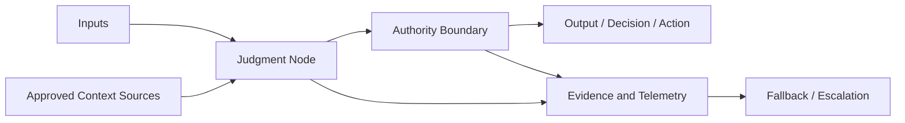
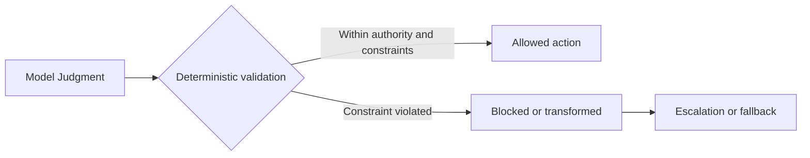

# Judgment Node Boundary

## Status

This document is **draft normative**. It defines a reusable pattern for making consequential Model Judgment explicit, bounded, observable, and operable without requiring a separate registry or governance system.

## 1. Context

A Thinking System may contain one or more locations where Model Judgment influences an output, decision, path, or action. UA calls each bounded location a **Judgment Node**.

The model call itself is rarely the complete boundary. The effective behavior of a Judgment Node also depends on:

- the inputs and context supplied to it;
- the authority granted around its output;
- deterministic validation and execution logic;
- the evidence collected;
- the fallback, containment, and escalation path;
- the people or systems authorized to change it.

## 2. Problem

When a Judgment Node remains implicit, the team cannot reliably determine:

- what the model is expected to judge;
- what the model must not decide or do;
- which context sources are allowed;
- how much authority the node possesses;
- which failures belong to Model Judgment, orchestration, or deterministic controls;
- what evidence is required before and after release;
- how unacceptable behavior is contained or escalated;
- who owns operation and change.

The result is an unreviewable boundary: uncertainty can propagate into business behavior without a clear contract or correction path.

## 3. Forces and trade-offs

A useful boundary must balance:

- **flexibility and constraint** — enough freedom for Model Judgment to be useful without delegating hard invariants;
- **context richness and contamination risk** — enough information to judge well without accepting untrusted or irrelevant context;
- **authority and recoverability** — enough authority to create value while keeping effects bounded and reversible where necessary;
- **observability and cost** — enough evidence for diagnosis without collecting telemetry that no controller can use;
- **completeness and adoption effort** — enough detail for the consequence level without forcing a small team to maintain a large registry.

## 4. Solution

> **Every consequential Judgment Node SHOULD have an explicit boundary proportional to its authority, downstream impact, reversibility, and failure consequences.**

The boundary makes visible:

- purpose;
- placement;
- inputs and approved context;
- authority;
- deterministic constraints;
- unacceptable outcomes;
- evidence and telemetry;
- fallback and escalation;
- ownership.

The boundary is a reviewable description of responsibility, not necessarily a separate service, runtime component, or document. For an SMB team, it may be recorded as a compact card inside an architecture note, feature review, or later Thinking System Review artifact.

## 5. Core boundary structure



The diagram does not imply that evidence must flow only after execution or that fallback is triggered automatically. Implementations may collect pre-release and runtime evidence and may use software or Human Authority as the controller.

## 6. Minimal boundary

The **minimal boundary** is intended for an ordinary SMB use case in which the node has limited authority, bounded downstream effects, and a clear fallback.

Record at least:

- **Purpose** — why Model Judgment is used here;
- **Placement** — Input Interpretation, Decision Logic, Output Mediation, or a combination;
- **Inputs and approved context** — what the node may receive and from which sources;
- **Allowed authority** — what output, decision, path, or action it may influence;
- **Hard constraints** — deterministic obligations that remain outside probabilistic judgment;
- **Unacceptable outcomes** — behavior the Requirement does not permit;
- **Evidence** — what is recorded or evaluated to determine whether the node remains acceptable;
- **Fallback or escalation** — what happens when the node cannot be accepted or confidence is insufficient;
- **Owner** — who holds operational responsibility for the boundary.

A minimal boundary is not a reduced safety standard. It is a proportional representation for a node whose authority and consequences do not justify the extended field set.

## 7. Extended boundary

Use the **extended boundary** when the node has material authority, greater autonomy, difficult-to-reverse effects, broad exposure, regulated consequences, or a high cost of failure.

In addition to the minimal fields, record applicable details about:

- name and versioned purpose;
- consequentiality and downstream impact;
- complete input set and context provenance;
- model, configuration, prompt, policy, and tool dependencies;
- allowed decisions, actions, and execution scope;
- deterministic invariants;
- prohibited actions;
- expected behavior and acceptable variation;
- output contract;
- pre-release evidence;
- runtime sensors and telemetry;
- failure conditions and Deviation Signals;
- fallback;
- containment;
- escalation;
- rollback or shutdown applicability;
- operational owner;
- change authority.

The extended boundary should still remain one coherent record. Do not split every field into a separate governance artifact unless the operating context genuinely requires independent ownership or lifecycle management.

## 8. Compact Judgment Node card

The following card is the default SMB representation. Complete the minimal fields and add extended fields only where consequence and authority justify them.

```markdown
### Judgment Node

- **Name:**
- **Purpose:**
- **Placement:** Input Interpretation / Decision Logic / Output Mediation
- **Inputs and approved context:**
- **Allowed authority:**
- **Hard constraints:**
- **Unacceptable outcomes:**
- **Evidence and telemetry:**
- **Fallback or escalation:**
- **Operational owner:**

Optional extensions:
- **Model, prompt, policy, and tool dependencies:**
- **Acceptable variation:**
- **Output contract:**
- **Failure signals:**
- **Containment:**
- **Rollback or shutdown:**
- **Change authority:**
```

This card is shown inside the pattern rather than maintained as a separate `judgment-node-record.md`. A later practical review artifact may embed the same fields without creating a second canonical record type.

## 9. Deterministic containment



Deterministic containment does not mean every semantic error can be detected by one validator. It means that authority, hard constraints, schemas, permissions, and other enforceable obligations are not delegated to probabilistic instructions alone.

## 10. Placement-specific review prompts

### Input Interpretation

Check for:

- ambiguous intent;
- prompt injection or malicious reinterpretation;
- contaminated or untrusted context;
- unsupported assumptions;
- identity or authorization confusion;
- loss of qualifiers that materially change the request.

### Decision Logic

Check for:

- excessive authority;
- unsafe routing or prioritization;
- incorrect tool or action selection;
- unauthorized action;
- plan drift or compounding error;
- hidden substitution of model preference for approved policy;
- failure to escalate when the node reaches its boundary.

### Output Mediation

Check for:

- semantic inaccuracy;
- unsupported claims;
- misleading confidence;
- unsafe transformation or omission;
- downstream schema or parser mismatch;
- disclosure failure;
- presentation that implies more certainty than the evidence supports.

These prompts help discover boundary obligations. They are not universal checklists and do not replace a Requirement derived from the actual context.

## 11. Relationship to the AI Control Plane

The Judgment Node Boundary defines **what must be bounded, observed, and corrected** around a particular use of Model Judgment.

The [`AI Control Plane`](../02-ai-control-plane/) provides the capabilities used to operate that boundary:

- actuators and constraints shape or limit behavior;
- sensors produce evidence;
- controllers interpret evidence and authorize change;
- fallback, escalation, containment, rollback, or shutdown provide corrective paths.

The pattern does not duplicate the Control Plane capability model. A boundary may be implemented through capabilities distributed across application code, platform services, evaluation systems, human workflows, and release processes.

## 12. Consequences and limitations

Applying this pattern:

- makes model-mediated responsibility visible;
- separates probabilistic judgment from deterministic authority;
- improves evaluation and incident diagnosis;
- exposes missing fallback, ownership, or change authority;
- creates a stable unit for later readiness, completion, and release review.

It also introduces documentation and operating effort. The record should therefore be proportional and should focus on nodes that materially influence system behavior. The pattern does not guarantee acceptable behavior, replace evaluation, or close the control loop by itself.

## 13. Related UA concepts

- [`Model Judgment Placement`](../00-doctrine/model-judgment-placement.md) defines the functional placement taxonomy used by this pattern.
- [`Requirements, Correctness, and Bugs`](../00-doctrine/requirements-correctness-and-bugs.md) defines the operating contract and diagnostic model.
- [`glossary.md`](../00-doctrine/glossary.md) contains the canonical concise vocabulary.
- [`AI Control Plane`](../02-ai-control-plane/) defines control capabilities used around the boundary.
- [`reference architectures`](../03-reference-architectures/) may demonstrate non-prescriptive compositions of Judgment Nodes and deterministic boundaries.
