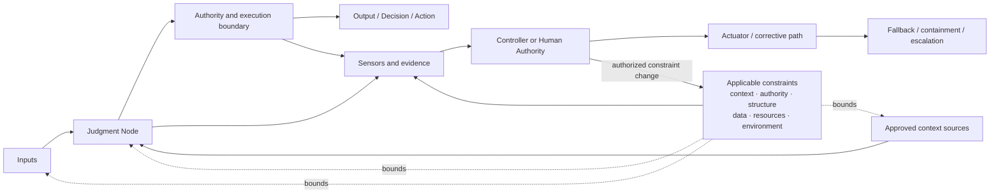
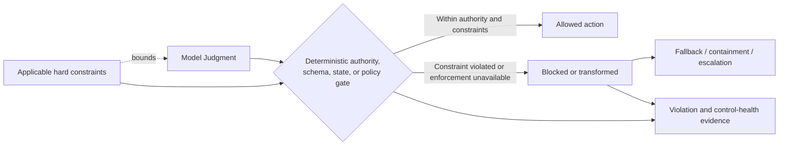

# Judgment Node Boundary

## Status

This document is **draft normative**. It defines a reusable pattern for making consequential Model Judgment explicit, constrained, observable, and operable without requiring a separate registry or governance system.

## 1. Context

A Thinking System may contain one or more locations where Model Judgment influences an output, decision, path, or action. UA calls each bounded location a **Judgment Node**.

The model call itself is rarely the complete boundary. The effective behavior of a Judgment Node also depends on:

- the inputs and context supplied to it;
- the authority granted around its output;
- the organizational, project, and local constraints that apply;
- where those constraints are realized and how they fail;
- deterministic validation and execution logic;
- the evidence collected about behavior and constraint state;
- the fallback, containment, and escalation path;
- the people or systems authorized to change the node or its constraints.

## 2. Problem

When a Judgment Node remains implicit, the team cannot reliably determine:

- what the model is expected to judge;
- what the model must not decide or do;
- which context sources are allowed;
- how much authority the node possesses;
- which constraints are inherited and which are local;
- whether a claimed hard boundary is actually enforced;
- which failures belong to Model Judgment, orchestration, constraint enforcement, or deterministic controls;
- what evidence is required before and after release;
- how unacceptable behavior or a constraint failure is contained or escalated;
- who owns operation, change, override, and reauthorization.

The result is an unreviewable boundary: uncertainty can propagate into business behavior without a clear contract, constraint realization, or correction path.

## 3. Forces and trade-offs

A useful boundary must balance:

- **flexibility and constraint** — enough freedom for Model Judgment to be useful without delegating hard invariants;
- **context richness and contamination risk** — enough information to judge well without accepting untrusted, irrelevant, or unauthorized context;
- **authority and recoverability** — enough authority to create value while keeping effects bounded and reversible where necessary;
- **constraint strength and viability** — enough enforceable structure for the consequence level without making the path technically, operationally, or economically non-viable;
- **observability and cost** — enough evidence for diagnosis without collecting telemetry that no Controller can use;
- **completeness and adoption effort** — enough detail for the consequence level without forcing a small team to maintain a large registry.

## 4. Solution

> **Every consequential Judgment Node SHOULD have an explicit boundary proportional to its authority, downstream impact, reversibility, constraint requirements, and failure consequences.**

The boundary makes visible:

- purpose;
- placement;
- inputs and approved context;
- allowed authority;
- applicable constraints and their sources;
- hard versus soft strength;
- realization and enforcement behavior;
- unacceptable outcomes;
- evidence and telemetry;
- fallback, containment, and escalation;
- operational and change ownership.

The boundary is a reviewable description of responsibility, not necessarily a separate service, runtime component, or document. For an SMB team, it may be recorded as a compact card inside an architecture note or a Thinking System Review artifact.

## 5. Core boundary structure



The diagram does not imply that evidence must flow only after execution or that fallback is triggered automatically. Implementations may collect pre-release and runtime evidence and may use software or Human Authority as the Controller.

## 6. Minimal boundary

The **minimal boundary** is intended for an ordinary SMB use case in which the node has limited authority, bounded downstream effects, and a clear fallback.

Record at least:

- **Purpose** — why Model Judgment is used here;
- **Placement** — Input Interpretation, Decision Logic, Output Mediation, or a combination;
- **Inputs and approved context** — what the node may receive and from which sources;
- **Allowed authority** — what output, decision, path, or action it may influence;
- **Applicable constraints and source** — which project, organizational, or local boundaries apply;
- **Hard constraints and realization** — deterministic obligations and how they are enforced;
- **Unacceptable outcomes** — behavior the Requirement does not permit;
- **Evidence and constraint health** — what is recorded or evaluated to determine whether the node and its boundaries remain acceptable;
- **Fallback or escalation** — what happens when the node cannot be accepted, a constraint fails, or evidence is insufficient;
- **Operational owner** — who holds responsibility for the boundary;
- **Change or override authority** — who may change the node or its material constraints.

A minimal boundary is not a reduced safety standard. It is a proportional representation for a node whose authority and consequences do not justify the extended field set.

## 7. Extended boundary

Use the **extended boundary** when the node has material authority, greater autonomy, difficult-to-reverse effects, broad exposure, regulated consequences, difficult constraint realization, or a high cost of failure.

In addition to the minimal fields, record applicable details about:

- name and versioned purpose;
- consequentiality and downstream impact;
- complete input set and context provenance;
- model, configuration, prompt, policy, constraint, and tool dependencies;
- allowed decisions, actions, and execution scope;
- deterministic invariants;
- inherited constraint identifiers and source versions;
- hard and soft constraint classification;
- enforcement points and failure behavior;
- prohibited actions;
- expected behavior and acceptable variation;
- output contract;
- pre-release evidence;
- runtime Sensors, constraint-health evidence, and telemetry;
- failure conditions and Deviation Signals;
- fallback;
- containment;
- escalation;
- rollback or shutdown applicability;
- operational owner;
- change, override, and exception authority;
- delivery reassessment and project reauthorization triggers.

The extended boundary should still remain one coherent record. Do not split every field into a separate governance artifact unless the operating context genuinely requires independent ownership or lifecycle management.

## 8. Compact Judgment Node card

The following card is the default SMB representation. Complete the minimal fields and add extended fields only where consequence and authority justify them.

```markdown
### Judgment Node

- **Name:**
- **Purpose:**
- **Placement:** Input Interpretation / Decision Logic / Output Mediation / Combination
- **Inputs and approved context:**
- **Allowed authority:**
- **Applicable constraints and source:**
- **Hard constraints and realization:**
- **Unacceptable outcomes:**
- **Evidence, telemetry, and constraint health:**
- **Fallback, containment, or escalation:**
- **Operational owner:**
- **Change or override authority:**

Optional extensions:
- **Consequentiality and downstream impact:**
- **Model, prompt, policy, constraint, tool, and configuration dependencies:**
- **Soft constraints and expected influence:**
- **Acceptable variation:**
- **Output contract:**
- **Constraint failure or degraded behavior:**
- **Failure signals:**
- **Rollback or shutdown:**
- **Delivery reassessment trigger:**
- **Project reauthorization trigger:**
```

This card is shown inside the pattern rather than maintained as a separate `judgment-node-record.md`. A practical review artifact may embed the same fields without creating a second canonical record type.

## 9. Deterministic containment



Deterministic containment does not mean every semantic error can be detected by one validator. It means that authority, hard constraints, schemas, permissions, state transitions, and other enforceable obligations are not delegated to probabilistic instructions alone.

## 10. Constraint review prompts

For each material constraint around the node, ask:

- What is the authoritative source?
- What subject and scope does it bound?
- Is it hard or soft?
- Where is it realized or enforced?
- What happens when enforcement is unavailable, uncertain, bypassed, or violated?
- What evidence shows activation, violations, false blocks, or degradation?
- Who may change, override, or disable it?
- Which change remains local, which requires delivery reassessment, and which requires project reauthorization?

## 11. Placement-specific review prompts

### Input Interpretation

Check for:

- ambiguous intent;
- prompt injection or malicious reinterpretation;
- contaminated or untrusted context;
- unauthorized or stale context sources;
- unsupported assumptions;
- identity or authorization confusion;
- loss of qualifiers that materially change the request;
- structural validity that hides incorrect semantic interpretation.

### Decision Logic

Check for:

- excessive authority;
- unsafe routing or prioritization;
- incorrect tool or action selection;
- unauthorized execution;
- plan drift or compounding error;
- hidden substitution of model preference for approved policy;
- failure to escalate when the node reaches its boundary;
- runtime relaxation of a project or organizational constraint.

### Output Mediation

Check for:

- semantic inaccuracy;
- unsupported claims;
- misleading confidence;
- unsafe transformation or omission;
- downstream schema or parser mismatch;
- disclosure failure;
- presentation that implies more certainty than the evidence supports;
- output that is structurally valid but violates a semantic or authority constraint.

These prompts help discover boundary obligations. They are not universal checklists and do not replace a Requirement derived from the actual context.

## 12. Relationship to the AI Control Plane

The Judgment Node Boundary defines **what must be bounded, observed, decided, and corrected** around a particular use of Model Judgment.

The [`Control-Loop Capability Anatomy`](../00-doctrine/control-loop-anatomy.md) and [`AI Control Plane`](../02-ai-control-plane/) provide the capabilities used to operate that boundary:

- Constraints define allowed context, authority, structure, data, resources, environment, and Human Authority requirements;
- Sensors produce evidence about behavior, outcomes, constraint state, and control health;
- Controllers interpret evidence and authorize corrective action or escalation;
- Actuators change configuration, routing, authority, scope, fallback, containment, rollback, compensation, or shutdown state.

The pattern does not duplicate the Control Plane capability model. A boundary may be implemented through capabilities distributed across application code, platform services, evaluation systems, human workflows, and release processes.

A prompt, schema, evaluation, approval screen, workflow engine, or kill switch does not constitute the whole boundary by itself.

## 13. Consequences and limitations

Applying this pattern:

- makes model-mediated responsibility visible;
- separates probabilistic judgment from deterministic authority;
- makes inherited and local constraints traceable;
- exposes soft constraints misrepresented as hard guarantees;
- improves evaluation, constraint-health monitoring, and incident diagnosis;
- exposes missing fallback, enforcement, ownership, or change authority;
- creates a stable unit for later readiness, completion, release, and reassessment review.

It also introduces documentation and operating effort. The record should therefore be proportional and should focus on nodes that materially influence system behavior. The pattern does not guarantee acceptable behavior, replace evaluation, prove constraint effectiveness, or close the control loop by itself.

## 14. Related UA concepts

- [`Model Judgment Placement`](../00-doctrine/model-judgment-placement.md) defines the functional placement taxonomy used by this pattern.
- [`Control-Loop Capability Anatomy`](../00-doctrine/control-loop-anatomy.md) defines the relationship between Constraints, Sensors, Controllers, and Actuators.
- [`Requirements, Correctness, and Bugs`](../00-doctrine/requirements-correctness-and-bugs.md) defines the operating contract and diagnostic model.
- [`glossary.md`](../00-doctrine/glossary.md) contains the canonical concise vocabulary.
- [`Constraint Capabilities`](../02-ai-control-plane/01-constraints/) defines constraint classes, realization, evidence, failure behavior, and authority.
- [`AI Control Plane`](../02-ai-control-plane/) defines the complete capability model used around the boundary.
- [`reference architectures`](../03-reference-architectures/) may demonstrate non-prescriptive compositions of Judgment Nodes, constraints, evidence, authority, and corrective action.
