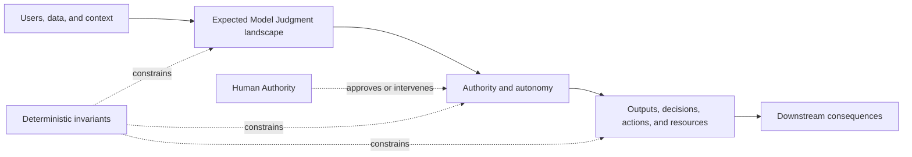
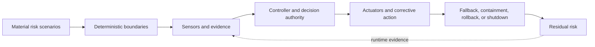

# Project Control Architecture and Viability Review Template

## Status and use

This is the informative working template for the draft-normative [`Project Control Architecture and Viability Review`](project-control-architecture-and-viability-review.md).

Use one living copy to make and preserve the project-level decision. Link supporting evidence rather than duplicating existing business-case, architecture, security, risk, finance, evaluation, or incident records.

Delete instructional prompts after completion where they no longer help. Mark non-applicable items explicitly. Depth should be proportional to authority, consequence, exposure, reversibility, evidence uncertainty, feedback latency, operational capacity, and control cost.

This template does not replace the delivery-level [`Thinking System Review`](thinking-system-review.md). It creates the project baseline that delivery reviews inherit.

---

## 1. Review identity

- **Project or proposed Thinking System:**
- **Review identifier:**
- **Review version:**
- **Decision status:** Draft / Bounded research / Authorized / Authorized with conditions / Redesign / Deferred / Escalated / No-Go / Reauthorization required
- **Date opened:**
- **Last updated:**
- **Previous project decision or review:**
- **Business outcome responsibility:**
- **Control architecture responsibility:**
- **Evidence and risk responsibility:**
- **Operational capacity responsibility:**
- **Project authorization authority:**
- **Linked product, architecture, security, legal, financial, evaluation, or incident records:**

One person may hold several responsibility bundles. Record responsibility and decision authority, not mandatory job titles.

---

## 2. Decision summary

Complete this section last so the current state is visible without reading the complete review.

- **Decision being requested:**
- **Proposed project boundary:**
- **Why Model Judgment is needed:**
- **Primary material risks:**
- **Required control architecture:**
- **Key evidence and capacity limitations:**
- **Control-economics conclusion:**
- **Current project authorization outcome:**
- **Authorized or rejected scope:**
- **Conditions and unresolved dependencies:**
- **Accepted residual risk:**
- **Decision authority and date:**
- **Next required decision:**

---

## 3. Organizational control context

Link to authoritative sources where they exist.

### 3.1 Applicable constraints

- **Legal and regulatory:**
- **Privacy and data handling:**
- **Security and identity:**
- **Safety:**
- **Contractual and customer obligations:**
- **Financial and procurement:**
- **Approved vendors and deployment models:**
- **Permitted data classes and geographies:**
- **Prohibited organizational uses or authority:**
- **Other organizational constraints:**

### 3.2 Available shared capabilities

| Capability | Available state | Owner or source | Project adaptation required | Gap or dependency |
|---|---|---|---|---|
| Identity and authorization | | | | |
| Data and tenant isolation | | | | |
| Model/vendor governance | | | | |
| Evaluation and evidence | | | | |
| Logging and audit | | | | |
| Observability and alerting | | | | |
| Incident response | | | | |
| Human review or escalation | | | | |
| Fallback, rollback, or shutdown | | | | |
| Other | | | | |

### 3.3 Organizational exceptions or unresolved decisions

- **Required exception:**
- **Decision authority:**
- **Status:**
- **Effect if unresolved:**

---

## 4. Business outcome and AI necessity

### 4.1 Intended outcome

- **User or business outcome:**
- **Affected users and stakeholders:**
- **Current process or baseline:**
- **Expected value:**
- **Who receives the value:**
- **Expected cost of not acting:**
- **Business assumptions:**
- **How success will be recognized:**

### 4.2 Why Model Judgment is proposed

- **Judgment, interpretation, synthesis, planning, or adaptation required:**
- **Useful variance the project needs to preserve:**
- **Why deterministic software alone is insufficient or unattractive:**
- **Why the model-mediated path is preferable:**

### 4.3 Alternatives

| Alternative | Expected value | Cost and limitations | Control burden | Decision |
|---|---|---|---|---|
| Current/manual process | | | | |
| Deterministic automation | | | | |
| Narrower model-assisted use | | | | |
| Proposed Thinking System | | | | |
| Other | | | | |

- **Reason the preferred path was selected:**
- **Conditions under which a non-AI alternative becomes preferable:**

---

## 5. Project boundary and intended Judgment landscape

### 5.1 Project boundary

- **In scope:**
- **Out of scope:**
- **Users and affected population:**
- **Environments and geographies:**
- **Data and context domains:**
- **Upstream systems:**
- **Downstream systems:**
- **Models, tools, vendors, and knowledge sources:**
- **Expected deployment and exposure:**
- **Initial Operating Envelope assumptions:**
- **Known unknowns:**

### 5.2 Intended Model Judgment

| Judgment area | Placement or function | Inputs and context | Intended authority or influence | Downstream consequence | Expected Human Authority |
|---|---|---|---|---|---|
| | Input Interpretation / Decision Logic / Output Mediation / Combination | | | | |
| | | | | | |

At this stage, map the consequential Judgment landscape. Detailed implementation-level Judgment Node cards belong in delivery reviews.

### 5.3 Deterministic invariants and prohibited authority

- **Business invariants:**
- **Identity and permission invariants:**
- **Data and privacy invariants:**
- **Transaction and state invariants:**
- **Financial or resource invariants:**
- **Required human or deterministic decisions:**
- **Prohibited model decisions and actions:**
- **Prohibited tools or data access:**
- **Maximum authorized autonomy:**

### 5.4 Project-boundary diagram



Replace the diagram when a project-specific view provides more value.

---

## 6. Material risk-scenario map

Do not reduce this section to one aggregate score. A local scale may be used only when its meaning and evidence are defined.

### 6.1 Local scale, if used

- **Consequence scale:**
- **Likelihood or uncertainty scale:**
- **Detectability scale:**
- **Reversibility or containment scale:**
- **Why the scale is decision-useful:**
- **Known limitations:**

### 6.2 Scenario table

| ID | Material scenario and affected obligation | Source or mechanism | Authority, autonomy, and exposure | Consequence and hard prohibition | Detectability and feedback latency | Reversibility, compensation, and containment | Propagation or correlation | Required controls and Human Authority | Residual risk and decision effect |
|---|---|---|---|---|---|---|---|---|---|
| R-01 | | | | | | | | | |
| R-02 | | | | | | | | | |
| R-03 | | | | | | | | | |

### 6.3 Scenario coverage review

- [ ] Ordinary operating failures considered
- [ ] Ambiguous or adversarial inputs considered
- [ ] Model behavior and distribution shift considered
- [ ] Prompt, policy, context, data, and tool changes considered
- [ ] Deterministic defects and boundary failures considered
- [ ] Misuse, abuse, and unauthorized access considered
- [ ] Human review and controller failure considered
- [ ] Vendor and external dependency changes considered
- [ ] Correlated or repeated failure considered
- [ ] Economic and operational-capacity failure considered
- [ ] Invalid project assumptions considered
- [ ] Hard legal, safety, security, privacy, or contractual prohibitions considered

- **Material scenario gaps:**
- **Reason any scenario is deferred:**

---

## 7. Required control architecture

Map controls to material scenarios. A tool or dashboard is not a complete control without authority and corrective action.

### 7.1 Control-capability map

| Control area | Required capability | Risk scenarios addressed | Shared or project-specific | Owner or dependency | Feasibility status | Evidence needed |
|---|---|---|---|---|---|---|
| Deterministic invariants and constraints | | | | | | |
| Authentication and authorization | | | | | | |
| Data and context provenance | | | | | | |
| Model, prompt, policy, and configuration control | | | | | | |
| Tool and action boundaries | | | | | | |
| Sensors and runtime evidence | | | | | | |
| Evaluation and regression evidence | | | | | | |
| Controller and decision authority | | | | | | |
| Human Authority | | | | | | |
| Fallback and degraded mode | | | | | | |
| Containment and isolation | | | | | | |
| Rollback, disable, or shutdown | | | | | | |
| Incident and corrective action | | | | | | |
| Other | | | | | | |

### 7.2 Control-loop completeness

For each critical scenario, confirm:

- [ ] The prohibited or unacceptable outcome is explicit
- [ ] A deterministic boundary or preventive control exists where feasible
- [ ] Relevant evidence can be observed
- [ ] Evidence limitations are understood
- [ ] A controller or decision authority is named
- [ ] The authority can act within the required time
- [ ] A real corrective mechanism exists
- [ ] Fallback, containment, rollback, or shutdown is feasible
- [ ] Human Authority is substantive where required
- [ ] Residual risk is stated after controls

### 7.3 Control architecture diagram



- **Critical missing capabilities:**
- **Capabilities that depend on unverified vendor claims:**
- **Controls whose latency may be too slow:**
- **Controls that create significant business friction:**

---

## 8. Evidence feasibility and feedback latency

### 8.1 Claims requiring evidence

| Claim or decision | Evidence required | Available source | Limitations | Pre-release or runtime | Decision latency required | Feasibility |
|---|---|---|---|---|---|---|
| | | | | | | |
| | | | | | | |

### 8.2 Evidence review

- **Representative and consequential scenarios available:**
- **Adversarial or abuse evidence available:**
- **Human or expert adjudication available:**
- **Deterministic contract evidence available:**
- **Statistical evidence feasible where relevant:**
- **Production-only evidence required:**
- **Data provenance and legal usability:**
- **Expected false passes and false blocks:**
- **Calibration or evaluator limitations:**
- **Ability to detect provider, model, context, or tool changes:**
- **Ability to reconstruct incidents and decisions:**
- **Critical evidence blind spots:**

### 8.3 Feedback-latency conclusion

- **Fastest credible detection for critical scenarios:**
- **Maximum tolerable detection and decision latency:**
- **Can corrective action occur before unacceptable propagation?** Yes / No / Unknown
- **Evidence feasibility conclusion:** Credible / Credible with conditions / Research required / Not credible
- **Effect on project decision:**

---

## 9. Human Authority and operational capacity

### 9.1 Human Authority map

| Decision or intervention | Responsible authority | Required competence and context | Expected volume and peak load | Required response time | Real action available | Capacity status |
|---|---|---|---|---|---|---|
| Approve or reject model-mediated outcome | | | | | | |
| Escalate consequential case | | | | | | |
| Narrow scope or authority | | | | | | |
| Roll back, disable, or shut down | | | | | | |
| Incident investigation and remediation | | | | | | |
| Project reauthorization | | | | | | |

### 9.2 Capacity and control quality

- **Can reviewers inspect the necessary evidence?**
- **Can they reject without organizational pressure?**
- **Is review time realistic at projected volume?**
- **Can the fallback absorb peak load?**
- **Is there coverage during absence, turnover, or incident peaks?**
- **Are automation bias and alert fatigue addressed?**
- **Is escalation authority clear?**
- **Is incident and support capacity funded?**
- **Operational-capacity gaps:**
- **Effect on project decision:**

### 9.3 Human Authority conclusion

- [ ] Substantive and sufficient for proposed scope
- [ ] Sufficient only with explicit limits
- [ ] Requires bounded research or capacity validation
- [ ] Ceremonial or non-viable in current design
- [ ] Not applicable because deterministic containment is sufficient

- **Rationale:**

---

## 10. Control economics and business viability

Use the organization's existing financial model where available. Keep hard prohibitions separate from expected-value trade-offs.

### 10.1 Expected benefit

| Benefit assumption | Expected value or range | Evidence | Uncertainty | Invalidated when |
|---|---|---|---|---|
| Revenue or margin | | | | |
| Time or throughput | | | | |
| Quality or error reduction | | | | |
| Customer or user value | | | | |
| Strategic or learning value | | | | |
| Avoided cost or risk | | | | |
| Other | | | | |

### 10.2 One-time control cost

| Cost area | Estimate or range | Owner | Evidence or assumption | Included in business case? |
|---|---|---|---|---|
| Architecture and integration | | | | |
| Data and context preparation | | | | |
| Evaluation and scenarios | | | | |
| Deterministic boundaries and permissions | | | | |
| Security, privacy, legal, and contractual work | | | | |
| Observability, audit, and incident integration | | | | |
| Human Authority workflow and training | | | | |
| Rollout and change management | | | | |
| Other | | | | |

### 10.3 Recurring control and operating cost

| Cost area | Estimate or range | Volume assumption | Evidence or uncertainty | Included in business case? |
|---|---|---|---|---|
| Model, retrieval, tool, and infrastructure use | | | | |
| Evaluation maintenance and repeated evidence | | | | |
| Human review and escalation | | | | |
| Monitoring, audit, support, and incidents | | | | |
| Model, prompt, policy, data, and vendor reassessment | | | | |
| Fallback, false blocks, latency, and operational friction | | | | |
| Remediation, compensation, or reserve | | | | |
| Other | | | | |

### 10.4 Residual exposure

| Residual exposure | Expected frequency or uncertainty | Consequence | Correlation or propagation | Financial treatment | Hard prohibition? |
|---|---|---|---|---|---|
| | | | | | |
| | | | | | |

### 10.5 Optional expected-value view

```text
Expected net value
= expected business benefit
- control build cost
- recurring control and operating cost
- expected residual exposure
```

- **Expected-value conclusion:**
- **Sensitivity to volume, review rate, incident frequency, model price, or latency:**
- **Business value lost because controls narrow autonomy or scope:**
- **Most uncertain financial assumptions:**
- **Non-AI alternative remains preferable when:**

### 10.6 Hard veto review

- [ ] No hard prohibition identified
- [ ] Critical violation cannot be detected within required time
- [ ] Consequence cannot be credibly contained, reversed, or compensated
- [ ] Required Human Authority is unavailable or non-substantive
- [ ] Required fallback cannot handle expected load
- [ ] Vendor, model, data, or context volatility invalidates the control design
- [ ] Legal, safety, security, privacy, or contractual boundary prohibits the path
- [ ] Control perimeter destroys the business case
- [ ] Other hard veto:

- **Hard-veto conclusion:**

### 10.7 Viability conclusion

- **Control architecture:** Credible / Credible with conditions / Research required / Not credible
- **Operational capacity:** Credible / Credible with conditions / Research required / Not credible
- **Economic viability:** Positive / Conditional / Unclear / Negative
- **Overall project viability:**
- **Rationale:**

---

## 11. Residual project risk

| Residual risk | Why it remains | Current controls | Evidence uncertainty | Acceptance condition | Reauthorization or shutdown trigger |
|---|---|---|---|---|---|
| | | | | | |
| | | | | | |

- **Risks accepted as part of useful variance:**
- **Risks accepted only for bounded research:**
- **Risks that must remain outside the authorized boundary:**
- **Decision uncertainty that remains:**

---

## 12. Project authorization decision

Record one outcome.

- [ ] **Authorized for delivery**
- [ ] **Authorized with conditions**
- [ ] **Authorized for bounded research**
- [ ] **Redesign required**
- [ ] **Escalate**
- [ ] **Deferred**
- [ ] **AI path rejected / No-Go**

### 12.1 Decision record

- **Decision date:**
- **Project authorization authority:**
- **Authorized or rejected scope:**
- **Decision rationale:**
- **Conditions:**
- **Unresolved dependencies:**
- **Accepted residual risk:**
- **Hard constraints and prohibited authority:**
- **Required controls before delivery begins:**
- **Decision validity period or review timing:**
- **Next decision required:**

### 12.2 Bounded-research limits, when applicable

- **Hypotheses to test:**
- **Users, data, environment, and duration:**
- **Authority and tool limits:**
- **Exposure and resource limits:**
- **Evidence to collect:**
- **Stopping conditions:**
- **Decision after research:**

The authorization remains in this review. A separate Project Launch Gate record is not required for the default SMB path.

---

## 13. Delivery inheritance package

Delivery-level [`Thinking System Reviews`](thinking-system-review.md) should link this version and inherit the baseline below.

- **Project review identifier and version:**
- **Authorized project boundary:**
- **Intended business outcome:**
- **Applicable organizational constraints:**
- **Authorized Model Judgment and maximum autonomy:**
- **Prohibited authority and hard invariants:**
- **Material risk scenarios delivery reviews must address:**
- **Shared controls available:**
- **Project-specific controls required:**
- **Evidence and feedback expectations:**
- **Human Authority and operational-capacity assumptions:**
- **Control-cost and resource boundaries:**
- **Project-level release constraints:**
- **Conditions delivery work must close:**
- **Project reauthorization triggers:**
- **Link to this immutable or versioned decision snapshot:**

### 13.1 Delivery inheritance rule

A delivery review may refine local Judgment Nodes, Requirements, controls, evidence, and deployment scope. It must not silently:

- expand authorized authority or autonomy;
- add a new population, domain, data class, geography, product, or tool outside the project boundary;
- weaken project invariants or prohibited authority;
- remove a required shared control or Human Authority path;
- accept a project-level risk or economic assumption contradicted by delivery evidence.

When that occurs, record the need for project reassessment rather than duplicating a new project assumption inside one delivery review.

---

## 14. Runtime and project reauthorization triggers

Select applicable triggers and add project-specific conditions.

- [ ] Material increase in autonomy or authority
- [ ] New tool or state-changing action
- [ ] New population, domain, geography, language, product, or data class
- [ ] Material model, provider, deployment, prompt, policy, context, or tool dependency change
- [ ] Loss or degradation of required sensor, evaluator, control, fallback, or Human Authority
- [ ] Incident, near miss, or Requirement violation invalidates a project assumption
- [ ] Critical scenario is more frequent, severe, correlated, or difficult to detect than assumed
- [ ] Control cost, latency, review volume, or incident burden exceeds the viable envelope
- [ ] Manual or deterministic fallback cannot absorb real load
- [ ] New legal, safety, security, privacy, contractual, financial, or organizational constraint
- [ ] Material business-value or non-AI-alternative change
- [ ] Repeated delivery exceptions collectively change the project boundary
- [ ] Other:

### 14.1 Reauthorization response

- **Evidence owner:**
- **Who may initiate reassessment:**
- **Immediate containment while reassessment occurs:**
- **Project authorization authority:**
- **Maximum response time for critical triggers:**
- **Possible outcomes:** Confirm / Narrow / Condition / Redesign / Return to research / Escalate / Defer / No-Go / Shutdown

---

## 15. Decision and reassessment history

| Review version | Date | Trigger | Project decision | Authorized scope | Material conditions or changes | Decision authority | Snapshot or link |
|---|---|---|---|---|---|---|---|
| 0.1 | | Initial review | | | | | |

Preserve prior decisions. Do not overwrite the evidence and assumptions that supported an earlier authorization.

---

## 16. Completion check

Before finalizing the project decision:

- [ ] Organizational constraints and shared capabilities are linked
- [ ] Business outcome and non-AI alternatives are explicit
- [ ] Project boundary and intended Judgment landscape are mapped
- [ ] Deterministic invariants and prohibited authority are explicit
- [ ] Material risk scenarios are connected to controls
- [ ] Critical controls include sensors, authority, and corrective action
- [ ] Evidence feasibility and feedback latency are understood
- [ ] Human Authority is substantive and capacity-tested
- [ ] One-time and recurring control costs are included
- [ ] Residual exposure and hard vetoes are explicit
- [ ] Project authorization outcome and authority are recorded
- [ ] Delivery inheritance package is complete
- [ ] Reauthorization triggers are defined
- [ ] Prior decision history is preserved

### Final decision statement

> For the stated project boundary and review version, the proposed Thinking System is **[authorized / authorized with conditions / authorized only for bounded research / requires redesign / escalated / deferred / rejected]** because **[decision rationale]**. The decision remains valid only while **[material assumptions, controls, capacity, economics, and scope]** remain true.
