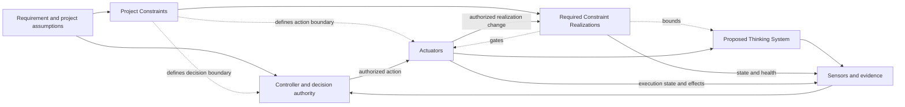

# Project Control Architecture and Viability Review Template

## How to use

Use one living copy to make and preserve the project-level decision. Link business-case, architecture, security, legal, policy, finance, evaluation, and incident records rather than duplicating them.

Section 6 is the canonical **Project Constraint Architecture**. Scenarios, capability feasibility, evidence, economics, authorization, inheritance, and reauthorization reference its Constraint IDs.

A separate risk register, Constraint Register, control catalogue, responsibility matrix, financial model, or gate record is not required for the default SMB path when this review and linked evidence are sufficient.

Depth should follow consequence, authority, exposure, reversibility, uncertainty, feedback latency, realization difficulty, capacity, and control cost.

---

## 1. Review identity

- **Project or proposed Thinking System:**
- **Review identifier and version:**
- **Status:** Draft / Bounded research / Authorized / Authorized with conditions / Redesign / Deferred / Escalated / No-Go / Reauthorization required
- **Date opened / last updated:**
- **Previous project decision:**
- **Business outcome responsibility:**
- **Control architecture responsibility:**
- **Evidence and risk responsibility:**
- **Operational capacity responsibility:**
- **Project authorization authority:**
- **Linked records:**

---

## 2. Decision summary

Complete last.

- **Decision requested:**
- **Proposed project boundary:**
- **Why Model Judgment is needed:**
- **Primary material scenarios:**
- **Applicable organizational sources:**
- **Project Constraint Architecture conclusion:**
- **Missing or conditional capabilities:**
- **Evidence and capacity limitations:**
- **Control-economics conclusion:**
- **Authorization outcome:**
- **Authorized or rejected scope:**
- **Conditions and unresolved dependencies:**
- **Accepted residual risk:**
- **Decision authority and date:**
- **Next decision:**

---

## 3. Organizational control context

### Applicable sources

| Area | Authoritative source or link | Owner/authority | Project interpretation | Exception/change authority | Gap/status |
|---|---|---|---|---|---|
| Legal and regulatory | | | | | |
| Privacy and data | | | | | |
| Security and identity | | | | | |
| Safety | | | | | |
| Contractual/customer | | | | | |
| Financial/procurement | | | | | |
| Vendors/models/deployment/regions | | | | | |
| Prohibited uses or authority | | | | | |
| Other | | | | | |

### Shared capabilities

| Capability | Available state | Owner/source | Project adaptation | Gap/dependency |
|---|---|---|---|---|
| Identity and authorization | | | | |
| Constraint Realization / policy enforcement | | | | |
| Data and tenant isolation | | | | |
| Evaluation and evidence | | | | |
| Logging, audit, observability | | | | |
| Incident response | | | | |
| Human Authority and escalation | | | | |
| Fallback, rollback, containment, compensation, shutdown | | | | |

---

## 4. Outcome, AI necessity, and alternatives

- **Intended outcome and affected parties:**
- **Current process or baseline:**
- **Expected value and business assumptions:**
- **How success will be recognized:**
- **Judgment or adaptation required:**
- **Useful variance to preserve:**
- **Why deterministic software alone is insufficient or unattractive:**
- **Value lost because necessary Constraints narrow autonomy, data, tools, population, or speed:**

| Alternative | Expected value | Cost/limitations | Constraint/control burden | Decision |
|---|---|---|---|---|
| Current/manual | | | | |
| Deterministic automation | | | | |
| Narrower model-assisted use | | | | |
| Proposed Thinking System | | | | |
| Other | | | | |

- **Preferred path and rationale:**
- **When a non-AI alternative becomes preferable:**

---

## 5. Boundary, Judgment landscape, and material scenarios

### Project boundary

- **In scope / out of scope:**
- **Users and population:**
- **Environments and geographies:**
- **Data and context domains:**
- **Upstream/downstream systems:**
- **Models, tools, vendors, sources:**
- **Expected deployment and exposure:**
- **Initial Operating Envelope assumptions:**
- **Known dependency/configuration risks:**
- **Known unknowns:**

### Intended Model Judgment

| Judgment area | Placement | Inputs/context | Intended authority/influence | Downstream consequence | Human Authority |
|---|---|---|---|---|---|
| | Input Interpretation / Decision Logic / Output Mediation / Combination | | | | |

### Deterministic Invariants and prohibited authority

- **Business, identity, data, transaction, financial, and audit Invariants:**
- **Required human or deterministic decisions:**
- **Prohibited model decisions/actions/tools/data access:**
- **Maximum autonomy:**

### Material scenario map

| ID | Scenario and obligation | Mechanism/source | Authority/exposure | Consequence or hard prohibition | Detectability/latency | Reversibility/containment/compensation | Propagation | Required Constraint IDs/capabilities | Residual decision effect |
|---|---|---|---|---|---|---|---|---|---|
| R-01 | | | | | | | | | |
| R-02 | | | | | | | | | |
| R-03 | | | | | | | | | |

Do not reduce this section to one aggregate score.

---

## 6. Canonical Project Constraint Architecture

| Constraint ID | Intent and source/rationale | Subject and project scope | Class | Hard/soft | Required realization and assumptions | Failure/bypass/conflict/unavailable behavior | Evidence/control health | Change/exception authority and Actuator | Delivery inheritance / reauthorization trigger |
|---|---|---|---|---|---|---|---|---|---|
| K-01 | | | Structural / Authority / State / Data / Resource / Environment / Human / Behavioral | | | | | | |
| K-02 | | | | | | | | | |
| K-03 | | | | | | | | | |

For every Hard Constraint, confirm that violation can be deterministically prevented or rejected within stated assumptions and scope. A prompt, probabilistic evaluator, model policy, or natural-language instruction is not hard by itself.

### Capability feasibility

| Required capability | Scenario/Constraint IDs | Shared or project-specific | Owner/dependency | Feasibility | Evidence needed | Cost/capacity concern |
|---|---|---|---|---|---|---|
| Constraint Realization | | | | | | |
| Sensors and evaluation | | | | | | |
| Controller and decision authority | | | | | | |
| Human Authority | | | | | | |
| Actuators and corrective action | | | | | | |
| Fallback/containment/compensation/rollback/shutdown | | | | | | |

### Capability completeness

- [ ] Relevant Constraint IDs and assumptions are explicit.
- [ ] Hard and Soft claims are accurate.
- [ ] Realization failure and bypass behavior are defined.
- [ ] Behavior, outcomes, realization state, and Actuator effects can be observed.
- [ ] A Controller with necessary authority exists.
- [ ] A real Actuator exists.
- [ ] Human Authority is substantive where required.
- [ ] Evidence and action can arrive before unacceptable propagation.
- [ ] Residual risk is stated after the complete path.

---

## 7. Evidence, Human Authority, and latency

| Claim or decision | Evidence required | Available source | Limitations | Pre-release/runtime | Required latency | Feasibility |
|---|---|---|---|---|---|---|
| | | | | | | |

Record representative/adversarial scenarios, deterministic and realization evidence, activation/violation/bypass evidence, production-only evidence, evaluator limits, dependency-change detection, incident reconstruction, and blind spots.

| Decision/intervention | Authority | Required context/competence | Expected volume | Response time | Real action available | Capacity status |
|---|---|---|---|---|---|---|
| Approve/reject outcome | | | | | | |
| Change realization | | | | | | |
| Escalate exception | | | | | | |
| Roll back/contain/compensate/stop | | | | | | |

- **Fastest credible critical-scenario detection:**
- **Maximum tolerable detection, decision, and action latency:**
- **Can realization and action occur before unacceptable propagation?** Yes / No / Unknown
- **Conclusion:** Credible / Conditional / Research required / Not credible

---

## 8. Control economics

| Area | Build/adaptation | Recurring operation | Uncertainty/sensitivity | Decision effect |
|---|---|---|---|---|
| Constraint design and realization | | | | |
| Evaluation and evidence | | | | |
| Human Authority and escalation | | | | |
| False blocks, fallback, friction | | | | |
| Monitoring, incident, reassessment | | | | |
| Vendor/model/tool/infrastructure | | | | |
| Residual exposure/compensation | | | | |

- **Expected value under proposed boundary:**
- **Value lost because of necessary Constraints:**
- **Control cost and capacity conclusion:**
- **Sensitivity:**
- **When deterministic/non-AI becomes preferable:**

A hard prohibition or unavailable capability cannot be averaged away.

---

## 9. Authorization decision

- [ ] Bounded research
- [ ] Authorized
- [ ] Authorized with conditions
- [ ] Redesign required
- [ ] Deferred
- [ ] Escalated
- [ ] No-Go / AI path rejected
- [ ] Reauthorization required

- **Decision and rationale:**
- **Authorized boundary and autonomy:**
- **Applicable Constraint IDs/source versions:**
- **Required capabilities:**
- **Evidence, capacity, cost, and release conditions:**
- **Accepted residual risk:**
- **Authority/date/validity:**

---

## 10. Delivery inheritance package

- **Project review identifier/version/outcome:**
- **Authorized scope and maximum autonomy:**
- **Relevant scenario IDs:**
- **Constraint IDs, sources, strength, assumptions, and delivery realization expectations:**
- **Required Sensors, Controller, Actuators, Human Authority, fallback, containment, compensation, rollback, shutdown:**
- **Evidence and latency expectations:**
- **Capacity/resource/cost boundaries:**
- **Conditions delivery must close:**
- **Changes permitted within delivery authority:**
- **Project reauthorization triggers:**

Delivery reviews link this package and record concrete realizations. They do not copy the complete project review.

---

## 11. Runtime evidence and reauthorization

Reauthorization may be required when evidence changes project risk, authority, Constraint meaning or feasibility, scope, evidence quality, Human Authority, capacity, economics, required capabilities, or residual exposure.

- [ ] Current decision remains valid
- [ ] Boundary narrowed / conditions changed
- [ ] More evidence or research required
- [ ] Redesign required
- [ ] Organizational exception/review required
- [ ] Project paused, rolled back, or stopped
- [ ] AI path rejected

- **Trigger, evidence, authority, rationale, and next version:**

---

## 12. Version history and final check

| Version | Date | Trigger | Material Constraint/capability change | Authorization outcome | Authority | Snapshot/link |
|---|---|---|---|---|---|---|
| | | | | | | |

- [ ] Organizational sources are linked, not copied.
- [ ] Section 6 is the canonical Project Constraint Architecture.
- [ ] Scenarios reference Constraint IDs and capabilities.
- [ ] Hard claims match deterministic guarantees and assumptions.
- [ ] Evidence, Human Authority, latency, capacity, economics, and action paths are credible.
- [ ] Project authorization remains distinct from delivery release.
- [ ] Inheritance is versioned and proportional.
- [ ] Reauthorization triggers and authority are explicit.
