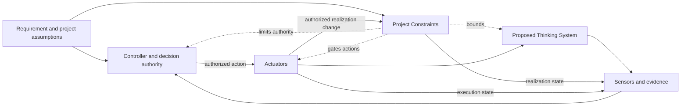

# Project Control Architecture and Viability Review Template

## Status and use

This is the informative working template for the draft-normative [`Project Control Architecture and Viability Review`](project-control-architecture-and-viability-review.md).

Use one living copy to make and preserve the project-level decision. Link business-case, architecture, security, legal, policy, financial, evaluation, and incident records rather than duplicating them.

This template uses one canonical **Project Constraint Architecture** in section 6. Risk scenarios, capability feasibility, evidence, economics, authorization, inheritance, and reauthorization reference those Constraint IDs rather than restating the same boundary.

A separate risk register, Constraint Register, control catalogue, responsibility matrix, or gate record is not required for the default SMB path when this review and linked evidence are sufficient.

Depth should follow consequence, authority, exposure, reversibility, uncertainty, feedback latency, realization difficulty, operational capacity, and control cost.

---

## 1. Review identity

- **Project or proposed Thinking System:**
- **Review identifier and version:**
- **Decision status:** Draft / Bounded research / Authorized / Authorized with conditions / Redesign / Deferred / Escalated / No-Go / Reauthorization required
- **Date opened / last updated:**
- **Previous project decision:**
- **Business outcome responsibility:**
- **Control architecture responsibility:**
- **Evidence and risk responsibility:**
- **Operational capacity responsibility:**
- **Project authorization authority:**
- **Linked records:**

One person may hold several responsibility bundles. Record real responsibility and decision rights, not mandatory job titles.

---

## 2. Decision summary

Complete this section last.

- **Decision requested:**
- **Proposed project boundary:**
- **Why Model Judgment is needed:**
- **Primary material scenarios:**
- **Applicable organizational sources:**
- **Project Constraint Architecture conclusion:**
- **Missing or conditional capabilities:**
- **Evidence and capacity limitations:**
- **Control-economics conclusion:**
- **Authorization outcome:**
- **Authorized or rejected scope:**
- **Conditions and unresolved dependencies:**
- **Accepted residual risk:**
- **Decision authority and date:**
- **Next required decision:**

---

## 3. Organizational control context

Link authoritative sources. Do not copy complete policy text.

### Applicable sources

| Area | Authoritative source or link | Owner or decision authority | Project interpretation | Exception/change authority | Gap or status |
|---|---|---|---|---|---|
| Legal and regulatory | | | | | |
| Privacy and data | | | | | |
| Security and identity | | | | | |
| Safety | | | | | |
| Contractual and customer obligations | | | | | |
| Financial and procurement | | | | | |
| Vendors, models, deployment modes, regions | | | | | |
| Prohibited uses or authority | | | | | |
| Other | | | | | |

### Shared capabilities

| Capability | Available state | Owner or source | Project adaptation required | Gap or dependency |
|---|---|---|---|---|
| Identity and authorization | | | | |
| Constraint Realization and policy enforcement | | | | |
| Data and tenant isolation | | | | |
| Evaluation and evidence | | | | |
| Logging, audit, and observability | | | | |
| Incident response | | | | |
| Human Authority and escalation | | | | |
| Fallback, rollback, containment, compensation, shutdown | | | | |
| Other | | | | |

---

## 4. Business outcome, AI necessity, and alternatives

### Intended outcome

- **User or business outcome:**
- **Affected users and stakeholders:**
- **Current process or baseline:**
- **Expected value and recipient:**
- **Business assumptions:**
- **How success will be recognized:**

### Why Model Judgment

- **Judgment, interpretation, synthesis, planning, or adaptation required:**
- **Useful variance to preserve:**
- **Why deterministic software alone is insufficient or unattractive:**
- **Value lost when Constraints narrow autonomy, data, tools, population, or speed:**

### Alternatives

| Alternative | Expected value | Cost and limitations | Constraint and control burden | Decision |
|---|---|---|---|---|
| Current or manual process | | | | |
| Deterministic automation | | | | |
| Narrower model-assisted use | | | | |
| Proposed Thinking System | | | | |
| Other | | | | |

- **Preferred path and rationale:**
- **Conditions under which a non-AI alternative becomes preferable:**

---

## 5. Project boundary, Judgment landscape, and material scenarios

### Project boundary

- **In scope / out of scope:**
- **Users and affected population:**
- **Environments and geographies:**
- **Data and context domains:**
- **Upstream and downstream systems:**
- **Models, tools, vendors, and knowledge sources:**
- **Expected deployment and exposure:**
- **Initial Operating Envelope assumptions:**
- **Known dependency and configuration risks:**
- **Known unknowns:**

### Intended Model Judgment

| Judgment area | Placement | Inputs/context | Intended authority or influence | Downstream consequence | Human Authority |
|---|---|---|---|---|---|
| | Input Interpretation / Decision Logic / Output Mediation / Combination | | | | |

Map the consequential landscape. Detailed implementation-level Judgment Node cards belong in delivery reviews.

### Deterministic Invariants and prohibited authority

- **Business, identity, data, transaction, financial, and audit Invariants:**
- **Required human or deterministic decisions:**
- **Prohibited model decisions and actions:**
- **Prohibited tools or data access:**
- **Maximum authorized autonomy:**

### Material scenario map

Do not reduce this table to one aggregate score. Local scales are optional and must define their meaning and limitations.

| ID | Scenario and affected obligation | Mechanism/source | Authority and exposure | Consequence or hard prohibition | Detectability and latency | Reversibility, containment, compensation | Propagation/correlation | Required Constraint IDs and capabilities | Residual decision effect |
|---|---|---|---|---|---|---|---|---|---|
| R-01 | | | | | | | | | |
| R-02 | | | | | | | | | |
| R-03 | | | | | | | | | |

Consider ordinary failure, ambiguous or adversarial input, model or distribution change, prompt/context/data/tool changes, deterministic defects, misuse, Human Authority failure, correlated failure, vendor changes, economic failure, and invalid project assumptions.

---

## 6. Canonical Project Constraint Architecture

Use one row for each material organizational or project-specific Constraint. Combine rows only when source, scope, realization expectations, and authority are genuinely shared.

| Constraint ID | Intent and source/rationale | Subject and project scope | Class | Hard or soft | Required realization and assumptions | Failure, bypass, conflict, unavailable behavior | Evidence and control health | Change/exception authority and required Actuator | Delivery inheritance and reauthorization trigger |
|---|---|---|---|---|---|---|---|---|---|
| K-01 | | | Structural / Authority / State / Data / Resource / Environment / Human / Behavioral | | | | | | |
| K-02 | | | | | | | | | |
| K-03 | | | | | | | | | |

For every Hard Constraint, confirm that violation can be deterministically prevented or rejected within stated assumptions and scope. A prompt, probabilistic evaluator, model policy, or natural-language instruction is not hard by itself.

### Capability feasibility linked to scenarios and Constraints

| Required capability | Scenario or Constraint IDs | Shared or project-specific | Owner/dependency | Feasibility | Evidence needed | Cost/capacity concern |
|---|---|---|---|---|---|---|
| Constraint Realization | | | | | | |
| Sensors and evaluation | | | | | | |
| Controller and decision authority | | | | | | |
| Human Authority | | | | | | |
| Actuators and corrective action | | | | | | |
| Fallback, containment, compensation, rollback, shutdown | | | | | | |

### Control-loop completeness

For each critical scenario, verify:

- [ ] Relevant Constraint IDs and realization assumptions are explicit.
- [ ] Hard and soft claims are accurate.
- [ ] Realization failure and bypass behavior are defined.
- [ ] Behavior, outcomes, realization state, and Actuator effects can be observed.
- [ ] A Controller with the necessary decision right exists.
- [ ] A real Actuator or corrective mechanism exists.
- [ ] Human Authority is substantive where required.
- [ ] Evidence and action can arrive before unacceptable propagation.
- [ ] Residual risk is stated after the complete control path.

---

## 7. Evidence feasibility, Human Authority, and operations

### Evidence feasibility

| Claim or decision | Evidence required | Available source | Limitations | Pre-release or runtime | Required latency | Feasibility |
|---|---|---|---|---|---|---|
| | | | | | | |

Record:

- representative, consequential, and adversarial scenarios;
- deterministic contract and Constraint Realization evidence;
- realization activation, violation, bypass, and control-health evidence;
- production-only evidence;
- calibration and evaluator limitations;
- ability to detect dependency and configuration change;
- incident and decision reconstruction capability;
- critical evidence blind spots.

### Human Authority and operational capacity

| Decision or intervention | Authority | Required context/competence | Expected volume and peak | Required response time | Real action available | Capacity status |
|---|---|---|---|---|---|---|
| Approve or reject outcome | | | | | | |
| Change or override a realization | | | | | | |
| Escalate exception | | | | | | |
| Roll back, contain, compensate, or stop | | | | | | |

A nominal HITL step is not substantive when information, competence, time, independence, capacity, or intervention power is missing.

### Feedback-latency conclusion

- **Fastest credible detection for critical scenarios:**
- **Maximum tolerable detection, decision, and action latency:**
- **Can realization and corrective action occur before unacceptable propagation?** Yes / No / Unknown
- **Conclusion:** Credible / Credible with conditions / Research required / Not credible

---

## 8. Control economics and viability

Estimate only to the level needed for the decision. Avoid false precision.

| Cost or capacity area | Build/adaptation | Recurring operation | Uncertainty or sensitivity | Decision effect |
|---|---|---|---|---|
| Constraint design and realization | | | | |
| Evaluation and evidence | | | | |
| Human review and escalation | | | | |
| False blocks, fallback, and operational friction | | | | |
| Monitoring, incident response, and reassessment | | | | |
| Vendor, model, tool, and infrastructure | | | | |
| Residual exposure and compensation | | | | |

- **Expected value under proposed boundary:**
- **Value lost because of necessary Constraints:**
- **Control cost and capacity conclusion:**
- **Sensitivity to vendor price, latency, volume, or realization effectiveness:**
- **Point at which deterministic or non-AI alternative becomes preferable:**

A hard prohibition, unavailable capability, or non-substantive Human Authority cannot be averaged away by an expected-value calculation.

---

## 9. Project authorization decision

Possible outcomes:

- [ ] Bounded research
- [ ] Authorized
- [ ] Authorized with conditions
- [ ] Redesign required
- [ ] Deferred
- [ ] Escalated
- [ ] No-Go / AI path rejected
- [ ] Reauthorization required

- **Decision and rationale:**
- **Authorized project boundary:**
- **Authorized Model Judgment and autonomy:**
- **Applicable Constraint IDs and source versions:**
- **Required shared and project-specific capabilities:**
- **Evidence, capacity, cost, and release conditions:**
- **Accepted residual risk:**
- **Decision authority and date:**
- **Validity period or reassessment date, if relevant:**

A successful demo is not project authorization. `No-Go` is a valid engineering outcome.

---

## 10. Delivery inheritance package

Pass one versioned baseline to delivery reviews:

- **Project review identifier, version, and authorization outcome:**
- **Authorized scope, population, data, geography, deployment, tools, and maximum autonomy:**
- **Relevant project risk scenario IDs:**
- **Constraint IDs, source versions, class, strength, and delivery realization expectations:**
- **Required Sensors, Controller, Actuators, Human Authority, fallback, containment, compensation, rollback, and shutdown:**
- **Evidence and feedback expectations:**
- **Capacity, resource, and control-cost boundaries:**
- **Conditions delivery must close:**
- **Changes permitted within delivery authority:**
- **Project reauthorization triggers:**

Delivery reviews link this package and record concrete realization. They do not copy the complete project review.

---

## 11. Runtime evidence and project reauthorization

Project reauthorization may be required when evidence changes:

- project risk or consequence assumptions;
- authority or autonomy;
- Constraint feasibility or source;
- population, data, geography, deployment, tool, or consequence scope;
- evidence quality or feedback latency;
- Human Authority or fallback capacity;
- control cost or unit economics;
- availability or effectiveness of required capabilities;
- accepted residual risk.

### Reauthorization outcome

- [ ] Current decision remains valid
- [ ] Project boundary narrowed or conditions changed
- [ ] More evidence or bounded research required
- [ ] Redesign required
- [ ] Organizational exception or review required
- [ ] Project paused, rolled back, or stopped
- [ ] AI path rejected

- **Trigger, evidence, authority, rationale, and next version:**

---

## 12. Version and decision history

| Version | Date | Trigger | Material Constraint or capability change | Authorization outcome | Authority | Snapshot/link |
|---|---|---|---|---|---|---|
| | | | | | | |

## Final integrity check

- [ ] Authoritative organizational sources are linked, not copied.
- [ ] Section 6 is the canonical Project Constraint Architecture.
- [ ] Material scenarios reference Constraint IDs and capability needs.
- [ ] Hard Constraint claims match deterministic guarantees and stated assumptions.
- [ ] Evidence, Human Authority, latency, capacity, economics, and corrective paths are credible.
- [ ] Project authorization remains distinct from delivery release.
- [ ] The inheritance package is versioned and proportional.
- [ ] Reauthorization triggers and decision rights are explicit.
