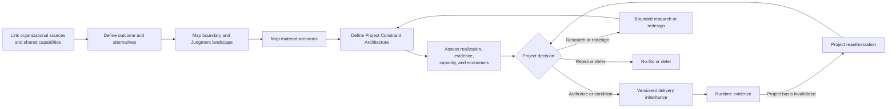
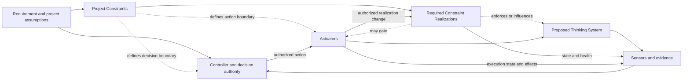

# Project Control Architecture and Viability Review

## Status

This document is **draft normative**. It defines a lightweight project-level pattern for deciding whether a proposed Thinking System has a credible, operable, and economically viable control architecture.

The pattern uses one living project review and linked evidence. It does not require a separate risk register, Constraint Register, control catalogue, responsibility matrix, financial model, or governance-board protocol for the default SMB path.

The informative working representation is the [`Project Control Architecture and Viability Review Template`](project-control-architecture-and-viability-review-template.md).

## 1. Context and problem

A delivery-level feature review cannot decide whether an entire proposed Thinking System should exist, what authority it may possess, or whether the surrounding control perimeter is feasible and worth operating.

Projects often begin from a prototype or vendor demonstration while:

- risk is compressed into one score;
- organizational policy is copied without project interpretation;
- prompts or probabilistic evaluators are presented as Hard Constraints;
- tools are listed without evidence, authority, or corrective paths;
- control cost, false blocks, fallback load, and Human Authority capacity are omitted;
- project authorization is confused with delivery release;
- every feature redefines project Constraints differently;
- runtime evidence cannot invalidate the project decision;
- teams continue building despite missing or uneconomic control.

## 2. Pattern

> **Use one living Project Control Architecture and Viability Review to connect business outcome, AI necessity, project boundary, material scenarios, one canonical Project Constraint Architecture, capability feasibility, evidence, Human Authority, capacity, economics, authorization, delivery inheritance, and reauthorization.**

The pattern complements product discovery, architecture, security, legal review, finance, delivery, QA, operations, and incident response.

## 3. Decision ownership

The project review owns:

- business outcome and AI necessity;
- project boundary and intended Judgment landscape;
- material project scenarios;
- interpretation of organizational Constraint sources;
- project-specific Constraints;
- feasibility of Constraint Realizations, Sensors, Controllers, Actuators, Human Authority, fallback, containment, compensation, rollback, and shutdown;
- evidence and feedback latency;
- operational capacity and control economics;
- project authorization, conditions, limitation, research, redesign, deferral, escalation, or No-Go;
- the versioned baseline inherited by delivery reviews;
- project reauthorization.

The [`Thinking System Review`](thinking-system-review.md) owns implementation-level Judgment Nodes, concrete realizations, DoR, DoD, deployment-specific Release Gate, and local reassessment.

A project authorization does not approve a specific deployment before delivery evidence exists. A delivery Release Gate does not authorize a broader project.

## 4. One canonical Project Constraint Architecture

Each material Constraint is recorded once with:

- Constraint ID;
- authoritative source or project-risk rationale;
- subject, path, and project scope;
- class and claimed hard or soft strength;
- required realization and assumptions;
- failure, bypass, conflict, and unavailable behavior;
- evidence and control health;
- change, exception, and execution authority;
- delivery inheritance and reauthorization trigger.

Hard or soft is a scoped claim about the Constraint together with its complete realized path. When one source condition has different guarantee strengths across subjects, paths, or scopes, record separate Constraint claims rather than one mixed-strength row.

Other sections reference these IDs:

- scenario map identifies required Constraints;
- capability feasibility identifies what must realize, observe, decide, and act;
- evidence and economics assess viability;
- authorization records the accepted baseline;
- delivery inheritance passes relevant IDs and expectations;
- runtime reassessment identifies which project basis changed and whether reauthorization is required.

## 5. Review flow



The flow is iterative and proportional. It does not require one sequence of meetings or one organizational owner.

## 6. Organizational context

Link rather than copy authoritative sources, such as prohibited uses, legal and contractual obligations, approved vendors and regions, data classes, identity, audit, evaluation, incident, fallback, shutdown, Human Authority, and exception rights.

The project interprets what those sources mean for the proposed system. It does not redefine them. An organizational source does not become a Hard Constraint merely because it uses mandatory language; the project must identify the scoped realized path supporting any hard claim.

## 7. Outcome, AI necessity, and alternatives

State:

- intended user or business outcome;
- affected parties and expected value;
- why Model Judgment is needed;
- useful variance to preserve;
- value lost when necessary Constraints narrow autonomy, data, tools, population, or speed;
- deterministic, manual, narrower model-assisted, and non-AI alternatives;
- conditions under which an alternative becomes preferable.

A successful prototype is evidence about possibility, not project authorization.

## 8. Boundary and Judgment landscape

Define:

- in-scope and out-of-scope responsibilities;
- users, population, data, geography, deployment, tools, vendors, and exposure;
- intended Input Interpretation, Decision Logic, and Output Mediation;
- authority and maximum autonomy;
- deterministic Invariants and prohibited authority;
- Human Authority and downstream consequences;
- initial Operating Envelope assumptions;
- dependency and configuration risks.

Detailed Judgment Node cards belong in delivery reviews.

## 9. Material scenarios

For each material scenario, identify:

- affected Requirement or obligation;
- source or mechanism;
- authority and exposure;
- consequence and any hard prohibition;
- detectability and feedback latency;
- reversibility, containment, and compensation;
- propagation or correlation;
- required Constraint IDs and capabilities;
- residual decision effect.

A local score may support but must not replace scenario reasoning. It cannot override a hard prohibition, missing capability, or non-substantive Human Authority.

## 10. Constraint accuracy and realization feasibility

A **Hard Constraint** is a scoped Constraint whose complete realized path deterministically prevents or rejects violation within stated assumptions, subject, path, scope, and enforcement boundaries.

A prompt, natural-language policy, probabilistic evaluator, classifier, or model safety layer is not hard by itself.

A project may depend on a composite realization. The review must identify where deterministic enforcement occurs, which parts only influence behavior, what assumptions support the claimed guarantee, and what happens when the path is unavailable, uncertain, bypassed, conflicting, or too costly.

Measured quality, cost, latency, or distribution tolerances remain part of the Requirement and Operating Envelope unless a separate realization deterministically enforces a specific boundary.

## 11. Complete capability path

For each critical scenario, describe:

```text
Requirement and Project Constraint
→ required Constraint Realization
→ Sensor evidence
→ Controller and decision authority
→ Actuator execution
→ observable effect, fallback, or reassessment
```



The arrows describe possible realization functions. Each Constraint row must state whether its realized path provides deterministic enforcement, probabilistic influence, or a composite path.

The project review should expose missing links rather than compensate with confident prose or product names.

## 12. Evidence and feedback latency

Assess:

- representative, consequential, and adversarial scenarios;
- deterministic contract and realization evidence;
- runtime outcome and incident evidence;
- activation, violation, bypass, false-block, and control-health evidence;
- evaluator calibration and blind spots;
- dependency and configuration-change detection;
- incident and decision reconstruction;
- required decision and Actuator latency.

Evidence feasibility is part of project viability, not a later QA detail.

## 13. Human Authority and capacity

Human Authority is substantive only when people have relevant information, competence, time, capacity, independence where needed, real decision rights, and an operable Actuator or escalation path.

Estimate ordinary and peak review volume, response latency, fallback load, and incident demand.

## 14. Control economics

Control cost includes:

- Constraint design and realization;
- evaluation and evidence;
- Human Authority and escalation;
- false blocks and lost value;
- fallback and degraded operation;
- latency and infrastructure;
- incident response, compensation, and reassessment;
- vendor volatility;
- residual exposure.

Estimate only to the precision needed for the decision. A hard prohibition or unavailable capability cannot be averaged away by expected value.

## 15. Project decision

Possible outcomes include bounded research, authorization, authorization with conditions, redesign, deferral, escalation, No-Go, or reauthorization required.

Record:

- authorized or rejected scope;
- approved Project Constraint Architecture;
- maximum autonomy and prohibited authority;
- required capabilities and Human Authority;
- evidence, capacity, cost, and release conditions;
- accepted residual risk;
- decision authority and validity.

Architectural Veto is part of engineering rigor when credible and viable control is unavailable.

## 16. Delivery inheritance

The project creates one versioned package containing:

- project review identifier, version, and decision;
- authorized scope and maximum autonomy;
- relevant scenario IDs;
- Constraint IDs, sources, scoped strength, assumptions, and delivery realization expectations;
- required Sensors, Controller, Actuators, Human Authority, fallback, containment, compensation, rollback, and shutdown;
- evidence and feedback expectations;
- capacity, resource, and cost boundaries;
- conditions delivery must close;
- changes allowed within delivery authority;
- reauthorization triggers.

Delivery reviews link this package and record concrete realizations. They do not recreate the complete project decision.

## 17. Runtime evidence and reauthorization

Project reauthorization is required when evidence invalidates a material basis of authorization, including risk, authority, Constraint meaning or feasibility, scope, claimed strength, evidence quality, Human Authority, capacity, economics, required capabilities, or residual exposure.

Local defects remain delivery-level when the project basis remains valid. Organizational review is required when an authoritative source, shared capability, or decision right changes.

## 18. Proportionality

Use the smallest review that preserves the project decision. A low-consequence project may need only a small scenario map, a few Constraint rows, a capability check, and a short decision.

Increase depth when consequence, authority, exposure, irreversibility, evidence uncertainty, latency, Human Authority load, realization difficulty, or economics justify it.

## 19. Consequences

### Benefits

- distinguishes project authorization from delivery release;
- translates risk into Constraints and capability requirements;
- exposes unsafe, infeasible, or uneconomic paths early;
- creates one baseline for delivery inheritance;
- routes runtime evidence to project reauthorization;
- remains usable without governance bureaucracy.

### Limitations

- requires cross-functional input and real decision authority;
- may expose that an AI path should be narrowed or rejected;
- depends on evidence quality and honest capacity estimates;
- does not prove universal safety;
- requires application evidence to refine proportionality.

## Relationships

- [`project-control-architecture-and-viability-review-template.md`](project-control-architecture-and-viability-review-template.md) is the informative working artifact.
- [`thinking-system-review.md`](thinking-system-review.md) owns delivery realization and release.
- [`../00-doctrine/control-loop-anatomy.md`](../00-doctrine/control-loop-anatomy.md) defines capability relationships.
- [`../00-doctrine/nested-control-lifecycle.md`](../00-doctrine/nested-control-lifecycle.md) defines inheritance and reassessment.
- [`../02-ai-control-plane/01-constraints/`](../02-ai-control-plane/01-constraints/) defines Constraints and Constraint Realization.
- [`../04-failure-modes/`](../04-failure-modes/) records recurring failures.
