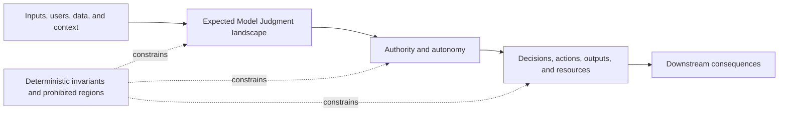
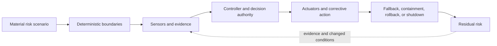

# Project Control Architecture and Viability Review

## Status

This document is **draft normative**. It defines a lightweight project-level pattern for deciding whether a proposed Thinking System has a credible, operable, and economically viable control architecture before ordinary delivery proceeds.

The pattern is intended for small and medium-sized engineering organizations. It does not require a governance department, a standing review board, a universal risk score, or a separate decision record for every step.

The practical working representation is the informative [`Project Control Architecture and Viability Review Template`](project-control-architecture-and-viability-review-template.md).

## 1. Context

A Thinking System may produce consequential uncertainty inside the system being controlled. A successful prototype can demonstrate useful Model Judgment without demonstrating that the surrounding control system can:

- constrain prohibited authority;
- detect critical Requirement violations;
- respond within the required time;
- preserve meaningful Human Authority;
- contain, reverse, or compensate harmful outcomes;
- operate at the required scale and latency;
- remain maintainable as models, data, tools, and vendors change;
- preserve a viable business case after control costs and residual exposure are included.

The delivery-level [`Thinking System Review`](thinking-system-review.md) evaluates a bounded system, feature, or material change. It should inherit a credible project boundary rather than become the place where the whole domain, business-risk space, shared controls, and project economics are rediscovered for every release.

## 2. Problem

Organizations often authorize AI projects using evidence that is too narrow for the decision:

- an impressive demonstration;
- a model benchmark;
- a nominal API price;
- a list of guardrails;
- an assumed Human-in-the-Loop step;
- a generic risk score;
- a claim that production monitoring will reveal problems later.

These signals do not establish that a complete control loop exists or that the required control perimeter is feasible.

The opposite failure is also common: teams respond by creating a large governance process before they understand the actual Judgment landscape, consequences, authority, evidence, or control needs.

The project decision therefore needs enough structure to expose control feasibility and non-viability without turning every project into a compliance program.

## 3. Pattern

> **Use one living Project Control Architecture and Viability Review to connect the intended business outcome, material risk scenarios, Model Judgment and authority landscape, required control capabilities, evidence feasibility, Human Authority, operational capacity, control economics, project authorization, delivery inheritance, and reauthorization triggers.**

The review answers:

> **Is there a credible, operable, and economically viable control architecture for pursuing this Thinking System within a defined project boundary?**

The review may authorize delivery, authorize only bounded research, impose conditions, require redesign, escalate the decision, defer the project, or reject the AI path.

`No-Go` is a valid engineering outcome.

## 4. Canonical boundary

This pattern owns the project-level decision surface for:

- material business and domain risk scenarios;
- intended Model Judgment, autonomy, and authority;
- deterministic invariants and prohibited authority;
- required project and organizational control capabilities;
- evidence feasibility and feedback latency;
- Human Authority and operational capacity;
- control build and run cost;
- residual project risk;
- project authorization and reauthorization;
- the baseline inherited by delivery-level reviews.

It does **not** own:

- the full model-mediated Definition of Ready;
- the full model-mediated Definition of Done;
- the deployment-specific Release Gate;
- detailed Judgment Node cards for every implementation change;
- feature-specific evaluation evidence;
- one mandatory risk-scoring method or financial model.

Those delivery decisions remain owned by the [`Thinking System Review`](thinking-system-review.md) or an equivalent process.

## 5. Review flow

```mermaid
flowchart LR
    C[Organizational context]
    O[Business outcome and AI necessity]
    B[Project boundary and Judgment landscape]
    R[Material risk scenarios]
    A[Required control architecture]
    E[Evidence feasibility]
    H[Human Authority and operating capacity]
    V[Control economics and viability]
    D{Project authorization}
    I[Inherited delivery baseline]
    T[Delivery-level Thinking System Reviews]
    P[Runtime evidence]
    X[Project reauthorization]

    C --> O --> B --> R --> A --> E --> H --> V --> D
    D -->|Authorized boundary| I --> T --> P
    D -->|Bounded research| T
    D -->|Redesign| B
    D -->|No-Go| D
    P -->|Project assumption changed| X --> R
```



The flow is iterative. A bounded research decision may be needed to learn whether evidence, controls, or economics are feasible. It does not authorize production use unless a later decision explicitly does so.

## 6. Step 1 — Establish decision identity and organizational context

Record:

- the proposed project or system;
- the decision version and status;
- the project sponsor or business outcome responsibility;
- project authorization authority;
- relevant legal, privacy, security, safety, contractual, financial, and policy constraints;
- prohibited organizational uses;
- approved vendors, deployment models, data classes, and tool-access boundaries where relevant;
- shared identity, audit, evaluation, observability, incident, fallback, and shutdown capabilities;
- available Human Authority and operating capacity;
- unresolved organizational dependencies or exceptions.

Organizational context may be inherited through links to existing policies or architecture records. The review should not duplicate those sources.

## 7. Step 2 — Define the business outcome and why Model Judgment is needed

Record:

- the intended user or business outcome;
- the current process or alternative solution;
- where deterministic software is insufficient or disproportionately expensive;
- which useful variance, interpretation, synthesis, planning, or adaptation justifies Model Judgment;
- the expected value and who receives it;
- the expected cost of continuing without the proposed system;
- non-AI alternatives and why they were accepted or rejected;
- assumptions that must be true for the business case to hold.

A project should not be authorized merely because a model can perform the task. The review should establish why the model-mediated path is preferable after control obligations are considered.

## 8. Step 3 — Define the project boundary and intended Judgment landscape

Identify the expected project-level system boundary, including:

- users, affected parties, environments, and data domains;
- upstream and downstream systems;
- external models, tools, vendors, and knowledge sources;
- intended deployment scope, population, and exposure;
- expected Model Judgment placements;
- decisions, paths, actions, communications, or resources that Model Judgment may influence;
- intended autonomy and tool access;
- intended Human Authority;
- deterministic invariants;
- prohibited actions and authority;
- initial Operating Envelope assumptions;
- foreseeable interactions between multiple Judgment Nodes.

At project authorization time, every implementation-level Judgment Node may not yet be known. The review should map the consequential Judgment landscape sufficiently to expose authority, propagation, shared controls, and major uncertainty concentrations.



## 9. Step 4 — Map material risk scenarios

The project review uses scenario-based reasoning rather than one mandatory aggregate score.

For each material scenario, record:

- the affected stakeholder, asset, obligation, or business outcome;
- the model-mediated event, deterministic defect, boundary failure, external change, misuse, or control failure that could produce the scenario;
- the relevant authority, autonomy, exposure, and affected population;
- the consequence and whether a hard prohibition applies;
- detectability and expected feedback latency;
- reversibility, compensability, and containment feasibility;
- propagation, correlation, and interaction with other systems or decisions;
- uncertainty in the scenario and evidence;
- required controls and Human Authority;
- expected residual risk and effect on the project decision.

### 9.1 Recommended risk-scenario surface

| Field | Decision purpose |
|---|---|
| Scenario and affected obligation | Makes the possible loss concrete and connects it to the business or Requirement. |
| Source or mechanism | Distinguishes model behavior, deterministic defects, missing boundaries, attacks, operational change, and controller failure. |
| Authority, autonomy, and exposure | Shows how much consequential power and population are affected. |
| Consequence and hard prohibitions | Separates negotiable trade-offs from outcomes the organization cannot authorize. |
| Detectability and feedback latency | Tests whether evidence can arrive before unacceptable harm propagates. |
| Reversibility, compensation, and containment | Identifies whether recovery is credible rather than assumed. |
| Propagation and correlation | Exposes repeated, systemic, or cross-system failure rather than only one bad output. |
| Required controls and Human Authority | Connects risk to an actual control architecture. |
| Residual risk and decision effect | Makes acceptance, limitation, redesign, escalation, or rejection explicit. |

Teams MAY use local qualitative or quantitative scales when the scale and evidence are defined. A combined score MUST NOT replace the scenario, hard-prohibition, control-feasibility, and decision rationale.

## 10. Step 5 — Derive the required control architecture

For each material scenario and consequential Judgment area, identify the required control-loop capabilities:

### 10.1 Deterministic boundaries

- invariants;
- authentication and authorization;
- data and tenant isolation;
- transaction and state boundaries;
- schemas and interface contracts;
- prohibited tools, actions, and authority;
- rate, budget, scope, and resource limits;
- mandatory human or deterministic decision points.

### 10.2 Sensors and evidence

- behavior and outcome evidence;
- source and context provenance;
- evaluation and regression evidence;
- override, complaint, incident, and near-miss evidence;
- distribution, drift, cost, latency, and capacity signals;
- evidence limitations and blind spots;
- required observation and decision latency.

### 10.3 Controller and decision authority

- who or what interprets evidence;
- who may accept, limit, change, suspend, or reject operation;
- which decisions may be automated;
- where Human Authority is required;
- escalation when authority or competence is insufficient.

### 10.4 Actuators and corrective action

- constrain or change model, prompt, policy, context, tool, route, or authority;
- narrow scope or population;
- require human approval;
- switch to deterministic or manual fallback;
- contain, isolate, roll back, disable, or shut down;
- correct downstream state or compensate affected parties where feasible.

### 10.5 Capability source and ownership

For each required capability, identify whether it is:

- already available as an organizational capability;
- shared but requires adaptation;
- project-specific and must be built;
- dependent on a vendor or external party;
- unavailable or not yet credible.

Telemetry without decision authority and corrective action is not a complete control.



## 11. Step 6 — Assess evidence feasibility and feedback latency

A control design is not credible when its critical claims cannot be observed or evaluated sufficiently for the decision.

Review:

- which pre-release evidence can be collected;
- which production evidence is necessary;
- whether critical violations can be detected directly or only through weak proxies;
- expected false-pass, false-block, and calibration limitations;
- required scenario, adversarial, human, deterministic, and statistical evidence;
- data availability, provenance, representativeness, and legal usability;
- whether feedback arrives before harm propagates beyond the available control response;
- whether model, provider, context, tool, or data changes can be detected and traced;
- whether incidents and near misses can be reconstructed;
- evidence gaps that remain after feasible controls are applied.

An inability to measure every behavior is not automatically a veto. An inability to detect or contain a critical prohibited outcome within the required time may be.

## 12. Step 7 — Assess Human Authority and operational capacity

Human involvement is a control only when the human path is real and operable.

Review:

- who has authority to approve, override, contain, escalate, roll back, or stop;
- whether reviewers have sufficient competence, context, independence, and time;
- expected review volume and peak load;
- required response time;
- whether the interface exposes evidence and uncertainty needed for judgment;
- whether automation bias, alert fatigue, diffusion of responsibility, or organizational pressure can weaken intervention;
- whether the manual or deterministic fallback can handle expected load;
- incident, support, on-call, and escalation capacity;
- whether responsibility remains assigned during absence, turnover, or organizational change.

A nominal Human-in-the-Loop step MUST NOT be treated as sufficient when the person cannot meaningfully inspect, reject, or reverse the model-mediated outcome.

## 13. Step 8 — Assess control economics and project viability

The cost of the primary model invocation is not the cost of the Thinking System.

Review at least:

### 13.1 Expected benefit

- revenue, margin, throughput, quality, time, safety, customer, or strategic value;
- value distribution across stakeholders;
- adoption assumptions;
- value lost when controls reduce autonomy, coverage, or speed;
- non-AI baseline and opportunity cost.

### 13.2 One-time control cost

- architecture and integration;
- data and context preparation;
- evaluation design and scenario development;
- deterministic boundaries and permissions;
- security, privacy, legal, and contractual work;
- observability, audit, and incident integration;
- Human Authority workflow design and training;
- rollout, migration, and change management.

### 13.3 Recurring control cost

- inference, retrieval, tool, and infrastructure use;
- evaluation maintenance and repeated evidence collection;
- human review and escalation capacity;
- monitoring, audit, support, and incident response;
- prompt, policy, model, context, and vendor-change reassessment;
- false blocks, fallback, latency, and operational friction;
- compensation, remediation, or reserve where relevant.

### 13.4 Residual exposure

- remaining frequency and consequence uncertainty;
- correlated or systemic failure;
- legal, safety, security, privacy, contractual, and reputational exposure;
- failures that are detectable only after harm;
- unsupported assumptions in the expected-value model.

A project MAY use an expected-value model such as:

```text
Expected net value
= expected business benefit
- control build cost
- recurring control and operating cost
- expected residual exposure
```

The formula is a decision aid, not a UA conformance requirement. Positive expected value MUST NOT override a hard prohibition, unacceptable consequence boundary, or control architecture that is not credible.

## 14. Step 9 — Make the project authorization decision

The review records one outcome:

- **Authorized for delivery** — the project boundary and required control architecture are credible enough for delivery-level work;
- **Authorized with conditions** — delivery may proceed only within explicit constraints, dependencies, or evidence conditions;
- **Authorized for bounded research** — only a controlled experiment or feasibility study is authorized;
- **Redesign required** — the outcome may remain valid, but authority, topology, scope, controls, or operating model must change;
- **Escalate** — the decision exceeds current authority, competence, policy, or risk appetite;
- **Deferred** — the project is not currently viable because a dependency, capability, evidence source, or economic assumption is unresolved;
- **AI path rejected / No-Go** — the proposed model-mediated path is not acceptable or viable within the stated boundary.

The decision records:

- authorized or rejected scope;
- rationale;
- material assumptions;
- hard constraints and prohibited authority;
- required shared and project-specific controls;
- accepted residual risk;
- conditions and unresolved dependencies;
- project authorization authority;
- decision validity and review timing where relevant;
- delivery inheritance package;
- project reauthorization triggers.

The authorization decision remains inside the same living review. The default SMB path does not require a separate Project Launch Gate record.

## 15. Step 10 — Create the delivery inheritance package

Delivery-level reviews should inherit the project baseline by reference rather than duplicate it.

The inheritance package should identify:

- project review identifier and version;
- authorized project and deployment scope;
- intended business outcome;
- organizational constraints and policy dependencies;
- intended Model Judgment and authority boundary;
- prohibited authority and hard invariants;
- material risk scenarios relevant to delivery decisions;
- shared controls and required project-specific controls;
- evidence and feedback expectations;
- Human Authority and operating-capacity assumptions;
- control-cost and resource boundaries;
- project-level release constraints;
- project reauthorization triggers;
- unresolved conditions delivery work must close.

A [`Thinking System Review`](thinking-system-review.md) may refine local Judgment Nodes, Requirements, controls, evidence, and release scope. It MUST NOT silently expand the authorized project boundary or weaken inherited constraints.

When delivery evidence contradicts the project baseline, the team should resolve the conflict through project reassessment rather than copying the new assumption into one feature review.

## 16. Step 11 — Define project reauthorization triggers

Project reassessment is required when evidence or change may invalidate the project-level control architecture, viability, or authority decision.

Triggers may include:

- material increase in autonomy or authority;
- new tool or state-changing action;
- expansion to a new population, domain, geography, language, product, or data class;
- material change in model, provider, context source, tool dependency, or deployment model;
- loss or degradation of a required sensor, evaluator, control, fallback, or Human Authority path;
- incident, near miss, or Requirement violation that invalidates a project assumption;
- evidence that a critical scenario is more frequent, severe, correlated, or difficult to detect than assumed;
- control cost, latency, review volume, or incident burden exceeding the viable envelope;
- inability of the manual or deterministic fallback to absorb real load;
- new legal, safety, security, privacy, contractual, financial, or organizational constraint;
- material change in business value or non-AI alternatives;
- repeated delivery exceptions that collectively change the project boundary.

A local implementation defect or bounded feature correction does not always require project reauthorization. The question is whether the evidence changes the project-level risk, authority, capability, capacity, or viability decision.

## 17. Responsibility bundles

The pattern uses responsibility bundles rather than mandatory job titles.

| Responsibility bundle | Required responsibility |
|---|---|
| **Business outcome responsibility** | Define the intended value, non-AI alternative, assumptions, and acceptable project boundary. |
| **Control architecture responsibility** | Map the Judgment landscape, deterministic invariants, control capabilities, dependencies, and containment paths. |
| **Evidence and risk responsibility** | Maintain material scenarios, evidence limits, residual-risk reasoning, and reauthorization signals. |
| **Operational capacity responsibility** | Establish Human Authority, fallback, incident, support, and operating-capacity feasibility. |
| **Project authorization authority** | Authorize, condition, limit, redirect, defer, escalate, or reject the project-level AI path. |

One person may hold several bundles in a small organization. Existing product, architecture, delivery, security, legal, finance, quality, or operational authority may carry these responsibilities.

The project authorization authority and delivery release authority may be the same person or different people. Both decisions must remain explicit.

## 18. One practical artifact

The [`Project Control Architecture and Viability Review Template`](project-control-architecture-and-viability-review-template.md) is the default working artifact for this pattern.

It combines:

- project and decision identity;
- organizational context;
- business outcome and AI necessity;
- project boundary and Judgment landscape;
- material risk scenarios;
- required control architecture;
- evidence feasibility;
- Human Authority and operational capacity;
- control economics;
- residual risk;
- project authorization;
- delivery inheritance;
- reauthorization triggers and decision history.

Supporting evidence MAY remain in existing architecture, risk, security, finance, product, evaluation, or incident systems and be linked from the review.

The pattern does not require separate risk maps, control catalogs, responsibility matrices, financial models, project gate records, or governance-board protocols when the single review and linked evidence are sufficient.

## 19. Proportional application

The full review surface identifies the questions that may matter. It does not require equal depth for every project.

A low-consequence, reversible, internally contained project may complete the review briefly and authorize only a limited scope.

A project with high authority, weak reversibility, broad exposure, long feedback latency, regulated decisions, safety implications, or correlated failure requires deeper evidence and stronger control architecture.

Depth should be proportional to:

- authority and autonomy;
- downstream consequence;
- affected population and exposure;
- reversibility and compensability;
- propagation and correlation;
- evidence uncertainty and feedback latency;
- legal, safety, security, privacy, and contractual constraints;
- Human Authority and operating capacity;
- control cost and residual exposure.

Mark non-applicable sections explicitly. Do not omit a material question merely because the organization lacks a specialist role or existing artifact.

## 20. Consequences

### Benefits

- separates project viability from feature completion and release;
- exposes control cost before the project is committed around a demo;
- turns risk into control requirements rather than an isolated score;
- preserves architectural veto and non-AI alternatives;
- gives delivery teams a stable inherited boundary;
- reduces repeated risk and policy discovery across feature reviews;
- creates a clear path from runtime evidence to project reauthorization;
- remains usable without a large governance organization.

### Costs and trade-offs

- requires cross-functional judgment before implementation details are fully known;
- may slow or stop projects that would otherwise move from prototype directly to delivery;
- depends on honest estimates of value, control cost, capacity, and uncertainty;
- can create false confidence when teams complete fields without testing control feasibility;
- may require bounded research before a decision can be made;
- needs maintenance when shared controls or organizational constraints change.

## 21. Known limits and anti-patterns

This review does not prove safety, reliability, compliance, or positive ROI.

Avoid:

- **Demo authorization** — treating capability evidence as control and viability evidence;
- **Risk-score compression** — replacing scenario and control reasoning with one number;
- **Guardrail inventory** — listing tools without decision authority and corrective paths;
- **Ceremonial Human Authority** — assigning review to people without time, context, competence, or power;
- **Monitoring deferral** — postponing critical control design until production;
- **Control-cost omission** — calculating only primary model cost;
- **feature-level duplication** — copying the whole project risk map into every delivery review;
- **silent scope expansion** — allowing a feature release to broaden project authority;
- **expected-value override** — averaging away hard prohibitions or unacceptable consequences;
- **governance accumulation** — creating additional records and committees where one living review is sufficient.

## 22. Non-prescription

UA does not require:

- the exact section order in this document;
- one universal risk taxonomy or score;
- one universal expected-value formula;
- a fixed review cadence;
- a project management methodology;
- a Project Launch Gate meeting;
- mandatory specialist roles;
- a new governance board or department;
- a separate top-level Operating Model module;
- duplication of existing architecture, security, risk, finance, product, or incident records.

Organizations MAY integrate the review into an existing business case, architecture review, product discovery, security review, delivery process, investment decision, change process, or risk workflow, provided the project decision, inherited boundary, and reauthorization path remain explicit and traceable.

## Related UA material

- [`Uncertainty in the Controlled Object`](../00-doctrine/uncertainty-in-the-controlled-object.md) — doctrine for the controlled-object shift and nested organizational, project, delivery, and runtime control levels.
- [`Requirements, Correctness, and Bugs`](../00-doctrine/requirements-correctness-and-bugs.md) — approved operating contracts, evidence, and system-level violations.
- [`Judgment Node Boundary`](judgment-node-boundary.md) — detailed boundary fields for consequential implementation-level Judgment Nodes.
- [`Thinking System Review`](thinking-system-review.md) — delivery-level DoR, experiment, DoD, Release Gate, and reassessment.
- [`AI Control Plane`](../02-ai-control-plane/) — distributed constraints, sensors, controllers, actuators, Human Authority, and corrective paths.
