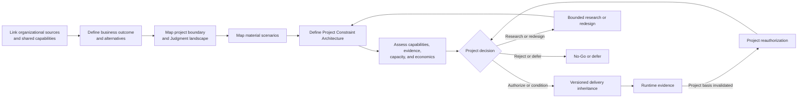
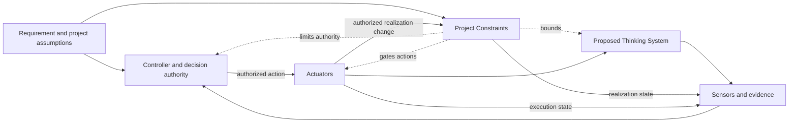

# Project Control Architecture and Viability Review

## Status

This document is **draft normative**. It defines a lightweight project-level pattern for deciding whether a proposed Thinking System has a credible, operable, and economically viable Constraint and control architecture.

The pattern is designed for small and medium-sized organizations. It uses one living project review and linked evidence rather than requiring a separate risk register, Constraint Register, control catalogue, responsibility matrix, financial model, or governance-board protocol.

The informative working representation is the [`Project Control Architecture and Viability Review Template`](project-control-architecture-and-viability-review-template.md).

## 1. Context

A feature-level delivery review cannot answer whether an entire proposed Thinking System should exist, what authority it may possess, or whether the surrounding control perimeter is feasible and worth operating.

Project-level questions include:

- Is Model Judgment necessary for the intended outcome?
- Which organizational Constraints and decision rights apply?
- What new project Constraints follow from material scenarios?
- Can those Constraints be realized within the required latency and scope?
- Can behavior, outcomes, realization state, and control health be observed?
- Who may decide, intervene, override, or stop?
- Which Actuators and fallback paths exist?
- Is Human Authority substantive and sufficiently staffed?
- Does the complete control path preserve a viable business case?
- Which boundary and conditions should delivery reviews inherit?

## 2. Problem

Projects often begin with a business case, prototype, or vendor demonstration before they have a project-level control decision.

This creates recurring failure patterns:

- risk is compressed into one generic score;
- policy prose is copied without project interpretation;
- prompts or probabilistic evaluators are represented as Hard Constraints;
- tools are listed without connecting them to evidence, authority, and action;
- control cost, false blocks, fallback load, and Human Authority capacity are omitted;
- project authorization is confused with a delivery Release Gate;
- every feature repeats the project risk and Constraint analysis differently;
- runtime evidence cannot invalidate the project decision;
- teams continue building even when credible control is unavailable or economically destructive.

## 3. Pattern

> **Use one living Project Control Architecture and Viability Review to connect business outcome, AI necessity, project boundary, material scenarios, one canonical Project Constraint Architecture, capability feasibility, evidence, Human Authority, capacity, economics, authorization, delivery inheritance, and reauthorization.**

The pattern complements product discovery, architecture, security, legal review, finance, delivery, QA, operations, and incident response. It does not replace them.

## 4. Decision ownership

The project review owns:

- business outcome and AI necessity;
- project boundary and intended Judgment landscape;
- material project scenarios and consequences;
- interpretation of organizational Constraint sources;
- project-specific Constraints;
- feasibility of Constraint Realization, Sensors, Controllers, Actuators, Human Authority, fallback, containment, rollback, compensation, and shutdown;
- evidence and feedback latency;
- operational capacity and control economics;
- project authorization, conditions, limitation, redesign, bounded research, deferral, escalation, or No-Go;
- the versioned baseline inherited by delivery reviews;
- project reauthorization.

The [`Thinking System Review`](thinking-system-review.md) owns implementation-level Judgment Nodes, concrete delivery realization, DoR, DoD, deployment-specific Release Gate, and local reassessment.

A delivery Release Gate does not authorize a broader project. A project authorization does not approve a specific deployment before delivery evidence exists.

## 5. One canonical Project Constraint Architecture

The project artifact should define each material Constraint once. The canonical project table records:

- Constraint ID;
- source or project-risk rationale;
- subject and project scope;
- class and hard or soft strength;
- required realization and assumptions;
- failure, bypass, conflict, and unavailable behavior;
- evidence and control health;
- change, exception, and execution authority;
- delivery inheritance and project reauthorization trigger.

Other project sections reference these IDs:

- scenario map identifies which Constraints are required;
- capability feasibility identifies what must realize, observe, decide, and act;
- evidence and economics assess whether the architecture is viable;
- authorization records the accepted Constraint baseline;
- delivery inheritance passes the relevant IDs and expectations;
- runtime reauthorization identifies which basis changed.

This prevents the project review from becoming several overlapping records inside one file.

## 6. Review flow



The flow is iterative and proportional. It does not require one sequence of meetings or one organizational owner.

## 7. Organizational context

Link rather than copy authoritative sources, such as:

- prohibited uses and risk appetite;
- legal, privacy, security, safety, contractual, procurement, residency, and financial obligations;
- approved vendors, models, data classes, geographies, and deployment modes;
- identity, audit, evaluation, incident, fallback, and shutdown capabilities;
- Human Authority and exception rights.

The project review interprets what these sources mean for the proposed system. It does not redefine them.

## 8. Business outcome, AI necessity, and alternatives

The review should state:

- the intended user or business outcome;
- affected parties and expected value;
- why Model Judgment is needed;
- which useful variance should remain available;
- what value is lost when necessary Constraints narrow autonomy, data, tools, population, or speed;
- deterministic, manual, narrower model-assisted, and non-AI alternatives;
- conditions under which an alternative becomes preferable.

A successful prototype is evidence about possibility, not project authorization.

## 9. Boundary and Judgment landscape

Define:

- in-scope and out-of-scope responsibilities;
- users, population, data, geography, deployment, tools, vendors, and exposure;
- intended Input Interpretation, Decision Logic, and Output Mediation;
- authority and maximum autonomy;
- deterministic Invariants and prohibited authority;
- Human Authority and affected downstream systems;
- initial Operating Envelope assumptions;
- dependency and configuration risks.

Detailed Judgment Node cards belong in delivery reviews.

## 10. Material scenario reasoning

Use scenario-based reasoning rather than one aggregate score.

For each material scenario, identify:

- affected Requirement or obligation;
- source or mechanism;
- authority, exposure, and population;
- consequence and any hard prohibition;
- detectability and feedback latency;
- reversibility, containment, and compensation;
- propagation or correlation;
- required Constraint IDs and capabilities;
- residual decision effect.

Local scales may be used only when their meaning, evidence, and limitations are explicit. A score must not override a hard prohibition, missing capability, or non-substantive Human Authority.

## 11. Constraint accuracy and realization feasibility

A **Hard Constraint** deterministically prevents or rejects violation within stated assumptions, scope, and enforcement boundaries.

A prompt, natural-language policy, probabilistic evaluator, classifier, or model safety layer is not hard by itself.

A project may depend on a composite realization. The review must identify where deterministic enforcement actually occurs, what assumptions support the guarantee, and what happens when the path is unavailable, uncertain, bypassed, or too costly.

## 12. Complete capability path

For each critical scenario, the project should be able to describe a credible path:

```text
Requirement and project Constraint
→ required Constraint Realization
→ Sensor evidence
→ Controller and decision authority
→ Actuator execution
→ observable effect, fallback, or reassessment
```

The canonical relationship is:



The project review should expose missing links rather than compensate with confident prose or tool names.

## 13. Evidence and feedback latency

Assess whether evidence can support the decision and arrive before unacceptable propagation.

Consider:

- representative, consequential, and adversarial scenarios;
- deterministic contract and realization evidence;
- runtime outcome and incident evidence;
- activation, violation, bypass, false-block, and control-health evidence;
- evaluator calibration and blind spots;
- dependency, model, prompt, policy, context, data, permission, and tool change detection;
- ability to reconstruct incidents and decisions;
- required decision and Actuator latency.

Evidence feasibility is part of project viability, not a later QA detail.

## 14. Human Authority and operational capacity

Human involvement is substantive only when the person or group has:

- relevant information and context;
- competence;
- time and response capacity;
- independence where needed;
- real authority to approve, reject, contain, roll back, compensate, or stop;
- an operable escalation and Actuator path.

Estimate ordinary and peak review volume, response latency, fallback load, and incident demand.

## 15. Control economics

The cost of controlling the system includes more than the model call:

- Constraint design and realization;
- evaluation and evidence;
- Human Authority and escalation;
- false blocks and lost value;
- fallback and degraded operation;
- latency and infrastructure;
- incident response, compensation, and reassessment;
- vendor and dependency volatility;
- residual exposure.

Estimate only to the precision needed for the decision. A hard prohibition or unavailable capability cannot be averaged away by expected value.

## 16. Project decision

Possible outcomes include:

- bounded research;
- authorization;
- authorization with conditions;
- redesign;
- deferral;
- escalation;
- No-Go / AI path rejected;
- reauthorization required.

The decision should record:

- authorized or rejected scope;
- approved Constraint baseline;
- maximum autonomy and prohibited authority;
- required capabilities and Human Authority;
- evidence, capacity, cost, and release conditions;
- accepted residual risk;
- decision authority and validity.

Architectural Veto is part of engineering rigor when credible control or viability is unavailable.

## 17. Delivery inheritance

The project creates one versioned package containing:

- project review identifier, version, and decision;
- authorized scope and maximum autonomy;
- relevant scenario IDs;
- Constraint IDs, sources, strength, and delivery realization expectations;
- required Sensors, Controller, Actuators, Human Authority, fallback, containment, compensation, rollback, and shutdown;
- evidence and feedback expectations;
- capacity, resource, and control-cost boundaries;
- conditions delivery must close;
- changes allowed within delivery authority;
- project reauthorization triggers.

Delivery reviews link this package and record concrete realization. They do not recreate the complete project decision.

## 18. Runtime evidence and reauthorization

Project reauthorization is required when evidence invalidates a material basis of authorization, including:

- risk or consequence assumptions;
- authority or autonomy;
- Constraint source, meaning, or feasibility;
- population, data, geography, deployment, tool, or consequence scope;
- evidence quality or feedback latency;
- Human Authority, fallback, or operational capacity;
- control cost or unit economics;
- availability or effectiveness of required capabilities;
- accepted residual risk.

Local defects remain delivery-level when the project basis remains valid. Organizational review is required when an authoritative source, shared capability, or decision right changes.

## 19. Proportionality

Use the smallest review that preserves the project decision.

For a low-consequence project, a small scenario map, a few Constraint rows, a capability check, and a short decision may be sufficient.

Increase depth when consequence, authority, exposure, irreversibility, evidence uncertainty, latency, Human Authority load, realization difficulty, or economics justify it.

Link existing records instead of recreating them.

## 20. Consequences

### Benefits

- makes project authorization distinct from delivery release;
- translates risk into explicit Constraints and capability requirements;
- exposes infeasible, unsafe, or uneconomic AI paths early;
- creates one baseline for delivery inheritance;
- preserves runtime reauthorization;
- remains usable without a large governance organization.

### Costs and limitations

- requires cross-functional input and explicit decision authority;
- may expose that the AI path should be narrowed or rejected;
- depends on evidence quality and honest capacity estimates;
- does not prove universal safety or eliminate uncertainty;
- requires real-team evidence to refine proportionality.

## Relationships

- [`project-control-architecture-and-viability-review-template.md`](project-control-architecture-and-viability-review-template.md) is the informative working artifact.
- [`thinking-system-review.md`](thinking-system-review.md) owns delivery-level realization and release.
- [`../00-doctrine/control-loop-anatomy.md`](../00-doctrine/control-loop-anatomy.md) defines capability relationships.
- [`../00-doctrine/nested-control-lifecycle.md`](../00-doctrine/nested-control-lifecycle.md) defines decision inheritance and reassessment.
- [`../02-ai-control-plane/01-constraints/`](../02-ai-control-plane/01-constraints/) defines Constraints and Constraint Realization.
- [`../04-failure-modes/`](../04-failure-modes/) records recurring control failures.
