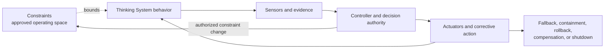

# Thinking System Review Template

## How to use this template

This is the default working artifact for the draft-normative [`Thinking System Review`](thinking-system-review.md) pattern.

Use one copy for one bounded system, feature, or material change. Keep it as a living document through framing, constraint realization, implementation or experimentation, completion, release, and operation.

When the work belongs to an authorized Thinking System project, link the applicable [`Project Control Architecture and Viability Review`](project-control-architecture-and-viability-review.md) version and complete the inherited project baseline below. Do not copy the complete project risk map, constraint architecture, control economics, or organizational policy into this review. Link inherited decisions and record the concrete delivery realization.

This template does not require a separate Constraint Register. Use the embedded constraint-realization table and link independent architecture, security, policy, configuration, or evidence records when they genuinely have a separate owner or lifecycle.

After a release decision:

1. preserve an immutable or versioned snapshot;
2. link the project decision and deployed constraint, system, model, prompt, policy, permission, tool, configuration, and deployment versions where material;
3. create a new version when a reassessment trigger occurs;
4. preserve the relationship to previous delivery and project decisions.

Mark an item `N/A` with a reason when it does not apply. Do not silently delete review areas because they appear inconvenient.

---

## 1. Review identity

- **System, feature, or material change:**
- **Review version:**
- **Previous review or decision:**
- **Review status:** Draft / Ready review / In implementation / In experiment / Done review / Release review / Operating / Reassessment
- **Date opened:**
- **Last updated:**
- **Implementation and constraint-realization responsibility:**
- **Evaluation responsibility:**
- **Operational responsibility:**
- **Release decision authority:**

### Relevant versions and references

- **Project Control Architecture and Viability Review identifier and version:**
- **Project authorization outcome and snapshot:**
- **Requirement or feature record:**
- **Architecture or design record:**
- **Repository and revision:**
- **Model and version:**
- **Prompt or instruction version:**
- **Policy and constraint source versions:**
- **Constraint realization or configuration versions:**
- **Permissions and identity configuration:**
- **Tools and external services:**
- **Deployment or release manifest:**
- **Evaluation evidence location:**
- **Operational dashboard, control-health evidence, or logs:**

---

## 2. Intended outcome and scope

- **User or business outcome:**
- **Why Model Judgment is used:**
- **In scope:**
- **Out of scope:**
- **Affected users, systems, or parties:**
- **Current lifecycle context:** Bounded experiment / Prototype / Limited deployment / Production change
- **Key assumptions:**
- **Known unknowns:**

### 2.1 Inherited project baseline

Complete by reference to the approved project review. Mark `N/A` with a reason only when this delivery review is itself the first bounded project-level investigation and no project authorization exists yet.

- **Authorized project boundary:**
- **Intended project outcome:**
- **Applicable organizational constraint sources:**
- **Inherited project constraint identifiers, classes, scope, and strength:**
- **Required delivery realization or enforcement expectations:**
- **Constraint failure, fallback, containment, and degraded-mode expectations:**
- **Constraint change, override, exception, and project reauthorization authority:**
- **Authorized Model Judgment and maximum autonomy:**
- **Prohibited authority and hard invariants:**
- **Material project risk scenarios relevant to this change:**
- **Shared controls available:**
- **Project-specific controls required:**
- **Evidence, constraint-health, and feedback expectations:**
- **Human Authority and operational-capacity assumptions:**
- **Control-cost and resource boundaries:**
- **Project-level release constraints:**
- **Conditions this delivery work must close:**
- **Project reauthorization triggers:**

If the proposed delivery scope contradicts, weakens, or expands this baseline, stop and request project reassessment rather than silently rewriting the project decision here.

### 2.2 System boundary

Describe the complete system responsibility, not only the model call.

- **Inputs:**
- **Outputs, decisions, paths, or actions:**
- **Upstream dependencies:**
- **Downstream dependencies:**
- **External dependencies:**
- **Constraint enforcement dependencies:**
- **Human decision and escalation dependencies:**

---

## 3. Mixed-system responsibilities

### 3.1 Deterministic responsibilities

- **Rules and state transitions:**
- **Invariants:**
- **Schemas, types, grammars, and interface contracts:**
- **Authentication, permissions, and action authorization:**
- **Transactions, audit, and data-handling obligations:**
- **Deterministic source-of-truth responsibilities:**

### 3.2 Model-mediated responsibilities

- **Expected judgment:**
- **Acceptable variation:**
- **Model-mediated decisions, paths, actions, or outputs:**
- **Unacceptable outcomes:**
- **Useful variance that must remain available:**

### 3.3 Constraint responsibilities

- **Inherited hard constraints:**
- **Inherited soft constraints:**
- **Locally derived constraints:**
- **Context and provenance constraints:**
- **Authority and action constraints:**
- **Structural and interface constraints:**
- **State and transaction constraints:**
- **Data, privacy, residency, and disclosure constraints:**
- **Resource, exposure, and deployment constraints:**
- **Environment and dependency constraints:**
- **Human Authority constraints:**

### 3.4 Control responsibilities

- **Sensors and evidence:**
- **Controller or decision authority:**
- **Actuators and corrective actions:**
- **Fallback:**
- **Containment:**
- **Compensation:**
- **Escalation:**
- **Rollback, disable, or shutdown:**
- **Decision and change traceability:**

---

## 4. Judgment Nodes

Repeat this section for each consequential Judgment Node. Use the minimal fields by default and complete optional fields where authority, downstream impact, reversibility, constraint difficulty, or failure consequences justify them.

### Judgment Node 1

- **Name:**
- **Purpose:**
- **Placement:** Input Interpretation / Decision Logic / Output Mediation / Combination
- **Inputs and approved context:**
- **Allowed authority:**
- **Applicable constraints and source:**
- **Hard constraints and realization:**
- **Unacceptable outcomes:**
- **Evidence, telemetry, and constraint health:**
- **Fallback, containment, or escalation:**
- **Operational owner:**
- **Change or override authority:**

Optional extensions:

- **Consequentiality and downstream impact:**
- **Model, prompt, policy, constraint, tool, permission, and configuration dependencies:**
- **Soft constraints and expected influence:**
- **Acceptable variation:**
- **Output contract:**
- **Constraint failure or degraded behavior:**
- **Failure conditions and Deviation Signals:**
- **Rollback or shutdown:**
- **Delivery reassessment trigger:**
- **Project reauthorization trigger:**

### Additional Judgment Nodes

Copy the card above as needed. Do not create a separate registry unless independent ownership or lifecycle management genuinely requires one.

---

## 5. Requirement, Operating Envelope, and constraint realization

### 5.1 Approved Requirement

- **Intended outcome:**
- **Deterministic obligations:**
- **Model-mediated obligations:**
- **Authority boundaries:**
- **Applicable inherited and local constraints:**
- **Evidence expectations:**
- **Required failure handling:**

### 5.2 Operating Envelope

- **Intended operating conditions:**
- **Acceptable behavioral range:**
- **Prohibited outcomes or regions:**
- **Business tolerances:**
- **Resource envelope:** Token / inference / compute / latency / concurrency / tool or service cost
- **Exposure and deployment limits:**
- **Human supervision requirements:**
- **Known assumptions:**

### 5.3 Constraint realization map

Use one row for each material inherited or local constraint. Several mechanisms may realize one approved constraint.

| Constraint ID and source | Subject and delivery scope | Hard or soft | Local interpretation | Realization and enforcement point | Configuration or version | Failure, bypass, conflict, or unavailable behavior | Evidence and control health | Local change or override authority | Reassessment or reauthorization trigger |
|---|---|---|---|---|---|---|---|---|---|
| | | | | | | | | | |
| | | | | | | | | | |

### 5.4 Control-loop design

- **Constraints:**
- **Sensors and evidence:**
- **Controller or decision authority:**
- **Actuators and corrective actions:**
- **Fallback, containment, compensation, rollback, or shutdown:**
- **Feedback latency or review timing:**
- **Constraint change path:**

---

## 6. Definition of Ready

For each item, mark `[x]`, `[ ]`, or `N/A`, and link evidence or explain open conditions.

### 6.1 Outcome, scope, and inherited boundary

- [ ] Intended user or business outcome is defined.
- [ ] System boundary is defined.
- [ ] In-scope and out-of-scope behavior is identified.
- [ ] Experiment, prototype, limited deployment, and production Requirement are distinguished where relevant.
- [ ] The applicable project review version and authorization outcome are linked, or the reason no project baseline exists is explicit.
- [ ] Inherited constraint sources, identifiers, and project conditions are linked.
- [ ] The proposed delivery scope remains inside inherited authority, population, domain, data, geography, deployment, tool, and consequence boundaries.
- [ ] Project conditions this change must close are identified.

**Evidence or notes:**

### 6.2 Judgment placement

- [ ] Consequential Judgment Nodes are identified.
- [ ] Each node's placement class is recorded.
- [ ] Affected decisions, actions, paths, or outputs are identified.
- [ ] Model-mediated responsibilities are separated from deterministic responsibilities.

**Evidence or notes:**

### 6.3 Authority

- [ ] Permitted authority is defined.
- [ ] Prohibited decisions and actions are defined.
- [ ] Human Authority or approval points are identified where required.
- [ ] Deterministic execution boundary is defined.
- [ ] Authority does not silently exceed the inherited project baseline.
- [ ] Local constraint-change and override authority is explicit.

**Evidence or notes:**

### 6.4 Requirement and Operating Envelope

- [ ] Deterministic invariants are identified.
- [ ] Applicable inherited and local constraints are represented in the Requirement.
- [ ] Acceptable behavioral variation is described.
- [ ] Unacceptable outcomes are described.
- [ ] Material tolerances or thresholds are defined where feasible and justified.
- [ ] Resource and deployment envelope is defined where material.
- [ ] Required failure handling is specified.
- [ ] The local Requirement does not weaken the project baseline.

**Evidence or notes:**

### 6.5 Constraint realization

- [ ] Each material constraint has an identified enforcement or influence mechanism.
- [ ] Hard and soft claims are distinguished.
- [ ] Configuration and versioning expectations are defined.
- [ ] Failure, bypass, conflict, and unavailability behavior are defined.
- [ ] Evidence of activation, violations, degradation, false blocks, and fallback is planned.
- [ ] Change, override, and exception authority is explicit.
- [ ] Missing realization is closed, conditioned, or routed to bounded research.

**Evidence or notes:**

### 6.6 Evidence strategy

- [ ] Relevant scenarios are identified.
- [ ] Consequential and adversarial scenarios are included where appropriate.
- [ ] Evaluation approach is defined.
- [ ] Evidence sources and limitations are understood.
- [ ] Constraint-health and enforcement evidence are included.
- [ ] Success and failure criteria are defined.
- [ ] Known unknowns are recorded.
- [ ] Applicable project-level evidence and feedback expectations are addressed.

**Evidence or notes:**

### 6.7 Control strategy

- [ ] Necessary Constraints, Sensors, Controllers, and Actuators are identified.
- [ ] Fallback, containment, compensation, or escalation is defined.
- [ ] Observability expectations are defined.
- [ ] Rollback or shutdown feasibility is considered.
- [ ] Required shared and project-specific controls are available or explicitly conditioned.

**Evidence or notes:**

### 6.8 Ownership

- [ ] Implementation responsibility is assigned.
- [ ] Constraint realization and configuration responsibility is assigned.
- [ ] Evaluation responsibility is assigned.
- [ ] Operational responsibility is assigned.
- [ ] Release decision authority is explicit.
- [ ] Project reauthorization authority is known when a trigger occurs.

**Evidence or notes:**

### 6.9 Feasibility

- [ ] Expected constraint and control cost and latency are understood sufficiently for the decision.
- [ ] Required data, environments, and tools are available.
- [ ] Legal, security, privacy, and compliance dependencies are identified.
- [ ] Unresolved risks are closed or explicitly accepted for a bounded experiment.
- [ ] The change remains inside inherited control-cost, capacity, resource, and constraint-feasibility assumptions.

**Evidence or notes:**

### 6.10 Readiness decision

Select one:

- [ ] Ready for implementation
- [ ] Ready for bounded experiment
- [ ] Ready with explicit conditions
- [ ] Needs clarification
- [ ] Project reauthorization required
- [ ] Control cost not justified
- [ ] AI path rejected

- **Decision date:**
- **Decision authority:**
- **Conditions or open questions:**
- **Bounded-experiment limits and stopping conditions, if applicable:**
- **Constraint realization hypotheses or gaps, if applicable:**
- **Project-level contradiction or reauthorization need, if applicable:**
- **Rationale:**

---

## 7. Implementation or bounded experiment

- **Selected path:** Implementation / Bounded experiment
- **Scope:**
- **Users, data, environments, and deployment:**
- **Authority and tool limits:**
- **Constraint realization implemented or tested:**
- **Constraint, model, prompt, policy, permission, tool, and configuration versions:**
- **Duration or exposure limit:**
- **Resource limits:**
- **Stopping or escalation conditions:**
- **Changes made:**
- **Evidence collected:**
- **Constraint violations, bypass attempts, false blocks, or degradation observed:**
- **Requirement, Operating Envelope, or boundary refinements:**
- **Material deviations or incidents:**
- **Project assumptions or constraints confirmed, contradicted, or reopened:**

---

## 8. Definition of Done

For each item, mark `[x]`, `[ ]`, or `N/A`, and link evidence or explain limitations.

### 8.1 Deterministic implementation evidence

- [ ] Applicable unit tests passed.
- [ ] Applicable integration tests passed.
- [ ] Interface, schema, type, grammar, and state contracts were verified.
- [ ] Deterministic invariants were tested.
- [ ] Authentication, authorization, data, transaction, and permission controls were tested.
- [ ] Applicable security, privacy, and compliance checks were completed.

**Evidence or notes:**

### 8.2 Constraint realization evidence

- [ ] Inherited and local constraints are implemented or explicitly identified as soft.
- [ ] Active source, configuration, and version are traceable.
- [ ] Hard constraints are enforced at the intended points.
- [ ] Bypass and negative-authority scenarios were tested.
- [ ] Fail-open, fail-closed, degraded, conflict, and unavailability behavior were tested where material.
- [ ] Constraint violation, override, control-health, false-block, and fallback evidence is available.
- [ ] Change and override authority is technically and procedurally bounded.
- [ ] Implemented constraints do not silently weaken the project baseline.

**Evidence or notes:**

### 8.3 Behavioral evaluation evidence

- [ ] Required scenario set was executed.
- [ ] Expected behavior was assessed.
- [ ] Unacceptable outcomes were tested.
- [ ] Operating Envelope evidence was collected.
- [ ] Variability across relevant runs was assessed where material.
- [ ] Regressions against the accepted baseline were checked.
- [ ] Material model, prompt, policy, constraint, tool, and configuration versions were recorded.

**Evidence or notes:**

### 8.4 Evidence quality

- [ ] Evaluation datasets and scenarios are documented.
- [ ] Known evidence limitations are recorded.
- [ ] Unsupported extrapolations are avoided.
- [ ] Confidence is proportional to the evidence.
- [ ] Material evidence and constraint-coverage gaps are explicitly listed.

**Evidence or notes:**

### 8.5 Authority and boundary evidence

- [ ] Authority limits were tested.
- [ ] Prohibited actions were blocked.
- [ ] Tool-use and action constraints were tested where applicable.
- [ ] Deterministic validation around Judgment Nodes was verified.
- [ ] Human Authority or approval points were tested where applicable.
- [ ] Local Controllers cannot relax higher-level boundaries outside delegated authority.
- [ ] The implemented authority remains inside the authorized project boundary.

**Evidence or notes:**

### 8.6 Resource evidence

- [ ] Token, inference, compute, constraint-service, or policy-engine use was assessed where material.
- [ ] Latency was assessed.
- [ ] Concurrency or rate behavior was assessed where material.
- [ ] Tool and external-service cost was assessed.
- [ ] Resource limits and failure behavior were tested.
- [ ] False blocks, fallback load, and operational friction were assessed.
- [ ] Evidence does not invalidate project-level control-cost, capacity, or constraint-feasibility assumptions, or project reassessment is recorded.

**Evidence or notes:**

### 8.7 Operational capabilities

- [ ] Required Sensors are operational.
- [ ] Constraint activation and control-health evidence is available.
- [ ] The Controller and decision authority are operational.
- [ ] Required Actuators and corrective paths are available.
- [ ] Alerts or review triggers are defined.
- [ ] Drift and dependency-change indicators are available where needed.
- [ ] Logs and traceability are sufficient for diagnosis and decision reconstruction.

**Evidence or notes:**

### 8.8 Failure handling

- [ ] Fallback was tested.
- [ ] Containment was tested.
- [ ] Escalation path was verified.
- [ ] Rollback, compensation, disable, or shutdown mechanisms were tested where applicable.
- [ ] Degraded mode is understood.
- [ ] Partial-failure and unavailable-constraint behavior were assessed.
- [ ] Project-level reauthorization and organizational escalation paths are known where applicable.

**Evidence or notes:**

### 8.9 Operability and ownership

- [ ] Operational responsibility is assigned.
- [ ] Constraint and configuration ownership is assigned.
- [ ] Support and incident expectations are defined.
- [ ] Reassessment triggers are documented.
- [ ] Material residual risks are recorded.
- [ ] Relevant operational documentation is complete.
- [ ] Human Authority, fallback capacity, and constraint operation remain consistent with the project baseline.

**Evidence or notes:**

### 8.10 Completion decision

Select one:

- [ ] Complete
- [ ] Complete with recorded limitations
- [ ] Insufficient evidence
- [ ] Constraints or controls incomplete
- [ ] Return to implementation
- [ ] Return to bounded experiment
- [ ] Project reauthorization required

- **Decision date:**
- **Decision responsibility:**
- **Evidence references:**
- **Known limitations:**
- **Material gaps:**
- **Project assumptions or constraints confirmed, contradicted, or reopened:**
- **Rationale:**

---

## 9. Residual risk

- **Known residual risks:**
- **Expected consequence or impact:**
- **Affected users, systems, or parties:**
- **Current constraints and controls:**
- **Evidence uncertainty:**
- **Constraint limitations or bypass exposure:**
- **Accepted residual behavior handled as designed:**
- **Conditions under which current acceptance is no longer valid:**
- **Relationship to project-level residual risk:**

---

## 10. Proposed deployment scope and active constraints

- **Environment:**
- **Deployment or release version:**
- **Model, prompt, policy, constraint, tool, and configuration versions:**
- **Users or population:**
- **Data scope:**
- **Geography or region:**
- **Duration:**
- **Usage, rate, or resource limits:**
- **Tool and action permissions:**
- **Active hard constraints:**
- **Active soft constraints:**
- **Constraint failure and degraded-mode behavior:**
- **Human supervision:**
- **Rollout approach:** Full / Limited / Phased / Canary
- **Conditions:**
- **Confirmation that scope and constraints remain inside project authorization:**

---

## 11. Release Gate

DoD establishes completeness. This section records whether the available evidence and residual risk are acceptable for the proposed deployment context.

A Release Gate does not authorize expansion beyond the linked project boundary or relaxation of inherited hard constraints. When the proposed deployment changes a project-level assumption or constraint, record `Project reauthorization required` instead of weakening the inherited baseline.

### 11.1 Evidence reviewed

- **Project authorization and inherited constraint baseline:**
- **Approved Requirement and Operating Envelope:**
- **Active constraint realization, source, configuration, and version:**
- **Constraint failure, degraded-mode, and override behavior:**
- **DoD outcome:**
- **Deterministic evidence:**
- **Behavioral evaluation evidence:**
- **Authority and boundary evidence:**
- **Control and failure-handling evidence:**
- **Resource, false-block, and operational-friction evidence:**
- **Known limitations and gaps:**
- **Residual-risk statement:**

### 11.2 Release decision

Select one:

- [ ] Release
- [ ] Limited release
- [ ] Phased or canary release
- [ ] Release with conditions
- [ ] Human-supervised release
- [ ] Block
- [ ] Return to experimentation
- [ ] Project reauthorization required
- [ ] Roll back
- [ ] Escalate

- **Decision date:**
- **Release decision authority:**
- **Decision rationale:**
- **Approved deployment scope:**
- **Approved active constraints and versions:**
- **Conditions:**
- **Monitoring and control-health expectations:**
- **Rollback, containment, compensation, or shutdown trigger:**
- **Local constraint-change authority:**
- **Project reauthorization trigger:**
- **Decision validity period or reassessment date, if applicable:**

---

## 12. Operation, enforcement, and reassessment

### 12.1 Runtime observation and constraint state

- **Key runtime behavior and outcome evidence:**
- **Active constraint and configuration versions:**
- **Constraint activation and control-health evidence:**
- **Violation and bypass-attempt evidence:**
- **Overrides and exception use:**
- **False blocks, fallback load, and operational friction:**
- **Deviation Signals:**
- **Review or alert thresholds and rationale:**
- **Named Controller and response path:**
- **Corrective Actuators available:**
- **Project assumptions and constraints monitored:**

### 12.2 Reassessment triggers

Mark applicable triggers and add system-specific triggers.

- [ ] Material model or model-configuration change
- [ ] Prompt, policy, constraint, or enforcement-configuration change
- [ ] Authority or autonomy change
- [ ] New tool or state-changing action
- [ ] Significant data or context-source change
- [ ] Incident, constraint violation, bypass, or confirmed Requirement violation
- [ ] Material drift, evidence degradation, constraint degradation, or excessive false blocks
- [ ] Expansion of deployment scope, population, domain, geography, language, product, deployment mode, or data class
- [ ] Material change in resource use, latency, review volume, fallback load, control cost, or external dependency
- [ ] Human Authority or fallback capacity no longer supports the assumed load
- [ ] Required Constraint, Sensor, Controller, Actuator, project control, or shared capability is lost or degraded
- [ ] Proposed relaxation, removal, or replacement of an inherited hard constraint
- [ ] New legal, security, privacy, compliance, contractual, financial, procurement, or business constraint
- [ ] Delivery evidence contradicts a project-level risk, authority, constraint-feasibility, capacity, evidence, or economic assumption
- [ ] Repeated local exceptions collectively change the project boundary
- [ ] Other:

### 12.3 Reassessment outcome

- [ ] Current decision remains valid
- [ ] Local constraint restored or tightened within delegated authority
- [ ] New evidence required
- [ ] Deployment scope narrowed
- [ ] Return to implementation
- [ ] Return to bounded experiment
- [ ] Release conditions changed
- [ ] Project reauthorization required
- [ ] Organizational review required
- [ ] Rollback, compensation, or containment initiated
- [ ] Escalated
- [ ] Shutdown or AI path rejected

- **Date:**
- **Decision authority:**
- **Evidence and active constraint state:**
- **Rationale:**
- **Effect on linked project decision:**
- **Link to next delivery or project review version:**

---

## 13. Version and decision history

| Review version | Date | Trigger | Project review version | Constraint baseline or material change | Readiness outcome | Completion outcome | Release or reassessment decision | Decision authority | Snapshot or link |
|---|---|---|---|---|---|---|---|---|---|
| | | | | | | | | | |

---

## Final snapshot check

Before preserving a release or reassessment snapshot:

- [ ] The applicable project review version and authorization outcome are linked.
- [ ] The inherited project constraint baseline remains current and conflicts are visible.
- [ ] The delivery scope does not silently expand project authority, autonomy, population, data, domain, geography, deployment, tool access, or consequence.
- [ ] Inherited hard constraints are not silently weakened.
- [ ] Requirement and Operating Envelope reflect the actual approved delivery contract.
- [ ] Consequential Judgment Nodes, applicable constraints, and authority boundaries are current.
- [ ] Constraint source, realization, active configuration, failure behavior, evidence, and change authority are traceable.
- [ ] Constraints, Sensors, Controllers, and Actuators form an operable control path.
- [ ] DoR, DoD, and Release Gate outcomes are distinct and recorded.
- [ ] Evidence references resolve and known limitations are visible.
- [ ] Residual risk and deployment scope are explicit.
- [ ] Operational responsibility and corrective paths are real.
- [ ] Local, project, and organizational reassessment triggers are documented.
- [ ] Relevant project, delivery, system, model, prompt, policy, constraint, permission, tool, dependency, configuration, and deployment versions are traceable.
