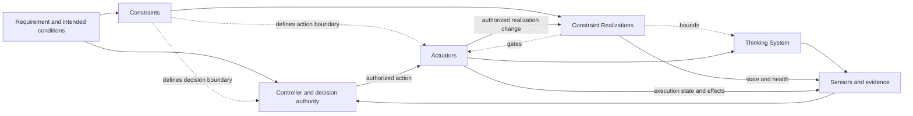

# Thinking System Review Template

## How to use

Use one living review for one bounded system, feature, or material change. Keep it through framing, implementation or bounded experiment, completion, release, and operation.

Link the applicable [`Project Control Architecture and Viability Review`](project-control-architecture-and-viability-review.md). Do not copy the complete project risk map, Project Constraint Architecture, organizational policies, or control economics.

Section 5 is the canonical **Constraint Realization Map**. Judgment Nodes, DoR, DoD, Release Gate, and runtime sections reference its IDs and active versions rather than repeating the same Constraint definition.

A separate Constraint Register is not required for the default SMB path. Link external records when they have an independent owner or lifecycle.

After a release or reassessment decision, preserve a versioned snapshot and the active project, model, prompt, policy, Constraint source, realization, permission, tool, configuration, and deployment versions where material.

---

## 1. Review identity

- **System, feature, or material change:**
- **Review identifier/version:**
- **Previous review:**
- **Status:** Draft / Ready / In implementation / In experiment / Done review / Release review / Operating / Reassessment
- **Date opened / last updated:**
- **Implementation responsibility:**
- **Constraint Realization responsibility:**
- **Evaluation responsibility:**
- **Operational responsibility:**
- **Release decision authority:**

### Linked versions and evidence

- **Project review/version/outcome:**
- **Requirement or feature record:**
- **Architecture/design record:**
- **Repository/revision:**
- **Model/version:**
- **Prompt/instruction version:**
- **Policy and Constraint source versions:**
- **Constraint Realization/configuration versions:**
- **Permissions, identity, tools, services:**
- **Deployment manifest:**
- **Evaluation/runtime evidence:**

---

## 2. Outcome, scope, and inherited project boundary

- **User or business outcome:**
- **Why Model Judgment is used:**
- **In scope / out of scope:**
- **Affected users/systems/parties:**
- **Lifecycle context:** Bounded experiment / Prototype / Limited deployment / Production change
- **Assumptions and known unknowns:**

### Inherited project baseline

Record by reference:

- **Authorized project boundary:**
- **Relevant inherited Constraint IDs/source versions:**
- **Required delivery realization/evidence expectations:**
- **Maximum autonomy and prohibited authority:**
- **Relevant project scenarios:**
- **Shared capabilities:**
- **Human Authority/capacity assumptions:**
- **Resource/control-cost boundaries:**
- **Conditions this delivery work must close:**
- **Project reauthorization triggers:**

If the proposed scope weakens or expands the project baseline, stop and request project reassessment.

### System boundary

- **Inputs and approved context:**
- **Outputs, decisions, paths, or actions:**
- **Upstream/downstream dependencies:**
- **External dependencies:**
- **Human decision/escalation dependencies:**

---

## 3. Mixed-system responsibilities

### Deterministic responsibilities

- **Rules, state transitions, and Invariants:**
- **Authentication, permissions, action authorization:**
- **Data, transaction, audit, and source-of-truth obligations:**
- **Interfaces, schemas, types, protocols:**

### Model-mediated responsibilities

- **Expected judgment:**
- **Useful and acceptable variation:**
- **Model-mediated decisions, paths, actions, or outputs:**
- **Unacceptable outcomes:**

### Control responsibilities

- **Sensors and evidence:**
- **Controller/decision authority:**
- **Actuators/corrective actions:**
- **Fallback, containment, compensation, rollback, shutdown:**
- **Decision/change traceability:**

---

## 4. Judgment Nodes

Repeat one compact card for each consequential Judgment Node.

### Judgment Node 1

- **Name and purpose:**
- **Placement:** Input Interpretation / Decision Logic / Output Mediation / Combination
- **Inputs and approved context:**
- **Allowed authority:**
- **Applicable Constraint IDs from section 5:**
- **Unacceptable outcomes:**
- **Evidence/control-health signals:**
- **Fallback, containment, or escalation:**
- **Operational owner:**
- **Local change authority:**
- **Delivery reassessment/project reauthorization trigger:**

Add optional detail only when consequence, authority, reversibility, or realization difficulty justifies it.

---

## 5. Requirement, Operating Envelope, and canonical Constraint Realization Map

### Approved Requirement

- **Intended outcome:**
- **Deterministic obligations:**
- **Model-mediated obligations:**
- **Authority boundaries:**
- **Evidence expectations:**
- **Required failure handling:**

### Operating Envelope

- **Operating conditions:**
- **Acceptable behavioral range:**
- **Prohibited outcomes/regions:**
- **Business tolerances:**
- **Resource envelope:**
- **Exposure/deployment limits:**
- **Human supervision:**
- **Assumptions:**

### Constraint Realization Map

| Constraint ID and source/version | Subject and delivery scope | Hard/soft | Realization and enforcement/influence point | Assumptions and claimed guarantee | Failure/bypass/conflict/unavailable behavior | Evidence/control health | Change/override authority and Actuator | Reassessment/reauthorization trigger |
|---|---|---|---|---|---|---|---|---|
| K-01 | | | | | | | | |
| K-02 | | | | | | | | |
| K-03 | | | | | | | | |

For each Hard Constraint, verify deterministic prevention or rejection within stated assumptions and scope. A prompt, probabilistic evaluator, classifier, or model policy is not hard by itself.

### Control-loop design

- **Feedback latency/review timing:**
- **Critical missing capability:**
- **Changes delivery may make without project reauthorization:**

---

## 6. Definition of Ready

Mark `[x]`, `[ ]`, or `N/A` and link evidence or explain the gap.

### Outcome and inherited boundary

- [ ] Outcome, scope, users, and system boundary are defined.
- [ ] Project review/version/outcome are linked.
- [ ] Relevant inherited Constraint IDs and conditions are linked.
- [ ] Scope remains inside inherited authority, population, data, domain, geography, deployment, tool, and consequence boundaries.

### Judgment and authority

- [ ] Consequential Judgment Nodes are identified.
- [ ] Model-mediated and deterministic responsibilities are separated.
- [ ] Permitted and prohibited authority are explicit.
- [ ] Human Authority is identified where required.

### Requirement and realization

- [ ] Requirement and Operating Envelope are sufficient for the next decision.
- [ ] Every material Constraint has one row in section 5.
- [ ] Hard/Soft claims are accurate.
- [ ] A credible realization or bounded research plan exists.
- [ ] Failure, bypass, conflict, unavailable, evidence, and change behavior are planned.

### Evidence, control, and feasibility

- [ ] Evaluation approach and limitations are understood.
- [ ] Required Sensors, Controller, Actuators, fallback, containment, compensation, rollback, or shutdown are identified.
- [ ] Shared capabilities and Human Authority capacity are available or conditioned.
- [ ] Expected cost, latency, and operational burden are acceptable for the next step.

### Readiness decision

- [ ] Ready for implementation
- [ ] Ready for bounded experiment
- [ ] Ready with conditions
- [ ] Needs clarification
- [ ] Project reauthorization required
- [ ] Control cost not justified
- [ ] AI path rejected

- **Decision date/authority:**
- **Conditions, limits, rationale:**

---

## 7. Implementation or bounded experiment

- **Selected path/scope:**
- **Users, data, environment, duration, exposure:**
- **Realization rows implemented/tested:**
- **Model, prompt, policy, permission, tool, realization, configuration versions:**
- **Stopping/escalation conditions:**
- **Evidence collected:**
- **Violations, bypass, false blocks, degradation, incidents:**
- **Requirement/Operating Envelope/realization refinements:**
- **Project assumptions confirmed, contradicted, reopened:**

---

## 8. Definition of Done

### Deterministic and realization evidence

- [ ] Applicable deterministic tests passed.
- [ ] Invariants, interfaces, permissions, state, transaction, and data obligations were verified.
- [ ] Each section 5 realization is implemented or explicitly retained as Soft.
- [ ] Hard realizations were tested against bypass and negative-authority scenarios.
- [ ] Material failure, conflict, degradation, and unavailable behavior were tested.
- [ ] Active source, realization, configuration, and version are traceable.

### Behavioral and evidence quality

- [ ] Required scenarios were evaluated.
- [ ] Unacceptable outcomes and relevant variation were assessed.
- [ ] Evidence/coverage limitations are recorded.
- [ ] Activation, violation, false-block, fallback, and control-health evidence is available where material.

### Control and operability

- [ ] Required Sensors are operational.
- [ ] Controller and decision authority are operational.
- [ ] Required Actuators are available.
- [ ] Fallback, containment, escalation, rollback, compensation, disable, or shutdown were verified where required.
- [ ] Operational ownership and Human Authority capacity are real.
- [ ] Evidence does not invalidate project assumptions, or project reassessment is recorded.

### Completion decision

- [ ] Complete
- [ ] Complete with limitations
- [ ] Insufficient evidence
- [ ] Constraints/controls incomplete
- [ ] Return to implementation/experiment
- [ ] Project reauthorization required

- **Decision date/responsibility:**
- **Evidence, limitations, gaps, rationale:**

---

## 9. Proposed deployment and Release Gate

### Proposed deployment

- **Environment/release version:**
- **Users, population, data, geography, duration:**
- **Usage, rate, resource, tool, action limits:**
- **Active Constraint IDs/realization versions from section 5:**
- **Human supervision/rollout:**
- **Confirmation scope remains inside project authorization:**

### Release evidence

- **Project authorization/inherited baseline:**
- **Requirement/Operating Envelope:**
- **DoD outcome:**
- **Active realization rows/versions:**
- **Behavioral, deterministic, authority, control, resource, and failure-handling evidence:**
- **Known limitations/residual risk:**

### Release decision

- [ ] Release
- [ ] Limited/phased/canary release
- [ ] Release with conditions
- [ ] Human-supervised release
- [ ] Block
- [ ] Return to experiment/implementation
- [ ] Project reauthorization required
- [ ] Roll back/escalate

- **Decision date/authority:**
- **Approved scope/realization versions:**
- **Conditions/rationale:**
- **Monitoring and corrective triggers:**
- **Local realization-change authority:**
- **Project reauthorization trigger:**

---

## 10. Operation and reassessment

### Runtime evidence

- **Active Constraint/realization versions:**
- **Behavior, outcome, realization-state, and Actuator-execution evidence:**
- **Violations, bypass, overrides, false blocks, fallback load, friction:**
- **Deviation Signals/incidents:**
- **Named Controller/available Actuators:**
- **Project assumptions monitored:**

### Reassessment triggers

- [ ] Model, prompt, policy, Constraint source, realization, permission, tool, or configuration changed materially.
- [ ] Authority, autonomy, data, population, geography, deployment, or consequence expanded.
- [ ] Violation, bypass, incident, confirmed Requirement violation, or material drift occurred.
- [ ] Realization, Sensor, Controller, Actuator, Human Authority, fallback, or shared capability degraded.
- [ ] False blocks, latency, review load, fallback load, or control cost became material.
- [ ] A Hard Constraint is proposed to be relaxed, replaced, or removed.
- [ ] Delivery evidence contradicts a project assumption.
- [ ] An organizational source or decision right changed.
- [ ] Other:

### Reassessment outcome

- [ ] Current decision remains valid
- [ ] Local realization restored/tightened within authority
- [ ] New evidence required
- [ ] Deployment narrowed
- [ ] Return to implementation/experiment
- [ ] Release conditions changed
- [ ] Project reauthorization required
- [ ] Organizational review required
- [ ] Rollback/containment/compensation/escalation/shutdown initiated

- **Date/authority:**
- **Evidence/rationale:**
- **Effect on project decision:**
- **Link to next version:**

---

## 11. Version history and final check

| Review version | Date | Trigger | Project review version | Material Constraint/realization change | Readiness | Completion | Release/reassessment | Authority | Snapshot/link |
|---|---|---|---|---|---|---|---|---|---|
| | | | | | | | | | |

- [ ] Project review/version are linked.
- [ ] Scope does not expand or weaken project authorization.
- [ ] Section 5 is the current canonical Constraint Realization Map.
- [ ] Hard claims match deterministic guarantees and assumptions.
- [ ] Requirement, Operating Envelope, Judgment Nodes, evidence, authority, and corrective paths are current.
- [ ] DoR, DoD, and Release Gate remain distinct.
- [ ] Active versions and evidence resolve.
- [ ] Residual risk and deployment scope are explicit.
- [ ] Local, project, and organizational triggers are documented.
