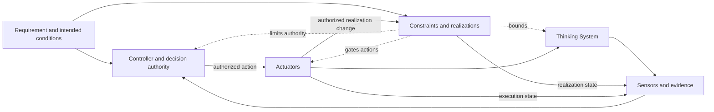

# Thinking System Review Template

## How to use this template

Use one living review for one bounded system, feature, or material change. Keep it through framing, implementation or bounded experiment, completion, release, and operation.

Link the applicable [`Project Control Architecture and Viability Review`](project-control-architecture-and-viability-review.md) version. Do not copy the complete project risk map, Constraint architecture, organizational policies, or control economics into this artifact.

This template uses one canonical **Constraint Realization Map** in section 5. DoR, DoD, Release Gate, and runtime sections reference that map instead of repeating the same Constraint definition.

A separate Constraint Register is not required for the default SMB path. Link external architecture, security, configuration, policy, or evidence records when they have a genuine independent owner or lifecycle.

After a release or reassessment decision:

1. preserve an immutable or versioned snapshot;
2. link the active project, delivery, model, prompt, policy, Constraint source, realization, permission, tool, and deployment versions where material;
3. create a new review version when a trigger occurs;
4. preserve the relationship to earlier decisions.

Mark an item `N/A` with a reason when it does not apply.

---

## 1. Review identity

- **System, feature, or material change:**
- **Review identifier and version:**
- **Previous review or decision:**
- **Status:** Draft / Ready / In implementation / In experiment / Done review / Release review / Operating / Reassessment
- **Date opened / last updated:**
- **Implementation responsibility:**
- **Constraint Realization responsibility:**
- **Evaluation responsibility:**
- **Operational responsibility:**
- **Release decision authority:**

### Linked versions and evidence

- **Project review identifier, version, and authorization outcome:**
- **Requirement or feature record:**
- **Architecture or design record:**
- **Repository and revision:**
- **Model and version:**
- **Prompt or instruction version:**
- **Policy and Constraint source versions:**
- **Constraint Realization and configuration versions:**
- **Permissions, identity, tools, and external services:**
- **Deployment or release manifest:**
- **Evaluation and runtime evidence:**

---

## 2. Outcome, scope, and inherited project boundary

- **User or business outcome:**
- **Why Model Judgment is used:**
- **In scope / out of scope:**
- **Affected users, systems, or parties:**
- **Lifecycle context:** Bounded experiment / Prototype / Limited deployment / Production change
- **Key assumptions and known unknowns:**

### Inherited project baseline

Record by reference, not by copying the project review.

- **Authorized project boundary:**
- **Relevant inherited Constraint IDs and source versions:**
- **Required delivery realizations or evidence expectations:**
- **Maximum autonomy and prohibited authority:**
- **Relevant project risk scenarios:**
- **Shared capabilities available:**
- **Human Authority and capacity assumptions:**
- **Resource and control-cost boundaries:**
- **Conditions this delivery work must close:**
- **Project reauthorization triggers:**

If the proposed scope weakens or expands the project baseline, stop and request project reassessment.

### System boundary

- **Inputs and approved context:**
- **Outputs, decisions, paths, or actions:**
- **Upstream and downstream dependencies:**
- **External dependencies:**
- **Human decision and escalation dependencies:**

---

## 3. Mixed-system responsibilities

### Deterministic responsibilities

- **Rules, state transitions, and Invariants:**
- **Authentication, permissions, and action authorization:**
- **Data, transaction, audit, and source-of-truth obligations:**
- **Interfaces, schemas, types, and protocols:**

### Model-mediated responsibilities

- **Expected judgment:**
- **Useful and acceptable variation:**
- **Model-mediated decisions, paths, actions, or outputs:**
- **Unacceptable outcomes:**

### Control responsibilities

- **Sensors and evidence:**
- **Controller and decision authority:**
- **Actuators and corrective actions:**
- **Fallback, containment, compensation, rollback, or shutdown:**
- **Decision and change traceability:**

---

## 4. Judgment Nodes

Repeat one compact card for each consequential Judgment Node.

### Judgment Node 1

- **Name and purpose:**
- **Placement:** Input Interpretation / Decision Logic / Output Mediation / Combination
- **Inputs and approved context:**
- **Allowed authority:**
- **Applicable Constraint IDs from section 5:**
- **Unacceptable outcomes:**
- **Evidence and control-health signals:**
- **Fallback, containment, or escalation:**
- **Operational owner:**
- **Local change authority:**
- **Delivery reassessment or project reauthorization trigger:**

Add optional detail only where consequence, authority, reversibility, or realization difficulty justifies it.

---

## 5. Requirement, Operating Envelope, and canonical Constraint Realization Map

### Approved Requirement

- **Intended outcome:**
- **Deterministic obligations:**
- **Model-mediated obligations:**
- **Authority boundaries:**
- **Evidence expectations:**
- **Required failure handling:**

### Operating Envelope

- **Intended operating conditions:**
- **Acceptable behavioral range:**
- **Prohibited outcomes or regions:**
- **Business tolerances:**
- **Resource envelope:**
- **Exposure and deployment limits:**
- **Human supervision requirements:**
- **Known assumptions:**

### Constraint Realization Map

This table is the canonical delivery record for material Constraints. Other sections reference its IDs and active versions.

| Constraint ID and source/version | Subject and delivery scope | Hard or soft | Realization and enforcement/influence point | Assumptions and claimed guarantee | Failure, bypass, conflict, or unavailable behavior | Evidence and control health | Change/override authority and Actuator | Reassessment or reauthorization trigger |
|---|---|---|---|---|---|---|---|---|
| K-01 | | | | | | | | |
| K-02 | | | | | | | | |
| K-03 | | | | | | | | |

For each Hard Constraint, verify that violation is deterministically prevented or rejected within the stated assumptions and scope. A prompt, probabilistic evaluator, or model policy is not hard by itself.

### Control-loop design

- **Feedback latency or review timing:**
- **Critical missing capability:**
- **Changes delivery may make without project reauthorization:**

---

## 6. Definition of Ready

For each item, mark `[x]`, `[ ]`, or `N/A` and link evidence or explain the gap.

### Outcome and inherited boundary

- [ ] Outcome, scope, users, and system boundary are defined.
- [ ] The project review version and authorization outcome are linked.
- [ ] Relevant inherited Constraint IDs and project conditions are linked.
- [ ] Proposed scope remains inside inherited authority, population, data, domain, geography, deployment, tool, and consequence boundaries.

### Judgment and authority

- [ ] Consequential Judgment Nodes are identified.
- [ ] Model-mediated and deterministic responsibilities are separated.
- [ ] Permitted and prohibited authority are explicit.
- [ ] Human Authority is identified where required.

### Requirement and Constraint Realization

- [ ] Requirement and Operating Envelope are defined sufficiently for the next decision.
- [ ] Every material Constraint has one row in section 5.
- [ ] Hard and soft claims are accurate.
- [ ] A credible realization or bounded research plan exists.
- [ ] Failure, bypass, conflict, unavailability, evidence, and change authority are planned.

### Evidence, control, and feasibility

- [ ] Evaluation approach and evidence limitations are understood.
- [ ] Required Sensors, Controller, Actuators, fallback, containment, rollback, compensation, or shutdown are identified.
- [ ] Shared capabilities and Human Authority capacity are available or explicitly conditioned.
- [ ] Expected realization and control cost, latency, and operational burden are acceptable for the next step.

### Readiness decision

- [ ] Ready for implementation
- [ ] Ready for bounded experiment
- [ ] Ready with conditions
- [ ] Needs clarification
- [ ] Project reauthorization required
- [ ] Control cost not justified
- [ ] AI path rejected

- **Decision date and authority:**
- **Conditions, limits, and rationale:**

---

## 7. Implementation or bounded experiment

- **Selected path and scope:**
- **Users, data, environment, duration, and exposure:**
- **Constraint Realization rows implemented or tested:**
- **Model, prompt, policy, permission, tool, realization, and configuration versions:**
- **Stopping or escalation conditions:**
- **Evidence collected:**
- **Violations, bypass attempts, false blocks, degradation, or incidents:**
- **Requirement, Operating Envelope, or realization refinements:**
- **Project assumptions confirmed, contradicted, or reopened:**

---

## 8. Definition of Done

### Deterministic and realization evidence

- [ ] Applicable deterministic tests passed.
- [ ] Invariants, interfaces, permissions, state, transaction, and data obligations were verified.
- [ ] Each section 5 realization is implemented or explicitly retained as soft.
- [ ] Hard realizations were tested against bypass and negative-authority scenarios.
- [ ] Material failure, conflict, degradation, and unavailable behavior were tested.
- [ ] Active source, realization, configuration, and version are traceable.

### Behavioral and evidence quality

- [ ] Required scenarios were evaluated.
- [ ] Unacceptable outcomes and relevant variation were assessed.
- [ ] Known evidence and coverage limitations are recorded.
- [ ] Constraint activation, violation, control-health, false-block, and fallback evidence is available where material.

### Control and operability

- [ ] Required Sensors are operational.
- [ ] Controller and decision authority are operational.
- [ ] Required Actuators and corrective paths are available.
- [ ] Fallback, containment, escalation, rollback, compensation, disable, or shutdown were verified where required.
- [ ] Operational ownership and Human Authority capacity are real.
- [ ] Evidence does not invalidate project cost, capacity, realization-feasibility, or authorization assumptions, or project reassessment is recorded.

### Completion decision

- [ ] Complete
- [ ] Complete with recorded limitations
- [ ] Insufficient evidence
- [ ] Constraints or controls incomplete
- [ ] Return to implementation or experiment
- [ ] Project reauthorization required

- **Decision date and responsibility:**
- **Evidence, limitations, gaps, and rationale:**

---

## 9. Proposed deployment and Release Gate

### Proposed deployment

- **Environment and release version:**
- **Users, population, data, geography, and duration:**
- **Usage, rate, resource, tool, and action limits:**
- **Active Constraint IDs and realization versions from section 5:**
- **Human supervision and rollout approach:**
- **Confirmation that scope remains inside project authorization:**

### Release evidence

- **Project authorization and inherited baseline:**
- **Requirement and Operating Envelope:**
- **DoD outcome:**
- **Active section 5 realization rows and versions:**
- **Behavioral, deterministic, authority, control, resource, and failure-handling evidence:**
- **Known limitations and residual risk:**

### Release decision

- [ ] Release
- [ ] Limited, phased, or canary release
- [ ] Release with conditions
- [ ] Human-supervised release
- [ ] Block
- [ ] Return to experiment or implementation
- [ ] Project reauthorization required
- [ ] Roll back or escalate

- **Decision date and authority:**
- **Approved scope and active realization versions:**
- **Conditions and rationale:**
- **Monitoring, rollback, containment, compensation, or shutdown triggers:**
- **Local realization-change authority:**
- **Project reauthorization trigger:**

---

## 10. Operation and reassessment

### Runtime evidence

- **Active Constraint and realization versions:**
- **Behavior, outcome, realization-state, and Actuator-execution evidence:**
- **Violations, bypass attempts, overrides, false blocks, fallback load, and friction:**
- **Deviation Signals and incidents:**
- **Named Controller and available Actuators:**
- **Project assumptions monitored:**

### Reassessment triggers

- [ ] Model, prompt, policy, Constraint source, realization, permission, tool, or configuration changed materially.
- [ ] Authority, autonomy, data, population, geography, deployment, or consequence scope expanded.
- [ ] A violation, bypass, incident, confirmed Requirement violation, or material drift occurred.
- [ ] Realization, Sensor, Controller, Actuator, Human Authority, fallback, or shared capability degraded.
- [ ] False blocks, latency, review load, fallback load, or control cost became material.
- [ ] A Hard Constraint is proposed to be relaxed, replaced, or removed.
- [ ] Delivery evidence contradicts a project risk, authority, realization-feasibility, capacity, evidence, or economic assumption.
- [ ] An organizational source or decision right changed.
- [ ] Other:

### Reassessment outcome

- [ ] Current decision remains valid
- [ ] Local realization restored or tightened within delegated authority
- [ ] New evidence required
- [ ] Deployment narrowed
- [ ] Return to implementation or experiment
- [ ] Release conditions changed
- [ ] Project reauthorization required
- [ ] Organizational review required
- [ ] Rollback, containment, compensation, escalation, or shutdown initiated

- **Date and authority:**
- **Evidence and rationale:**
- **Effect on linked project decision:**
- **Link to next review version:**

---

## 11. Version and decision history

| Review version | Date | Trigger | Project review version | Material Constraint or realization change | Readiness outcome | Completion outcome | Release or reassessment decision | Authority | Snapshot or link |
|---|---|---|---|---|---|---|---|---|---|
| | | | | | | | | | |

## Final snapshot check

- [ ] Project review and authorization version are linked.
- [ ] Scope does not silently expand or weaken the project boundary.
- [ ] Section 5 is the canonical delivery Constraint Realization Map and is current.
- [ ] Hard Constraint claims match deterministic guarantees and stated assumptions.
- [ ] Requirement, Operating Envelope, Judgment Nodes, evidence, authority, and corrective paths are current.
- [ ] DoR, DoD, and Release Gate remain distinct decisions.
- [ ] Active versions and evidence resolve.
- [ ] Residual risk and deployment scope are explicit.
- [ ] Local, project, and organizational reassessment triggers are documented.
