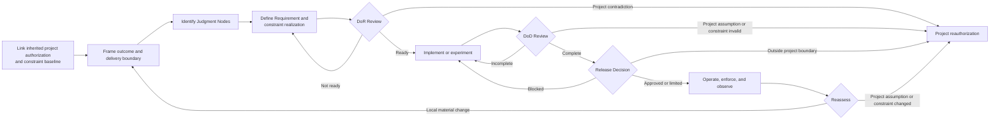
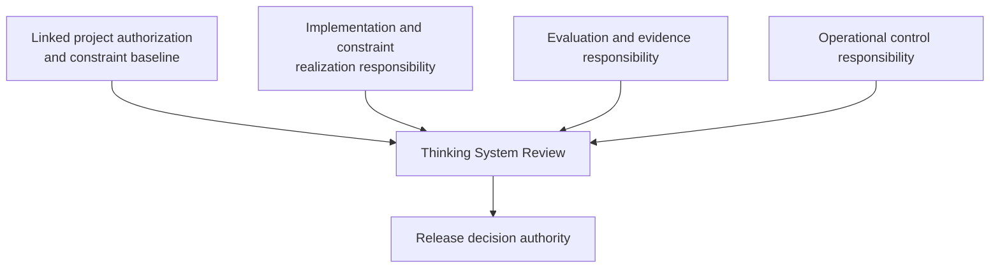

# Thinking System Review

## Status

This document is **draft normative**. It defines a lightweight socio-technical pattern for framing, implementing, evaluating, releasing, and reassessing consequential model-mediated work through one delivery-level review flow and one living practical artifact.

The pattern is designed for small and medium-sized engineering teams. It does not require a governance department, a new organizational structure, a separate Constraint Register, or a separate record for every review decision.

“Delivery level” describes the decision surface, not the size of the work item. The review may cover a bounded whole system, feature, or material change.

## 1. Context

A Thinking System combines deterministic responsibilities, Model Judgment, constraints, evidence, decision authority, and corrective mechanisms. Conventional engineering practices remain necessary, but they do not by themselves make the following explicit:

- where probabilistic judgment affects behavior;
- which variation is acceptable and which outcomes are prohibited;
- what authority a Judgment Node possesses;
- which organizational and project constraints apply;
- where those constraints are realized and how they fail;
- what evidence is needed before completion and release;
- how cost, latency, tool use, population, or other material resources are bounded;
- what happens when behavior cannot be accepted or constraint enforcement is unavailable;
- who owns operation, constraint change, and release authorization.

The presentation *Designing Non-Deterministic Systems: Maintaining Engineering Rigor in the AI Era* motivates this shift. Slides 1–6 establish the delivery-contract implications of runtime variance, Requirements, evidence, readiness, completion, and release. Slide 12 proposes a four-layer control stack of Actuators, Constraints, Sensors, and Controller. UA translates that presentation shorthand into the tool-neutral [`Control-Loop Capability Anatomy`](../00-doctrine/control-loop-anatomy.md): Constraints bound the operating space, Sensors produce evidence, Controllers interpret and authorize, and Actuators execute corrective change. The presentation's named tools remain examples rather than normative classifications.

A delivery review may exist inside a broader authorized Thinking System project. In that case, it should inherit the applicable project authorization and constraint baseline from the [`Project Control Architecture and Viability Review`](project-control-architecture-and-viability-review.md) rather than rediscover or duplicate the complete project risk, constraint, control-capacity, and economic decision for every change.

## 2. Problem

Teams often add an LLM or agent to an existing delivery process without changing the review contract. The feature may pass deterministic tests while important model-mediated and constraint responsibilities remain implicit.

This creates recurring gaps:

- the Requirement describes desired functionality but not acceptable behavioral variation;
- Judgment Nodes are not mapped to authority and constraints;
- soft prompts or policies are presented as hard guarantees;
- inherited constraints are copied as prose without concrete realization, failure behavior, or ownership;
- evaluation is performed without a clear claim or decision context;
- completion is confused with release authorization;
- residual risk is accepted informally or not recorded;
- runtime evidence has no named Controller or corrective path;
- project-level constraints are ignored, duplicated, or weakened inconsistently across feature records;
- one release silently expands authority, population, data, tools, deployment, or consequence beyond the project authorization;
- small teams respond by either under-governing the system or creating too many disconnected governance artifacts.

## 3. Pattern

> **Use one living Thinking System Review to connect the inherited project authorization and constraint baseline, local Requirement, Judgment Node boundaries, concrete constraint realization, readiness decision, implementation or experiment, completion evidence, release decision, and reassessment triggers.**

The pattern extends an organization's existing engineering process. It does not replace conventional requirements, architecture review, security review, testing, change management, or incident response.

The practical implementation of this pattern is the [`Thinking System Review Template`](thinking-system-review-template.md). The template remains one document throughout the change lifecycle. After a release decision, the team preserves a versioned or immutable snapshot and creates a new version when a material reassessment is required.

## 4. Canonical boundary and project inheritance

This pattern owns:

- implementation-level Judgment Nodes;
- the Requirement and Operating Envelope for the bounded delivery scope;
- local interpretation of inherited constraints;
- concrete constraint realization, configuration, enforcement point, failure behavior, evidence, and local change authority;
- the model-mediated Definition of Ready;
- implementation or bounded experimentation;
- the model-mediated Definition of Done;
- the deployment-specific Release Gate;
- local runtime reassessment.

The [`Project Control Architecture and Viability Review`](project-control-architecture-and-viability-review.md) owns:

- project-level material risk scenarios;
- intended project Judgment, autonomy, and authority;
- organizational constraint interpretation and project-specific constraint architecture;
- required shared and project-specific Constraints, Sensors, Controllers, Actuators, Human Authority, and corrective paths;
- evidence feasibility and feedback latency;
- Human Authority and operational capacity;
- control economics and project viability;
- project authorization and reauthorization;
- the versioned baseline inherited by delivery reviews.

When a project review exists, the Thinking System Review should link its identifier, version, authorization outcome, and inheritance package. It may refine local detail but MUST NOT silently:

- expand authorized authority or autonomy;
- add a population, domain, geography, language, product, deployment mode, data class, or tool outside the project boundary;
- weaken inherited hard constraints, deterministic invariants, or prohibited authority;
- change an authoritative constraint source, exception authority, or project-level meaning;
- remove a required shared control or Human Authority path;
- accept a project-level risk, constraint-feasibility, capacity, evidence, or economic assumption contradicted by delivery evidence.

A contradiction should trigger project reassessment rather than local normalization.

## 5. Lightweight review flow

The flow is iterative rather than a mandatory linear pipeline. A bounded experiment may refine the Requirement, Operating Envelope, Judgment Node boundary, constraint realization, evidence strategy, or control design before implementation proceeds.

A project baseline may be `N/A` only when the review is itself the first bounded investigation and project-level authorization has not yet been established. The review should then state that limitation and must not present its release decision as broader project authorization.

## 6. Step 1 — Link the inherited project baseline and frame the delivery boundary

Record:

- the applicable Project Control Architecture and Viability Review identifier, version, and authorization outcome;
- the authorized project scope;
- the intended business outcome;
- applicable organizational constraint sources;
- inherited project constraint identifiers, classes, scope, and strength;
- required delivery realization and enforcement expectations;
- constraint failure, fallback, containment, and degraded-mode expectations;
- constraint change, override, exception, and project reauthorization authority;
- authorized Model Judgment and maximum autonomy;
- prohibited authority and hard invariants;
- material project risk scenarios relevant to the delivery scope;
- shared controls and project-specific controls required;
- evidence, constraint-health, and feedback expectations;
- Human Authority and operational-capacity assumptions;
- control-cost and resource boundaries;
- project-level release constraints;
- project reauthorization triggers;
- conditions the delivery work must close;
- the bounded system, feature, or change under review;
- in-scope and out-of-scope behavior;
- deterministic responsibilities;
- model-mediated responsibilities;
- boundary and control responsibilities;
- whether the work is an experiment, prototype, limited deployment, or production change.

The review should describe the system-level responsibility rather than treating the model call as the whole system.

Link the project baseline by version. Do not copy the complete project risk map, control economics, organizational policy, or full constraint architecture into every delivery review. Record the inherited references and the concrete local realization.

## 7. Step 2 — Identify consequential Judgment Nodes

Use the [`Model Judgment Placement`](../00-doctrine/model-judgment-placement.md) taxonomy and the [`Judgment Node Boundary`](judgment-node-boundary.md) pattern.

For each consequential Judgment Node, record at least:

- purpose;
- placement;
- inputs and approved context;
- allowed authority;
- applicable constraints and source;
- hard constraints and realization;
- unacceptable outcomes;
- evidence, telemetry, and constraint health;
- fallback, containment, or escalation;
- operational owner;
- change or override authority.

A small team may embed several compact Judgment Node cards in the same review. A separate registry is not required.

Implementation-level authority and constraints should remain inside the inherited project baseline. A proposed node that changes the project Judgment, authority, population, data, tool, deployment, consequence, or hard-constraint landscape may require project reauthorization before implementation proceeds.

## 8. Step 3 — Define the Requirement, Operating Envelope, and control-loop realization

The approved Requirement should distinguish:

- intended outcomes;
- deterministic obligations and invariants;
- model-mediated obligations and acceptable variation;
- authority boundaries;
- applicable inherited and local constraints;
- prohibited outcomes or regions;
- relevant operating conditions;
- material resource constraints;
- evidence expectations;
- required failure handling.

The Operating Envelope is one part of the Requirement. It should be derived from context and consequence rather than copied from a generic benchmark or presentation example.

### 8.1 Constraints

For each material inherited or local constraint, identify:

- source and identifier;
- subject and scope;
- hard or soft strength;
- local interpretation;
- realization and enforcement point;
- configuration or version;
- failure, bypass, conflict, and unavailability behavior;
- evidence and control-health signals;
- local change or override authority;
- delivery reassessment and project reauthorization triggers.

A soft prompt or policy must not be represented as a hard guarantee. A hard inherited constraint must not be weakened through local implementation convenience.

### 8.2 Sensors and evidence

Identify evidence about:

- model-mediated behavior and downstream outcomes;
- deterministic obligations;
- constraint activation, violations, bypass attempts, overrides, degradation, and false blocks;
- cost, latency, capacity, resource use, and fallback load;
- Human Authority volume, response time, and decisions;
- dependency, model, prompt, policy, context, permission, data, and tool changes.

### 8.3 Controller and decision authority

Identify:

- who or what interprets the evidence;
- the local decisions owned by software or people;
- which constraint changes are permitted locally;
- which decisions require delivery release authority;
- which changes require project reauthorization or organizational review;
- expected response latency and escalation path.

### 8.4 Actuators and corrective action

Identify real mechanisms capable of:

- changing prompts, models, policies, context, routing, permissions, tools, or configuration;
- tightening or restoring a constraint within delegated authority;
- narrowing deployment, authority, population, data, or exposure;
- switching to fallback or degraded mode;
- containing, rolling back, disabling, compensating, or shutting down.

The local Requirement may narrow the project boundary. It must not weaken inherited constraints or authorize project-level scope expansion.

## 9. Step 4 — Definition of Ready

UA does not replace an organization's existing Definition of Ready. The conditions below are an extension for work in which consequential behavior depends on Model Judgment.

Work is Ready when the applicable items are sufficiently explicit for implementation or a bounded experiment.

### 9.1 Outcome, scope, and project inheritance

- the intended user or business outcome is defined;
- the system boundary is defined;
- in-scope and out-of-scope behavior is identified;
- experiment, prototype, limited deployment, and production Requirement are distinguished where relevant;
- the applicable project review version and authorization outcome are linked, or the reason no project baseline exists is explicit;
- inherited constraint sources, identifiers, and project conditions are linked;
- the proposed delivery scope remains inside inherited authority, population, domain, data, geography, deployment, tool, and consequence boundaries;
- project conditions this change must close are identified.

### 9.2 Judgment placement

- consequential Judgment Nodes are identified;
- each node's placement class is recorded;
- affected decisions, actions, paths, or outputs are identified;
- model-mediated responsibilities are separated from deterministic responsibilities.

### 9.3 Authority

- permitted authority is defined;
- prohibited decisions and actions are defined;
- Human Authority or approval points are identified where required;
- the deterministic execution boundary is defined;
- authority remains inside the inherited project baseline;
- local constraint-change and override authority is explicit.

### 9.4 Requirements and Operating Envelope

- deterministic invariants are identified;
- applicable inherited and local constraints are represented in the Requirement;
- acceptable behavioral variation is described;
- unacceptable outcomes are described;
- material tolerances or thresholds are defined where feasible and justified;
- the resource and deployment envelope is defined where material;
- required failure handling is specified;
- the local Requirement does not weaken the project baseline.

### 9.5 Constraint realization

- each material constraint has an identified enforcement or influence mechanism;
- hard and soft claims are distinguished;
- configuration and versioning expectations are defined;
- failure, bypass, conflict, and unavailability behavior are defined;
- evidence of activation, violations, degradation, and false blocks is planned;
- change, override, and exception authority is explicit;
- missing realization is closed, conditioned, or routed to bounded research.

### 9.6 Evidence strategy

- relevant scenarios are identified;
- consequential and adversarial scenarios are included where appropriate;
- the evaluation approach is defined;
- evidence sources and limitations are understood;
- constraint-health and enforcement evidence are included;
- success and failure criteria are defined;
- known unknowns are recorded;
- applicable project-level evidence and feedback expectations are addressed.

### 9.7 Control strategy

- necessary Constraints, Sensors, Controllers, and Actuators are identified;
- fallback, containment, compensation, or escalation is defined;
- observability expectations are defined;
- rollback or shutdown feasibility is considered;
- required shared and project-specific controls are available or explicitly conditioned.

### 9.8 Ownership

- implementation responsibility is assigned;
- constraint realization and configuration responsibility is assigned;
- evaluation responsibility is assigned;
- operational responsibility is assigned;
- release decision authority is explicit;
- project reauthorization authority is known when a trigger occurs.

### 9.9 Feasibility

- expected constraint and control cost and latency are understood sufficiently for the decision;
- required data, environments, and tools are available;
- legal, security, privacy, and compliance dependencies are identified;
- unresolved risks are closed or explicitly accepted for a bounded experiment;
- the change remains inside inherited control-cost, capacity, resource, and constraint-feasibility assumptions.

### 9.10 Readiness outcomes

The review records one outcome:

- **Ready for implementation**;
- **Ready for bounded experiment**;
- **Ready with explicit conditions**;
- **Needs clarification**;
- **Project reauthorization required**;
- **Control cost not justified**;
- **AI path rejected**.

`Ready for bounded experiment` does not authorize production use. The experiment must have explicit scope, authority, constraints, data, exposure, resource limits, and stopping conditions.

A delivery-level `Control cost not justified` outcome may reflect a local implementation path. When evidence invalidates the complete project constraint architecture or economics, project reauthorization is required.

## 10. Step 5 — Implement or run a bounded experiment

Implementation follows the approved Requirement, inherited project baseline, Judgment Node boundaries, and constraint realization design.

A bounded experiment is appropriate when the final Operating Envelope, constraint realization, evidence strategy, or technical feasibility cannot yet be established. It should:

- distinguish hypotheses from approved production obligations;
- limit users, data, authority, tools, duration, deployment, and resource exposure;
- identify provisional hard and soft constraints;
- define what evidence will refine the Requirement and constraint architecture;
- define stopping, containment, and escalation conditions;
- preserve model, prompt, policy, constraint, tool, permission, configuration, dataset, and deployment traceability where material;
- record which project assumptions and constraints were confirmed, contradicted, or reopened.

Evidence from experimentation informs the next decision. It does not automatically become a production Requirement, project authorization, or release authorization.

## 11. Step 6 — Definition of Done

UA does not replace an organization's existing Definition of Done. The conditions below extend completion for consequential model-mediated work.

DoD establishes whether implementation, evidence, constraint realization, operability, and recovery support are sufficiently complete. It does not accept residual risk or authorize release.

### 11.1 Deterministic implementation evidence

- applicable unit tests passed;
- applicable integration tests passed;
- interface, schema, type, grammar, and state contracts were verified;
- deterministic invariants were tested;
- authentication, authorization, data, transaction, and permission controls were tested;
- applicable security, privacy, and compliance checks were completed.

### 11.2 Constraint realization evidence

- inherited and local constraints are implemented or explicitly identified as soft;
- active source, configuration, and version are traceable;
- hard constraints are enforced at the intended points;
- bypass and negative-authority scenarios were tested;
- fail-open, fail-closed, degraded, conflict, and unavailability behavior were tested where material;
- constraint violation, override, control-health, false-block, and fallback evidence is available;
- change and override authority is technically and procedurally bounded;
- implemented constraints do not silently weaken the project baseline.

### 11.3 Behavioral evaluation evidence

- the required scenario set was executed;
- expected behavior was assessed;
- unacceptable outcomes were tested;
- Operating Envelope evidence was collected;
- variability across relevant runs was assessed where material;
- regressions against the accepted baseline were checked;
- material model, prompt, policy, constraint, tool, and configuration versions were recorded.

### 11.4 Evidence quality

- evaluation datasets and scenarios are documented;
- known evidence limitations are recorded;
- unsupported extrapolations are avoided;
- confidence is proportional to the evidence;
- material evidence and constraint-coverage gaps are explicitly listed.

### 11.5 Authority and boundary evidence

- authority limits were tested;
- prohibited actions were blocked;
- tool-use and action constraints were tested where applicable;
- deterministic validation around Judgment Nodes was verified;
- Human Authority or approval points were tested where applicable;
- local Controllers cannot relax higher-level boundaries outside delegated authority;
- implemented authority remains inside the authorized project boundary.

### 11.6 Resource evidence

- token, inference, compute, constraint-service, or policy-engine use was assessed where material;
- latency was assessed;
- concurrency or rate behavior was assessed where material;
- tool and external-service cost was assessed;
- resource limits and failure behavior were tested;
- false blocks, fallback load, and operational friction were assessed;
- project-level control-cost and capacity assumptions remain credible, or project reassessment is recorded.

### 11.7 Operational capabilities

- required Sensors are operational;
- constraint activation and control-health evidence is available;
- the Controller and decision authority are operational;
- required Actuators and corrective paths are available;
- alerts or review triggers are defined;
- drift and dependency-change indicators are available where needed;
- logs and traceability are sufficient for diagnosis and decision reconstruction.

### 11.8 Failure handling

- fallback was tested;
- containment was tested;
- the escalation path was verified;
- rollback, compensation, disable, or shutdown mechanisms were tested where applicable;
- degraded mode is understood;
- partial-failure and unavailable-constraint behavior were assessed;
- project reauthorization and organizational escalation paths are known where applicable.

### 11.9 Operability and ownership

- operational responsibility is assigned;
- constraint and configuration ownership is assigned;
- support and incident expectations are defined;
- reassessment triggers are documented;
- material residual risks are recorded;
- relevant operational documentation is complete;
- Human Authority, fallback capacity, and constraint operation remain consistent with project assumptions.

### 11.10 Completion outcomes

The review records one outcome:

- **Complete**;
- **Complete with recorded limitations**;
- **Insufficient evidence**;
- **Constraints or controls incomplete**;
- **Return to implementation**;
- **Return to bounded experiment**;
- **Project reauthorization required**.

A completion outcome is bounded by the stated Requirement, inherited constraint baseline, evidence scope, system version, intended deployment context, and project authorization.

## 12. Step 7 — Release Gate

The Release Gate is separate from DoD.

> **DoD asks whether implementation, constraint realization, and required evidence are sufficiently complete.**

> **The Release Gate asks whether the available evidence and residual risk are acceptable for a specific deployment context.**

The Release Gate does not authorize project-level scope expansion or relaxation of inherited hard constraints.

### 12.1 Release inputs

The release decision reviews applicable:

- linked project authorization and constraint baseline;
- approved Requirement and Operating Envelope;
- active constraint realization, source, configuration, and version;
- constraint failure, degraded-mode, and override behavior;
- DoD outcome;
- deterministic test evidence;
- behavioral evaluation evidence;
- authority and boundary evidence;
- resource evidence;
- known limitations and evidence gaps;
- operational Sensors, Controller, Actuators, and failure handling;
- residual-risk statement;
- proposed deployment scope.

### 12.2 Release outcomes

Record one outcome:

- **Release**;
- **Limited release**;
- **Phased or canary release**;
- **Release with conditions**;
- **Human-supervised release**;
- **Block**;
- **Return to experimentation**;
- **Project reauthorization required**;
- **Roll back**;
- **Escalate**.

A release decision should record scope, active constraints, rationale, conditions, monitoring and reassessment triggers, and the authority making the decision. Release pressure must not silently weaken the Requirement, relax inherited constraints, redefine accepted tolerances, or expand the project boundary.

## 13. Step 8 — Operate, enforce, observe, and reassess

The same review is reassessed after a material change or new evidence, including:

- model or material model-configuration change;
- prompt, policy, constraint, or enforcement-configuration change;
- authority or autonomy change;
- new tool or state-changing action;
- significant data or context-source change;
- incident, constraint violation, bypass, or confirmed Requirement violation;
- material drift, evidence degradation, constraint degradation, or excessive false blocks;
- expansion of deployment scope, population, domain, geography, language, product, deployment mode, or data class;
- material change in resource use, latency, review volume, fallback load, control cost, or external dependency;
- loss or degradation of a required Constraint, Sensor, Controller, Actuator, Human Authority, or fallback capacity;
- new legal, security, privacy, compliance, contractual, financial, procurement, or business constraint;
- delivery evidence contradicting a project-level risk, authority, constraint-feasibility, capacity, evidence, or economic assumption;
- repeated local exceptions collectively changing the project boundary.

Reassessment may:

- confirm the current delivery decision;
- restore or tighten a local constraint within delegated authority;
- narrow operation;
- require new local evidence;
- return the work to implementation or experimentation;
- change release conditions;
- trigger rollback, containment, compensation, escalation, or shutdown;
- require project reauthorization;
- require organizational review.

The response level follows the assumption, constraint, capability, or authority boundary that changed. Do not escalate every local defect to the project level. Do not keep project-invalidating evidence inside one local review.

## 14. Responsibility bundles

The pattern uses four responsibility bundles, not mandatory job titles.

| Responsibility bundle | Required responsibility |
|---|---|
| **Implementation** | Build or configure the system and constraint realization in accordance with the approved Requirement and inherited project baseline. |
| **Evaluation** | Define and assess behavioral, deterministic, constraint-health, and operational evidence needed to support readiness, completion, release, and reassessment claims. |
| **Operation** | Maintain constraint enforcement, Sensors, evidence, fallback, and corrective paths; respond to Deviation Signals and incidents. |
| **Release decision authority** | Accept, limit, condition, escalate, reject, reverse, or require reauthorization for release in the stated deployment context. |

In a small team, one person may hold several bundles. Consequential release authorization should nevertheless remain explicit, and the decision-maker must have adequate evidence, competence, time, and authority.

The project authorization authority may be the same person or a different person. Delivery release authority cannot silently change project authorization or organizational constraints.

## 15. One practical artifact

The [`Thinking System Review Template`](thinking-system-review-template.md) is the default working artifact for this pattern. It combines:

- project review version and inherited authorization and constraint baseline;
- system, feature, or change framing;
- mixed-system responsibilities;
- Judgment Node cards;
- Requirement and Operating Envelope;
- local constraint realization and versioning;
- DoR;
- implementation or experiment notes;
- DoD;
- residual risk;
- deployment scope and active constraints;
- release decision;
- local, project, and organizational reassessment triggers;
- version and decision history.

The pattern does not require separate readiness records, Constraint Registers, completion packages, responsibility matrices, governance-board protocols, Judgment Node registries, or Release Decision Records.

The project review remains a separate living artifact because it has a different decision owner and lifecycle. Delivery reviews link its version and inheritance package instead of copying it.

After a release decision:

1. preserve an immutable or versioned snapshot of the completed review;
2. link the project decision, deployed constraint, model, prompt, policy, tool, permission, configuration, and relevant evidence versions;
3. create a new delivery review version when a local reassessment trigger occurs;
4. request project reauthorization when evidence invalidates the project baseline;
5. preserve the relationship to prior project and delivery decisions rather than overwriting history.

## 16. Proportional application

The complete checklists define the available review surface. Not every item requires the same depth for every system.

Application should be proportional to:

- authority;
- downstream consequences;
- autonomy;
- reversibility;
- exposure and deployment scope;
- constraint strength and enforcement difficulty;
- evidence uncertainty;
- legal, security, privacy, and compliance context;
- resource and operating cost;
- failure propagation.

Mark non-applicable items explicitly rather than silently omitting them. Do not invent universal constraints, thresholds, sample sizes, review cadences, or role titles.

The review may be unnecessary for a model use that cannot materially influence system behavior and remains fully contained within an ordinary deterministic workflow. When in doubt, first map the Judgment Node, authority, and applicable constraints; the answer should follow from the actual boundary, not from whether the feature is marketed as an agent.

## 17. Source interpretation: presentation slides 1–6 and 12

This pattern deliberately translates, rather than copies, the source presentation:

- **Slides 1–3** establish that model-mediated runtime behavior has non-zero variance and requires engineered boundaries, sensing, feedback, and correction.
- **Slide 4** reframes defects around business tolerances. UA narrows this into the system-level definition of a Bug as a violation of an approved Requirement; an individual tail event remains evidence until diagnosed.
- **Slide 5** presents the Requirement as an engineered space of possibilities. UA represents this through the complete Requirement and its Operating Envelope.
- **Slide 6** argues that readiness, cost, completion, and release must change together. UA preserves those concerns while treating risk representation, sample size, metrics, and confidence methods as context-derived rather than universal.
- **Slide 12** presents Actuators, Constraints, Sensors, and Controller as a four-layer control stack. UA adopts the four capability functions while rejecting a mandatory physical stack or literal product mapping. Prompt registries, semantic monitors, schemas, HITL gateways, kill switches, APIs, and orchestration frameworks are classified by the functions, guarantees, evidence, and decision rights they provide in a specific control loop.

The presentation remains source evidence. This pattern and the owning doctrine and AI Control Plane documents are the explicit draft-normative framework decisions for delivery-level work.

## 18. Consequences and limitations

Applying the pattern:

- provides one visible path from inherited project authorization and constraints to runtime reassessment;
- keeps full DoR and DoD coverage without multiplying operational documents;
- separates project authorization, constraint realization, completion, and residual-risk release acceptance;
- exposes missing constraints, soft guarantees represented as hard, authority, evidence, ownership, corrective paths, or project contradictions;
- makes bounded experimentation a deliberate engineering decision;
- supports traceability across project, constraint, model, prompt, policy, permission, tool, configuration, and deployment changes;
- prevents one release from silently expanding or weakening the project boundary.

The pattern also creates review effort. A completed checklist does not guarantee sound judgment, adequate evidence, effective constraints, or a functioning loop. The pattern does not replace project viability review, domain expertise, engineering tests, security and compliance work, or substantive Human Authority.

## 19. Related UA concepts

- [`Project Control Architecture and Viability Review`](project-control-architecture-and-viability-review.md) defines project-level risk, constraint architecture, required capabilities, evidence and capacity feasibility, economics, authorization, inheritance, and reauthorization.
- [`Control-Loop Capability Anatomy`](../00-doctrine/control-loop-anatomy.md) defines Constraints, Sensors, Controllers, and Actuators.
- [`Nested Control Lifecycle`](../00-doctrine/nested-control-lifecycle.md) defines constraint inheritance, delivery realization, runtime evidence, and reauthorization.
- [`Requirements, Correctness, and Bugs`](../00-doctrine/requirements-correctness-and-bugs.md) defines the approved operating contract and diagnostic model.
- [`Model Judgment Placement`](../00-doctrine/model-judgment-placement.md) defines where Model Judgment may function in a system.
- [`Judgment Node Boundary`](judgment-node-boundary.md) defines the compact constrained boundary used inside the review.
- [`Constraint Capabilities`](../02-ai-control-plane/01-constraints/) defines constraint classes, realization, evidence, failure behavior, and authority.
- [`AI Control Plane`](../02-ai-control-plane/) defines the distributed capabilities used to bound, observe, decide, and correct behavior.
- [`Thinking System Review Template`](thinking-system-review-template.md) is the practical working representation of this pattern.
