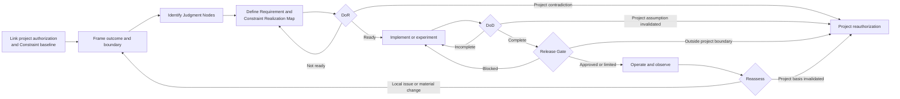

# Thinking System Review

## Status

This document is **draft normative**. It defines a lightweight delivery-level pattern for framing, implementing, evaluating, releasing, and reassessing consequential model-mediated work through one living review artifact.

The pattern is designed for small and medium-sized engineering teams. It does not require a governance department, a separate Constraint Register, a separate Judgment Node registry, or a separate record for every phase decision.

“Delivery level” describes the decision surface, not the size of the work item. The review may cover a bounded whole system, feature, or material change.

## 1. Context

A Thinking System combines deterministic responsibilities, Model Judgment, Constraints, evidence, decision authority, and corrective mechanisms.

Conventional engineering practices remain necessary, but they do not automatically make explicit:

- where probabilistic judgment affects behavior;
- what authority it possesses;
- which project Constraints apply;
- how those Constraints are realized and evidenced;
- what variation is acceptable and which outcomes are prohibited;
- what evidence supports readiness, completion, and release;
- who decides and which Actuators can change operation;
- what happens when realization, evidence, Human Authority, fallback, or economics become inadequate.

The presentation *Designing Non-Deterministic Systems* motivates a four-part teaching model. UA translates it through the [`Control-Loop Capability Anatomy`](../00-doctrine/control-loop-anatomy.md): Constraints define approved boundaries, Sensors produce evidence, Controllers select or authorize action, and Actuators execute change. These are functions, not mandatory physical layers or product categories.

## 2. Problem

Teams often add an LLM or agent without changing the delivery contract. The feature may pass deterministic tests while material responsibilities remain implicit.

Recurring gaps include:

- the Requirement omits acceptable variation, prohibited outcomes, authority, or failure handling;
- Judgment Nodes are not mapped to authority and Constraints;
- prompts or probabilistic evaluators are presented as hard guarantees;
- project Constraints are copied as prose without concrete realization;
- the same Constraint definition is repeated inconsistently across readiness, completion, release, and runtime records;
- evaluation evidence has no decision owner or corrective path;
- completion is confused with release authorization;
- runtime evidence cannot trigger local correction or project reauthorization;
- a feature silently expands the project boundary;
- small teams either under-govern the system or create too many disconnected artifacts.

## 3. Pattern

> **Use one living Thinking System Review to connect the inherited project authorization, local Requirement, Judgment Node boundaries, one canonical Constraint Realization Map, readiness, implementation or bounded experiment, completion, release, and reassessment.**

The pattern extends existing engineering work. It does not replace product requirements, architecture, security, QA, change management, or incident response.

The informative working representation is the [`Thinking System Review Template`](thinking-system-review-template.md).

## 4. Decision ownership

This pattern owns:

- implementation-level Judgment Nodes;
- the delivery Requirement and Operating Envelope;
- one canonical Constraint Realization Map;
- Definition of Ready;
- implementation or bounded experimentation;
- Definition of Done;
- the deployment-specific Release Gate;
- local runtime reassessment.

The [`Project Control Architecture and Viability Review`](project-control-architecture-and-viability-review.md) owns:

- project-level risk scenarios;
- intended project Judgment, autonomy, and authority;
- project Constraint architecture;
- required shared and project-specific capabilities;
- evidence feasibility, Human Authority, capacity, and economics;
- project authorization and reauthorization;
- the versioned baseline inherited by delivery reviews.

A delivery review may narrow the project boundary. It MUST NOT silently:

- expand authority, autonomy, population, data, domain, geography, deployment, tool access, or consequence;
- weaken an inherited Hard Constraint or deterministic Invariant;
- redefine an authoritative Constraint source;
- remove a required capability or Human Authority path;
- accept delivery evidence that invalidates a project assumption without project reassessment.

## 5. One living artifact and one canonical Constraint map

The review should link higher-level decisions and supporting evidence instead of copying them.

Within the delivery artifact, each material Constraint should be defined once in a **Constraint Realization Map** containing:

- Constraint ID and source/version;
- subject and delivery scope;
- hard or soft strength;
- realization and enforcement or influence point;
- assumptions and claimed guarantee;
- failure, bypass, conflict, and unavailable behavior;
- evidence and control health;
- change or override authority and available Actuator;
- delivery reassessment or project reauthorization trigger.

Other sections should reference the Constraint IDs and active versions:

- DoR asks whether realization is credible and planned;
- DoD asks whether it is implemented and verified;
- Release Gate records which versions become active;
- runtime records evidence, violations, degradation, and changes.

This avoids turning one Markdown file into several duplicated protocols.

## 6. Review flow



The flow is iterative. A bounded experiment may refine the Requirement, Operating Envelope, Judgment Node boundary, realization, evidence strategy, or control design.

## 7. Frame the inherited boundary

Record by reference:

- project review identifier, version, and authorization outcome;
- authorized project scope;
- relevant inherited Constraint IDs and source versions;
- maximum autonomy and prohibited authority;
- relevant project risk scenarios;
- required shared capabilities and Human Authority;
- capacity, resource, and control-cost assumptions;
- conditions the delivery work must close;
- project reauthorization triggers.

Then define the bounded delivery outcome, scope, users, inputs, outputs, dependencies, and lifecycle context.

A project baseline may be `N/A` only when the review is the first bounded investigation and no project authorization exists yet. That limitation must be explicit, and a delivery Release Gate must not be represented as broader project authorization.

## 8. Identify consequential Judgment Nodes

Use [`Model Judgment Placement`](../00-doctrine/model-judgment-placement.md) and [`Judgment Node Boundary`](judgment-node-boundary.md).

For each consequential node, record at least:

- purpose and placement;
- inputs and approved context;
- allowed authority;
- applicable Constraint IDs;
- unacceptable outcomes;
- evidence and control-health signals;
- fallback, containment, or escalation;
- operational owner;
- local change authority;
- reassessment trigger.

A separate registry is not required by default.

## 9. Define the Requirement and capability path

The delivery Requirement should include, where material:

- intended outcomes;
- deterministic obligations and Invariants;
- model-mediated obligations and acceptable variation;
- authority boundaries;
- prohibited outcomes;
- relevant operating conditions;
- resource and exposure boundaries;
- evidence expectations;
- failure handling.

The Operating Envelope is part of the Requirement, not its synonym.

### Constraint accuracy

A Hard Constraint is one whose violation is deterministically prevented or rejected within stated assumptions, scope, and enforcement boundaries.

A prompt, probabilistic evaluator, model policy, or natural-language instruction is not hard by itself. Composite controls must identify where the deterministic guarantee actually arises.

### Capability path

For each material scenario, verify:

```text
Requirement and Constraint
→ Constraint Realization
→ Sensor evidence
→ Controller decision authority
→ Actuator execution
→ observable effect or reassessment
```

An evaluator normally performs a Sensor function. Logic selecting `block`, `canary`, or `release` performs a Controller function. Deployment, blocking, rollback, or exposure change performs an Actuator function.

## 10. Definition of Ready

UA extends, rather than replaces, the organization's DoR.

Work is Ready when applicable items are explicit enough for implementation or a bounded experiment:

- outcome, scope, and system boundary;
- inherited project authorization and Constraint references;
- consequential Judgment Nodes and authority;
- Requirement and Operating Envelope;
- one row for every material Constraint in the realization map;
- accurate hard/soft claims;
- credible realization or bounded research plan;
- failure, bypass, conflict, unavailable, and change behavior;
- evidence strategy and limitations;
- Controller, Actuator, Human Authority, fallback, containment, rollback, compensation, or shutdown path;
- responsibility, capacity, cost, and latency feasibility.

Possible outcomes:

- Ready for implementation;
- Ready for bounded experiment;
- Ready with conditions;
- Needs clarification;
- Project reauthorization required;
- Control cost not justified;
- AI path rejected.

A bounded experiment is not production authorization.

## 11. Implementation or bounded experiment

The review records:

- selected path and bounded scope;
- users, data, environment, duration, exposure, and resources;
- Constraint Realization rows implemented or tested;
- active model, prompt, policy, permission, tool, realization, and configuration versions;
- stopping and escalation conditions;
- evidence collected;
- violations, bypass attempts, false blocks, degradation, incidents, and operational burden;
- Requirement or realization refinements;
- project assumptions confirmed, contradicted, or reopened.

## 12. Definition of Done

DoD establishes implementation and evidence completeness. It does not authorize deployment.

Applicable completion evidence includes:

- deterministic tests and Invariant verification;
- realization, bypass, failure, conflict, degradation, and unavailability tests;
- active version traceability;
- behavioral scenarios and evidence limitations;
- Constraint activation, violation, false-block, fallback, and control-health evidence;
- operational Sensors, Controller, and Actuators;
- verified fallback, containment, escalation, rollback, compensation, disable, or shutdown;
- real operational responsibility and Human Authority capacity;
- confirmation that delivery evidence does not invalidate project assumptions, or an explicit project reassessment.

Possible outcomes:

- Complete;
- Complete with limitations;
- Insufficient evidence;
- Constraints or controls incomplete;
- Return to implementation or experiment;
- Project reauthorization required.

## 13. Release Gate

The Release Gate asks:

> Are the realized Constraints, available evidence, residual risk, operational capacity, and proposed deployment scope acceptable under the linked project authorization?

It records:

- project authorization and Requirement;
- DoD outcome;
- active Constraint IDs and realization versions;
- deterministic, behavioral, authority, resource, control, and failure-handling evidence;
- known limitations and residual risk;
- proposed population, data, geography, duration, exposure, tools, and resource limits;
- release authority, conditions, monitoring, and corrective triggers.

Possible outcomes:

- Release;
- limited, phased, canary, conditional, or human-supervised release;
- Block;
- return to implementation or experiment;
- Project reauthorization required;
- rollback or escalation.

The Release Gate does not expand project authorization or relax an inherited Hard Constraint.

## 14. Runtime operation and reassessment

Runtime should preserve:

- active Constraint source and realization versions;
- behavior, outcome, realization-state, and Actuator-execution evidence;
- violations, bypass attempts, overrides, false blocks, fallback load, and friction;
- incidents and Deviation Signals;
- named Controller and available Actuators;
- monitored project assumptions.

Evidence may trigger:

- local restoration, tightening, rollback, containment, compensation, or new delivery review;
- project reauthorization when risk, authority, realization feasibility, evidence, capacity, economics, or scope changes;
- organizational review when an authoritative Constraint, decision right, or shared capability changes.

Technical configurability does not authorize runtime relaxation of a higher-level boundary.

## 15. Proportionality

Use the smallest review that preserves the decision.

For low-consequence work, one compact Judgment Node card, a few Constraint rows, and short DoR/DoD/Release decisions may be sufficient.

Increase depth when consequence, authority, exposure, irreversibility, evidence uncertainty, feedback latency, Human Authority load, realization difficulty, or cost justify it.

Do not multiply artifacts merely because several disciplines contribute evidence. Link existing architecture, security, policy, evaluation, finance, or incident records.

## 16. Consequences

### Benefits

- connects project authorization to delivery without duplicating it;
- makes Model Judgment, Constraints, evidence, authority, and corrective action reviewable;
- separates readiness, completion, release, and reassessment;
- preserves one source for delivery realization;
- supports small teams without requiring governance bureaucracy;
- routes invalidating evidence upward.

### Costs and limitations

- requires disciplined versioning and ownership;
- does not remove uncertainty or prove universal safety;
- may expose that required control is too costly or infeasible;
- depends on evidence quality and substantive authority;
- needs application evidence to refine proportionality.

## Relationships

- [`thinking-system-review-template.md`](thinking-system-review-template.md) is the informative working artifact.
- [`project-control-architecture-and-viability-review.md`](project-control-architecture-and-viability-review.md) owns project authorization and the inherited baseline.
- [`judgment-node-boundary.md`](judgment-node-boundary.md) defines the local Judgment boundary.
- [`../00-doctrine/control-loop-anatomy.md`](../00-doctrine/control-loop-anatomy.md) defines capability relationships.
- [`../02-ai-control-plane/01-constraints/`](../02-ai-control-plane/01-constraints/) defines Constraints and Constraint Realization.
- [`../04-failure-modes/`](../04-failure-modes/) records recurring control failures.
