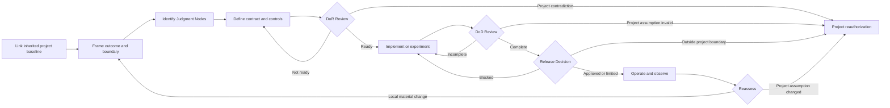
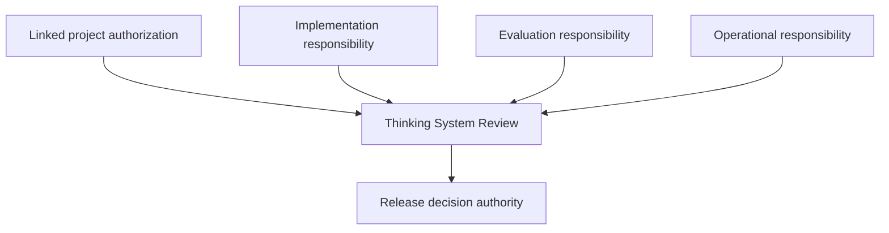

# Thinking System Review

## Status

This document is **draft normative**. It defines a lightweight socio-technical pattern for framing, implementing, evaluating, releasing, and reassessing consequential model-mediated work through one delivery-level review flow and one living practical artifact.

The pattern is designed for small and medium-sized engineering teams. It does not require a governance department, a new organizational structure, or a separate record for every review decision.

“Delivery level” describes the decision surface, not the size of the work item. The review may cover a bounded whole system, feature, or material change.

## 1. Context

A Thinking System combines deterministic responsibilities, Model Judgment, and the boundaries and controls between them. Conventional engineering practices remain necessary, but they do not by themselves make the following explicit:

- where probabilistic judgment affects behavior;
- which variation is acceptable and which outcomes are prohibited;
- what authority a Judgment Node possesses;
- what evidence is needed before completion and release;
- how cost, latency, tool use, or other material resources are bounded;
- what happens when behavior cannot be accepted;
- who owns operation and who may authorize release.

The presentation *Designing Non-Deterministic Systems: Maintaining Engineering Rigor in the AI Era* motivates this shift across slides 1-6: model-mediated behavior introduces runtime variance; Requirements must describe a safe operating space rather than only one path; and readiness, completion, and release must incorporate risk, resource use, evidence, and tolerance. UA adopts those engineering concerns while rejecting universal sample sizes, mandatory confidence intervals, or one required digital representation of risk.

A delivery review may exist inside a broader authorized Thinking System project. In that case, it should inherit the applicable project boundary from the [`Project Control Architecture and Viability Review`](project-control-architecture-and-viability-review.md) rather than rediscover or duplicate the complete project risk, control-capacity, and economic decision for every change.

## 2. Problem

Teams often add an LLM or agent to an existing delivery process without changing the review contract. The feature may pass deterministic tests while important model-mediated responsibilities remain implicit.

This creates recurring gaps:

- the Requirement describes desired functionality but not acceptable behavioral variation;
- Judgment Nodes are not mapped to authority and deterministic constraints;
- evaluation is performed without a clear claim or decision context;
- completion is confused with release authorization;
- residual risk is accepted informally or not recorded;
- runtime evidence has no named owner or corrective path;
- project-level constraints are either ignored or copied inconsistently across feature records;
- one release silently expands authority, population, data, tools, or consequence beyond the project authorization;
- small teams respond by either under-governing the system or creating too many disconnected governance artifacts.

## 3. Pattern

> **Use one living Thinking System Review to connect the inherited project boundary, local Requirement, Judgment Node boundaries, readiness decision, implementation or experiment, completion evidence, release decision, and reassessment triggers.**

The pattern extends an organization's existing engineering process. It does not replace conventional requirements, architecture review, security review, testing, change management, or incident response.

The practical implementation of this pattern is the [`Thinking System Review Template`](thinking-system-review-template.md). The template remains one document throughout the change lifecycle. After a release decision, the team preserves a versioned or immutable snapshot and creates a new version when a material reassessment is required.

## 4. Canonical boundary and project inheritance

This pattern owns:

- implementation-level Judgment Nodes;
- the Requirement and Operating Envelope for the bounded delivery scope;
- the model-mediated Definition of Ready;
- implementation or bounded experimentation;
- the model-mediated Definition of Done;
- the deployment-specific Release Gate;
- local runtime reassessment.

The [`Project Control Architecture and Viability Review`](project-control-architecture-and-viability-review.md) owns:

- project-level material risk scenarios;
- intended project Judgment, autonomy, and authority;
- required shared and project-specific controls;
- evidence feasibility and feedback latency;
- Human Authority and operational capacity;
- control economics and project viability;
- project authorization and reauthorization;
- the baseline inherited by delivery reviews.

When a project review exists, the Thinking System Review should link its identifier, version, authorization outcome, and inheritance package. It may refine local detail but MUST NOT silently:

- expand authorized authority or autonomy;
- add a population, domain, geography, language, product, data class, or tool outside the project boundary;
- weaken inherited deterministic invariants or prohibited authority;
- remove a required shared control or Human Authority path;
- accept a project-level risk, capacity, evidence, or economic assumption contradicted by delivery evidence.

A contradiction should trigger project reassessment rather than local normalization.

## 5. Lightweight review flow

The flow is iterative rather than a mandatory linear pipeline. A bounded experiment may refine the Requirement, Operating Envelope, Judgment Node boundary, evidence strategy, or control design before implementation proceeds.

A project baseline may be `N/A` only when the review is itself the first bounded investigation and project-level authorization has not yet been established. The review should then state that limitation and must not present its release decision as broader project authorization.

## 6. Step 1 — Link the inherited project baseline and frame the delivery boundary

Record:

- the applicable Project Control Architecture and Viability Review identifier, version, and authorization outcome;
- the authorized project scope;
- the intended business outcome;
- applicable organizational constraints;
- authorized Model Judgment and maximum autonomy;
- prohibited authority and hard invariants;
- material project risk scenarios relevant to the delivery scope;
- shared controls and project-specific controls required;
- evidence and feedback expectations;
- Human Authority and operational-capacity assumptions;
- control-cost and resource boundaries;
- project-level release constraints;
- project reauthorization triggers;
- conditions the delivery work must close;
- the bounded system, feature, or change under review;
- in-scope and out-of-scope behavior;
- deterministic responsibilities;
- model-mediated responsibilities;
- boundary and control responsibilities;
- whether the work is an experiment, prototype, limited deployment, or production change.

The review should describe the system-level responsibility rather than treating the model call as the whole system.

Link the project baseline by version. Do not copy the complete project risk map, control economics, or organizational policy into every delivery review.

## 7. Step 2 — Identify consequential Judgment Nodes

Use the [`Model Judgment Placement`](../00-doctrine/model-judgment-placement.md) taxonomy and the [`Judgment Node Boundary`](judgment-node-boundary.md) pattern.

For each consequential Judgment Node, record at least:

- purpose;
- placement;
- inputs and approved context;
- allowed authority;
- deterministic constraints;
- unacceptable outcomes;
- evidence and telemetry;
- fallback or escalation;
- operational owner.

A small team may embed several compact Judgment Node cards in the same review. A separate registry is not required.

Implementation-level authority should remain inside the inherited project boundary. A proposed node that changes the project Judgment or authority landscape may require project reauthorization before implementation proceeds.

## 8. Step 3 — Define the Requirement, Operating Envelope, and controls

The approved Requirement should distinguish:

- intended outcomes;
- deterministic obligations and invariants;
- model-mediated obligations and acceptable variation;
- authority boundaries;
- prohibited outcomes or regions;
- relevant operating conditions;
- material resource constraints;
- evidence expectations;
- required failure handling.

The Operating Envelope is one part of the Requirement. It should be derived from context and consequence rather than copied from a generic benchmark or presentation example.

Identify the applicable control-loop capabilities:

- sensors and evidence;
- constraints and actuators;
- controller or decision authority;
- validation or release gates;
- fallback, containment, escalation, rollback, or shutdown.

The local Requirement may narrow the project boundary. It must not weaken inherited constraints or authorize project-level scope expansion.

## 9. Step 4 — Definition of Ready

UA does not replace an organization's existing Definition of Ready. The conditions below are an extension for work in which consequential behavior depends on Model Judgment.

Work is Ready when the applicable items are sufficiently explicit for implementation or a bounded experiment.

### 9.1 Outcome, scope, and project inheritance

- the intended user or business outcome is defined;
- the system boundary is defined;
- in-scope and out-of-scope behavior is identified;
- experiment, prototype, limited deployment, and production Requirement are distinguished where relevant;
- the applicable project review version and authorization outcome are linked, or the reason no project baseline exists is explicit;
- the proposed delivery scope remains inside inherited authority, population, domain, data, geography, tool, and consequence boundaries;
- project conditions this change must close are identified.

### 9.2 Judgment placement

- consequential Judgment Nodes are identified;
- each node's placement class is recorded;
- affected decisions, actions, paths, or outputs are identified;
- model-mediated responsibilities are separated from deterministic responsibilities.

### 9.3 Authority

- permitted authority is defined;
- prohibited decisions and actions are defined;
- Human Authority or approval points are identified where required;
- the deterministic execution boundary is defined;
- authority remains inside the inherited project baseline.

### 9.4 Requirements and Operating Envelope

- deterministic invariants are identified;
- acceptable behavioral variation is described;
- unacceptable outcomes are described;
- material tolerances or thresholds are defined where feasible and justified;
- the resource envelope is defined where material;
- required failure handling is specified;
- inherited project constraints remain represented in the local Requirement.

### 9.5 Evidence strategy

- relevant scenarios are identified;
- consequential and adversarial scenarios are included where appropriate;
- the evaluation approach is defined;
- evidence sources and limitations are understood;
- success and failure criteria are defined;
- known unknowns are recorded;
- applicable project-level evidence and feedback expectations are addressed.

### 9.6 Control strategy

- necessary sensors are identified;
- necessary constraints and actuators are identified;
- fallback, containment, or escalation is defined;
- observability expectations are defined;
- rollback or shutdown feasibility is considered;
- required shared and project-specific controls are available or explicitly conditioned.

### 9.7 Ownership

- implementation responsibility is assigned;
- evaluation responsibility is assigned;
- operational responsibility is assigned;
- release decision authority is explicit;
- project reauthorization authority is known when a trigger occurs.

### 9.8 Feasibility

- expected cost and latency are understood sufficiently for the decision;
- required data, environments, and tools are available;
- legal, security, privacy, and compliance dependencies are identified;
- unresolved risks are closed or explicitly accepted for a bounded experiment;
- the change remains inside inherited control-cost, capacity, and resource assumptions.

### 9.9 Readiness outcomes

The review records one outcome:

- **Ready for implementation**;
- **Ready for bounded experiment**;
- **Ready with explicit conditions**;
- **Needs clarification**;
- **Project reauthorization required**;
- **Control cost not justified**;
- **AI path rejected**.

`Ready for bounded experiment` does not authorize production use. The experiment must have explicit scope, authority, data, exposure, resource limits, and stopping conditions.

A delivery-level `Control cost not justified` outcome may reflect a local implementation path. When evidence invalidates the complete project economics, project reauthorization is required.

## 10. Step 5 — Implement or run a bounded experiment

Implementation follows the approved Requirement, inherited project baseline, and boundary design.

A bounded experiment is appropriate when the final Operating Envelope, evidence strategy, or technical feasibility cannot yet be established. It should:

- distinguish hypotheses from approved production obligations;
- limit users, data, authority, duration, and resource exposure;
- define what evidence will refine the Requirement;
- define stopping, containment, and escalation conditions;
- preserve model, prompt, policy, tool, configuration, and dataset traceability where material;
- record which project assumptions were confirmed, contradicted, or reopened.

Evidence from experimentation informs the next decision. It does not automatically become a production Requirement, project authorization, or release authorization.

## 11. Step 6 — Definition of Done

UA does not replace an organization's existing Definition of Done. The conditions below extend completion for consequential model-mediated work.

DoD establishes whether implementation, evidence, operability, and recovery support are sufficiently complete. It does not accept residual risk or authorize release.

### 11.1 Deterministic implementation evidence

- applicable unit tests passed;
- applicable integration tests passed;
- interface and schema contracts were verified;
- deterministic invariants were tested;
- authorization and permission controls were tested;
- applicable security, privacy, and compliance checks were completed.

### 11.2 Behavioral evaluation evidence

- the required scenario set was executed;
- expected behavior was assessed;
- unacceptable outcomes were tested;
- Operating Envelope evidence was collected;
- variability across relevant runs was assessed where material;
- regressions against the accepted baseline were checked;
- material model and configuration versions were recorded.

### 11.3 Evidence quality

- evaluation datasets and scenarios are documented;
- known evidence limitations are recorded;
- unsupported extrapolations are avoided;
- confidence is proportional to the evidence;
- material evidence gaps are explicitly listed.

### 11.4 Authority and boundary evidence

- authority limits were tested;
- prohibited actions were blocked;
- tool-use constraints were tested where applicable;
- deterministic validation around Judgment Nodes was verified;
- Human Authority or approval points were tested where applicable;
- implemented authority remains inside the authorized project boundary.

### 11.5 Resource evidence

- token, inference, or compute use was assessed where material;
- latency was assessed;
- concurrency or rate behavior was assessed where material;
- tool and external-service cost was assessed;
- resource limits and failure behavior were tested;
- project-level control-cost and capacity assumptions remain credible, or project reassessment is recorded.

### 11.6 Operational controls

- required sensors are operational;
- required telemetry is available;
- alerts or review triggers are defined;
- drift indicators are available where needed;
- logs and traceability are sufficient for diagnosis.

### 11.7 Failure handling

- fallback was tested;
- containment was tested;
- the escalation path was verified;
- rollback or disable mechanisms were tested where applicable;
- degraded mode is understood;
- partial-failure behavior was assessed;
- project reauthorization and organizational escalation paths are known where applicable.

### 11.8 Operability and ownership

- operational responsibility is assigned;
- support and incident expectations are defined;
- reassessment triggers are documented;
- material residual risks are recorded;
- relevant operational documentation is complete;
- Human Authority and fallback capacity remain consistent with project assumptions.

### 11.9 Completion outcomes

The review records one outcome:

- **Complete**;
- **Complete with recorded limitations**;
- **Insufficient evidence**;
- **Controls incomplete**;
- **Return to implementation**;
- **Return to bounded experiment**;
- **Project reauthorization required**.

A completion outcome is bounded by the stated Requirement, evidence scope, system version, intended deployment context, and inherited project authorization.

## 12. Step 7 — Release Gate

The Release Gate is separate from DoD.

> **DoD asks whether implementation and required evidence are sufficiently complete.**

> **The Release Gate asks whether the available evidence and residual risk are acceptable for a specific deployment context.**

The Release Gate does not authorize project-level scope expansion.

### 12.1 Release inputs

The release decision reviews applicable:

- linked project authorization and inherited baseline;
- approved Requirement and Operating Envelope;
- DoD outcome;
- deterministic test evidence;
- behavioral evaluation evidence;
- authority and boundary evidence;
- resource evidence;
- known limitations and evidence gaps;
- operational controls and failure handling;
- residual-risk statement;
- proposed deployment scope.

### 12.2 Release outcomes

Record one outcome:

- **Release**;
- **Limited release**;
- **Phased or canary release**;
- **Release with conditions**;
- **Human-supervised release**;
- **Block**;
- **Return to experimentation**;
- **Project reauthorization required**;
- **Roll back**;
- **Escalate**.

A release decision should record scope, rationale, conditions, monitoring and reassessment triggers, and the authority making the decision. Release pressure must not silently weaken the Requirement, redefine accepted tolerances, or expand the project boundary.

## 13. Step 8 — Operate, observe, and reassess

The same review is reassessed after a material change or new evidence, including:

- model or material model-configuration change;
- prompt or policy change;
- authority or autonomy change;
- new tool or state-changing action;
- significant data or context-source change;
- incident or confirmed Requirement violation;
- material drift or evidence degradation;
- expansion of deployment scope, population, domain, geography, language, product, or data class;
- material change in resource use, latency, review volume, control cost, or external dependency;
- loss or degradation of required shared controls, Human Authority, or fallback capacity;
- new legal, security, privacy, compliance, contractual, financial, or business constraint;
- delivery evidence contradicting a project-level risk, authority, capacity, evidence, or economic assumption;
- repeated local exceptions collectively changing the project boundary.

Reassessment may:

- confirm the current delivery decision;
- narrow operation;
- require new local evidence;
- return the work to implementation or experimentation;
- change release conditions;
- trigger rollback, containment, escalation, or shutdown;
- require project reauthorization;
- require organizational review.

The response level follows the assumption that changed. Do not escalate every local defect to the project level. Do not keep project-invalidating evidence inside one local review.

## 14. Responsibility bundles

The pattern uses four responsibility bundles, not mandatory job titles.

| Responsibility bundle | Required responsibility |
|---|---|
| **Implementation** | Build or configure the system in accordance with the approved Requirement, inherited project boundary, and local controls. |
| **Evaluation** | Define and assess the evidence needed to support readiness, completion, release, and reassessment claims. |
| **Operation** | Maintain observability, respond to Deviation Signals and incidents, and execute or coordinate corrective action. |
| **Release decision authority** | Accept, limit, condition, escalate, reject, or reverse release for the stated deployment context. |

In a small team, one person may hold several bundles. Consequential release authorization should nevertheless remain explicit, and the decision-maker must have adequate evidence, competence, time, and authority.

The project authorization authority may be the same person or a different person. Delivery release authority cannot silently change project authorization.

## 15. One practical artifact

The [`Thinking System Review Template`](thinking-system-review-template.md) is the default working artifact for this pattern. It combines:

- project review version and inherited baseline;
- system, feature, or change framing;
- mixed-system responsibilities;
- Judgment Node cards;
- Requirement and Operating Envelope;
- DoR;
- implementation or experiment notes;
- DoD;
- residual risk;
- deployment scope;
- release decision;
- local, project, and organizational reassessment triggers;
- version and decision history.

The pattern does not require separate readiness records, completion packages, responsibility matrices, governance-board protocols, Judgment Node registries, or Release Decision Records.

The project review remains a separate living artifact because it has a different decision owner and lifecycle. Delivery reviews link its version and inheritance package instead of copying it.

After a release decision:

1. preserve an immutable or versioned snapshot of the completed review;
2. link the project decision, deployed versions, and relevant evidence;
3. create a new delivery review version when a local reassessment trigger occurs;
4. request project reauthorization when evidence invalidates the project baseline;
5. preserve the relationship to prior project and delivery decisions rather than overwriting history.

## 16. Proportional application

The complete checklists define the available review surface. Not every item requires the same depth for every system.

Application should be proportional to:

- authority;
- downstream consequences;
- autonomy;
- reversibility;
- exposure and deployment scope;
- evidence uncertainty;
- legal, security, privacy, and compliance context;
- resource and operating cost;
- failure propagation.

Mark non-applicable items explicitly rather than silently omitting them. Do not invent universal thresholds, sample sizes, review cadences, or role titles.

The review may be unnecessary for a model use that cannot materially influence system behavior and remains fully contained within an ordinary deterministic workflow. When in doubt, first map the Judgment Node and its authority; the answer should follow from the actual boundary, not from whether the feature is marketed as an agent.

## 17. Source interpretation: presentation slides 1-6

This pattern deliberately translates, rather than copies, the source presentation:

- **Slides 1-3** establish that model-mediated runtime behavior has non-zero variance and requires engineered boundaries, sensing, feedback, and correction.
- **Slide 4** reframes defects around business tolerances. UA narrows this into the system-level definition of a Bug as a violation of an approved Requirement; an individual tail event remains evidence until diagnosed.
- **Slide 5** presents the Requirement as an engineered space of possibilities. UA represents this through the complete Requirement and its Operating Envelope.
- **Slide 6** argues that readiness, cost, completion, and release must change together. UA preserves those concerns while treating risk representation, sample size, metrics, and confidence methods as context-derived rather than universal.

The presentation remains source evidence. This pattern is the explicit draft-normative framework decision for delivery-level work.

## 18. Consequences and limitations

Applying the pattern:

- provides one visible path from inherited project authorization to runtime reassessment;
- keeps full DoR and DoD coverage without multiplying operational documents;
- separates project authorization, completion, and residual-risk release acceptance;
- exposes missing authority, evidence, ownership, corrective paths, or project contradictions;
- makes bounded experimentation a deliberate engineering decision;
- supports traceability across project, model, prompt, policy, tool, and deployment changes;
- prevents one release from silently expanding the project boundary.

The pattern also creates review effort. A completed checklist does not guarantee sound judgment, adequate evidence, or effective control. The pattern does not replace project viability review, domain expertise, engineering tests, security and compliance work, or a functioning control loop.

## 19. Related UA concepts

- [`Project Control Architecture and Viability Review`](project-control-architecture-and-viability-review.md) defines project-level risk, required controls, evidence and capacity feasibility, economics, authorization, inheritance, and reauthorization.
- [`Requirements, Correctness, and Bugs`](../00-doctrine/requirements-correctness-and-bugs.md) defines the approved operating contract and diagnostic model.
- [`Model Judgment Placement`](../00-doctrine/model-judgment-placement.md) defines where Model Judgment may function in a system.
- [`Judgment Node Boundary`](judgment-node-boundary.md) defines the compact boundary used inside the review.
- [`AI Control Plane`](../02-ai-control-plane/) defines the distributed capabilities used to constrain, observe, evaluate, and correct behavior.
- [`Thinking System Review Template`](thinking-system-review-template.md) is the practical working representation of this pattern.
