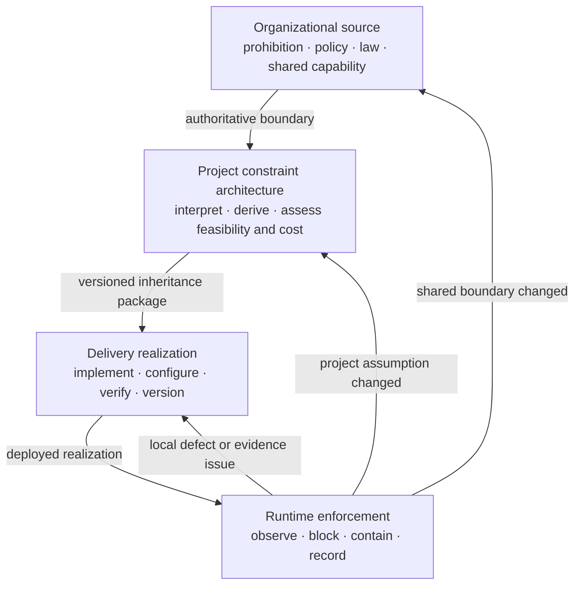

# Constraint Capabilities

**Status:** Draft normative  
**Role:** Conditions and enforcement mechanisms that bound the reachable operating space of a Thinking System

## Purpose

Constraints make the approved operating boundary concrete.

They limit which states, actions, authority, data, tools, resources, environments, outputs, or deployment conditions are reachable by the system. They may be inherited from organizational sources, derived from project risk and authorization, realized in delivery architecture, and exercised at runtime.

Constraints are a first-class AI Control Plane capability. They are not merely examples of Actuators, prompts, schemas, or policy documents.

## Canonical relationship

The [`Control-Loop Capability Anatomy`](../../00-doctrine/control-loop-anatomy.md) defines the relationship between Constraints, Sensors, Controllers, and Actuators.

In summary:

- **Constraints** define or enforce the allowed operating space.
- **Sensors** produce evidence about behavior, conditions, control health, and violations.
- **Controllers** interpret evidence and authorize decisions.
- **Actuators** execute authorized changes to behavior or operating conditions.

An actuator may change a constraint. A constraint may block an action. A technical component may implement several capability functions, but the functions should remain distinguishable.

## Constraint description

A mature constraint description should identify:

1. **Source** — the authoritative organizational, project, delivery, or runtime decision from which it originates.
2. **Subject** — the state, action, authority, input, context, data, tool, output, resource, environment, or human decision path being bounded.
3. **Scope** — the users, population, domain, geography, deployment, component, Judgment Node, tool, data class, or time period to which it applies.
4. **Class** — structural, authority, state, data, resource, environment, Human Authority, or soft behavioral constraint.
5. **Strength** — hard or soft.
6. **Realization** — the mechanism and enforcement point.
7. **Failure behavior** — blocked, rejected, repaired, degraded, escalated, isolated, rolled back, or allowed with explicit residual risk.
8. **Change authority** — who or what may tighten, relax, override, disable, or replace it.
9. **Evidence** — how enforcement state, violations, bypass attempts, friction, and degradation are observed.
10. **Traceability** — version, configuration, source decision, and affected Requirement or risk scenario.
11. **Reassessment rule** — which change requires delivery reassessment, project reauthorization, or organizational review.

## Constraint classes

### 1. Structural and interface constraints

These constrain format, type, shape, allowed values, protocol, and interface behavior.

Examples include:

- JSON Schema and OpenAPI contracts;
- typed interfaces and data-transfer objects;
- constrained decoding and formal grammars;
- parser and serialization rules;
- enum and range restrictions;
- deterministic output validation.

Structural validity does not establish semantic acceptability. A valid object may still violate the Requirement.

### 2. Authority and action constraints

These constrain what the model-mediated path may decide, invoke, modify, or cause.

Examples include:

- authentication and authorization;
- RBAC, ABAC, and capability-based access;
- tool and function allowlists;
- action approval requirements;
- separation of recommendation from execution;
- maximum autonomy;
- prohibited actions and side effects.

A probabilistic instruction not to perform an action is not equivalent to an enforceable authority boundary.

### 3. State and transaction constraints

These constrain allowed system states and transitions.

Examples include:

- state machines;
- transaction boundaries;
- idempotency requirements;
- preconditions and postconditions;
- approval-before-commit rules;
- consistency, isolation, and rollback obligations.

Model Judgment may propose a transition. Deterministic logic should enforce critical state and transaction invariants.

### 4. Data and context constraints

These constrain what information may enter, influence, or leave the model-mediated path.

Examples include:

- tenant and row-level isolation;
- source allowlists;
- provenance requirements;
- data classification and residency;
- context-size and relevance policies;
- deterministic redaction and DLP;
- prompt-injection isolation boundaries;
- disclosure and retention rules.

A rich context window is not automatically an authorized context boundary.

### 5. Resource and exposure constraints

These constrain resource use and the scale of possible consequences.

Examples include:

- token, inference, compute, and tool-cost budgets;
- latency and timeout limits;
- rate, concurrency, iteration, recursion, and duration limits;
- affected population and deployment limits;
- rollout, canary, geography, and time-window boundaries;
- bounded experiment exposure.

Resource constraints may be hard technical stops, project authorization conditions, or both.

### 6. Environment and dependency constraints

These constrain where and through which dependencies the system may operate.

Examples include:

- approved models, providers, and deployment modes;
- network egress controls;
- sandboxing and process isolation;
- approved regions and jurisdictions;
- vendor, version, and data-source pinning;
- tool availability and dependency health requirements.

A provider or model change may invalidate project evidence even when application code does not change.

### 7. Human-decision constraints

These constrain when a human decision is required and what authority is reserved for people.

Examples include:

- mandatory approval before consequential execution;
- dual control or separation of duties;
- required escalation for defined conditions;
- review-volume and response-time limits;
- authority reserved for legal, security, financial, safety, or business owners;
- prohibition on automated override of a human decision.

Human involvement is not a hard constraint when the person lacks evidence, competence, time, capacity, independence, or real power to block.

### 8. Soft behavioral constraints

These influence probabilistic behavior but do not guarantee compliance.

Examples include:

- prompts and system instructions;
- natural-language policies;
- rubrics and style guides;
- examples and few-shot demonstrations;
- model-level preference or safety tuning.

Soft constraints may improve behavior, but they require evidence and must not be used as the sole enforcement of a critical invariant.

## Constraint inheritance and realization

Constraints become more concrete as they move through the Nested Control Lifecycle.

### Organizational level

Authoritative sources may define prohibited uses, risk appetite, legal and contractual obligations, data handling, vendors, geographies, deployment models, procurement limits, and reserved decision rights.

### Project level

The project review should:

- interpret applicable organizational constraints;
- derive project-specific constraints from material risk scenarios;
- identify the required enforcement and evidence capabilities;
- determine whether shared capabilities are sufficient;
- identify missing or vendor-dependent constraints;
- include constraint build, operation, review, and incident cost in the viability decision;
- define which constraints are inherited by delivery reviews;
- define project reauthorization triggers.

### Delivery level

The delivery review should:

- link the inherited constraint and source version;
- identify the local realization and enforcement point;
- verify hard versus soft claims;
- test failure behavior, bypass resistance, and traceability;
- confirm the deployment scope and configuration;
- identify operational ownership and change authority;
- preserve runtime evidence and reassessment triggers.

### Runtime level

Runtime operation should:

- preserve the active constraint and source versions;
- observe enforcement state and health;
- record violations, blocks, bypass attempts, overrides, and false blocks;
- apply authorized fallback, containment, rollback, or shutdown;
- prevent runtime tuning from silently changing project or organizational authority;
- route invalidating evidence to the correct decision level.

## Hard, soft, and composite realization

A single business constraint may require several mechanisms.

Example:

> Customer replies must not contain unsupported product claims.

Possible realization:

- source allowlist and provenance requirement — hard data/context constraint;
- grounding instruction — soft behavioral constraint;
- claim-to-source evaluator — sensor;
- deterministic block when required references are missing — hard output constraint;
- human review for unresolved claims — Human Authority constraint and controller path;
- feature disable or prompt rollback — actuator;
- support lead or release authority — controller.

The business constraint is not equivalent to any single tool in the chain.

## Constraint failure behavior

For each material constraint, define what happens when:

- the system attempts to violate it;
- enforcement is unavailable;
- enforcement returns an uncertain result;
- the constraint conflicts with another constraint;
- the constraint is stale or its source changed;
- the constraint creates excessive false blocks, latency, cost, or human workload;
- an override is requested;
- the mechanism is bypassed or misconfigured.

Fail-open and fail-closed behavior must be context-derived. A universal rule is not credible. The chosen behavior should follow consequence, reversibility, evidence latency, fallback capacity, and the approved Requirement.

## Change and override authority

Every material constraint should distinguish:

- who may propose a change;
- who may approve a change;
- who may execute a change;
- whether emergency override is permitted;
- how an override is time-bounded, logged, and reviewed;
- which changes stay within delivery authority;
- which changes require project reauthorization;
- which changes require organizational review.

A runtime Controller may change only constraints inside its delegated authority. It must not silently relax a hard project or organizational boundary.

## Evidence expectations

Relevant evidence may include:

- deterministic contract and permission tests;
- policy-engine decision logs;
- violation and bypass-attempt records;
- active configuration and version evidence;
- output and outcome evaluation;
- false-block and fallback rates;
- latency, cost, capacity, and availability;
- human overrides and escalation results;
- incident and near-miss evidence;
- control-health and dependency-change evidence.

A constraint with no evidence of activation, coverage, failure, or operational effect should not be assumed effective.

## Anti-patterns

### Constraint-as-prompt fallacy

Treating a natural-language instruction as a deterministic guarantee.

### Declared but unenforced

Recording a policy or boundary without an enforcement point, failure behavior, or owner.

### Tool-name taxonomy

Classifying a product as a Constraint, Sensor, Controller, or Actuator without identifying the function it actually performs in the loop.

### Fail-open by accident

Allowing operation after constraint-service failure without an explicit, authorized decision.

### Runtime policy overreach

Allowing a runtime component or operator to relax project or organizational constraints outside delegated authority.

### Constraint drift

Changing schemas, permissions, prompts, policies, models, tools, data, or deployment conditions without preserving the relationship to the approved Requirement and source decision.

### Constraint accumulation

Adding overlapping checks and policies without resolving conflicts, ownership, latency, cost, or operational burden.

## Non-prescription

UA does not require:

- one universal constraint catalogue;
- one policy engine;
- one schema technology;
- one centralized enforcement layer;
- hard constraints for every behavior;
- automatic blocking for every deviation;
- a separate Constraint Register for the default SMB path;
- one mandatory product or vendor.

The project and delivery review artifacts may embed the required constraint fields and link supporting evidence. Independent records are optional only when separate ownership or lifecycle genuinely requires them.

## Relationships

- [`../../00-doctrine/control-loop-anatomy.md`](../../00-doctrine/control-loop-anatomy.md) defines the four capability classes.
- [`../../00-doctrine/glossary.md`](../../00-doctrine/glossary.md) provides concise canonical definitions.
- [`../README.md`](../README.md) defines the AI Control Plane module.
- [`../00-actuators/`](../00-actuators/) defines mechanisms that execute authorized changes.
- [`../02-sensors/`](../02-sensors/) defines evidence capabilities.
- [`../03-controller/`](../03-controller/) defines decision authority.
- [`constraint-realization-catalog.md`](constraint-realization-catalog.md) provides informative implementation examples.
- [`../../01-patterns/project-control-architecture-and-viability-review.md`](../../01-patterns/project-control-architecture-and-viability-review.md) applies constraints to project authorization and viability.
- [`../../01-patterns/thinking-system-review.md`](../../01-patterns/thinking-system-review.md) applies them to delivery and release.
