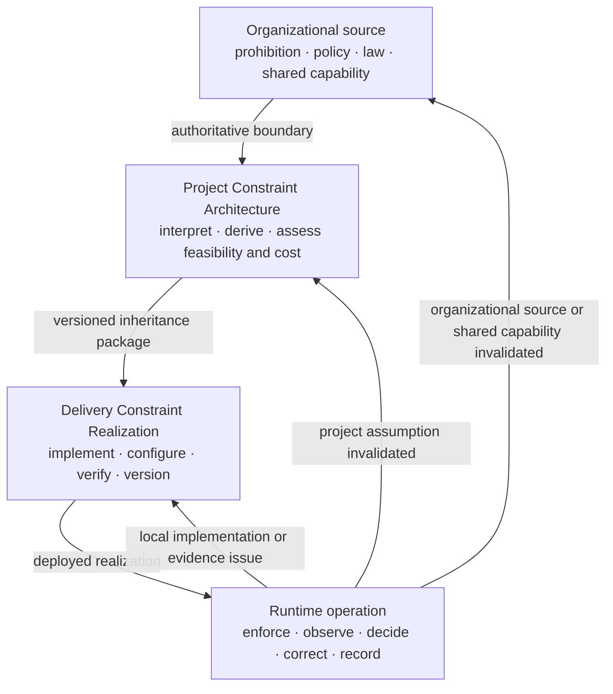

# Constraint Capability Family

**Status:** Draft normative  
**Role:** Defines approved operating boundaries and the capability needed to realize, operate, evidence, and change them

## Purpose

The Constraints family makes the approved operating boundary explicit and operational.

A **Constraint** states which states, actions, authority, data, tools, resources, environments, outputs, deployment conditions, or human decisions are allowed or prohibited. It is an authoritative decision object, not an execution mechanism.

A **Constraint Realization** is the technical or socio-technical mechanism that implements, enforces, or influences the approved boundary for a defined scope.

UA groups both in one capability family because control is incomplete when either the authoritative boundary or its operational realization is missing. Constraint Realization is not a fifth capability family.

Constraints are not merely examples of Actuators, prompts, schemas, policy documents, or validators.

## Canonical relationship

The [`Control-Loop Capability Anatomy`](../../00-doctrine/control-loop-anatomy.md) defines the relationship among:

- **Constraints** — approved boundaries;
- **Constraint Realizations** — mechanisms implementing, enforcing, or influencing those boundaries;
- **Sensors** — evidence about behavior, outcomes, realization state, and control health;
- **Controllers** — interpretation and decision authority;
- **Actuators** — execution of authorized changes.

An Actuator may install, tighten, relax, replace, or remove a Constraint Realization within delegated authority. A Constraint Realization may reject or block an attempted action. A single component may perform several functions, but the functions remain distinguishable.

## Constraint description

A material Constraint should identify:

1. **Source or rationale** — the authoritative organizational source or project-risk rationale.
2. **Subject** — the behavior, state, action, authority, input, context, data, tool, output, resource, environment, deployment, or human decision being bounded.
3. **Path** — the system, workflow, execution, data, or decision path through which the subject can be reached or affected.
4. **Scope** — the users, population, domain, geography, deployment, component, Judgment Node, data class, tool, or time period to which it applies.
5. **Class** — structural, authority, state, data, resource, environment, Human Authority, or behavioral.
6. **Claimed strength** — hard or soft for that subject, path, and scope.
7. **Realization** — the mechanism and enforcement or influence point.
8. **Assumptions** — the conditions under which the claimed guarantee is valid.
9. **Failure behavior** — violation, conflict, bypass, uncertainty, degradation, and unavailability behavior.
10. **Change authority** — who may propose, approve, execute, override, disable, or replace it.
11. **Evidence** — activation, violations, bypass attempts, degradation, false blocks, friction, and coverage.
12. **Traceability** — version, source decision, affected Requirement, risk scenario, and deployed realization.
13. **Reassessment rule** — which changes remain local and which require delivery reassessment, project reauthorization, or organizational review.

When one source condition has different guarantee strengths across subjects, paths, or scopes, split it into separate Constraint records rather than marking one row as partly hard and partly soft.

## Hard and Soft Constraint claims

Hard or soft strength is a scoped claim about a Constraint together with its complete realized path. It is not an intrinsic property of policy prose, a Requirement sentence, or an organizational source.

### Hard Constraint

A Hard Constraint is a scoped Constraint whose complete realized path deterministically prevents or rejects violation within explicitly stated assumptions, subject, path, scope, and enforcement boundaries.

Examples may include:

- permission checks;
- typed interface or schema rejection;
- transaction preconditions;
- deterministic state-machine guards;
- tool allowlists;
- tenant, row-level, network, or regional isolation;
- rate, cost, concurrency, time, or exposure caps;
- mandatory approval gates that technically prevent execution before approval.

The same source condition may be hard in one path and soft in another because the realization, assumptions, and reachable states differ.

A probabilistic detector, evaluator, prompt, model policy, or natural-language instruction is not hard merely because its failure behavior is documented.

### Soft Constraint

A Soft Constraint is a scoped Constraint whose realized path influences probabilistic behavior but cannot guarantee that a prohibited state, action, or output remains unreachable.

Examples include:

- prompts and system instructions;
- natural-language policies;
- rubrics and style guidance;
- demonstrations and model preferences;
- probabilistic safety or semantic classifiers used without deterministic downstream enforcement.

Soft Constraints may be useful and necessary. They must not be represented as deterministic guarantees.

### Composite realization

One business Constraint may require several realizations.

Example:

> Customer replies must not contain unsupported product claims.

Possible control path:

- approved-source restriction — data/context realization;
- grounding instruction — soft realization;
- claim-to-source evaluator — Sensor;
- deterministic block when required evidence is absent — hard realization;
- Human Authority for unresolved cases — approval Constraint plus Controller path;
- feature disable or prompt rollback — Actuator;
- support or release authority — Controller.

The business Constraint is hard only for the scope in which the complete realized path deterministically prevents or rejects the prohibited outcome within stated assumptions. If the semantic claim remains probabilistic, record the narrower structural or authority Hard Constraint and the remaining semantic Soft Constraint separately.

## Constraint classes

### 1. Structural and interface

Bound format, type, shape, protocol, and allowed values.

Examples:

- JSON Schema, OpenAPI, Protobuf, and typed DTOs;
- constrained decoding and formal grammars;
- parser and serialization rules;
- enums and range restrictions;
- deterministic output validation.

Structural validity does not establish semantic acceptability.

### 2. Authority and action

Bound what the model-mediated path may decide, invoke, modify, or cause.

Examples:

- authentication and authorization;
- RBAC, ABAC, and capability-based access;
- tool and function allowlists;
- action approval requirements;
- separation of recommendation from execution;
- maximum autonomy;
- prohibited side effects.

A prompt asking the model not to act is not equivalent to an enforceable authority boundary.

### 3. State and transaction

Bound allowed states and transitions.

Examples:

- state machines;
- transaction boundaries;
- idempotency;
- preconditions and postconditions;
- approval-before-commit rules;
- consistency, isolation, and rollback obligations.

Model Judgment may propose a transition. Deterministic logic should protect critical state and transaction Invariants.

### 4. Data and context

Bound what information may enter, influence, or leave the model-mediated path.

Examples:

- tenant and row-level isolation;
- source allowlists;
- provenance requirements;
- data classification and residency;
- context-source restrictions;
- deterministic redaction and DLP;
- disclosure and retention rules;
- prompt-injection isolation boundaries.

A large context window is not automatically an authorized context boundary.

### 5. Resource and exposure

Bound resource use and possible consequence scale.

Examples:

- token, inference, compute, and tool-cost budgets;
- latency and timeout limits;
- rate, concurrency, iteration, recursion, and duration limits;
- affected population and deployment limits;
- canary, geography, and time-window boundaries;
- bounded experiment exposure.

### 6. Environment and dependency

Bound where and through which dependencies the system may operate.

Examples:

- approved models, providers, and deployment modes;
- network egress controls;
- sandboxing and process isolation;
- approved regions and jurisdictions;
- vendor, version, and data-source pinning;
- dependency health requirements.

A provider or model change may invalidate project evidence even when application code is unchanged.

### 7. Human Authority

Bound when human approval is required and which authority remains reserved for people.

Examples:

- mandatory approval before consequential execution;
- dual control or separation of duties;
- escalation for defined conditions;
- response-time and review-volume limits;
- authority reserved for legal, security, financial, safety, or business owners;
- prohibition on automated override of a human decision.

Human involvement is not a Hard Constraint when the person lacks information, competence, time, capacity, independence, or real power to block. A hard approval boundary also requires that execution cannot bypass the approval path.

### 8. Behavioral

Influence model behavior without guaranteeing compliance.

Examples:

- prompts and system instructions;
- natural-language policies;
- rubrics and style guides;
- demonstrations;
- preference or safety tuning.

Behavioral Constraints are normally soft unless a separate deterministic realization creates a narrower Hard Constraint that makes a specified prohibited result unreachable.

## Constraint inheritance and realization

Constraints become more concrete through the Nested Control Lifecycle:

### Organizational level

Authoritative sources may define prohibited uses, risk appetite, legal and contractual obligations, approved data, vendors, models, geographies, deployment modes, procurement limits, and reserved decision rights. The source does not by itself establish that a resulting project Constraint is hard.

### Project level

The project review should:

- interpret applicable organizational Constraints;
- derive project-specific Constraints from material risk scenarios;
- state scoped hard or soft claims only after required realization and assumptions are understood;
- identify required realization and evidence capabilities;
- assess shared capability sufficiency;
- include design, operation, review, fallback, and incident cost in viability;
- create one versioned Constraint baseline for delivery inheritance;
- define project reauthorization triggers.

### Delivery level

The delivery review should maintain one canonical **Constraint Realization Map** for the bounded system, feature, or material change. It links each material Constraint to source/version, subject, path, delivery scope, realization, failure behavior, evidence, active configuration, change authority, and reassessment trigger.

DoR, DoD, Release Gate, and runtime sections should reference that map rather than restating the same Constraint definition.

A delivery row should contain one reviewable guarantee strength. Split a compound condition when different subjects, paths, or scopes have different strengths.

### Runtime level

Runtime should:

- preserve active source and realization versions;
- observe realization state and health;
- record violations, blocks, bypass attempts, overrides, false blocks, and friction;
- route evidence to an authorized Controller;
- invoke Actuators within delegated authority;
- prevent runtime tuning from silently changing project or organizational authority;
- route invalidating evidence to the correct decision level.

## Failure behavior

For each material Constraint and realization, define what happens when:

- violation is attempted;
- realization is unavailable or uncertain;
- two Constraints conflict;
- the source or realization becomes stale;
- false blocks, latency, cost, or human workload become excessive;
- an override is requested;
- the mechanism is bypassed or misconfigured;
- the stated enforcement assumptions no longer hold.

Fail-open and fail-closed behavior must be context-derived. The decision should follow consequence, reversibility, evidence latency, fallback capacity, and the approved Requirement.

## Change and override authority

Distinguish:

- who may propose a change;
- who may approve it;
- which Actuator or operator may execute it;
- whether emergency override is permitted;
- how an override is bounded, logged, and reviewed;
- which changes remain inside delivery authority;
- which require project reauthorization;
- which require organizational review.

Technical configurability does not create authority.

## Evidence expectations

Relevant evidence may include:

- deterministic contract and permission tests;
- policy-engine decisions;
- activation and configuration state;
- violation and bypass-attempt records;
- output and outcome evaluation;
- false-block and fallback rates;
- latency, cost, capacity, and availability;
- human overrides and escalation outcomes;
- incident and near-miss evidence;
- dependency and enforcement-assumption changes.

A realization with no evidence of activation, coverage, failure, or operational effect should not be assumed effective.

## Anti-patterns

### Constraint-as-prompt fallacy

Treating a probabilistic instruction as a deterministic guarantee.

### Constraint–realization collapse

Treating the approved boundary, implementation mechanism, runtime state, and resulting guarantee as one undifferentiated object.

### Mixed-strength Constraint record

Combining distinct subjects, paths, or scopes with different guarantee strengths in one hard/soft field, making the claimed boundary impossible to review or trace.

### Declared but unrealized

Recording a policy or boundary without a credible realization, failure behavior, evidence, or owner.

### Tool-name taxonomy

Classifying a product as a Constraint, Sensor, Controller, or Actuator without identifying the function it performs.

### Fail-open by accident

Continuing operation after realization failure without an explicit, authorized decision.

### Runtime authority overreach

Allowing a runtime component or operator to relax project or organizational Constraints outside delegated authority.

### Constraint drift

Changing sources, schemas, permissions, prompts, policies, models, tools, data, or deployment conditions without preserving traceability to the approved Requirement and decision.

### Constraint accumulation

Adding overlapping checks and policies without resolving conflicts, ownership, latency, cost, or operational burden.

## Non-prescription

UA does not require:

- one universal Constraint catalogue;
- one policy engine or schema technology;
- one centralized enforcement layer;
- Hard Constraints for every behavior;
- automatic blocking for every deviation;
- a separate Constraint Register for the default SMB path;
- one mandatory product or vendor.

Project and delivery reviews embed the necessary Constraint fields and link supporting evidence. Separate records are optional only when independent ownership or lifecycle genuinely requires them.

## Relationships

- [`../../00-doctrine/control-loop-anatomy.md`](../../00-doctrine/control-loop-anatomy.md) defines the capability relationships.
- [`../../00-doctrine/glossary.md`](../../00-doctrine/glossary.md) owns canonical terminology.
- [`../README.md`](../README.md) defines the AI Control Plane module.
- [`../00-actuators/`](../00-actuators/) defines mechanisms that execute authorized changes.
- [`../02-sensors/`](../02-sensors/) defines evidence capabilities.
- [`../03-controller/`](../03-controller/) defines decision authority.
- [`constraint-realization-catalog.md`](constraint-realization-catalog.md) provides informative implementation examples.
- [`../../01-patterns/project-control-architecture-and-viability-review.md`](../../01-patterns/project-control-architecture-and-viability-review.md) applies Constraints to project authorization and viability.
- [`../../01-patterns/thinking-system-review.md`](../../01-patterns/thinking-system-review.md) applies them to delivery and release.
