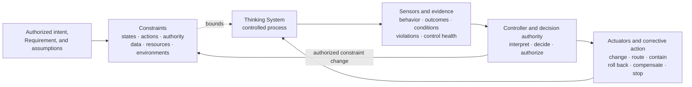
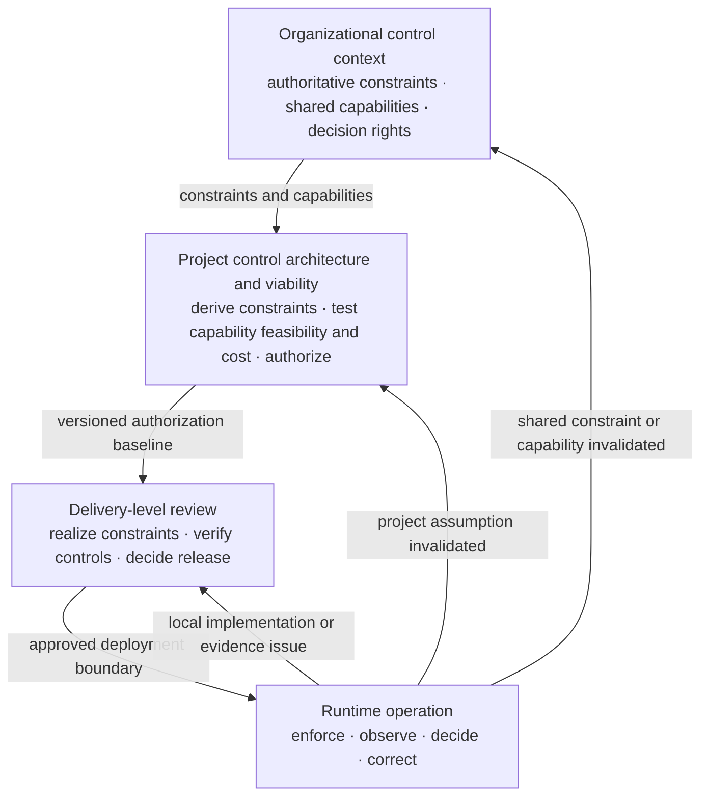

# The AI Control Plane

**Status:** Draft normative  
**Role:** Distributed capability model for bounding, observing, deciding, and correcting model-mediated behavior

## Purpose

This module defines the control capabilities required to operate Thinking Systems as governed closed-loop systems rather than open-loop model integrations.

The AI Control Plane is not necessarily a standalone product, service, platform, or infrastructure layer. Its responsibilities may be distributed across application code, platform services, evaluation systems, human workflows, project and release processes, incident response, and organizational governance mechanisms.

The [`Nested Control Lifecycle`](../00-doctrine/nested-control-lifecycle.md) defines **where decisions are owned** across organizational, project, delivery, and runtime levels. The [`Control-Loop Capability Anatomy`](../00-doctrine/control-loop-anatomy.md) and this module define **which capabilities make those decisions operational**.

## Four capability classes

UA distinguishes four logical control capabilities:

1. **Constraints** — define or enforce the allowed operating space.
2. **Sensors and evidence** — make behavior, outcomes, conditions, control health, and violations observable.
3. **Controllers and decision authority** — interpret evidence relative to approved intent and authorize or select corrective action.
4. **Actuators and corrective action** — execute authorized changes to behavior or operating conditions.

The four classes are not a mandatory physical stack. One component may realize several functions, and one function may be distributed across several components and human processes.

## Capability anatomy



A functioning control loop requires more than telemetry, a policy file, a dashboard, or a kill switch. The relevant operating space must be explicit, evidence must reach decision authority, and that authority must have a real path to change, contain, compensate for, roll back, or stop behavior.

## Defines

This module defines or develops:

- **Constraints** that bound states, actions, authority, data, context, resources, environments, outputs, deployment scope, and Human Authority requirements;
- **Sensors** that observe outputs, outcomes, drift, incidents, operating conditions, constraint state, and control performance;
- **Controllers** that interpret evidence and authorize corrective action within explicit decision rights;
- **Actuators** that execute authorized changes to behavior, constraints, deployment, state, or the socio-technical operating process;
- feedback loops connecting observation to controlled change;
- project, release, escalation, fallback, rollback, containment, compensation, and shutdown responsibilities;
- traceability between constraint sources, evidence, decisions, actuator execution, and system changes.

## Does not define

This module does not prescribe:

- one centralized control-plane service;
- four separate services or products;
- one specific model, framework, vendor, policy engine, or deployment topology;
- universal quality, safety, latency, cost, risk, autonomy, or evidence thresholds;
- fully automated control in contexts that require Human Authority;
- model quality as a substitute for system-level control;
- one mandatory project or delivery review process;
- one universal constraint catalogue;
- one mandatory tool classification.

## Key concepts

- constraint source and scope;
- hard and soft constraint;
- constraint realization and enforcement point;
- actuator;
- sensor;
- controller;
- evidence and Deviation Signal;
- approved Requirement and Operating Envelope;
- Judgment Node boundary and authority constraint;
- project authorization;
- delivery Release Gate;
- escalation and Human Authority;
- fallback, compensation, rollback, containment, and shutdown;
- feedback latency and control cadence;
- local reassessment and project reauthorization.

## Capability areas

- [`00-actuators/`](00-actuators/) — mechanisms that execute authorized changes to behavior or operating conditions.
- [`01-constraints/`](01-constraints/) — conditions and enforcement mechanisms that bound the reachable operating space.
- [`02-sensors/`](02-sensors/) — evidence about behavior, outcomes, constraints, drift, and operating conditions.
- [`03-controller/`](03-controller/) — interpretation, decision authority, constraint-change authority, and corrective decisions.

The capability-area documents inherit the module's draft-normative boundary when they define a capability. Implementation examples and technology catalogs are informative unless explicitly classified otherwise.

## Constraints are not merely Actuators

Constraints and Actuators have different jobs:

- a Constraint defines or enforces what is allowed;
- an Actuator executes an authorized change.

An Actuator may tighten, relax, replace, or disable a Constraint within delegated authority. A Constraint may block an attempted action. One technical component may participate in both functions, but the distinction is necessary to reason about authority, guarantees, evidence, and failure behavior.

Example:

```text
Constraint: only approved support queues may be selected
→ realization: deterministic queue allowlist
→ sensor: rejected route and override evidence
→ controller: release or operational authority
→ actuator: update the allowlist, disable automated routing, or switch to manual triage
```

The constraint is not equivalent to the allowlist technology, and the allowlist technology is not the complete control loop.

## Control capabilities across the Nested Control Lifecycle

The same capability vocabulary appears at different decision levels without making those levels identical.



### Organizational level

The organization supplies authoritative constraint sources and shared capabilities, such as prohibited uses, legal and contractual obligations, approved vendors and regions, identity and audit systems, risk appetite, incident processes, and reserved Human Authority.

### Project level

The [`Project Control Architecture and Viability Review`](../01-patterns/project-control-architecture-and-viability-review.md) uses the capability model to determine:

- which material risk scenarios require constraints, sensing, decision authority, intervention, fallback, containment, rollback, compensation, or shutdown;
- which organizational constraints apply and which project-specific constraints must be derived;
- which capabilities already exist as organizational services or processes;
- which controls must be built or adapted by the project;
- whether constraint enforcement, evidence, and corrective action can arrive within the required time;
- whether Human Authority and operational capacity are substantive;
- whether the complete control perimeter is technically, operationally, and economically viable.

A project control architecture is not a list of tools. Each critical scenario should connect an approved boundary to enforcement, evidence, decision authority, and a real corrective mechanism.

### Delivery level

The [`Thinking System Review`](../01-patterns/thinking-system-review.md) refines the inherited project capability requirements around implementation-level Judgment Nodes, the local Requirement and Operating Envelope, constraint realization, DoR, evidence, DoD, the deployment-specific Release Gate, and local reassessment.

The delivery review may narrow or instantiate project controls. It must not silently remove a required constraint or capability, relax a higher-level boundary, or expand project authority.

### Runtime level

Runtime operation exercises the actual control loop. It should:

- enforce the deployed constraint realization;
- observe outputs, outcomes, conditions, constraint violations, bypass attempts, and control health;
- route evidence to an authorized Controller;
- invoke available Actuators within delegated authority;
- preserve active versions and material decisions;
- distinguish local correction from project reauthorization and organizational review.

Runtime evidence may:

- trigger a local corrective action or delivery reassessment;
- invalidate a project risk, authority, capacity, evidence, constraint, or economic assumption and require project reauthorization;
- expose a missing or degraded shared capability or changed authoritative constraint and require organizational review.

The affected decision level follows the assumption or authority boundary invalidated by evidence.

## Judgment Node boundaries and control capabilities

The [`Judgment Node Boundary`](../01-patterns/judgment-node-boundary.md) identifies what must be bounded, observed, and corrected around a particular use of Model Judgment.

The AI Control Plane supplies the capability vocabulary used to operate that boundary:

- Constraints define allowed context, authority, structure, data, tools, resources, outputs, and deployment conditions;
- Sensors produce evidence about the node, its downstream effects, the operating context, and constraint state;
- Controllers interpret that evidence and authorize corrective action or escalation;
- Actuators change configuration, routing, authority, scope, fallback, containment, rollback, compensation, or shutdown state.

A boundary description is not itself a functioning control loop. The loop becomes operational only when constraints are realized, evidence reaches decision authority, and that authority has a real mechanism capable of changing the path.

## Tool mapping rule

Do not classify a product or framework as a Controller, Sensor, Constraint, or Actuator solely by name.

Examples:

- a Prompt Registry may provide traceability, soft-constraint configuration, or actuator inputs;
- a semantic monitor may be a Sensor;
- a kill-switch endpoint may be an Actuator;
- a Human-in-the-Loop gateway may realize a Human Authority constraint, a decision interface, and evidence capture;
- JSON Schema may realize a structural Constraint;
- a policy engine may realize constraint enforcement and, in a bounded case, automated controller logic;
- an agent framework may host tool execution, routing, evidence, and constraint mechanisms without owning the higher-level authorization decisions.

The system function, guarantee, decision right, and corrective path determine classification.

## Relationships

- [`00-doctrine/control-loop-anatomy.md`](../00-doctrine/control-loop-anatomy.md) defines the four capability classes and their relationships.
- [`00-doctrine/nested-control-lifecycle.md`](../00-doctrine/nested-control-lifecycle.md) defines decision ownership, inheritance, and upward reassessment.
- [`01-patterns/project-control-architecture-and-viability-review.md`](../01-patterns/project-control-architecture-and-viability-review.md) uses the capability model for project-level risk-control feasibility, capacity, economics, authorization, and reauthorization.
- [`01-patterns/thinking-system-review.md`](../01-patterns/thinking-system-review.md) uses the capability model for delivery-level readiness, constraint realization, evidence, release, and local reassessment.
- [`01-patterns/judgment-node-boundary.md`](../01-patterns/judgment-node-boundary.md) applies capabilities around consequential Judgment Nodes.
- [`03-reference-architectures/`](../03-reference-architectures/) demonstrates possible distributions of control-plane capabilities.
- [`04-failure-modes/`](../04-failure-modes/) identifies deviations and control failures the plane must detect or mitigate.
- [`SPECIFICATION.md`](../SPECIFICATION.md) defines the status and normative boundary of this module.
