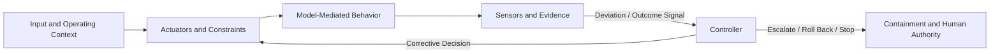

# The AI Control Plane

**Status:** Draft normative  
**Role:** Capability model for constraining, observing, and correcting model-mediated behavior

## Purpose

This module defines the control capabilities required to operate Thinking Systems as closed-loop systems rather than open-loop model integrations.

The AI Control Plane is not necessarily a standalone product or infrastructure layer. Its responsibilities may be distributed across application code, platform services, evaluation systems, human workflows, release processes, and governance mechanisms.

## Defines

This module defines or develops:

- **Actuators** that shape or constrain model-mediated behavior;
- **Sensors** that observe outputs, outcomes, drift, incidents, and operating conditions;
- **Controllers** that interpret evidence and authorize corrective action;
- feedback loops connecting observation to controlled change;
- release, escalation, rollback, containment, and shutdown responsibilities;
- traceability between evidence, decisions, and system changes.

## Does not define

This module does not prescribe:

- one centralized control-plane service;
- a specific model, framework, vendor, or deployment topology;
- universal quality, safety, latency, cost, or autonomy thresholds;
- fully automated control in contexts that require Human Authority;
- model quality as a substitute for system-level control.

## Key concepts

- actuator;
- sensor;
- controller;
- evidence and deviation signal;
- target operating envelope;
- Judgment Node boundary and authority constraint;
- release gate;
- escalation and Human Authority;
- rollback, containment, and shutdown;
- feedback latency and control cadence.

## Capability areas

- [`00-actuators/`](00-actuators/) — mechanisms capable of changing or constraining behavior.
- [`01-sensors/`](01-sensors/) — evidence about behavior, outcomes, drift, and operating conditions.
- [`02-controller/`](02-controller/) — interpretation, decision authority, and corrective action.

The capability-area documents inherit the module's draft-normative boundary when they define a capability. Examples and implementation-oriented subareas are informative unless explicitly stated otherwise.

## Judgment Node boundaries and control capabilities

The [`Judgment Node Boundary`](../01-patterns/judgment-node-boundary.md) pattern identifies what must be bounded, observed, and corrected around a particular use of Model Judgment.

The AI Control Plane supplies the capability vocabulary used to operate that boundary:

- actuators and constraints shape context, configuration, permissions, routing, tool access, execution, or other behavior;
- sensors produce evidence about the node, its downstream effects, and its operating conditions;
- controllers interpret that evidence and authorize corrective action;
- escalation, fallback, containment, rollback, or shutdown provide intervention paths.

A boundary description is not itself a functioning control loop. The loop becomes operational only when evidence reaches decision authority and that authority has a real mechanism capable of changing, containing, or stopping behavior.

## Relationships

- [`00-doctrine/`](../00-doctrine/) explains why probabilistic judgment requires explicit boundaries and feedback, including the [`Model Judgment Placement`](../00-doctrine/model-judgment-placement.md) taxonomy.
- [`01-patterns/`](../01-patterns/) describes reusable ways to implement control responsibilities, including the [`Judgment Node Boundary`](../01-patterns/judgment-node-boundary.md) pattern.
- [`03-reference-architectures/`](../03-reference-architectures/) demonstrates possible distributions of control-plane capabilities.
- [`04-failure-modes/`](../04-failure-modes/) identifies deviations and control failures the plane must detect or mitigate.
- [`SPECIFICATION.md`](../SPECIFICATION.md) defines the status and normative boundary of this module.

## Control-loop architecture

A functioning loop requires more than telemetry. Observation becomes control only when evidence is connected to decision rights and a mechanism capable of changing, containing, or stopping behavior.
