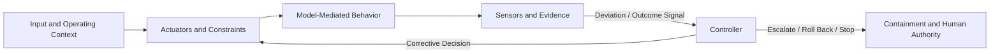

# The AI Control Plane

**Status:** Draft normative  
**Role:** Capability model for constraining, observing, and correcting model-mediated behavior

## Purpose

This module defines the control capabilities required to operate Thinking Systems as closed-loop systems rather than open-loop model integrations.

The AI Control Plane is not necessarily a standalone product or infrastructure layer. Its responsibilities may be distributed across application code, platform services, evaluation systems, human workflows, release processes, and governance mechanisms.

## Defines

This module defines or develops:

- **Actuators** that shape or constrain model-mediated behavior;
- **Sensors** that observe outputs, outcomes, drift, incidents, and operating conditions;
- **Controllers** that interpret evidence and authorize corrective action;
- feedback loops connecting observation to controlled change;
- release, escalation, rollback, containment, and shutdown responsibilities;
- traceability between evidence, decisions, and system changes.

## Does not define

This module does not prescribe:

- one centralized control-plane service;
- a specific model, framework, vendor, or deployment topology;
- universal quality, safety, latency, cost, or autonomy thresholds;
- fully automated control in contexts that require human authority;
- model quality as a substitute for system-level control.

## Key concepts

- actuator;
- sensor;
- controller;
- error or deviation signal;
- target operating envelope;
- release gate;
- escalation and human authority;
- rollback, containment, and shutdown;
- feedback latency and control cadence.

## Relationships

- [`00-doctrine/`](../00-doctrine/) explains why probabilistic judgment requires explicit boundaries and feedback.
- [`01-patterns/`](../01-patterns/) describes reusable ways to implement control responsibilities.
- [`03-reference-architectures/`](../03-reference-architectures/) demonstrates possible distributions of control-plane capabilities.
- [`04-failure-modes/`](../04-failure-modes/) identifies deviations and control failures the plane must detect or mitigate.
- [`SPECIFICATION.md`](../SPECIFICATION.md) defines the status and normative boundary of this module.

## Control-loop architecture

A functioning loop requires more than telemetry. Observation becomes control only when evidence is connected to decision rights and a mechanism capable of changing, containing, or stopping behavior.
