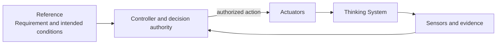
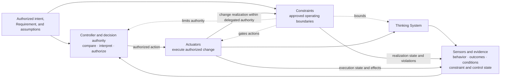
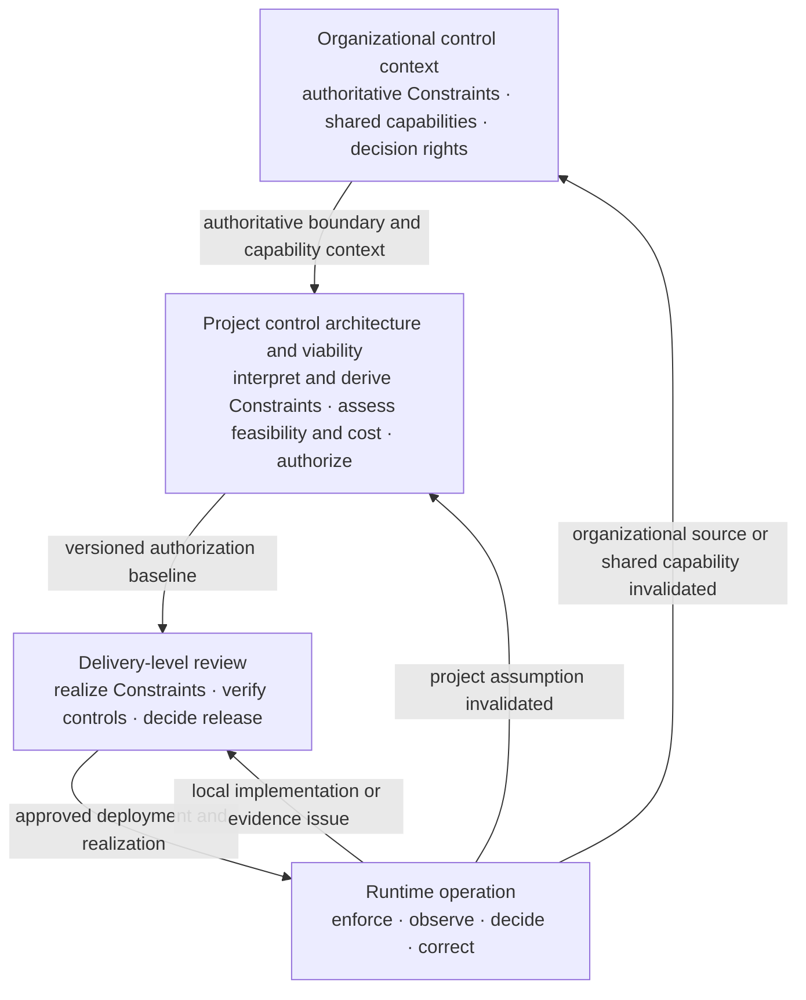

# The AI Control Plane

**Status:** Draft normative  
**Role:** Distributed capability model for bounding, observing, deciding, and correcting model-mediated behavior

## Purpose

This module defines the capabilities used to operate Thinking Systems as governed closed-loop systems rather than open-loop model integrations.

The AI Control Plane is not necessarily a standalone product, service, platform, or infrastructure layer. Its responsibilities may be distributed across application code, platform services, evaluation systems, human workflows, project and release processes, incident response, and organizational mechanisms.

The [`Nested Control Lifecycle`](../00-doctrine/nested-control-lifecycle.md) defines **where decisions are owned**. The [`Control-Loop Capability Anatomy`](../00-doctrine/control-loop-anatomy.md) defines **which logical functions make those decisions operational**.

## Four capability classes

UA distinguishes:

1. **Constraints** — approved conditions that limit the allowed operating space.
2. **Sensors and evidence** — mechanisms that make behavior, outcomes, conditions, Constraint Realization state, Actuator execution, and control health observable.
3. **Controllers and decision authority** — functions that compare or interpret evidence against approved conditions and select or authorize action.
4. **Actuators and corrective action** — mechanisms that execute authorized changes to operation.

The classes are not a mandatory physical stack. One component may perform several functions, and one function may be distributed across technical and human mechanisms.

## Feedback loop and bounded operation

A closed feedback loop connects the controlled process to sensing, decision, and action:



Closed-loop operation alone is not sufficient. A loop may be closed while over-authorized, unsafe, or able to reach prohibited states.

UA adds explicit Constraints and their realizations:



Constraints bound the space in which the loop may operate. They are not the feedback edge itself.

## Capability areas

- [`00-actuators/`](00-actuators/) — mechanisms that execute authorized change.
- [`01-constraints/`](01-constraints/) — approved boundaries and their realization.
- [`02-sensors/`](02-sensors/) — evidence about behavior, outcomes, Constraints, Actuator execution, drift, and control health.
- [`03-controller/`](03-controller/) — interpretation, decision authority, escalation, and authorization of corrective action.

The directory numbering is navigation only. It does not define a required execution order or physical layering.

## Constraint, realization, and Actuator boundary

- A **Constraint** defines the approved boundary.
- A **Constraint Realization** implements, enforces, or influences that boundary for a defined scope.
- An **Actuator** executes an authorized change, including a change to a Constraint Realization within delegated authority.

A Constraint Realization may reject an attempted action. An Actuator may install, tighten, relax, replace, or remove a realization. These functions remain distinct even when one component performs several of them.

Example:

```text
Constraint: only approved support queues may be selected
→ realization: deterministic queue allowlist
→ sensor: rejected-route and configuration-health evidence
→ controller: authorized release or operational decision
→ actuator: update the allowlist, disable automated routing, or switch to manual triage
```

## Hard and soft Constraints

A **Hard Constraint** deterministically prevents or rejects violation within explicitly stated assumptions, scope, and enforcement boundaries.

A **Soft Constraint** influences probabilistic behavior without guaranteeing that a prohibited state, action, or output remains unreachable.

Prompts, natural-language policies, rubrics, probabilistic evaluators, and model safety classifiers are not hard merely because their failure behavior is documented. A composite control may use probabilistic sensing together with a deterministic downstream block, but the hard guarantee comes from the deterministic enforcement path and its stated assumptions.

## Controller and Actuator boundary

A Controller compares or interprets evidence and selects or authorizes action. An Actuator executes the action.

A single service or human workflow may contain both functions, but the distinction must remain visible so that decision rights, execution rights, evidence, latency, and failure behavior can be reviewed.

## Sensor, gate, and release action

Classification follows the function performed in the specific system:

```text
Golden Scenarios and evaluation runner
→ Sensor and evidence

Threshold or policy logic selecting block / canary / release
→ Controller function

Deployment, exposure change, rollback, or block execution
→ Actuator function
```

An `Eval Gate` may package all three functions, but the package name does not collapse their responsibilities.

## Tool mapping rule

Do not classify a product or framework solely by name.

- a Prompt Registry may provide configuration, traceability, evidence, or Actuator inputs;
- a semantic monitor normally performs a Sensor function;
- JSON Schema may realize a structural Constraint;
- a kill-switch endpoint normally performs an Actuator function;
- a HITL gateway may realize an approval Constraint, a Controller interface, evidence capture, and an Actuator path;
- a policy engine may realize Constraints and, in a bounded case, Controller logic;
- an agent framework may host execution, routing, sensing, and constraint mechanisms without owning higher-level authorization.

Classification follows approved function, guarantee, evidence, authority, and corrective path.

## Control capabilities across the Nested Control Lifecycle



### Organizational level

The organization supplies authoritative Constraint sources, shared capabilities, and decision rights, such as prohibited uses, legal and contractual obligations, approved vendors and regions, identity, audit, incident response, Human Authority, and shutdown capability.

### Project level

The [`Project Control Architecture and Viability Review`](../01-patterns/project-control-architecture-and-viability-review.md) determines:

- which organizational Constraints apply;
- which project-specific Constraints follow from material risk scenarios;
- which realizations and evidence appear feasible;
- which Sensors, Controllers, Actuators, Human Authority, fallback, containment, rollback, compensation, or shutdown capabilities are required;
- whether the complete control perimeter is technically, operationally, and economically viable;
- which boundary delivery reviews inherit.

### Delivery level

The [`Thinking System Review`](../01-patterns/thinking-system-review.md) links the project baseline and records one concrete Constraint Realization map for the bounded system, feature, or material change. It verifies readiness, completion, deployment-specific release, and local reassessment without redefining project authorization.

### Runtime level

Runtime exercises deployed realizations, records behavior and control health, routes evidence to authorized Controllers, invokes Actuators within delegated authority, and sends invalidating evidence to the decision level whose basis changed.

## Capability completeness

A UA control architecture is incomplete when, for a material scenario:

- no approved Constraint or operating boundary exists;
- no credible realization exists;
- a probabilistic influence is represented as a hard guarantee;
- the realization has no observable state or failure evidence;
- evidence reaches no Controller with decision authority;
- the Controller lacks an effective Actuator path;
- authority to change a Constraint is unclear or exceeds the approved boundary;
- corrective action cannot occur within the required time;
- the complete control path is operationally or economically non-viable.

## Non-prescription

This module does not prescribe:

- one centralized control-plane service;
- four separate products or services;
- one vendor, framework, schema technology, policy engine, or topology;
- universal quality, safety, latency, cost, risk, autonomy, or evidence thresholds;
- fully automated control when Human Authority is required;
- one universal Constraint catalogue;
- one mandatory product classification;
- one mandatory fail-open or fail-closed rule.

## Relationships

- [`00-doctrine/control-loop-anatomy.md`](../00-doctrine/control-loop-anatomy.md) defines the four capability classes and their relationships.
- [`00-doctrine/glossary.md`](../00-doctrine/glossary.md) owns canonical terminology.
- [`00-doctrine/nested-control-lifecycle.md`](../00-doctrine/nested-control-lifecycle.md) defines decision ownership and upward reassessment.
- [`01-patterns/project-control-architecture-and-viability-review.md`](../01-patterns/project-control-architecture-and-viability-review.md) applies the model to project viability and authorization.
- [`01-patterns/thinking-system-review.md`](../01-patterns/thinking-system-review.md) applies it to delivery readiness, completion, release, and reassessment.
- [`01-patterns/judgment-node-boundary.md`](../01-patterns/judgment-node-boundary.md) applies it around consequential Model Judgment.
- [`03-reference-architectures/`](../03-reference-architectures/) demonstrates possible distributions of capabilities.
- [`04-failure-modes/`](../04-failure-modes/) identifies recurring boundary, realization, sensing, decision, and actuation failures.
- [`SPECIFICATION.md`](../SPECIFICATION.md) defines status and conformance boundaries.
