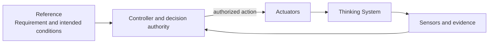
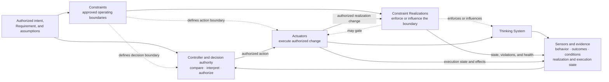
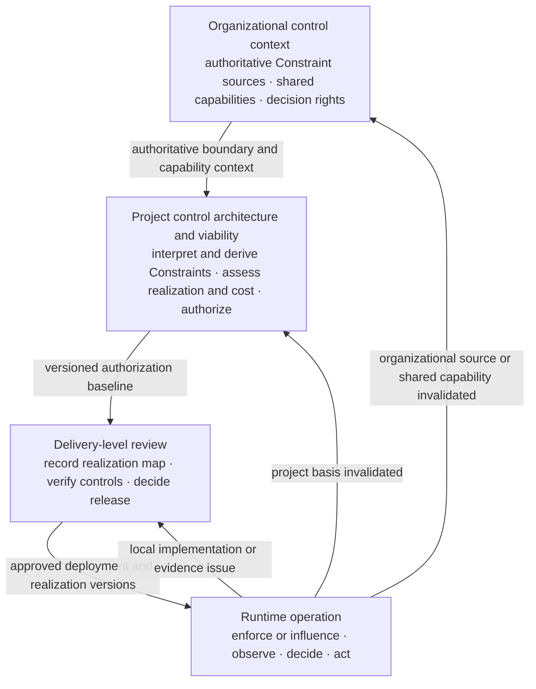

# The AI Control Plane

> **UA navigation**
>
> [UA Home](../README.md) · [Specification](../SPECIFICATION.md)
>
> **Lifecycle:** [Organization / boundaries](../00-doctrine/nested-control-lifecycle.md#1-organizational-control-context) · [Project / architecture](../01-patterns/project-control-architecture-and-viability-review.md) · [Delivery / release](../01-patterns/thinking-system-review.md) · [Runtime / reassessment](../00-doctrine/nested-control-lifecycle.md#4-runtime-operation-and-reassessment)
>
> **Explore:** [Doctrine](../00-doctrine/) · [Patterns](../01-patterns/) · [Control capabilities](README.md) · [Reference architectures](../03-reference-architectures/) · [Failure modes](../04-failure-modes/) · [Research](../content/research/index.md)

**Status:** Draft normative  
**Role:** Distributed capability model for defining and realizing boundaries, observing behavior, deciding, and correcting model-mediated operation

## Purpose

This module develops the capability families used to operate Thinking Systems as governed closed-loop systems rather than open-loop model integrations.

The AI Control Plane is not necessarily a standalone product, service, platform, or infrastructure layer. Responsibilities may be distributed across application code, platform services, evaluation systems, human workflows, release processes, incident response, and organizational mechanisms.

The [`Nested Control Lifecycle`](../00-doctrine/nested-control-lifecycle.md) defines **where decisions are owned**. The [`Control-Loop Capability Anatomy`](../00-doctrine/control-loop-anatomy.md) defines **which logical functions make those decisions operational**.

## Four capability families

1. [`Constraints and their realizations`](01-constraints/) — approved boundaries plus the mechanisms that implement, enforce, or influence them.
2. [`Sensors and evidence`](02-sensors/) — mechanisms observing behavior, outcomes, operating conditions, Constraint Realization state, Actuator execution, and control health.
3. [`Controllers and decision authority`](03-controller/) — functions comparing or interpreting evidence against approved conditions and selecting or authorizing action.
4. [`Actuators and corrective action`](00-actuators/) — mechanisms executing authorized changes to operation.

The first family is intentionally composite. A Constraint is an authoritative decision object, while a Constraint Realization is its operational mechanism. Constraint Realization is not a fifth capability family.

The capability families are not a mandatory physical stack. One component may perform several functions, and one function may be distributed.

## Feedback loop and bounded operation

A feedback loop closes through sensing, decision, and effective actuation:



Closed-loop operation alone is not sufficient. A loop may be closed while over-authorized, unsafe, or able to reach prohibited states.



Constraints bound the space in which the loop may operate. Their realizations make that boundary operational. Neither is the feedback edge itself.

## Capability areas

- [`00-actuators/`](00-actuators/) — execution of authorized change.
- [`01-constraints/`](01-constraints/) — approved boundaries and their realizations.
- [`02-sensors/`](02-sensors/) — evidence about behavior, outcomes, realizations, Actuator execution, drift, and control health.
- [`03-controller/`](03-controller/) — comparison, interpretation, decision authority, escalation, and authorization of action.

The directory numbering is navigation only. It does not define a required execution order or topology.

## Capability boundaries

### Constraint and Constraint Realization

- A **Constraint** defines the approved boundary.
- A **Constraint Realization** implements, enforces, or influences it for a defined scope.
- The Constraints capability family depends on both remaining connected and traceable.

### Controller and Actuator

- A **Controller** selects or authorizes action.
- An **Actuator** executes action.

### Sensor and gate

```text
Evaluator and metrics
→ Sensor

Logic selecting block / canary / release
→ Controller function

Deployment, exposure change, blocking, or rollback
→ Actuator function
```

A product may package several functions. Its name does not remove their different evidence, authority, and failure responsibilities.

## Hard and Soft Constraint claims

Hard or soft is a scoped claim about a Constraint together with its complete realized path, not an intrinsic property of source policy text.

A **Hard Constraint** deterministically prevents or rejects violation within explicitly stated assumptions, subject, path, scope, and enforcement boundaries.

A **Soft Constraint** influences probabilistic behavior without guaranteeing that a prohibited state, action, or output remains unreachable.

Prompts, natural-language policies, rubrics, probabilistic evaluators, and model safety classifiers are not hard by themselves. A composite control may use probabilistic sensing and deterministic downstream blocking, but the claimed guarantee follows the complete realized path and its assumptions.

When one source condition has different guarantee strengths across subjects, paths, or scopes, record separate Constraint claims rather than one mixed hard/soft record.

## Tool mapping rule

Classify by function in the specific system:

- Prompt Registry — configuration, traceability, evidence, or Actuator input;
- semantic monitor — normally Sensor;
- JSON Schema — possible structural Constraint Realization;
- kill-switch endpoint — normally Actuator;
- HITL gateway — may combine approval Constraint Realization, Controller interface, evidence capture, and Actuator path;
- policy engine — may realize Constraints and bounded Controller logic;
- agent framework — may host execution, routing, sensing, and realization without owning higher-level authorization.

Named technologies are examples, not requirements.

## Across the Nested Control Lifecycle



### Organizational level

See [`Organizational control context`](../00-doctrine/nested-control-lifecycle.md#1-organizational-control-context).

Supplies authoritative Constraint sources, shared capabilities, and decision rights.

### Project level

The [`Project Control Architecture and Viability Review`](../01-patterns/project-control-architecture-and-viability-review.md) defines one Project Constraint Architecture and assesses realization, sensing, authority, actuation, Human Authority, capacity, economics, authorization, and inheritance.

### Delivery level

The [`Thinking System Review`](../01-patterns/thinking-system-review.md) links the project baseline and records one concrete Constraint Realization Map for a bounded system, feature, or material change.

### Runtime level

See [`Runtime operation and reassessment`](../00-doctrine/nested-control-lifecycle.md#4-runtime-operation-and-reassessment).

Runtime exercises deployed realizations, records behavior and control health, routes evidence to authorized Controllers, invokes Actuators within delegated authority, and sends invalidating evidence to the appropriate decision level.

## Capability completeness

For a material scenario, a UA control architecture is incomplete when:

- no approved Constraint exists;
- no credible realization exists;
- a probabilistic influence is represented as a Hard Constraint;
- realization activation, coverage, failure, or health cannot be observed;
- evidence reaches no Controller with decision authority;
- the Controller lacks an effective Actuator;
- authority to change a realization is unclear or excessive;
- correction cannot occur within the consequence window;
- the complete path is operationally or economically non-viable.

## Non-prescription

This module does not prescribe one centralized service, four products, one vendor, one schema technology, one evaluator, one policy engine, one topology, universal thresholds, fully automated control, one Constraint catalogue, one product classification, or one fail-open/fail-closed rule.

## Relationships

- [`../00-doctrine/control-loop-anatomy.md`](../00-doctrine/control-loop-anatomy.md) defines canonical capability relationships.
- [`../00-doctrine/glossary.md`](../00-doctrine/glossary.md) owns terminology.
- [`../00-doctrine/nested-control-lifecycle.md`](../00-doctrine/nested-control-lifecycle.md) defines decision ownership and reassessment.
- [`../01-patterns/project-control-architecture-and-viability-review.md`](../01-patterns/project-control-architecture-and-viability-review.md) applies the model at project level.
- [`../01-patterns/thinking-system-review.md`](../01-patterns/thinking-system-review.md) applies it at delivery level.
- [`../01-patterns/judgment-node-boundary.md`](../01-patterns/judgment-node-boundary.md) applies it around Model Judgment.
- [`../03-reference-architectures/`](../03-reference-architectures/) demonstrates compositions.
- [`../04-failure-modes/`](../04-failure-modes/) records recurring failures.
- [`../SPECIFICATION.md`](../SPECIFICATION.md) defines status and conformance.
