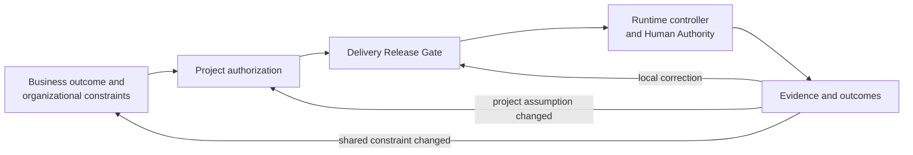
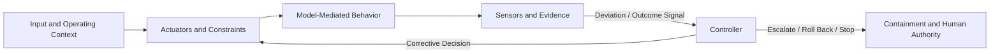

# The AI Control Plane

**Status:** Draft normative  
**Role:** Capability model for constraining, observing, and correcting model-mediated behavior

## Purpose

This module defines the control capabilities required to operate Thinking Systems as closed-loop systems rather than open-loop model integrations.

The AI Control Plane is not necessarily a standalone product or infrastructure layer. Its responsibilities may be distributed across application code, platform services, evaluation systems, human workflows, project and release processes, and governance mechanisms.

The [`Nested Control Lifecycle`](../00-doctrine/nested-control-lifecycle.md) defines where organizational, project, delivery, and runtime decisions are owned. This module defines the capabilities that make those decisions operational.

## Defines

This module defines or develops:

- **Actuators** that shape or constrain model-mediated behavior;
- **Sensors** that observe outputs, outcomes, drift, incidents, and operating conditions;
- **Controllers** that interpret evidence and authorize corrective action;
- feedback loops connecting observation to controlled change;
- project, release, escalation, rollback, containment, compensation, and shutdown responsibilities;
- traceability between evidence, decisions, and system changes.

## Does not define

This module does not prescribe:

- one centralized control-plane service;
- a specific model, framework, vendor, or deployment topology;
- universal quality, safety, latency, cost, risk, or autonomy thresholds;
- fully automated control in contexts that require Human Authority;
- model quality as a substitute for system-level control;
- one mandatory project or delivery review process.

## Key concepts

- actuator;
- sensor;
- controller;
- evidence and deviation signal;
- target operating envelope;
- Judgment Node boundary and authority constraint;
- project authorization;
- delivery release gate;
- escalation and Human Authority;
- fallback, compensation, rollback, containment, and shutdown;
- feedback latency and control cadence;
- local reassessment and project reauthorization.

## Capability areas

- [`00-actuators/`](00-actuators/) — mechanisms capable of changing or constraining behavior.
- [`01-sensors/`](01-sensors/) — evidence about behavior, outcomes, drift, and operating conditions.
- [`02-controller/`](02-controller/) — interpretation, decision authority, and corrective action.

The capability-area documents inherit the module's draft-normative boundary when they define a capability. Examples and implementation-oriented subareas are informative unless explicitly stated otherwise.

## Control capabilities across review levels

The same control-capability vocabulary is used at different decision levels without making those levels identical.

### Project level

The [`Project Control Architecture and Viability Review`](../01-patterns/project-control-architecture-and-viability-review.md) uses the capability model to determine:

- which material risk scenarios require prevention, sensing, decision authority, intervention, fallback, containment, rollback, compensation, or shutdown;
- which capabilities already exist as organizational services or processes;
- which controls must be built or adapted by the project;
- whether evidence and corrective action can arrive within the required time;
- whether Human Authority and operational capacity are substantive;
- whether the complete control perimeter is technically, operationally, and economically viable.

A project control architecture is not a list of tools. Each critical scenario should connect evidence to a controller with authority and to a real corrective mechanism.

### Delivery level

The [`Thinking System Review`](../01-patterns/thinking-system-review.md) refines the inherited project capability requirements around implementation-level Judgment Nodes, the local Requirement and Operating Envelope, DoR, evidence, DoD, the deployment-specific Release Gate, and local reassessment.

The delivery review may narrow or instantiate project controls. It must not silently remove a required capability or expand project authority.

### Runtime level

Runtime evidence exercises the actual control loop. It may:

- trigger a local corrective action or delivery reassessment;
- invalidate a project risk, authority, capacity, evidence, or economic assumption and require project reauthorization;
- expose a missing or degraded shared capability and require organizational review.

The affected decision level follows the assumption invalidated by evidence.

## Judgment Node boundaries and control capabilities

The [`Judgment Node Boundary`](../01-patterns/judgment-node-boundary.md) pattern identifies what must be bounded, observed, and corrected around a particular use of Model Judgment.

The AI Control Plane supplies the capability vocabulary used to operate that boundary:

- actuators and constraints shape context, configuration, permissions, routing, tool access, execution, or other behavior;
- sensors produce evidence about the node, its downstream effects, and its operating conditions;
- controllers interpret that evidence and authorize corrective action;
- escalation, fallback, containment, compensation, rollback, or shutdown provide intervention paths.

A boundary description is not itself a functioning control loop. The loop becomes operational only when evidence reaches decision authority and that authority has a real mechanism capable of changing, containing, compensating, or stopping behavior.

## Relationships

- [`00-doctrine/`](../00-doctrine/) explains why probabilistic judgment requires explicit boundaries and feedback, including [`Uncertainty in the Controlled Object`](../00-doctrine/uncertainty-in-the-controlled-object.md), the [`Nested Control Lifecycle`](../00-doctrine/nested-control-lifecycle.md), and the [`Model Judgment Placement`](../00-doctrine/model-judgment-placement.md) taxonomy.
- [`01-patterns/project-control-architecture-and-viability-review.md`](../01-patterns/project-control-architecture-and-viability-review.md) uses the capability model for project-level risk-control feasibility, capacity, economics, authorization, and reauthorization.
- [`01-patterns/thinking-system-review.md`](../01-patterns/thinking-system-review.md) uses the capability model for delivery-level readiness, evidence, release, and local reassessment.
- [`01-patterns/judgment-node-boundary.md`](../01-patterns/judgment-node-boundary.md) applies capabilities around consequential Judgment Nodes.
- [`03-reference-architectures/`](../03-reference-architectures/) demonstrates possible distributions of control-plane capabilities.
- [`04-failure-modes/`](../04-failure-modes/) identifies deviations and control failures the plane must detect or mitigate.
- [`SPECIFICATION.md`](../SPECIFICATION.md) defines the status and normative boundary of this module.

## Control-loop architecture

A functioning loop requires more than telemetry. Observation becomes control only when evidence is connected to decision rights and a mechanism capable of changing, containing, compensating, or stopping behavior.
