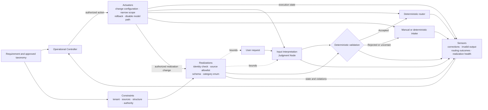
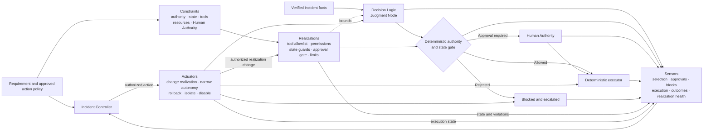
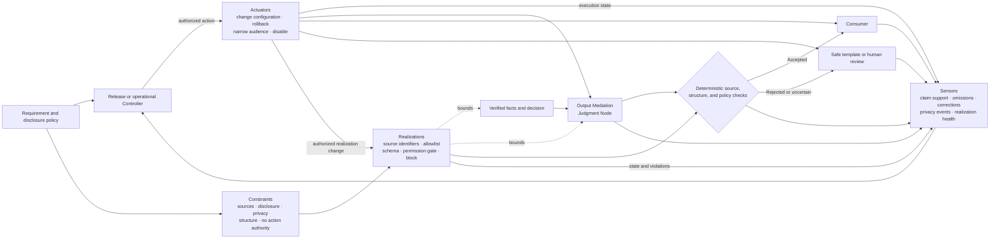
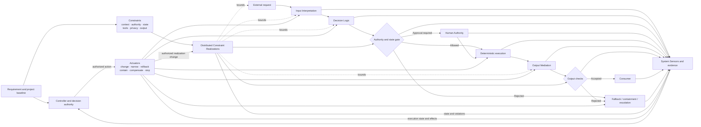

# Judgment Placement Reference Architectures

## Status

This document is **reference** material. It shows four non-prescriptive compositions of Model Judgment placement, Judgment Node boundaries, and AI Control Plane capabilities.

The examples classify functions, not products. They do not establish conformance or a mandatory topology.

In every example:

- a **Constraint** is the approved boundary;
- a **Constraint Realization** is the mechanism implementing, enforcing, or influencing that boundary;
- a **Sensor** produces evidence;
- a **Controller** selects or authorizes action;
- an **Actuator** executes the action.

## 1. Reading the examples

| Example | Context | Model Judgment authority |
|---|---|---|
| Input Interpretation | Route an ambiguous support request | Propose structured intent and routing context |
| Decision Logic | Select from an approved incident playbook | Recommend or select a bounded action |
| Output Mediation | Explain verified account or operational data | Transform presentation without changing source facts or decisions |
| Composite | Interpret, choose, execute, and explain a service request | Different authority at each bounded node |

The examples identify:

- Judgment Node and system boundaries;
- approved Constraints and concrete realizations;
- deterministic responsibilities and Invariants;
- Sensors and evidence;
- Controller and decision authority;
- Actuators and corrective paths;
- fallback and reassessment.

DoR, DoD, Release Gate, and the canonical delivery Constraint Realization Map remain owned by the [`Thinking System Review`](../01-patterns/thinking-system-review.md).

## 2. Input Interpretation

### Context

A support intake service converts a natural-language request into structured intent, category, and routing context. Downstream routing remains deterministic.



| Element | Reference choice |
|---|---|
| Constraint | Current-tenant data only; approved taxonomy and sources; no business-action authority; unsupported cases fall back. |
| Realization | Identity and tenant checks, source allowlist, typed schema, category enumeration, validation, and routing permission boundary. |
| Sensor | Corrections, rerouting, invalid structure, unsupported categories, fallback rate, realization health, and drift after version changes. |
| Controller | Operational authority interprets evidence and authorizes changes within the project boundary. |
| Actuator | Deploy taxonomy or source changes, roll back prompt/model, narrow population, force manual intake, or disable the model path. |
| Fallback | Human triage or deterministic intake form. |

Primary risks include ambiguous intent, prompt injection, contaminated context, valid structure with incorrect meaning, and taxonomy changes that expand scope.

## 3. Decision Logic

### Context

An incident-response service receives verified incident facts. A Judgment Node selects or recommends an action from an approved catalogue. Deterministic gates enforce authority and state conditions.



| Element | Reference choice |
|---|---|
| Constraint | Approved action space, scoped credentials, deterministic preconditions, approval for consequential action, bounded rate and duration, no self-expansion. |
| Realization | Tool allowlist, typed contracts, permission scopes, state-machine guards, approval gate, workflow-depth and transaction limits. |
| Sensor | Selection, approval, blocked attempts, execution state, downstream outcome, resource use, and realization health. |
| Controller | Incident authority authorizes continuation, narrowing, catalogue changes, rollback, isolation, or stop. |
| Actuator | Deploy catalogue or permission changes, require approval, switch to deterministic playbook, isolate environment, roll back, or disable execution. |
| Fallback | Deterministic playbook, no-action safe state, or human escalation. |

Primary risks include excessive authority, incorrect tool selection, bypass, ineffective Human Authority, stale permissions, and unauthorized relaxation of a Hard Constraint.

## 4. Output Mediation

### Context

A deterministic core has produced verified data or an approved decision. A Judgment Node creates an explanation for a customer or downstream system.



| Element | Reference choice |
|---|---|
| Constraint | Approved sources, mandatory disclosure, privacy and tenant boundaries, output contract, no fact or decision alteration, no autonomous action. |
| Realization | Source IDs, retrieval allowlist, disclosure rules, schema validation, permission boundary, deterministic block, and Human Authority where semantic enforcement is incomplete. |
| Sensor | Claim support, omission, disclosure coverage, corrections, privacy events, parser failures, and source or policy drift. |
| Controller | Release or operational authority authorizes source, policy, audience, model, prompt, fallback, or deployment changes. |
| Actuator | Deploy approved-source or disclosure changes, roll back, narrow audience, switch template, hide output, or disable the path. |
| Fallback | Deterministic template, verified facts, refusal, or human review. |

Primary risks include unsupported claims, misleading confidence, omission, privacy failure, and wording that changes user behavior despite unchanged source facts.

## 5. Composite Thinking System

### Context

A service workflow interprets a request, selects a bounded action, executes through deterministic tooling, and explains the verified result.



This composition requires system-level evidence. Strong local evaluations do not prove that error propagation, authority, transactions, disclosures, and user outcomes remain acceptable end to end.

Primary risks include cross-node error propagation, lost or conflicting Constraints, orchestration-based authority expansion, partial execution, inconsistent state, and local metrics disconnected from business outcomes.

## 6. Evaluation gate decomposition

An implementation may call one package an `Eval Gate`, but the capability functions remain:

```text
Golden Scenarios, evaluator, and metrics
→ Sensor and evidence

Logic selecting block / canary / release
→ Controller function

Deployment, exposure change, block, or rollback execution
→ Actuator function
```

This distinction preserves decision rights, failure behavior, and execution traceability.

## 7. Review use

When adapting an example:

1. link the project authorization and relevant Constraint IDs;
2. record concrete realizations in the delivery Constraint Realization Map;
3. identify reference conditions and Sensor evidence;
4. identify Controller decision rights;
5. identify real Actuator paths and execution evidence;
6. distinguish local correction from project reauthorization;
7. derive thresholds and controls from the actual Requirement and consequence context.

## Relationships

- [`../00-doctrine/control-loop-anatomy.md`](../00-doctrine/control-loop-anatomy.md) defines capability relationships.
- [`../00-doctrine/model-judgment-placement.md`](../00-doctrine/model-judgment-placement.md) defines placement functions.
- [`../01-patterns/judgment-node-boundary.md`](../01-patterns/judgment-node-boundary.md) defines node boundaries.
- [`../01-patterns/thinking-system-review.md`](../01-patterns/thinking-system-review.md) owns delivery realization and release.
- [`../02-ai-control-plane/`](../02-ai-control-plane/) develops the control capabilities.
- [`../04-failure-modes/`](../04-failure-modes/) records recurring failures.
