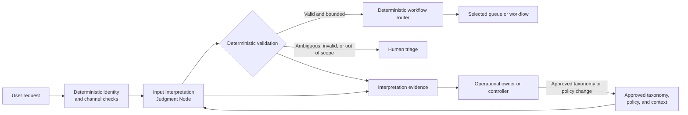
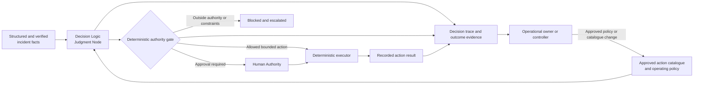
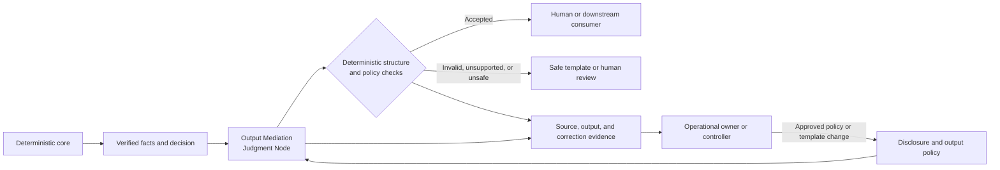
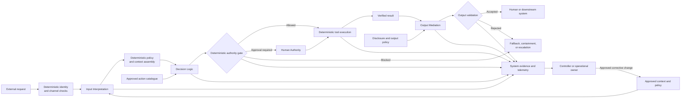

# Judgment Placement Reference Architectures

## Status

This document is **reference** material. It shows four minimal, non-prescriptive compositions of the [`Model Judgment Placement`](../00-doctrine/model-judgment-placement.md) taxonomy, the [`Judgment Node Boundary`](../01-patterns/judgment-node-boundary.md) pattern, the [`AI Control Plane`](../02-ai-control-plane/), and the [`Thinking System Review`](../01-patterns/thinking-system-review.md).

The examples help small and medium-sized engineering teams recognize where Model Judgment occurs and what must remain deterministic around it. Copying an example does not establish UA alignment, and no diagram is a mandatory topology.

## 1. How to read the examples

The first three examples deliberately isolate one placement class. The fourth shows one possible composite Thinking System.

| Example | Illustrative context | Model Judgment authority |
|---|---|---|
| Input Interpretation only | Route an ambiguous support request | Propose structured intent, category, and routing context |
| Decision Logic only | Select a response from an approved incident playbook | Recommend or select a bounded action under an authority gate |
| Output Mediation only | Explain verified account or operational data | Transform presentation without changing source facts or decisions |
| Composite Thinking System | Interpret, decide, execute, and explain a service request | Different authority at each node, constrained by deterministic boundaries |

For each example, the architecture identifies the system boundary, Judgment Node, deterministic responsibilities, authority, evidence, fallback, major risks, and the Thinking System Review areas that deserve attention.

The complete Definition of Ready and Definition of Done remain canonically owned by [`thinking-system-review.md`](../01-patterns/thinking-system-review.md). They are not repeated here.

## 2. Input Interpretation only

### Context

A support intake service receives a natural-language request and maps it to a structured intent, category, and routing context. The downstream workflow is deterministic.

| Element | Reference choice |
|---|---|
| **System boundary** | Identity and channel checks, approved context, the Judgment Node, validation, deterministic routing, evidence, and human triage. |
| **Judgment Node** | Converts ambiguous input into intent, category, extracted entities, or routing context. |
| **Deterministic responsibilities** | Authentication, allowed schemas and categories, permissions, exact routing rules, data mutation, audit logging, and rejection of unsupported interpretations. |
| **Authority boundary** | The node may propose structured interpretation. It may not grant permissions, authorize business actions, invent workflows, or bypass policy. |
| **Key sensor or evidence** | Human corrections, rerouting, unsupported category generation, identity or authorization confusion, and drift after model, prompt, taxonomy, or context changes. |
| **Fallback** | Human triage or a deterministic intake form. |

**Major risks**

- ambiguous intent;
- prompt injection or instruction confusion inside user text;
- contaminated context;
- unsupported assumptions;
- identity or authorization confusion;
- deterministic routing built on an incorrect interpretation.

**Thinking System Review focus**

Prioritize Judgment Node identification, placement, authority, evidence strategy, boundary testing, operational controls, and reassessment after taxonomy, context, prompt, or model changes. See the complete [`Thinking System Review`](../01-patterns/thinking-system-review.md).

## 3. Decision Logic only

### Context

An incident-response service receives structured and verified incident facts. A Judgment Node recommends or selects a response from an approved action catalogue. Deterministic gates decide whether execution is allowed, requires Human Authority, or must be blocked.

| Element | Reference choice |
|---|---|
| **System boundary** | Trusted incident facts, approved action catalogue, the Judgment Node, authority gate, Human Authority, deterministic execution, evidence, and escalation. |
| **Judgment Node** | Ranks, recommends, plans, or selects only within an approved action space. |
| **Deterministic responsibilities** | Trusted input facts, permissions, limits, transaction boundaries, approval requirements, tool execution, side-effect recording, and blocking. |
| **Authority boundary** | The node may recommend or select bounded actions. It may not create permissions or tools, override policy, expand its authority, or bypass required approval. |
| **Key sensor or evidence** | Selected action versus policy, approvals and overrides, blocked attempts, execution results, downstream outcomes, and plan divergence. |
| **Fallback** | Deterministic playbook, no-action safe state, or escalation to a human operator. |

**Major risks**

- excessive authority;
- unsafe routing or prioritization;
- incorrect tool or action selection;
- unauthorized execution;
- plan drift and compounding error;
- substitution of model preference for approved policy;
- ineffective Human Authority.

**Thinking System Review focus**

Prioritize authority, Operating Envelope, control strategy, ownership, bounded-experiment limits, authority testing, failure handling, Release Gate scope, supervision, rollback, and containment. See the complete [`Thinking System Review`](../01-patterns/thinking-system-review.md).

## 4. Output Mediation only

### Context

A deterministic core has already produced verified data, an approved decision, or a completed operational result. A Judgment Node turns those facts into an explanation for a customer or downstream system.

| Element | Reference choice |
|---|---|
| **System boundary** | Deterministic source of truth, verified data, output policy, the Judgment Node, enforceable checks, source evidence, and safe fallback. |
| **Judgment Node** | Explains, summarizes, translates, filters, or adapts verified information. |
| **Deterministic responsibilities** | Source facts, transaction state, approved decision, mandatory disclosures, data exposure rules, schema contracts, source identifiers, and blocking. |
| **Authority boundary** | The node may transform presentation. It may not alter facts or decisions, invent claims, hide mandatory limitations, or initiate a business action. |
| **Key sensor or evidence** | Claim-to-source support, omitted facts, disclosure coverage, human corrections, parser failures, and misleading confidence. |
| **Fallback** | Deterministic template, direct verified facts, safe refusal, or human review. |

**Major risks**

- semantic inaccuracy;
- unsupported claims;
- misleading confidence;
- unsafe transformation or omission;
- disclosure failure;
- downstream parser mismatch;
- wording that changes user action despite unchanged source data.

**Thinking System Review focus**

Prioritize the Requirement and Operating Envelope, evidence strategy, disclosure and output controls, behavioral evaluation, evidence quality, deterministic interfaces, fallback, audience scope, and reassessment after source, policy, model, prompt, or downstream-interface changes. See the complete [`Thinking System Review`](../01-patterns/thinking-system-review.md).

## 5. Composite Thinking System

### Context

A service workflow accepts a natural-language request, interprets it, chooses a bounded action, executes that action through deterministic tooling, and explains the verified result.

This composition contains all three placement classes, but it is only one possible arrangement. A real system may omit, repeat, combine, or reorder them.

| Element | Reference choice |
|---|---|
| **System boundary** | All Judgment Nodes plus identity, context, policy, authority, execution, verified-result, output, evidence, decision, fallback, containment, and escalation responsibilities. |
| **Judgment Nodes** | J1 interprets the request; J2 selects a bounded action; J3 explains the verified result. |
| **Deterministic responsibilities** | Identity, authorization, invariants, trusted context, action catalogue, approval, transaction integrity, verified result capture, disclosures, auditability, rollback, and shutdown. |
| **Authority boundary** | J1 shapes interpretation but gains no action authority. J2 remains behind the authority gate. J3 cannot alter the transaction or facts. |
| **Key sensor or evidence** | Interpretation corrections, decision traces, approvals, blocked actions, execution outcomes, claim support, end-to-end outcomes, resource use, and versioned dependencies. |
| **Fallback** | Manual intake, deterministic playbook, Human Authority, blocked execution, rollback or containment, deterministic output template, or human review. |

**Major risks**

- error propagation across Judgment Nodes;
- context contamination or policy loss between stages;
- authority expansion through orchestration;
- compounding planning and execution errors;
- syntactically valid but semantically unacceptable output;
- partial failure with inconsistent transaction and user-visible state;
- strong local metrics but missing end-to-end evidence;
- model, prompt, policy, tool, data, or provider drift.

**Thinking System Review focus**

Apply the complete review. Pay particular attention to separate Judgment Node cards, authority between nodes, cross-node scenarios, end-to-end evidence, degraded modes, rollback, containment, Release Gate conditions, and reassessment after any material dependency or authority change. See the [`Thinking System Review`](../01-patterns/thinking-system-review.md) and its [`template`](../01-patterns/thinking-system-review-template.md).

## 6. Cross-example lessons

1. **Placement is functional, not physical.** It describes what Model Judgment does, not where a service must be deployed.
2. **Placement does not determine risk.** Authority, consequence, exposure, reversibility, evidence, and corrective paths determine control depth.
3. **Deterministic code around a model is not automatically a sufficient boundary.** Context, authority, evidence, fallback, ownership, and change control also matter.
4. **Sensors differ by placement.** Interpretation correction, decision outcome, and claim support are different evidence problems.
5. **A local pass is not an end-to-end release decision.** Composite systems require evidence about propagation and system outcomes.
6. **Fallback must change the operating path.** Repeating the same uncertain call is not automatically a fallback.
7. **No universal threshold follows from these examples.** Tolerances and review effort come from the approved Requirement and deployment context.
8. **The AI path may be rejected.** When adequate authority, evidence, containment, or fallback cannot be justified, the responsible design may remain deterministic or human-operated.

## 7. Source interpretation and limits

The original presentation *Designing Non-Deterministic Systems: Maintaining Engineering Rigor in the AI Era* was used as source evidence for the slide 1-6 framework-transfer sequence. The repository source-intake record distinguishes the maintainer-supplied original PPTX used for slide-level review from the PDF export preserved under `content/raw/`.

Current UA narrows presentation shorthand as follows:

- non-zero variance does not make every undesirable tail event a Bug;
- the Operating Envelope is part of the complete Requirement, not its synonym;
- evidence may be deterministic, statistical, human, model-assisted, or combined;
- sample size, confidence methods, tolerances, and thresholds are context-derived;
- Input Interpretation, Decision Logic, and Output Mediation form a taxonomy, not a required pipeline;
- responsibility bundles and decision authority do not imply mandatory job titles;
- reference architectures do not create conformance by copying topology.

## 8. Related material

- [`Model Judgment Placement`](../00-doctrine/model-judgment-placement.md) — canonical functional taxonomy.
- [`Requirements, Correctness, and Bugs`](../00-doctrine/requirements-correctness-and-bugs.md) — Requirement, Operating Envelope, Correctness, and diagnostic model.
- [`Judgment Node Boundary`](../01-patterns/judgment-node-boundary.md) — reusable node-boundary pattern.
- [`Thinking System Review`](../01-patterns/thinking-system-review.md) — canonical review flow and full DoR, DoD, and Release Gate extensions.
- [`Thinking System Review Template`](../01-patterns/thinking-system-review-template.md) — one living SMB working artifact.
- [`AI Control Plane`](../02-ai-control-plane/) — distributed capabilities for sensing, decision, and corrective action.
