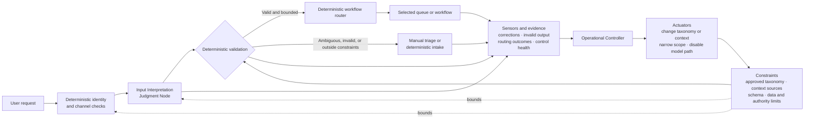
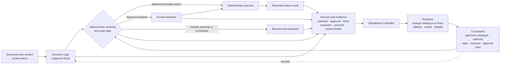
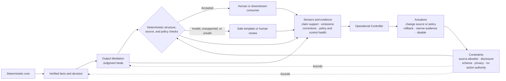
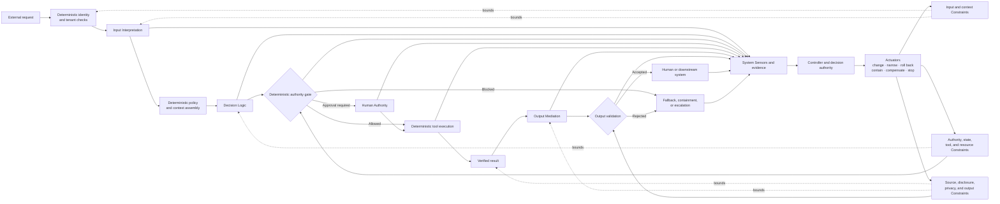

# Judgment Placement Reference Architectures

## Status

This document is **reference** material. It shows four minimal, non-prescriptive compositions of the [`Model Judgment Placement`](../00-doctrine/model-judgment-placement.md) taxonomy, the [`Judgment Node Boundary`](../01-patterns/judgment-node-boundary.md) pattern, the [`Control-Loop Capability Anatomy`](../00-doctrine/control-loop-anatomy.md), the [`AI Control Plane`](../02-ai-control-plane/), and the [`Thinking System Review`](../01-patterns/thinking-system-review.md).

The examples help small and medium-sized engineering teams recognize where Model Judgment occurs, which Constraints bound it, what remains deterministic, which evidence is needed, who or what acts as Controller, and which Actuators provide real corrective paths. Copying an example does not establish UA alignment, and no diagram is a mandatory topology.

## 1. How to read the examples

The first three examples deliberately isolate one placement class. The fourth shows one possible composite Thinking System.

| Example | Illustrative context | Model Judgment authority |
|---|---|---|
| Input Interpretation only | Route an ambiguous support request | Propose structured intent, category, and routing context |
| Decision Logic only | Select a response from an approved incident playbook | Recommend or select a bounded action under an authority gate |
| Output Mediation only | Explain verified account or operational data | Transform presentation without changing source facts or decisions |
| Composite Thinking System | Interpret, decide, execute, and explain a service request | Different authority at each node, bounded by explicit Constraints and deterministic responsibilities |

For each example, identify:

- the system and Judgment Node boundary;
- material Constraints and their realization;
- deterministic responsibilities and Invariants;
- Sensors and evidence;
- Controller and decision authority;
- Actuators and corrective action;
- fallback, containment, and reassessment;
- the Thinking System Review areas that deserve attention.

The examples classify functions, not products. A schema may realize a structural Constraint; its violation log may act as a Sensor; a feature flag may act as an Actuator; the authority deciding a change may perform the Controller function. One component may perform several functions.

The complete Definition of Ready and Definition of Done remain canonically owned by [`thinking-system-review.md`](../01-patterns/thinking-system-review.md). They are not repeated here.

## 2. Input Interpretation only

### Context

A support intake service receives a natural-language request and maps it to structured intent, category, and routing context. The downstream workflow is deterministic.

| Element | Reference choice |
|---|---|
| **System boundary** | Identity and channel checks, approved context, the Judgment Node, constraint realization, validation, deterministic routing, evidence, Controller, Actuators, and manual fallback. |
| **Judgment Node** | Converts ambiguous input into intent, category, extracted entities, or routing context. |
| **Constraints** | Current-tenant data only; approved taxonomy and context sources; typed interpretation schema; no permission or business-action authority; ambiguous or unsupported cases must fall back. |
| **Constraint realization** | Deterministic identity and tenant checks, source allowlist, typed schema, category enumeration, validation gate, and routing permission boundary. |
| **Deterministic responsibilities** | Authentication, tenant isolation, exact routing rules after accepted interpretation, state mutation, audit logging, and rejection of unsupported structure or authority. |
| **Sensors** | Human corrections, rerouting, unsupported category generation, validation failures, identity or authorization confusion, fallback rate, and drift after model, prompt, taxonomy, or context changes. |
| **Controller** | Operational owner interprets evidence and may authorize taxonomy, context, prompt, model, rollout, or fallback changes inside the project boundary. |
| **Actuators** | Update approved taxonomy or context, roll back prompt/model, narrow population, route all cases to manual intake, or disable the model path. |
| **Fallback** | Human triage or a deterministic intake form. |

**Major risks**

- ambiguous intent;
- prompt injection or instruction confusion inside user text;
- contaminated, stale, or unauthorized context;
- unsupported assumptions;
- identity or authorization confusion;
- valid schema containing incorrect semantic interpretation;
- deterministic routing built on an incorrect interpretation;
- local taxonomy change that silently expands project scope.

**Thinking System Review focus**

Prioritize inherited context and authority Constraints, structural realization, uncertainty and fallback behavior, interpretation evidence, constraint-health signals, change authority, and reassessment after taxonomy, context, prompt, model, data-source, or population changes.

## 3. Decision Logic only

### Context

An incident-response service receives structured and verified incident facts. A Judgment Node recommends or selects a response from an approved action catalogue. Deterministic gates decide whether execution is allowed, requires Human Authority, or must be blocked.

| Element | Reference choice |
|---|---|
| **System boundary** | Trusted incident facts, approved action catalogue, Judgment Node, authority and state gates, Human Authority, deterministic execution, evidence, Controller, Actuators, and escalation. |
| **Judgment Node** | Ranks, recommends, plans, or selects only within an approved action space. |
| **Constraints** | Approved action catalogue; scoped credentials; reversible-action limit; deterministic preconditions; required Human Authority for consequential actions; rate, duration, and retry limits; no self-expansion of tools or permissions. |
| **Constraint realization** | Tool allowlist, typed tool contracts, permission scopes, state-machine preconditions, approval gate, bounded workflow depth, transaction controls, and blocked safe state. |
| **Deterministic responsibilities** | Trusted input facts, permissions, transaction boundaries, approval requirements, tool execution, side-effect recording, idempotency, and blocking. |
| **Sensors** | Selected action versus policy, approvals and overrides, blocked attempts, execution results, downstream outcomes, plan divergence, resource use, and constraint-health evidence. |
| **Controller** | Operational or incident authority decides whether to continue, narrow, change the action catalogue, require more Human Authority, roll back, isolate, or stop. |
| **Actuators** | Change catalogue or permission scope, narrow autonomy, require approval, switch to deterministic playbook, isolate the environment, roll back, or disable execution. |
| **Fallback** | Deterministic playbook, no-action safe state, or escalation to a human operator. |

**Major risks**

- excessive authority;
- unsafe routing or prioritization;
- incorrect tool or action selection;
- unauthorized execution or Constraint bypass;
- plan drift, excessive retries, or compounding error;
- substitution of model preference for approved policy;
- ineffective Human Authority;
- stale action catalogue or permission configuration;
- runtime relaxation of a project hard Constraint.

**Thinking System Review focus**

Prioritize authority and state Constraints, tool and credential realization, Human Authority capacity, bounded-experiment limits, negative-authority testing, failure behavior, execution and outcome evidence, rollback, containment, and project reauthorization after authority, tool, environment, or consequence changes.

## 4. Output Mediation only

### Context

A deterministic core has already produced verified data, an approved decision, or a completed operational result. A Judgment Node turns those facts into an explanation for a customer or downstream system.

| Element | Reference choice |
|---|---|
| **System boundary** | Deterministic source of truth, verified data, output and disclosure Constraints, Judgment Node, enforceable checks, source evidence, Controller, Actuators, and safe fallback. |
| **Judgment Node** | Explains, summarizes, translates, filters, or adapts verified information. |
| **Constraints** | Approved sources only; mandatory disclosures; tenant and privacy boundaries; typed output contract; no alteration of facts or decisions; no autonomous action; unsupported claims cannot proceed to the consumer. |
| **Constraint realization** | Source identifiers, retrieval allowlist, disclosure rules, schema validation, permission boundary, deterministic blocking for missing required evidence, and human review where semantic enforcement is incomplete. |
| **Deterministic responsibilities** | Source facts, transaction state, approved decision, mandatory disclosures, data exposure, schema contracts, source identifiers, and downstream action boundaries. |
| **Sensors** | Claim-to-source support, omitted facts, disclosure coverage, human corrections, parser failures, misleading confidence, privacy events, and source or policy drift. |
| **Controller** | Operational or release authority interprets evidence and decides source, policy, audience, model, prompt, fallback, or deployment changes. |
| **Actuators** | Change approved source set or disclosure policy, roll back prompt/model, narrow audience, switch to deterministic template, hide generated output, or disable the path. |
| **Fallback** | Deterministic template, direct verified facts, safe refusal, or human review. |

**Major risks**

- semantic inaccuracy;
- unsupported claims despite valid structure;
- misleading confidence;
- unsafe transformation or omission;
- disclosure or privacy failure;
- downstream parser mismatch;
- wording that changes user action despite unchanged source data;
- stale source, policy, or disclosure configuration.

**Thinking System Review focus**

Prioritize Requirement and Operating Envelope, source and disclosure Constraints, structural versus semantic guarantees, grounding and omission evidence, fallback, audience and deployment scope, and reassessment after source, policy, model, prompt, privacy, language, or downstream-interface changes.

## 5. Composite Thinking System

### Context

A service workflow accepts a natural-language request, interprets it, chooses a bounded action, executes that action through deterministic tooling, and explains the verified result.

This composition contains all three placement classes, but it is only one possible arrangement. A real system may omit, repeat, combine, or reorder them.

| Element | Reference choice |
|---|---|
| **System boundary** | All Judgment Nodes plus identity, context, Constraint realization, authority, execution, verified-result, output, evidence, Controller, Actuators, fallback, containment, and escalation responsibilities. |
| **Judgment Nodes** | J1 interprets the request; J2 selects a bounded action; J3 explains the verified result. |
| **Constraints** | K1 bounds identity, tenant, input, and context; K2 bounds authority, tools, state, resources, and Human Authority; K3 bounds source, disclosure, privacy, structure, and output authority. |
| **Deterministic responsibilities** | Identity, authorization, Invariants, trusted context, action catalogue, approval, transaction integrity, verified-result capture, disclosures, auditability, rollback, and shutdown. |
| **Sensors** | Interpretation corrections, decision traces, approvals, blocked actions, execution outcomes, claim support, constraint violations, end-to-end outcomes, resource use, active versions, and dependency changes. |
| **Controller** | Operational and release authorities interpret local and end-to-end evidence, decide which Constraint or behavior may change, and escalate project-invalidating findings. |
| **Actuators** | Change context, policy, model, prompt, permissions, catalogue, scope, or deployment; require Human Authority; switch fallback; isolate, roll back, compensate, or shut down. |
| **Fallback** | Manual intake, deterministic playbook, Human Authority, blocked execution, rollback or containment, deterministic output template, or human review. |

**Major risks**

- error propagation across Judgment Nodes;
- context contamination or Constraint loss between stages;
- authority expansion through orchestration;
- conflicting or stale Constraints across nodes;
- compounding planning and execution errors;
- syntactically valid but semantically unacceptable output;
- partial failure with inconsistent transaction and user-visible state;
- strong local metrics but missing end-to-end evidence;
- model, prompt, policy, Constraint, permission, tool, data, or provider drift;
- runtime corrective action that changes a project boundary without reauthorization.

**Thinking System Review focus**

Apply the complete review. Pay particular attention to separate Judgment Node cards, inherited and local Constraints, authority between nodes, cross-node scenarios, end-to-end evidence, active versions, control health, degraded modes, fallback independence, rollback, containment, Release Gate conditions, and reassessment after any material dependency, Constraint, scope, or authority change.

## 6. Cross-example lessons

1. **Placement is functional, not physical.** It describes what Model Judgment does, not where a service must be deployed.
2. **The four control capabilities are also functional.** Constraints, Sensors, Controllers, and Actuators do not require four separate services.
3. **Placement does not determine risk.** Authority, consequence, exposure, Constraint strength, reversibility, evidence, and corrective paths determine control depth.
4. **A Constraint is not its tool.** A schema, policy engine, permission gate, prompt, HITL gateway, or sandbox realizes only part of an approved boundary.
5. **Soft influence is not hard enforcement.** Prompt or policy wording must not be represented as a deterministic guarantee.
6. **Sensors differ by placement and Constraint.** Interpretation correction, decision outcome, claim support, violation evidence, and control health are different evidence problems.
7. **A local pass is not an end-to-end release decision.** Composite systems require evidence about propagation, interactions, and system outcomes.
8. **The Controller must have bounded authority.** Technical configurability does not authorize changing project or organizational Constraints.
9. **Fallback must change the operating path.** Repeating the same uncertain call or depending on the same failing provider is not automatically fallback independence.
10. **No universal threshold follows from these examples.** Tolerances, Constraints, and review effort come from the approved Requirement and deployment context.
11. **The AI path may be rejected.** When adequate Constraint realization, evidence, authority, containment, or fallback cannot be justified, the responsible design may remain deterministic or human-operated.

## 7. Source interpretation and limits

The original presentation *Designing Non-Deterministic Systems: Maintaining Engineering Rigor in the AI Era* was used as source evidence for slides 1–6 and slide 12. The repository source-intake record distinguishes the maintainer-supplied original PPTX used for slide-level review from the PDF export preserved under `content/raw/`.

Current UA narrows presentation shorthand as follows:

- non-zero variance does not make every undesirable tail event a Bug;
- the Operating Envelope is part of the complete Requirement, not its synonym;
- evidence may be deterministic, statistical, human, model-assisted, or combined;
- sample size, confidence methods, tolerances, and thresholds are context-derived;
- Input Interpretation, Decision Logic, and Output Mediation form a taxonomy, not a required pipeline;
- Actuators, Constraints, Sensors, and Controller from slide 12 become four logical capability functions, not a mandatory stack;
- named products and tools are classified by function rather than copied into a normative layer;
- responsibility bundles and decision authority do not imply mandatory job titles;
- reference architectures do not create conformance by copying topology.

## 8. Related material

- [`Control-Loop Capability Anatomy`](../00-doctrine/control-loop-anatomy.md) — canonical four-capability model.
- [`Model Judgment Placement`](../00-doctrine/model-judgment-placement.md) — canonical functional placement taxonomy.
- [`Requirements, Correctness, and Bugs`](../00-doctrine/requirements-correctness-and-bugs.md) — Requirement, Operating Envelope, Correctness, and diagnostic model.
- [`Judgment Node Boundary`](../01-patterns/judgment-node-boundary.md) — reusable constrained node-boundary pattern.
- [`Thinking System Review`](../01-patterns/thinking-system-review.md) — canonical review flow and DoR, DoD, Release Gate, and reassessment extensions.
- [`Thinking System Review Template`](../01-patterns/thinking-system-review-template.md) — one living SMB working artifact.
- [`Constraint Capabilities`](../02-ai-control-plane/01-constraints/) — canonical constraint capability and realization expectations.
- [`AI Control Plane`](../02-ai-control-plane/) — distributed Constraints, Sensors, Controllers, Actuators, Human Authority, and corrective paths.
