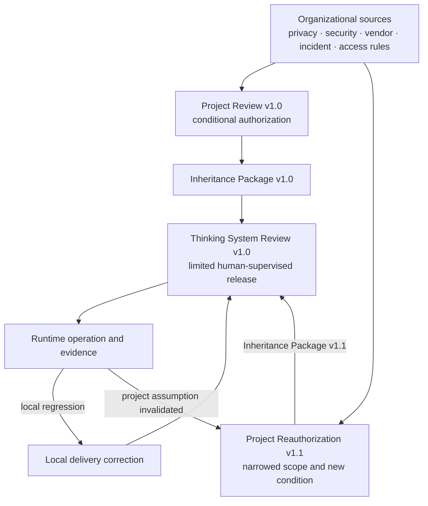
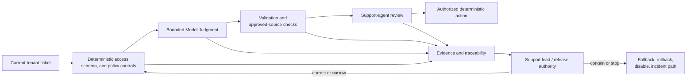
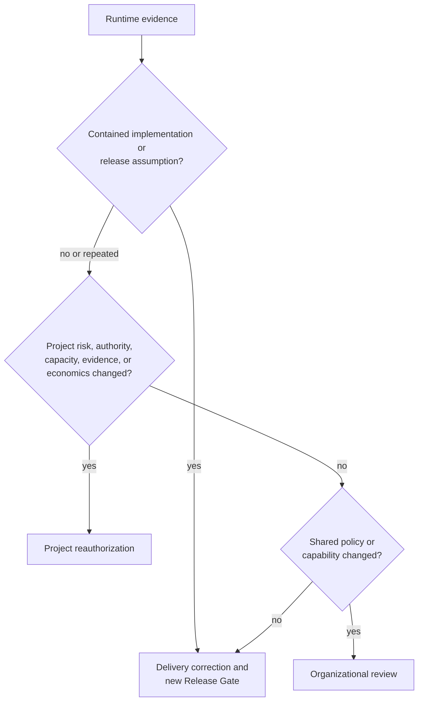

# Worked Project-to-Runtime Application: Human-Supervised Support Assistance

## Status and evidence boundary

This document is a **reference worked example** showing how the four UA control levels connect through one project authorization, one delivery-level Thinking System Review, runtime evidence, and project reauthorization.

The company, project identifiers, assumptions, costs, thresholds, events, evidence, and decisions are **illustrative and synthesized**. They do not describe a real deployment and do not validate UA as an effective control method in every context.

The example deliberately reuses the completed [`Worked Thinking System Review: Human-Supervised Support Triage and Grounded Reply Drafting`](worked-thinking-system-review-support-triage.md). It does not duplicate that delivery record. Instead, it demonstrates:

- which organizational sources constrain the project;
- what the project-level review owns;
- what is passed to delivery through a versioned inheritance package;
- what the delivery review refines locally;
- which runtime evidence remains a delivery issue;
- which runtime evidence invalidates a project assumption;
- how the project is reauthorized without rewriting organizational policy or duplicating the delivery record.

---

## 1. Scenario

ExampleCo operates a support organization for several software products. The proposed project, `SUPPORT-AI`, aims to reduce support-agent handling time by assisting with ticket interpretation, queue recommendation, retrieval from approved knowledge sources, and grounded reply drafting.

The initial proposal is not for an autonomous support agent. The intended system is a human-supervised Thinking System whose outputs remain recommendations and drafts.



---

## 2. Organizational control context

The project links existing organizational sources rather than copying them into UA artifacts.

| Organizational source | Constraint or capability inherited by the project |
|---|---|
| Data classification policy | Support tickets may contain customer and account data; cross-tenant access is prohibited. |
| Approved model-provider register | Only approved provider-hosted models in the contracted region may process support content. |
| Identity and access-control standard | The service account may read the current ticket and approved Product A knowledge sources only. |
| Security incident process | Suspected cross-tenant exposure, credential leakage, or account takeover follows the existing security incident path. |
| Customer-communication policy | Automated systems may draft but may not send customer communication without human approval in the initial operating mode. |
| Vendor-change process | Provider model or material platform changes require review before production use. |
| Shared logging and audit service | Each invocation must preserve tenant, ticket, model, instruction, policy, source, validation, fallback, and human-decision traceability. |
| Feature-control capability | The product platform supports project-wide and queue-level disable without disabling ordinary support operations. |

### Organizational decision boundary

The organization permits bounded experimentation and human-supervised deployment under the listed controls. It does not authorize autonomous customer communication, refunds, entitlement changes, account changes, final severity decisions, or security-incident resolution.

No new governance committee is created. Existing policy owners remain authoritative for their sources.

---

## 3. Project Control Architecture and Viability Review — version 1.0

### 3.1 Project identity

- **Project:** `SUPPORT-AI`
- **Review version:** `1.0`
- **Illustrative review date:** 2026-05-15
- **Project outcome owner:** Head of Support
- **Control architecture responsibility:** Product architect
- **Evidence and risk responsibility:** Support operations lead
- **Operational capacity responsibility:** Support operations lead
- **Project authorization authority:** Product and delivery director
- **Decision:** Conditionally authorized for bounded delivery and human-supervised limited release

### 3.2 Intended outcome and AI necessity

**Outcome:** Reduce the time required to understand, route, and draft initial responses for ordinary Product A support tickets while preserving support-agent authority and customer-communication controls.

**Why Model Judgment is proposed:** Tickets are unstructured, ambiguous, and frequently combine several intents. Deterministic parsing and routing rules remain useful for exact constraints and known cases but do not provide sufficient contextual interpretation or grounded drafting across the intended ticket range.

**Non-AI alternative considered:** Improve deterministic intake forms, routing rules, search, and support macros.

**Decision:** Implement those deterministic improvements regardless. Use Model Judgment only where contextual interpretation and synthesis are expected to provide additional value. The project is not authorized if control and human-review cost removes the expected operational benefit.

### 3.3 Intended Judgment and authority landscape

| Proposed Judgment | Placement | Maximum authorized authority in v1.0 |
|---|---|---|
| Interpret ticket intent, ambiguity, product area, and urgency indicators | Input Interpretation | Structured recommendation only |
| Recommend an allowed queue and escalation category | Decision Logic | Recommendation only; deterministic mandatory-review rules override it |
| Formulate retrieval queries and draft a grounded response | Output Mediation | Draft only; no send permission |

Prohibited authority includes:

- autonomous customer communication;
- ticket closure;
- refunds or entitlement changes;
- account changes;
- final security, legal, contractual, or severity decisions;
- access to another tenant's data;
- tools that can mutate customer or account state.

### 3.4 Material project scenarios

| ID | Scenario | Consequence | Required control response |
|---|---|---|---|
| `P-R1` | Cross-tenant context is supplied to or returned by the model path | Privacy and contractual breach | Deterministic tenant boundary, least-privilege identity, provenance logging, immediate disable, security incident escalation |
| `P-R2` | A mandatory security or account-takeover escalation is suppressed | Delayed response to a consequential incident | Deterministic mandatory-review rules, scenario evaluation, human review, miss detection, queue-level disable |
| `P-R3` | A reply contains unsupported or fabricated product claims | Customer harm, rework, loss of trust | Approved-source retrieval, source attachment, validation, human approval, no-send permission, fallback |
| `P-R4` | Support agents over-trust recommendations and stop exercising meaningful review | Latent control failure and automation bias | Training, visible uncertainty and sources, accept/edit/reject evidence, sampled review, authority remains human |
| `P-R5` | Model, prompt, policy, knowledge, or provider behavior changes silently | Degraded behavior outside reviewed evidence | Version pinning where available, change traceability, regression evaluation, rollback, reauthorization trigger |
| `P-R6` | Human-review and incident burden exceed the time saved | Project becomes economically non-viable | Review-time measurement, edit and reject evidence, operational-capacity limits, cost review, project reauthorization |

### 3.5 Required project control architecture



The project requires:

- deterministic tenant and permission enforcement outside Model Judgment;
- explicit Judgment Node boundaries;
- approved-source retrieval and claim provenance;
- typed outputs and deterministic validation;
- mandatory human review before customer communication;
- manual triage and safe acknowledgement fallbacks;
- model, prompt, policy, source, and configuration version traceability;
- quality, authority, override, latency, cost, and incident evidence;
- queue-level and project-wide disable;
- clear authority to narrow, roll back, suspend, or stop the system.

### 3.6 Evidence feasibility and feedback latency

The project concludes that the following evidence is feasible:

- adjudicated scenario sets for ordinary routing, ambiguous tickets, mandatory escalations, unsupported claims, and prohibited actions;
- deterministic tests for tenant, permission, schema, source, and no-send invariants;
- support-agent accept, edit, reject, and override evidence;
- source-coverage and unsupported-claim review;
- processing latency and model/retrieval cost;
- review time and incident burden;
- model, prompt, policy, and knowledge-version traceability.

Feedback is fast enough for ordinary quality correction because drafts remain human-supervised. Confirmed privacy, tenant-boundary, prohibited-authority, or mandatory-escalation failures require immediate containment rather than waiting for periodic review.

### 3.7 Human Authority and operational capacity

Human review is treated as a real control only if agents have:

- access to the original ticket and cited sources;
- visible uncertainty and fallback states;
- time to reject or rewrite outputs;
- training on prohibited authority and escalation;
- no productivity target that implicitly requires blind acceptance;
- a clear route for reporting recurring defects or incidents.

Initial operating capacity is limited to five trained Product A support agents and no more than 100 visible drafts per business day.

### 3.8 Project control economics

Illustrative planning ranges:

| Cost or benefit component | Initial assumption |
|---|---|
| Engineering and integration | 8–12 person-weeks |
| Evaluation and release preparation | 3–5 person-weeks |
| Support training and rollout | 1–2 person-weeks |
| Ongoing model and retrieval cost | Target average at or below USD 0.03 per processed ticket |
| Ongoing evidence and review work | 4–8 support-lead hours per week during limited release |
| Incident and correction reserve | 2–4 engineering days per quarter under the initial scope |
| Expected operational benefit | 20–30% reduction in handling time for eligible ordinary tickets |

The project remains viable only if meaningful support-agent review, evidence work, and incident handling fit inside the benefit. Model-token cost alone is not the project cost.

### 3.9 Project authorization decision v1.0

**Decision:** Conditional authorization.

Authorized:

- Product A;
- English-language tickets;
- recommendation and draft authority only;
- five trained agents;
- maximum 100 visible drafts per business day;
- approved provider, region, model deployment, knowledge sources, and platform controls;
- bounded delivery work and a human-supervised limited release after a delivery Release Gate.

Not authorized:

- autonomous send or ticket mutation;
- new products, languages, populations, data classes, geographies, or vendors;
- removal of human review;
- authority over refunds, entitlements, accounts, final severity, security resolution, or legal commitments.

Conditions:

1. deterministic tenant isolation and no-send controls must be tested as invariants;
2. the delivery review must show effective mandatory-escalation handling and grounded drafting;
3. runtime evidence must include review time, not only model quality and token cost;
4. any material change in autonomy, authority, scope, model/provider behavior, human capacity, evidence feasibility, or economics requires project reauthorization.

---

## 4. Delivery inheritance package — version 1.0

The project review passes the following versioned baseline to the delivery review.

| Inherited field | Project baseline v1.0 |
|---|---|
| Authorized outcome | Human-supervised interpretation, routing recommendation, retrieval, and grounded reply drafting for ordinary Product A tickets |
| Approved scope | English, Product A, five trained agents, up to 100 visible drafts per business day |
| Maximum authority | Recommendation and draft only; no autonomous action or communication |
| Deterministic invariants | Tenant isolation, least privilege, allowed queues and sources, mandatory-review rules, no-send permission, complete traceability |
| Required controls | Bounded Judgment Nodes, validation, provenance, human approval, fallback, disable, rollback, incident escalation |
| Required evidence | Boundary tests, scenario evidence, grounding review, override/edit/reject data, latency, cost, review time, incidents |
| Human Authority | Support agents approve communication; support lead controls operation; release authority may narrow, roll back, suspend, or stop |
| Economic boundary | Full operating and control cost must preserve a credible benefit; review time is part of cost |
| Reauthorization triggers | New authority, scope, population, data, language, geography, provider/model risk, weakened capacity, ineffective controls, changed economics |
| Project review reference | `SUPPORT-AI-PROJECT-REVIEW`, version `1.0` |

The delivery review may refine implementation detail and narrow the deployment. It may not silently expand this baseline.

---

## 5. Delivery-level Thinking System Review — version 1.0

The completed delivery record is maintained separately as [`Worked Thinking System Review: Human-Supervised Support Triage and Grounded Reply Drafting`](worked-thinking-system-review-support-triage.md).

### 5.1 What the delivery review inherits

The delivery record links `SUPPORT-AI-PROJECT-REVIEW v1.0` and inherits:

- the approved business outcome;
- recommendation-and-draft authority only;
- Product A, English, five-agent, 100-draft limits;
- tenant isolation, mandatory review, approved sources, no-send, logging, fallback, rollback, and disable requirements;
- project reauthorization triggers;
- the requirement to measure human-review cost.

### 5.2 What the delivery review refines

The delivery review defines three implementation-level Judgment Nodes:

1. Ticket Interpretation;
2. Routing and Escalation Recommendation;
3. Grounded Reply Draft.

It also refines:

- exact input and output contracts;
- queue and source allowlists;
- model, prompt, policy, and knowledge versions;
- the bounded experiment;
- example-specific quality and resource thresholds;
- deterministic tests and scenario evidence;
- operational dashboards and fallback paths;
- the deployment-specific Release Gate.

### 5.3 Release decision

The illustrative delivery review approves a **human-supervised limited release** inside the inherited project boundary.

The release decision does not authorize:

- autonomous sending;
- more users or ticket volume;
- additional products or languages;
- removal of human review;
- broader tool or data access.

Those remain project decisions.

---

## 6. Runtime operation and evidence

During the illustrative first four weeks, the system produces several evidence types.

### 6.1 Evidence that remains local to delivery

**Event L1 — Prompt regression after an approved wording change**

- Draft acceptance decreases and edit magnitude increases.
- Tenant, authority, mandatory escalation, and grounding controls remain effective.
- Scope, population, model provider, human capacity, and project economics remain inside the authorized boundary.

**Response:**

- pause promotion of the new prompt;
- roll back to the previous prompt version;
- add the failed cases to the local regression set;
- rerun the delivery evidence package;
- record a new delivery Release Gate decision.

**Why this remains local:** The evidence invalidates an implementation-level completion and release assumption, not the project authorization.

### 6.2 Evidence that triggers immediate containment and delivery reassessment

**Event L2 — One confirmed unsupported troubleshooting claim appears in a draft**

- The claim is blocked during human review and is not sent.
- The source validator records missing support.
- The no-send and human-review controls work as designed.

**Response:**

- hide drafts for the affected product area;
- investigate retrieval and validation behavior;
- expand the scenario and grounding evidence;
- correct the delivery implementation;
- require a new local Release Gate before restoring that product area.

**Why this remains local initially:** The approved control architecture contains the event and the project assumptions still hold. Repeated or uncontained occurrences could change that conclusion.

### 6.3 Evidence that invalidates a project assumption

**Event P1 — Human review consumes more time than planned**

After four weeks:

- eligible tickets show an illustrative 12% handling-time reduction rather than the expected 20–30%;
- agents spend substantial time checking source relevance and rewriting ambiguous drafts;
- support-lead evidence review requires 11 hours per week rather than the planned 4–8;
- model and retrieval cost remains within the local resource envelope;
- deterministic safety and authority controls remain effective;
- agents report that low-quality knowledge tagging is the main cause of review burden.

The delivery feature is behaving inside its release boundary, but the **project control economics and operational-capacity assumptions are no longer credible**.

**Response:** project reauthorization is required.

### 6.4 Evidence-routing decision



---

## 7. Project reauthorization — version 1.1

### 7.1 Reauthorization trigger

The trigger is not model accuracy by itself. The trigger is evidence that the approved control perimeter requires more human capacity and produces less operational benefit than assumed.

The invalidated project assumptions are:

- expected handling-time reduction;
- support-lead evidence-review capacity;
- maturity and tagging quality of the knowledge source;
- viability of the initial eligible-ticket range.

### 7.2 Options considered

1. Continue unchanged and accept lower benefit.
2. Remove human review to recover speed.
3. Expand volume to create more aggregate benefit.
4. Narrow scope to ticket categories with strong knowledge coverage.
5. Pause the project until the knowledge base is improved.
6. Stop the AI path and retain deterministic search, macros, and routing improvements.

Options 2 and 3 are rejected because they expand authority or exposure while the project economics and evidence assumptions are weaker than expected.

### 7.3 Project decision v1.1

**Decision:** Reauthorize with narrower scope and an added dependency condition.

The project remains authorized only for:

- two Product A ticket categories with verified source coverage;
- five trained support agents;
- maximum 60 visible drafts per business day;
- recommendation and draft authority only;
- mandatory human review;
- the existing provider, region, deterministic controls, and incident paths.

New conditions:

1. knowledge articles in the authorized categories must have an accountable owner, freshness indicator, and valid product tag;
2. runtime evidence must separate model defects from missing or stale knowledge;
3. support-lead evidence review must return to no more than eight hours per week before scope expansion;
4. the project must show a credible net handling-time benefit after human review and evidence work;
5. scope expansion requires another project reauthorization, not only a delivery Release Gate.

### 7.4 Updated inheritance package v1.1

The delivery review is updated by reference with:

- narrower ticket-category scope;
- daily exposure reduced from 100 to 60 drafts;
- an explicit knowledge-ownership and freshness dependency;
- revised economic and operational-capacity conditions;
- a new reauthorization trigger for deterioration in source coverage or review burden.

The delivery implementation then completes a local reassessment and new Release Gate for the narrowed deployment.

---

## 8. What is not duplicated

This application intentionally avoids creating parallel records.

| Information | Canonical owner in this example |
|---|---|
| Organizational privacy, security, vendor, identity, and incident rules | Existing organizational sources |
| Outcome, material scenarios, required controls, project economics, authorization, inheritance, reauthorization | Project Control Architecture and Viability Review |
| Judgment Nodes, exact contracts, implementation, bounded experiment, DoR, DoD, Release Gate | Thinking System Review |
| Invocation evidence, overrides, incidents, latency, cost, review time | Runtime systems and linked evidence stores |
| Local correction decision | Thinking System Review history |
| Project scope and economic decision v1.1 | Project review history |

The project record links evidence but does not copy complete logs. The delivery record links the project baseline but does not recreate the project scenario map or economics. Runtime evidence links the project and delivery versions under which it was produced.

---

## 9. End-to-end decision trace

```text
Organizational sources permit human-supervised assistance under existing controls
→ Project Review v1.0 conditionally authorizes Product A, English, five agents, 100 drafts/day
→ Inheritance Package v1.0 constrains the delivery review
→ Thinking System Review v1.0 defines three Judgment Nodes and approves a limited release
→ Runtime prompt regression is corrected locally through rollback and a new Release Gate
→ One unsupported draft is contained locally because human review and no-send controls work
→ Review burden and weak benefit invalidate project capacity and economic assumptions
→ Project Review v1.1 narrows categories and exposure and adds knowledge-ownership conditions
→ Delivery review inherits v1.1 and reauthorizes the narrower deployment locally
```

---

## 10. Framework observations

This example exposes several important UA distinctions:

1. **Project authorization is not a successful prototype.** It includes the full control perimeter, Human Authority, operating capacity, and economics.
2. **Delivery release is not project authorization.** It proves a bounded implementation against an inherited project boundary.
3. **Runtime evidence does not all escalate equally.** A prompt regression can remain local; changed project economics cannot.
4. **Human review has a cost and failure mode.** It cannot be treated as a free control or a label applied after the fact.
5. **A control can work while the project becomes non-viable.** Safety containment does not prove business viability.
6. **Narrowing is a valid success condition.** Reauthorization does not have to mean expansion or shutdown.
7. **No additional governance document is required.** Two living reviews plus linked organizational and runtime evidence are sufficient for this example.
8. **The AI Control Plane is distributed.** Deterministic code, platform controls, evidence systems, support workflows, and Human Authority jointly implement the control loop.

---

## 11. Limits of the example

This example does not establish:

- universal thresholds for support systems;
- a general formula for project control economics;
- proof that human review will remain effective at larger scale;
- a complete privacy, security, legal, or vendor review;
- a required four-week review cadence;
- a mandatory team structure or set of job titles;
- production evidence for the named system;
- conformance merely by copying the example.

A real application must derive its own scenarios, authority limits, controls, evidence, capacity, economics, and reauthorization triggers from its actual context.

## Relationships

- [`Nested Control Lifecycle`](../00-doctrine/nested-control-lifecycle.md) defines the four decision levels and evidence-routing logic.
- [`Project Control Architecture and Viability Review`](../01-patterns/project-control-architecture-and-viability-review.md) owns the project decision demonstrated here.
- [`Thinking System Review`](../01-patterns/thinking-system-review.md) owns the delivery decision demonstrated here.
- [`Worked Thinking System Review: Human-Supervised Support Triage and Grounded Reply Drafting`](worked-thinking-system-review-support-triage.md) contains the detailed delivery record reused by this application.
- [`The AI Control Plane`](../02-ai-control-plane/) defines the control capabilities distributed across the example.
