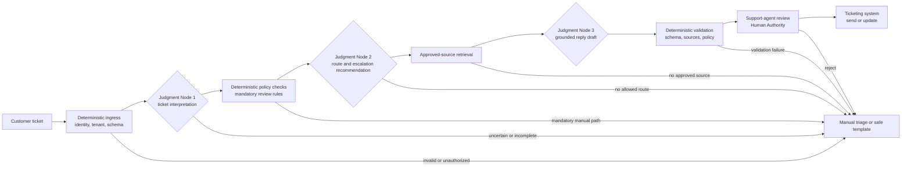
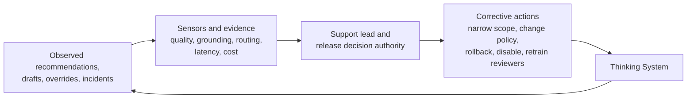

# Worked Thinking System Review: Human-Supervised Support Triage and Grounded Reply Drafting

## Status and evidence boundary

This document is a **reference worked example** of the [`Thinking System Review`](../01-patterns/thinking-system-review.md). It demonstrates how one small engineering team could complete the review for a realistic customer-support use case.

The company, system identifiers, model versions, evaluation results, thresholds, dates, and operational evidence below are **illustrative and synthesized for this example**. They are not claims about a real deployment, audited production results, or evidence that UA is effective in every context.

The example is intentionally concrete so that the framework can be inspected under realistic constraints. Its numerical values are local decisions derived from the example's authority, consequences, human-review capacity, and deployment scope. They are not UA defaults and MUST NOT be copied into another system without an independent Requirement and risk decision.

---

## 1. Review identity

- **System or feature:** ExampleCo Support Ticket Triage and Grounded Reply Drafting
- **Review version:** 1.0
- **Previous review or decision:** None; first review
- **Review status:** Release review completed; human-supervised limited release proposed
- **Illustrative date opened:** 2026-06-01
- **Illustrative last updated:** 2026-07-15
- **Implementation responsibility:** Application engineer
- **Evaluation responsibility:** Support lead with one application engineer
- **Operational responsibility:** Support lead
- **Release decision authority:** Product and delivery owner

One person may hold more than one responsibility bundle in a small team. The bundles above describe accountability and decision rights, not mandatory job titles.

### Relevant versions and references

- **Requirement or feature record:** `SUP-AI-014`
- **Architecture or design record:** `ADR-SUP-009`
- **Repository and revision:** `support-assist`, revision `7c9e2f1`
- **Model and version:** provider-hosted instruction model, pinned deployment `support-model-2026-06`
- **Prompt or instruction version:** `support-triage-v1.4`; `support-reply-v1.7`
- **Policy or configuration version:** `support-policy-v1.3`
- **Knowledge source snapshot:** `support-kb-2026-06-15`
- **Tools and external services:** ticketing API, approved knowledge retrieval, incident-status API
- **Evaluation evidence location:** `eval/support-review-v1/`
- **Operational dashboard or logs:** `support-assist-limited-release`

---

## 2. Intended outcome and scope

- **User or business outcome:** Reduce the time required to understand, route, and draft an initial response to ordinary support tickets while preserving support-agent authority and avoiding unsafe or unsupported commitments.
- **Why Model Judgment is used:** Customer requests are written in natural language, are frequently ambiguous or incomplete, and may combine several issues. Exact deterministic parsing would require brittle rules and still fail to capture context.
- **In scope:** English-language tickets for Product A; intent extraction; urgency indicators; recommended queue and escalation category; retrieval from approved Product A knowledge sources; a grounded reply draft for a support agent.
- **Out of scope:** autonomous message sending; refunds; entitlement changes; account changes; legal or contractual commitments; final severity assignment; autonomous ticket closure; security-incident resolution; access to another tenant's data.
- **Affected users, systems, or parties:** support agents, customers who submitted tickets, the ticketing platform, the approved knowledge base, and the on-call escalation process.
- **Current lifecycle context:** bounded experiment completed; human-supervised limited deployment proposed.
- **Key assumptions:** Product A knowledge articles are current and correctly tagged; the ticketing platform enforces tenant isolation; support agents retain enough time and context to reject recommendations.
- **Known unknowns:** behavior in other languages; seasonal ticket distributions; long-term automation bias; performance after provider-side model changes; behavior for newly launched Product A features.

### System boundary

The system responsibility includes deterministic ingestion, access control, source selection, validation, human review, logging, and fallback. The model call is only part of the system.

- **Inputs:** customer ticket body, permitted ticket metadata, Product A identifier, approved account state, and current incident status.
- **Outputs, decisions, paths, or actions:** structured interpretation, route recommendation, escalation recommendation, approved-source references, reply draft, or deterministic fallback.
- **Upstream dependencies:** ticketing platform, authentication, tenant and account context.
- **Downstream dependencies:** support queue, human review, existing message-send and ticket-update functions.
- **External dependencies:** model provider and approved knowledge retrieval service.

---

## 3. Mixed-system responsibilities

### 3.1 Deterministic responsibilities

- **Rules:** tenant isolation; queue allowlist; mandatory manual review for security, suspected data loss, billing dispute, legal threat, or account takeover; only approved published sources may ground a reply.
- **Invariants:** the AI path cannot send a message, close a ticket, issue a refund, change an entitlement, or modify account state.
- **Schemas and interface contracts:** typed ticket input; typed interpretation; allowed queue enumeration; source-reference list; reply-draft schema.
- **Authentication and permissions:** service account may read the current tenant's ticket and approved Product A knowledge; it has no write permission to customer, billing, or account systems.
- **Exact constraints:** final SLA calculation and severity remain outside Model Judgment; prohibited actions are rejected regardless of model output.
- **Transactions, audit, or data-handling obligations:** each invocation records tenant, ticket, model, prompt, policy, knowledge snapshot, validation result, fallback, and human decision.

### 3.2 Model-mediated responsibilities

- **Expected judgment:** interpret intent and ambiguity; identify urgency indicators; recommend a support route; formulate a retrieval query; synthesize a concise draft from approved sources.
- **Acceptable variation:** wording, explanation order, and one of several valid routes for genuinely multi-topic tickets may vary when the recommendation remains inside the approved routing and authority contract.
- **Model-mediated decisions, paths, actions, or outputs:** interpretation fields, route recommendation, escalation recommendation, retrieval-query text, and reply draft.
- **Unacceptable outcomes:** fabricated product behavior; unsupported troubleshooting; hidden uncertainty; customer-specific data not present in approved context; refund or contractual promises; claiming an action was performed; suppressing a mandatory escalation.

### 3.3 Boundary and control responsibilities

- **Context assembly and provenance:** deterministic retrieval of current-ticket metadata and allowlisted Product A sources; source identifiers attached to every draft claim.
- **Authority boundary:** recommendations and drafts only; all consequential actions remain deterministic or human-authorized.
- **Deterministic validation:** schemas, queue allowlist, source allowlist, mandatory-review rules, prohibited-claim patterns, and no-send permission.
- **Sensors and evidence:** routing agreement, escalation misses, unsupported-claim review, source coverage, fallback rate, human accept/edit/reject decisions, latency, cost, and incidents.
- **Controller or decision authority:** support lead interprets operational evidence; release decision authority may narrow, disable, roll back, or expand the deployment.
- **Fallback:** manual triage or a deterministic acknowledgement template.
- **Containment:** feature flag, queue-level disable, model/prompt rollback, and removal of draft visibility.
- **Escalation:** security and privacy events go to the existing incident path; quality degradation goes to the support lead and release decision authority.
- **Rollback, disable, or shutdown:** immediate feature disable without changing the ticketing platform's standard workflow.

---

## 4. Judgment Nodes

### Judgment Node 1 — Ticket Interpretation

- **Purpose:** Convert an unstructured ticket into an explicit description of intent, product area, urgency indicators, missing information, and ambiguity.
- **Placement:** Input Interpretation
- **Inputs and approved context:** current ticket text; permitted ticket metadata; Product A taxonomy; current incident-status flag.
- **Allowed authority:** produce structured interpretation and an `uncertain` indicator.
- **Hard constraints:** no final severity, entitlement, refund, account, or security decision; no access beyond the current tenant and ticket.
- **Unacceptable outcomes:** silently inventing missing facts; treating a suspected security event as routine; mixing another tenant's context; suppressing uncertainty.
- **Evidence and telemetry:** field-completeness review, human interpretation agreement, mandatory-review recall, uncertainty/fallback frequency, and context-provenance logs.
- **Fallback or escalation:** manual triage when required fields are missing, uncertainty is material, or a mandatory-review signal is present.
- **Operational owner:** support lead.
- **Consequentiality and downstream impact:** medium; a poor interpretation can misroute the ticket and distort every later step.
- **Output contract:** intent category, product area, urgency indicators, missing-information list, ambiguity note, and mandatory-review signals.
- **Failure conditions and Deviation Signals:** mandatory-review case not surfaced; contradictory fields; unsupported inferred customer state; abnormal drop in uncertainty/fallback rate.
- **Containment:** discard interpretation and route to manual triage.
- **Change authority:** implementation responsibility may propose changes; release decision authority approves production promotion.

### Judgment Node 2 — Routing and Escalation Recommendation

- **Purpose:** Recommend an allowed support queue and whether the ticket requires expedited human review.
- **Placement:** Decision Logic
- **Inputs and approved context:** validated interpretation from Node 1; queue allowlist; deterministic mandatory-review rules; current queue configuration.
- **Allowed authority:** recommendation only.
- **Hard constraints:** queue must be selected from configuration; deterministic mandatory-review rules override the recommendation; final SLA and severity are not model-controlled.
- **Unacceptable outcomes:** routing outside the allowlist; suppressing security, data-loss, billing-dispute, legal, or account-takeover review; presenting recommendation as a completed action.
- **Evidence and telemetry:** agreement with adjudicated human routing, mandatory-escalation misses, override reason, fallback rate, and distribution by queue.
- **Fallback or escalation:** default manual-triage queue when no allowed recommendation can be established.
- **Operational owner:** support lead.
- **Consequentiality and downstream impact:** medium to high; a missed escalation can delay response to a consequential ticket.
- **Output contract:** recommended queue, recommended review category, concise rationale, and explicit uncertainty.
- **Failure conditions and Deviation Signals:** confirmed missed mandatory escalation; unexpected shift in queue distribution; high override rate; route outside configuration.
- **Containment:** disable Node 2 while retaining ordinary manual routing.
- **Change authority:** release decision authority.

### Judgment Node 3 — Grounded Reply Draft

- **Purpose:** Produce a concise support-agent draft based on current-ticket facts and approved Product A sources.
- **Placement:** Output Mediation
- **Inputs and approved context:** current ticket; validated interpretation; route recommendation; retrieved approved sources; current incident status.
- **Allowed authority:** draft only; no send permission.
- **Hard constraints:** each factual product claim must be supported by an attached approved source; no refund, contractual, legal, security-resolution, or completed-action statement; human approval required.
- **Unacceptable outcomes:** fabricated features; unsupported troubleshooting; disclosure of another customer's information; false assurance; hiding missing evidence; claiming a refund, reset, or escalation occurred.
- **Evidence and telemetry:** source coverage, unsupported-claim review, human accept/edit/reject decision, edit magnitude, prohibited-claim blocks, and fallback rate.
- **Fallback or escalation:** deterministic acknowledgement template or no draft when sources are missing or validation fails.
- **Operational owner:** support lead.
- **Consequentiality and downstream impact:** medium while human review is mandatory; high if future authority expands to autonomous send.
- **Output contract:** reply draft, source identifiers, uncertainty note, and recommended next human action.
- **Failure conditions and Deviation Signals:** unsupported claim; missing source; prohibited commitment; abnormal decrease in human rejection combined with unchanged quality evidence; privacy complaint.
- **Containment:** hide drafts, retain manual support workflow, and roll back prompt/policy/model version.
- **Change authority:** release decision authority.

---

## 5. Requirement and Operating Envelope

### 5.1 Approved Requirement

- **Intended outcome:** assist support agents with faster understanding, routing, and drafting for ordinary Product A tickets without transferring consequential action authority to the model.
- **Deterministic obligations:** enforce tenant isolation, permissions, mandatory-review rules, queue and source allowlists, no-send authority, typed interfaces, logging, fallback, and immediate disable.
- **Model-mediated obligations:** interpret tickets, recommend an allowed route, and draft useful grounded replies within the accepted behavioral range.
- **Authority boundaries:** recommendation and drafting only; support agents make communication decisions; deterministic services perform any ticket or account action.
- **Evidence expectations:** scenario-based behavioral review, authority and boundary tests, source-grounding review, resource evidence, human override data, and operational traceability.
- **Required failure handling:** manual triage, safe acknowledgement, queue-level disable, prompt/model rollback, and security/privacy incident escalation.

### 5.2 Operating Envelope

- **Intended operating conditions:** English-language Product A tickets; authenticated tenant context; published Product A knowledge sources; human-reviewed replies; limited support-agent population.
- **Acceptable behavioral range:** reasonable variation in phrasing and explanation; route recommendations that agree with adjudicated support judgment often enough to reduce work while preserving reliable fallback and no known mandatory-escalation miss in the approved evidence set.
- **Prohibited outcomes or regions:** cross-tenant data exposure; autonomous action; unsupported product claims sent to customers; suppressed mandatory escalation; legal, refund, entitlement, or security-resolution commitments.
- **Resource envelope:** average model and retrieval cost no more than USD 0.03 per processed ticket during the limited release; p95 processing latency no more than 5 seconds under approved load; one model attempt plus one bounded repair attempt.
- **Exposure and deployment limits:** Product A only; English only; five trained support agents; maximum 100 visible drafts per business day; no autonomous send or state change.
- **Human supervision requirements:** a support agent must review every recommendation and draft before any downstream action.
- **Known assumptions:** support-agent review remains meaningful; knowledge tagging is current; queue taxonomy is stable; source references are available to the reviewer.

### Example-specific decision thresholds

| Decision surface | Example-specific condition | Rationale and limitation |
|---|---|---|
| Tenant isolation and autonomous action | Zero accepted violations | These are deterministic invariants, not statistical quality targets. Any confirmed violation disables the feature. |
| Mandatory escalation | No known miss in the approved high-consequence scenario set; any confirmed production miss triggers disable and reassessment | This does not prove the true miss probability is zero. It defines a release and incident condition for the limited scope. |
| Routing usefulness | At least 85% agreement with adjudicated routing in the limited scope | Below this level the review burden is unlikely to justify operation for this team. Human routing itself contains disagreement. |
| Unsupported factual claims | No unsupported claim may be sent; drafts failing source or human review are blocked | The model may still generate an unacceptable draft because human review and deterministic blocking remain part of the system. |
| Draft utility | At least 75% accepted with no more than light editing during the supervised pilot | A local product-efficiency condition, not a general quality metric. |
| Cost and latency | Average cost at or below USD 0.03; p95 at or below 5 seconds | Derived from the example's unit economics and agent workflow, not a universal envelope. |

### 5.3 Control-loop design

- **Sensors:** human decisions, adjudicated samples, mandatory-escalation review, source coverage, unsupported-claim review, privacy and security signals, fallback rate, cost, latency, and queue-distribution drift.
- **Constraints and actuators:** queue/source allowlists, mandatory-review rules, no-write permissions, schemas, feature flags, prompt/policy/model selection, retry limit, and fallback routing.
- **Controller or decision authority:** support lead for routine interpretation and response; release decision authority for scope, release, rollback, and shutdown.
- **Corrective actions:** narrow queue or product scope, disable a Judgment Node, update deterministic rules, change prompt or policy, refresh knowledge, add scenarios, retrain support reviewers, roll back model/configuration, or reject the AI path.
- **Feedback latency or review timing:** immediate for privacy, authority, and mandatory-escalation incidents; daily during the first two weeks; then weekly while evidence remains stable. This cadence is example-specific.

---

## 6. Definition of Ready

### 6.1 Outcome and scope

- [x] Intended user or business outcome is defined.
- [x] System boundary is defined.
- [x] In-scope and out-of-scope behavior is identified.
- [x] Experiment, limited deployment, and production Requirement are distinguished.

**Evidence or notes:** The first decision authorizes only a bounded experiment with historical and shadow traffic. No customer-facing autonomous behavior is included.

### 6.2 Judgment placement

- [x] Consequential Judgment Nodes are identified.
- [x] Each node's placement class is recorded.
- [x] Affected decisions, actions, paths, and outputs are identified.
- [x] Model-mediated responsibilities are separated from deterministic responsibilities.

**Evidence or notes:** Three nodes cover Input Interpretation, Decision Logic, and Output Mediation. Their composition is specific to this system and is not a required UA pipeline.

### 6.3 Authority

- [x] Permitted authority is defined.
- [x] Prohibited decisions and actions are defined.
- [x] Human Authority points are identified.
- [x] Deterministic execution boundary is defined.

**Evidence or notes:** The model produces recommendations and drafts only. Ticket state, messaging, refunds, entitlements, and account actions remain outside model authority.

### 6.4 Requirements and Operating Envelope

- [x] Deterministic invariants are identified.
- [x] Acceptable behavioral variation is described.
- [x] Unacceptable outcomes are described.
- [x] Material tolerances and thresholds are defined and justified for the experiment.
- [x] Resource envelope is defined.
- [x] Required failure handling is specified.

**Evidence or notes:** Thresholds are provisional experiment and limited-release decision surfaces. They are not presented as general support-system requirements.

### 6.5 Evidence strategy

- [x] Relevant scenarios are identified.
- [x] Consequential and adversarial scenarios are included.
- [x] Evaluation approach is defined.
- [x] Evidence sources and limitations are understood.
- [x] Success and failure criteria are defined.
- [x] Known unknowns are recorded.

**Evidence or notes:** Two support reviewers independently label high-consequence and ambiguous cases; disagreements are adjudicated. Human agreement is treated as evidence with limitations, not ground truth.

### 6.6 Control strategy

- [x] Necessary sensors are identified.
- [x] Necessary constraints and actuators are identified.
- [x] Fallback, containment, and escalation are defined.
- [x] Observability expectations are defined.
- [x] Rollback and shutdown feasibility are defined.

**Evidence or notes:** The ordinary manual support workflow remains available when the AI path is disabled.

### 6.7 Ownership

- [x] Implementation responsibility is assigned.
- [x] Evaluation responsibility is assigned.
- [x] Operational responsibility is assigned.
- [x] Release decision authority is explicit.

**Evidence or notes:** The support lead holds evaluation and operational responsibility in this small-team example. Release authority remains explicit.

### 6.8 Feasibility

- [x] Expected cost and latency are understood sufficiently for a bounded experiment.
- [x] Required data, environments, and tools are available.
- [x] Security, privacy, and contractual dependencies are identified.
- [x] Unresolved risks are explicitly bounded for the experiment.

**Evidence or notes:** Historical tickets are de-identified before offline replay. Live shadow processing uses production access controls but exposes no AI result to the customer or support agent.

### 6.9 Readiness decision

- [ ] Ready for implementation
- [x] Ready for bounded experiment
- [ ] Ready with explicit conditions
- [ ] Needs clarification
- [ ] Control cost not justified
- [ ] AI path rejected

- **Illustrative decision date:** 2026-06-07
- **Decision authority:** product and delivery owner
- **Conditions or open questions:** calibrate routing agreement; establish source-grounding review; verify support-agent override workflow; measure cost and latency; examine variability for ambiguous cases.
- **Bounded-experiment limits:** de-identified historical tickets, one product, English only, no action permission, fixed model/prompt/policy/knowledge versions, then shadow traffic before any visible pilot.
- **Stopping conditions:** any cross-tenant exposure; attempted unauthorized action; confirmed missed mandatory escalation caused or permitted by the experiment; unsupported-claim rate above 2% after deterministic source validation; inability to diagnose behavior from logs; cost above USD 0.05 average per ticket.
- **Rationale:** the system boundary and experiment are sufficiently controlled to collect evidence, but production release evidence does not yet exist.

---

## 7. Bounded experiment

### 7.1 Selected path and scope

- **Selected path:** Bounded experiment
- **Users, data, and environments:** de-identified historical tickets; production shadow traffic; then five trained support agents in a supervised pilot.
- **Authority and tool limits:** read-only ticket and knowledge access; no message send; no account, billing, entitlement, or ticket-state changes.
- **Duration and exposure:** three offline evaluation cycles, two weeks of shadow operation, and ten business days of supervised pilot use.
- **Resource limits:** one primary invocation and one bounded repair attempt; daily request cap; cost and latency envelope defined above.
- **Stopping or escalation conditions:** readiness stopping conditions plus any reviewer report that the draft creates pressure to approve an unsafe answer.

### 7.2 Illustrative evidence set

The following values are synthesized to demonstrate how a completed review may connect evidence to a decision.

| Stage | Scope | Illustrative result | Interpretation |
|---|---|---|---|
| Offline replay | 420 de-identified Product A tickets, including 60 high-consequence and 90 ambiguous cases | Routing agreement 91%; no known mandatory-escalation miss in the 60-case set; 10 unsupported factual drafts before source-policy refinement | Promising but insufficient for release; source validation and fallback required refinement. |
| Variability check | Three runs for each of 90 ambiguous tickets | 18% changed route recommendation at least once; all remained inside allowed queues; 7 cases crossed ordinary/manual-review recommendation | Placement and authority remained bounded, but ambiguity needed an explicit fallback rule rather than majority voting. |
| Shadow operation | 680 live tickets over two weeks | Routing agreement on adjudicated sample 89%; p95 latency 3.8 seconds; average cost USD 0.021; 6.4% manual fallback | Production distribution and resources remained inside the provisional experiment envelope. |
| Human-supervised pilot | 410 visible recommendations and drafts across five agents | 62% accepted with no material edit; 27% lightly edited; 11% rejected; three unsupported drafts blocked before send; no autonomous action possible | Utility condition met, but human review and source validation remain necessary. |

### 7.3 Changes made during the experiment

- added a deterministic mandatory-review rule before route recommendation;
- required source identifiers for every factual paragraph;
- added fallback when required sources are absent;
- separated interpretation uncertainty from routing recommendation;
- removed model access to final SLA and severity fields;
- limited draft length and prohibited statements claiming that an action had already occurred;
- added queue-distribution and fallback monitoring;
- added reviewer controls for accept, edit, reject, and escalation override.

### 7.4 Requirement and boundary refinements

- the initial proposal allowed the model to set preliminary severity; this authority was removed because the benefit did not justify the control burden;
- routing agreement alone was rejected as sufficient evidence because human routing contained disagreement and high-consequence misses mattered more;
- no-source behavior was changed from best-effort drafting to deterministic fallback;
- the limited-release Requirement now explicitly requires human approval and source visibility.

### 7.5 Material deviations or incidents

- no real incident is claimed by this reference example;
- the synthesized evaluation includes unsupported drafts and unstable ambiguous routing to demonstrate how evidence changes the boundary before release.

---

## 8. Definition of Done

### 8.1 Deterministic implementation evidence

- [x] Applicable unit tests passed.
- [x] Applicable integration tests passed.
- [x] Interface and schema contracts were verified.
- [x] Deterministic invariants were tested.
- [x] Authorization and permission controls were tested.
- [x] Applicable security and privacy checks were completed for the limited scope.

**Evidence or notes:** Tests cover tenant access, queue and source allowlists, no-write permissions, mandatory-review overrides, feature disable, fallback, and audit fields. The example does not claim an external security audit.

### 8.2 Behavioral evaluation evidence

- [x] Required scenario set was executed.
- [x] Expected behavior was assessed.
- [x] Unacceptable outcomes were tested.
- [x] Operating Envelope evidence was collected.
- [x] Variability across relevant runs was assessed.
- [x] Regressions against the accepted baseline were checked.
- [x] Material model and configuration versions were recorded.

**Evidence or notes:** Evidence is limited to Product A, English, the stated data window, pinned versions, and human-supervised operation.

### 8.3 Evidence quality

- [x] Evaluation datasets and scenarios are documented.
- [x] Known evidence limitations are recorded.
- [x] Unsupported extrapolations are avoided.
- [x] Confidence is proportional to the evidence.
- [x] Material evidence gaps are explicitly listed.

**Evidence or notes:** The review does not infer performance for other products, languages, autonomous operation, or future model versions. The high-consequence sample is too small to estimate a very low true miss rate.

### 8.4 Authority and boundary evidence

- [x] Authority limits were tested.
- [x] Prohibited actions were blocked.
- [x] Tool-use constraints were tested.
- [x] Deterministic validation around Judgment Nodes was verified.
- [x] Human approval points were tested.

**Evidence or notes:** The application service lacks send and account-write credentials, so model output cannot bypass the human approval path.

### 8.5 Resource evidence

- [x] Model and retrieval use was assessed.
- [x] Latency was assessed.
- [x] Concurrency and rate behavior were assessed for the limited scope.
- [x] External-service cost was assessed.
- [x] Resource limits and failure behavior were tested.

**Evidence or notes:** The limited-release evidence supports the stated request cap, not unrestricted scale.

### 8.6 Operational controls

- [x] Required sensors are operational.
- [x] Required telemetry is available.
- [x] Alerts and review triggers are defined.
- [x] Distribution-change indicators are available for routing and fallback.
- [x] Logs and traceability are sufficient for the stated diagnostic scope.

**Evidence or notes:** Semantic correctness still depends partly on calibrated human review. Telemetry alone is not treated as control.

### 8.7 Failure handling

- [x] Fallback was tested.
- [x] Containment was tested.
- [x] Escalation path was verified.
- [x] Rollback and disable mechanisms were tested.
- [x] Degraded mode is understood.
- [x] Partial-failure behavior was assessed.

**Evidence or notes:** When model or retrieval service is unavailable, the ordinary manual support workflow remains unchanged.

### 8.8 Operability and ownership

- [x] Operational responsibility is assigned.
- [x] Support and incident expectations are defined.
- [x] Reassessment triggers are documented.
- [x] Material residual risks are recorded.
- [x] Relevant operational documentation is complete for the limited release.

**Evidence or notes:** Expansion beyond the stated scope requires a new review version rather than silent reuse of this decision.

### 8.9 Completion decision

- [ ] Complete
- [x] Complete with recorded limitations
- [ ] Insufficient evidence
- [ ] Controls incomplete
- [ ] Return to implementation
- [ ] Return to bounded experiment

- **Illustrative decision date:** 2026-07-12
- **Decision responsibility:** implementation and evaluation responsibilities
- **Evidence references:** `eval/support-review-v1/`, `logs/support-shadow-v1/`, `pilot/support-agents-v1/`
- **Known limitations:** one product; one language; limited agent population; mandatory human review; small high-consequence sample; no evidence for autonomous actions.
- **Material gaps:** long-term automation bias, seasonal drift, new feature coverage, and behavior after provider-side changes.
- **Rationale:** implementation, evidence, operability, and failure handling are complete enough to support a separate limited-release decision, but the evidence does not justify broad or autonomous deployment.

---

## 9. Residual risk

| Residual risk | Potential consequence | Current mitigation and signal | Acceptance invalidated when |
|---|---|---|---|
| Rare missed urgency or mandatory escalation | Delayed response to a consequential ticket | deterministic mandatory-review rules, human review, adjudicated samples, any confirmed miss as an incident | a confirmed miss is caused or permitted by the released system |
| Plausible but weakly supported wording | Customer receives misleading guidance | source references, deterministic source validation, human approval, unsupported-claim sampling | unsupported content is sent or source coverage materially degrades |
| Stale or incorrectly tagged knowledge | Grounded but outdated answer | versioned knowledge snapshot, publication state, source visibility, knowledge-age monitoring | stale guidance affects a customer or update process becomes unreliable |
| Support-agent automation bias | Agent accepts a poor recommendation because it appears authoritative | visible sources and uncertainty, reject controls, reviewer training, override and edit monitoring | human review becomes ceremonial or unexplained acceptance rises while quality evidence worsens |
| Distribution shift | Routing or drafting quality degrades over time | queue-distribution, fallback, override, source, cost, latency, and incident signals | material degradation or unexplained distribution change persists |
| Provider-side model behavior change | New outputs violate the reviewed boundary | pinned deployment where available, version logging, shadow evaluation, feature disable | the provider changes behavior without evidence sufficient to maintain the decision |
| Scope creep | Evidence is reused for a new product, language, tool, or authority level | explicit deployment scope and reassessment triggers | a new scope is enabled without a new review version |

- **Evidence uncertainty:** the example's sample supports only the stated limited decision; it cannot establish very low incident probabilities or long-term stability.
- **Accepted residual behavior handled as designed:** occasional uncertain or unusable recommendations that are routed to manual triage; drafts rejected or edited by support agents; temporary service unavailability handled by the ordinary workflow.

---

## 10. Proposed deployment scope

- **Environment:** production, feature-flagged limited release
- **Version or configuration:** model `support-model-2026-06`; prompts `support-triage-v1.4` and `support-reply-v1.7`; policy `support-policy-v1.3`; knowledge `support-kb-2026-06-15`
- **Users or population:** five trained Product A support agents
- **Data scope:** English Product A tickets for authenticated tenants
- **Duration:** four weeks before mandatory reassessment
- **Usage, rate, or resource limits:** maximum 100 visible drafts per business day; stated cost and latency envelope
- **Tool and action permissions:** read-only ticket, approved knowledge, and incident-status access; no send or state-changing permission
- **Human supervision:** every recommendation and draft reviewed before any downstream action
- **Rollout approach:** Human-supervised limited release
- **Conditions:** immediate disable for privacy, authority, or confirmed mandatory-escalation failure; daily review for the first two weeks; no scope expansion without a new review.

---

## 11. Release Gate

### 11.1 Evidence reviewed

- **Approved Requirement and Operating Envelope:** sections 5 and 10 of this review
- **DoD outcome:** Complete with recorded limitations
- **Deterministic evidence:** access, permissions, schemas, allowlists, mandatory-review rules, no-write authority, logging, fallback, and disable tests
- **Behavioral evaluation evidence:** offline replay, ambiguity variability runs, production shadow, and supervised pilot
- **Authority and boundary evidence:** no autonomous send or state change; human approval and fallback tested
- **Control and failure-handling evidence:** operational signals, feature flag, queue-level disable, rollback, manual workflow, and incident paths
- **Resource evidence:** cost, latency, and limited-load behavior inside the example envelope
- **Known limitations and gaps:** one product and language; limited high-consequence sample; no autonomous-operation evidence; long-term drift unknown
- **Residual-risk statement:** the system may still generate poor recommendations or drafts, but the limited deployment keeps consequential action outside Model Judgment and provides visible human review, fallback, diagnosis, and disable paths.

### 11.2 Release decision

- [ ] Release
- [ ] Limited release
- [ ] Phased or canary release
- [ ] Release with conditions
- [x] Human-supervised release
- [ ] Block
- [ ] Return to experimentation
- [ ] Roll back
- [ ] Escalate

- **Illustrative decision date:** 2026-07-15
- **Release decision authority:** product and delivery owner
- **Decision rationale:** the reviewed system can provide useful recommendations and drafts while deterministic boundaries and human review prevent the model from taking consequential action. Evidence supports only the stated Product A and English-language scope.
- **Conditions:** five trained agents; no autonomous send; source visibility; request cap; daily initial review; fixed reviewed versions; no product, language, or authority expansion.
- **Monitoring and review expectations:** daily quality and incident review for two weeks, then weekly; mandatory four-week reassessment.
- **Rollback, containment, or shutdown trigger:** confirmed privacy or tenant violation; unauthorized action path; confirmed missed mandatory escalation; unsupported content sent; repeated source-validation bypass; inability to reconstruct a decision; material unexplained degradation.
- **Decision validity period:** four weeks or until any material reassessment trigger, whichever occurs first.

DoD establishes completion for the stated evidence package. The Release Gate accepts residual risk only for this human-supervised limited deployment.

---

## 12. Operation and reassessment

### 12.1 Runtime observation

- **Key runtime evidence:** route recommendation and human route; escalation recommendation and override; source identifiers; accept/edit/reject decision; edit magnitude; fallback; validation blocks; cost; latency; model/prompt/policy/knowledge versions.
- **Deviation Signals:** confirmed missed mandatory escalation; unsupported claim; privacy or tenant signal; abnormal queue-distribution shift; rising fallback or rejection; source-coverage decline; cost or latency outside the envelope; reviewers unable to explain acceptance.
- **Review or alert conditions and rationale:** immediate incident path for privacy, authority, and escalation failures; daily review during initial operation; contextual investigation for material trend changes rather than an automatic claim that every metric movement is a Bug.
- **Named response path:** support lead investigates; security/privacy incidents enter the existing incident process; release decision authority approves narrowing, rollback, or shutdown.
- **Corrective actions available:** disable a node or the feature; narrow scope; revert model, prompt, policy, or knowledge snapshot; change deterministic mandatory-review rules; add scenarios; retrain reviewers; return to experiment; reject the AI path.

### 12.2 Reassessment triggers

- [x] Material model or model-configuration change
- [x] Prompt or policy change
- [x] Authority change
- [x] New tool integration
- [x] Significant data or context-source change
- [x] Incident or confirmed Requirement violation
- [x] Material drift or evidence degradation
- [x] Expansion of deployment scope or population
- [x] Material change in resource use, latency, or external dependency
- [x] New legal, security, privacy, contractual, or business constraint
- [x] New product or language
- [x] Proposal to enable autonomous send, ticket-state change, refund, entitlement, or account action

### 12.3 Initial reassessment state

- [x] Current limited-release decision remains the proposed state
- [ ] New evidence required immediately
- [ ] Deployment scope narrowed
- [ ] Return to implementation
- [ ] Return to bounded experiment
- [ ] Release conditions changed
- [ ] Rollback or containment initiated
- [ ] Escalated
- [ ] Shutdown or AI path rejected

- **Rationale:** this row records the starting operational state of the reference example. A real deployment would create a new review version after observing actual runtime evidence.
- **Link to next review version:** not applicable to the illustrative example.

---

## 13. Version and decision history

| Review version | Illustrative date | Trigger | Readiness outcome | Completion outcome | Release or reassessment decision | Decision authority | Snapshot or link |
|---|---|---|---|---|---|---|---|
| 0.1 | 2026-06-07 | Initial framing | Ready for bounded experiment | — | Experiment only | Product and delivery owner | `SUP-AI-014-v0.1` |
| 0.7 | 2026-07-12 | Experiment evidence complete | — | Complete with recorded limitations | Pending Release Gate | Implementation and evaluation responsibilities | `SUP-AI-014-v0.7` |
| 1.0 | 2026-07-15 | Limited-release review | — | Complete with recorded limitations | Human-supervised release | Product and delivery owner | `SUP-AI-014-v1.0` |

---

## 14. Framework application findings

These are observations from constructing the worked reference, not empirical findings from a real organization.

1. **One living artifact is sufficient for this case.** The three Judgment Node cards, readiness decision, evidence, completion decision, residual risk, release scope, and reassessment triggers fit in one review. A separate Judgment Node registry or Release Decision Record would add duplication.
2. **Authority and ownership must remain separate.** The support lead can own operation without granting the model or the support lead authority to change every release condition.
3. **DoD and Release Gate answer different questions in practice.** The implementation can be complete while release remains limited by product, language, human-review, and evidence boundaries.
4. **Threshold selection needs explicit rationale.** The template can record thresholds, but the example exposes the need for future risk-and-tolerance mapping and control-economics guidance explaining why a specific team should choose them.
5. **Human review is a control only when it has time, context, competence, and real power.** Source visibility, reject controls, review capacity, and an unchanged manual fallback are part of the boundary, not implementation detail.
6. **A compact rendered mode may be useful for SMB adoption.** The complete review surface is valuable, but a team may need a shorter working view generated from the same canonical sections rather than a second checklist.
7. **Several failure-mode candidates become concrete.** Automation bias, stale-but-grounded knowledge, false grounding, missed escalation, and distribution shift are candidates for later failure-mode work, but this illustrative document alone does not activate new taxonomy entries.

### Research reconciliation decision

This reference applies existing doctrine and patterns but does not add new source evidence, resolve a research contradiction, or change a canonical framework decision. Therefore:

- no new research ledger or worklog is created;
- `content/research/framework-traceability.md` does not require an entry for this PR;
- the application findings remain candidates for validation through a real team application or additional worked domains;
- any later change to doctrine, the Thinking System Review, risk mapping, control economics, or failure modes requires a separate explicit review.

---

## Related UA material

- [`Thinking System Review`](../01-patterns/thinking-system-review.md) — canonical owner of the full review flow and decision surfaces.
- [`Thinking System Review Template`](../01-patterns/thinking-system-review-template.md) — blank working artifact represented by this completed example.
- [`Judgment Node Boundary`](../01-patterns/judgment-node-boundary.md) — boundary fields used for the three nodes.
- [`Model Judgment Placement`](../00-doctrine/model-judgment-placement.md) — Input Interpretation, Decision Logic, and Output Mediation taxonomy.
- [`Requirements, Correctness, and Bugs`](../00-doctrine/requirements-correctness-and-bugs.md) — Requirement, Operating Envelope, Correctness, and system-level Bug model.
- [`AI Control Plane`](../02-ai-control-plane/) — distributed sensors, constraints, actuators, controllers, and corrective paths used in the example.
