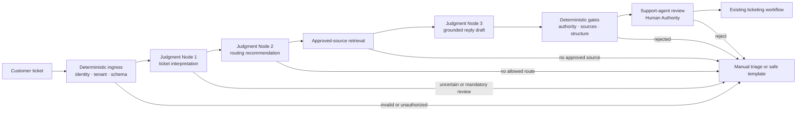
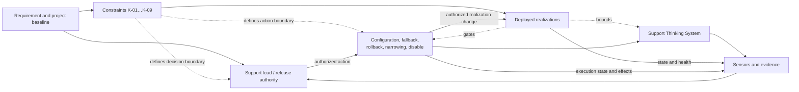

# Worked Thinking System Review: Human-Supervised Support Triage and Grounded Reply Drafting

## Status and evidence boundary

This document is a **reference worked example** of the [`Thinking System Review`](../01-patterns/thinking-system-review.md). It demonstrates how a small engineering team could complete one proportional delivery review while linking an illustrative project authorization.

The company, identifiers, model versions, thresholds, dates, and evidence are synthesized for the example. They are not claims about a real deployment, audited production results, or proof that UA is effective in every context.

The numerical values are local decisions derived from the example's authority, consequences, human-review capacity, and deployment scope. They are not UA defaults.

The example uses one canonical **Constraint Realization Map**. Judgment Nodes, DoR, DoD, Release Gate, and runtime reassessment reference its IDs rather than redefining each Constraint.

---

## 1. Review identity

- **System or feature:** ExampleCo Support Ticket Triage and Grounded Reply Drafting
- **Review identifier and version:** `TSR-SUP-014 v1.0`
- **Previous review:** `TSR-SUP-014 v0.7`
- **Status:** Release review completed; human-supervised limited release proposed
- **Illustrative date opened / last updated:** 2026-06-01 / 2026-07-15
- **Implementation responsibility:** Application engineer
- **Constraint Realization responsibility:** Application engineer with platform/security support
- **Evaluation responsibility:** Support lead with application engineer
- **Operational responsibility:** Support lead
- **Release decision authority:** Product and delivery owner

### Linked versions and evidence

- **Project review/version/outcome:** `PCAVR-SUP-001 v1.0` — Authorized with conditions
- **Requirement record:** `SUP-AI-014`
- **Architecture record:** `ADR-SUP-009`
- **Repository/revision:** `support-assist`, revision `7c9e2f1`
- **Model/version:** pinned deployment `support-model-2026-06`
- **Prompt versions:** `support-triage-v1.4`; `support-reply-v1.7`
- **Policy and Constraint source versions:** `support-policy-v1.3`; `ORG-DATA-004`; `ORG-AI-AUTH-002`
- **Constraint Realization/configuration versions:** `support-boundary-v1.2`; `support-schema-v1.3`; `support-permissions-v1.1`
- **Knowledge snapshot:** `support-kb-2026-06-15`
- **Tools/services:** ticketing API, approved knowledge retrieval, incident-status API
- **Evaluation evidence:** `eval/support-review-v1/`
- **Operational evidence:** `support-assist-limited-release`

The identifiers represent linked records in the illustrative organization. They are not additional repository artifacts.

---

## 2. Outcome, scope, and inherited project boundary

- **Outcome:** Reduce the time required to understand, route, and draft an initial response to ordinary support tickets while preserving support-agent authority and avoiding unauthorized action or unsupported commitments.
- **Why Model Judgment is used:** Tickets are ambiguous, incomplete, and often combine several issues; brittle deterministic parsing would not provide sufficient contextual interpretation.
- **In scope:** English-language Product A tickets; intent extraction; urgency indicators; queue and escalation recommendation; retrieval from approved Product A sources; grounded reply draft.
- **Out of scope:** Autonomous message sending; refunds; entitlement or account changes; legal or contractual commitments; final severity; autonomous closure; security-incident resolution; cross-tenant data.
- **Affected parties:** Support agents, customers, ticketing platform, approved knowledge base, and on-call escalation process.
- **Lifecycle context:** Bounded experiment completed; human-supervised limited deployment proposed.
- **Key assumptions:** Knowledge articles are current and tagged; ticketing platform enforces tenant isolation; agents have enough context and time to reject poor recommendations.
- **Known unknowns:** Other languages; seasonal distribution changes; long-term automation bias; provider-side behavior changes; newly launched Product A features.

### Inherited project baseline

- **Authorized project boundary:** Product A, English, recommendations and drafts only, human-supervised operation, no state-changing authority.
- **Relevant project Constraint IDs:** `PK-01` tenant and data boundary; `PK-02` recommendation-only authority; `PK-03` mandatory Human Authority; `PK-04` bounded product/language/population; `PK-05` approved knowledge and tool dependencies.
- **Required delivery realization:** Read-only credentials, tenant isolation, queue/source allowlists, deterministic mandatory-review rules, no-send boundary, visible source references, fallback, logging, rollback, and feature disable.
- **Maximum autonomy:** Recommendation and drafting only.
- **Relevant project scenarios:** Cross-tenant exposure; missed mandatory escalation; unsupported customer guidance; automation bias; provider/model drift; scope creep.
- **Human Authority assumption:** A trained support agent reviews every recommendation and draft before action.
- **Control-cost boundary:** Limited release must remain useful with the stated review load, request cap, cost, and latency envelope.
- **Project reauthorization triggers:** Autonomous send or state change; new product/language/data class/geography; broader agent population; material model/provider change; weakening a Hard Constraint; review capacity no longer substantive.

### System boundary



- **Inputs:** Current ticket, permitted metadata, Product A identifier, approved account state, incident status.
- **Outputs:** Structured interpretation, route/escalation recommendation, source references, reply draft, or fallback.
- **Dependencies:** Ticketing platform, identity and tenant context, model provider, approved retrieval, human review, existing send/update functions.

---

## 3. Mixed-system responsibilities

### Deterministic responsibilities

- tenant isolation and authentication;
- typed input/output contracts;
- queue and source allowlists;
- mandatory manual-review rules;
- read-only service permissions and no autonomous send or state change;
- audit of tenant, ticket, model, prompt, policy, knowledge, realization, validation, fallback, and human decision;
- fallback and immediate feature disable.

### Model-mediated responsibilities

- interpret intent, ambiguity, missing information, and urgency indicators;
- recommend an allowed route and escalation category;
- formulate retrieval query text;
- synthesize a concise reply draft from approved context.

Useful variation is allowed in wording, explanation order, and genuinely ambiguous route recommendations. Fabricated facts, hidden uncertainty, prohibited commitments, cross-tenant content, and claims that an action already occurred are unacceptable.

### Control responsibilities

- **Sensors:** Routing agreement, mandatory-escalation misses, source coverage, unsupported-claim review, human accept/edit/reject, fallback, latency, cost, violations, realization health, and Actuator execution.
- **Controller:** Support lead for routine operational decisions; product and delivery owner for release conditions, scope, and project-level escalation.
- **Actuators:** Feature flag, queue-level disable, prompt/model/policy/realization deployment, scope narrowing, fallback activation, rollback, and shutdown.
- **Fallback:** Manual triage or deterministic acknowledgement template.
- **Escalation:** Security/privacy events to incident response; quality or capacity degradation to support lead and release authority.

---

## 4. Judgment Nodes

### JN-01 — Ticket Interpretation

- **Placement:** Input Interpretation
- **Inputs/context:** Current ticket, permitted metadata, Product A taxonomy, incident-status flag.
- **Allowed authority:** Produce structured interpretation and uncertainty indicators.
- **Applicable Constraint IDs:** `K-01`, `K-03`, `K-04`, `K-05`, `K-08`.
- **Unacceptable outcomes:** Invented facts; cross-tenant context; suppressed uncertainty; security event treated as routine.
- **Evidence:** Completeness, human agreement, mandatory-review recall, fallback frequency, provenance logs, realization health.
- **Fallback:** Manual triage.
- **Operational owner:** Support lead.
- **Change authority:** Release authority approves production change; project reauthorization for expanded context or authority.

### JN-02 — Routing and Escalation Recommendation

- **Placement:** Decision Logic
- **Inputs/context:** Validated interpretation, queue allowlist, mandatory-review rules, current queue configuration.
- **Allowed authority:** Recommendation only.
- **Applicable Constraint IDs:** `K-02`, `K-03`, `K-04`, `K-08`.
- **Unacceptable outcomes:** Route outside allowlist; missed mandatory review; recommendation represented as completed action.
- **Evidence:** Adjudicated routing agreement, mandatory-escalation misses, overrides, fallback, queue distribution, blocked attempts.
- **Fallback:** Manual-triage queue.
- **Operational owner:** Support lead.
- **Change authority:** Local configuration change within project baseline; project reauthorization for autonomy or action authority.

### JN-03 — Grounded Reply Draft

- **Placement:** Output Mediation
- **Inputs/context:** Ticket, validated interpretation, route recommendation, approved sources, incident status.
- **Allowed authority:** Draft only.
- **Applicable Constraint IDs:** `K-01`, `K-02`, `K-05`, `K-06`, `K-07`, `K-08`.
- **Unacceptable outcomes:** Fabricated feature claims; unsupported troubleshooting; privacy disclosure; prohibited commitment; false completed-action statement.
- **Evidence:** Source coverage, unsupported-claim review, human accept/edit/reject, prohibited-pattern blocks, fallback, privacy events.
- **Fallback:** Deterministic acknowledgement or no draft.
- **Operational owner:** Support lead.
- **Change authority:** Release authority; project reauthorization before autonomous send or broader domain.

---

## 5. Requirement, Operating Envelope, and canonical Constraint Realization Map

### Approved Requirement

Assist support agents with faster understanding, routing, and drafting for ordinary Product A tickets without transferring consequential action authority to Model Judgment.

Deterministic obligations include tenant isolation, permissions, mandatory-review rules, queue/source allowlists, no-send authority, typed interfaces, audit, fallback, and disable. Model-mediated obligations include interpretation, bounded routing recommendation, and useful grounded drafting.

### Operating Envelope

- **Conditions:** English Product A tickets, authenticated tenant context, approved published sources, human-reviewed replies, five trained agents.
- **Acceptable variation:** Wording and explanation order; more than one reasonable allowed route for genuinely ambiguous tickets.
- **Prohibited regions:** Cross-tenant exposure; autonomous action; unsupported content sent; suppressed mandatory escalation; refund, legal, entitlement, or security-resolution commitments.
- **Resource envelope:** Average model/retrieval cost ≤ USD 0.03 per ticket; p95 processing latency ≤ 5 seconds; one model attempt plus one bounded repair attempt.
- **Exposure:** Maximum 100 visible drafts per business day for four weeks.
- **Human supervision:** Every recommendation and draft reviewed before downstream action.

### Constraint Realization Map

| ID and source | Subject and scope | Hard/soft | Realization and enforcement/influence point | Assumptions and claimed guarantee | Failure/bypass/unavailable behavior | Evidence/control health | Change authority and Actuator | Reassessment trigger |
|---|---|---|---|---|---|---|---|---|
| `K-01` / `ORG-DATA-004` | Current-tenant ticket and account context only | Hard | Authentication, tenant-scoped query, row-level access, no cross-tenant retrieval | Platform identity and tenant controls operate as designed; unauthorized access is rejected | Fail closed to manual workflow; security incident on violation or bypass | Access-denial logs, tenant identifiers, integration tests, incident evidence | Security/platform authority; permission/config deployment Actuator | Any confirmed exposure, bypass, or platform-control change |
| `K-02` / `PK-02` | No autonomous send, closure, refund, entitlement, account, or security action | Hard | Read-only service credentials; no write-capable endpoint exposed to the AI path | Credential and endpoint boundaries are complete; unauthorized action is unreachable | Reject action; disable feature; incident escalation | Permission tests, denied calls, credential/config state | Project/release authority; permission or feature-flag Actuator | Any write authority or new state-changing tool requires project reauthorization |
| `K-03` / `PK-03` | Mandatory human approval before downstream customer action | Hard | Workflow requires agent approval; application cannot call send/update without existing human action path | Existing ticketing workflow cannot be bypassed and agents retain real review power | Block to manual workflow; disable if approval becomes ceremonial or bypassable | Approval/reject/edit records, review latency and volume, bypass tests | Release authority; workflow/configuration Actuator | Review capacity, context, competence, or power becomes inadequate |
| `K-04` / `support-policy-v1.3` | Routes limited to approved Product A queues; defined cases require manual review | Hard | Queue enumeration, deterministic mandatory-review rules, default manual-triage queue | Taxonomy/configuration are current; route outside list is rejected | Reject or route to manual triage; disable automated recommendation if stale | Rejected routes, mandatory-review triggers, queue distribution, config version | Support/release authority; allowlist/config deployment Actuator | Taxonomy change, confirmed missed mandatory review, or new route authority |
| `K-05` / `PK-05` | Only approved Product A knowledge sources may enter retrieval context | Hard | Published-source allowlist, source snapshot/version, retrieval filter | Source metadata and allowlist are correct; non-approved source is excluded | No-source fallback; disable retrieval on filter failure | Source IDs, rejected sources, snapshot/version, filter-health evidence | Knowledge/release authority; source-config Actuator | New source class, filter bypass, stale-source process failure |
| `K-06` / `SUP-AI-014` | Every visible factual draft paragraph carries approved source references | Hard structural | Draft schema requires source identifiers; deterministic validation blocks missing references | Schema/validation covers the presented draft fields; missing references are rejected | No draft or safe template | Schema tests, block logs, source-coverage records | Release authority; schema/config deployment Actuator | Schema bypass, new output channel, or validation degradation |
| `K-07` / `SUP-AI-014` | Unsupported factual claims should not reach customers | Soft composite | Grounding instruction, claim review/evaluator, visible sources, agent review, deterministic block for missing references | Semantic support cannot be determined perfectly; no claim of deterministic truth guarantee | Block known failures; fallback; incident and reassessment if unsupported content is sent | Unsupported-claim sample, human reject/edit, complaints, incidents | Release authority; prompt/evaluator/fallback/disable Actuators | Unsupported content sent, evaluator calibration loss, or review becomes ineffective |
| `K-08` / `PK-04` | Product A, English, five trained agents, limited request volume | Hard exposure | Feature targeting, language/product checks, agent allowlist, daily request cap | Targeting and rate controls operate correctly | Reject outside scope; no AI output; narrow or disable | Exposure/config state, request counts, rejected scope | Release authority within project boundary; targeting/rate Actuators | New product, language, population, geography, or higher exposure requires project reauthorization |
| `K-09` / `SUP-AI-014` | One primary attempt, one repair; stated cost and latency envelope | Hard for attempt count; operational limit for cost/latency | Orchestration depth limit, timeout, budget and rate monitoring | Attempt/timeout controls are deterministic; aggregate cost/latency may vary | Stop and fallback on limit; reassess persistent economic breach | Attempts, timeout, cost, latency, fallback, saturation | Operational authority; budget/rate/config Actuators | Persistent envelope breach or changed unit economics |

`K-07` is intentionally Soft: source visibility, evaluation, and human review reduce risk but do not deterministically establish semantic truth. `K-02`, `K-03`, `K-05`, and `K-06` provide hard authority, source, approval, and structural boundaries around that residual uncertainty.

### Capability path



---

## 6. Definition of Ready

- [x] Outcome, scope, system boundary, and inherited project authorization are explicit.
- [x] Three consequential Judgment Nodes are identified with bounded authority.
- [x] Requirement and Operating Envelope are defined for the bounded experiment.
- [x] Every material Constraint has one row in section 5.
- [x] Hard and Soft claims are separated; semantic support is not represented as a deterministic guarantee.
- [x] Failure, fallback, containment, evidence, Controller, Actuator, and Human Authority paths are defined.
- [x] Cost, latency, data, privacy, and operational dependencies are bounded sufficiently for an experiment.

**Readiness outcome:** Ready for bounded experiment.

- **Illustrative decision date:** 2026-06-07
- **Authority:** Product and delivery owner
- **Experiment boundary:** De-identified historical tickets, then production shadow traffic, then five-agent supervised pilot; no autonomous action; fixed reviewed versions.
- **Stopping conditions:** Cross-tenant exposure; attempted unauthorized action; confirmed mandatory-escalation miss; inability to diagnose behavior; unsupported-claim evidence above the experiment limit; cost above USD 0.05 average per ticket.

---

## 7. Bounded experiment and evidence

| Stage | Scope | Illustrative result | Decision interpretation |
|---|---|---|---|
| Offline replay | 420 de-identified Product A tickets, including 60 high-consequence and 90 ambiguous cases | Routing agreement 91%; no known mandatory-escalation miss in the 60-case set; ten unsupported drafts before refinement | Promising but insufficient; source validation and fallback needed refinement. |
| Variability check | Three runs for each of 90 ambiguous tickets | 18% changed route at least once; all stayed in allowed queues; seven crossed ordinary/manual-review recommendation | Explicit ambiguity fallback was required; majority voting was rejected. |
| Shadow operation | 680 live tickets over two weeks | Routing agreement 89% on adjudicated sample; p95 3.8 seconds; average cost USD 0.021; fallback 6.4% | Runtime distribution and resources remained within the experiment envelope. |
| Supervised pilot | 410 visible recommendations/drafts across five agents | 62% accepted without material edit; 27% lightly edited; 11% rejected; three unsupported drafts blocked before send | Utility condition met; human review and source controls remain necessary. |

### Changes made

- added deterministic mandatory-review rules before route recommendation;
- required source identifiers for factual draft paragraphs;
- added no-source fallback;
- removed preliminary severity authority;
- limited attempts and draft length;
- added queue-distribution, fallback, source, violation, and realization-health monitoring;
- added accept/edit/reject and escalation-override evidence;
- preserved manual workflow as fallback.

No real incident is claimed. Unsupported drafts and unstable ambiguous routing are synthesized evidence demonstrating how the boundary changes before release.

---

## 8. Definition of Done

- [x] Tenant, permission, queue/source allowlist, no-write, schema, mandatory-review, fallback, audit, rollback, and disable tests passed for the limited scope.
- [x] Hard realizations were tested for bypass and negative-authority cases.
- [x] Required scenarios, unacceptable outcomes, and relevant variability were evaluated.
- [x] Evidence limitations are explicit; no extrapolation is made to other products, languages, autonomous operation, or future model versions.
- [x] Realization activation, violation, fallback, false-block, latency, cost, and Human Authority evidence is available.
- [x] Sensors, Controller responsibilities, Actuators, fallback, containment, escalation, rollback, and disable paths are operable for the limited release.
- [x] Evidence does not invalidate the illustrative project authorization.

**Completion outcome:** Complete with recorded limitations.

- **Illustrative decision date:** 2026-07-12
- **Limitations:** One product, one language, five agents, mandatory human review, small high-consequence sample, no autonomous-action evidence, long-term drift unknown.

---

## 9. Residual risk

| Residual risk | Current boundary and evidence | Acceptance invalidated when |
|---|---|---|
| Rare missed urgency or mandatory escalation | `K-04`, human review, adjudicated cases, any confirmed miss treated as incident | A confirmed miss is caused or permitted by the released system |
| Plausible but unsupported wording | `K-05`–`K-07`, visible sources, evaluator and human review, blocked missing references | Unsupported content is sent or semantic review degrades materially |
| Stale or incorrectly tagged knowledge | Versioned approved-source snapshot, source visibility, knowledge-age monitoring | Stale guidance affects a customer or source governance fails |
| Automation bias | `K-03`, visible sources/uncertainty, reject/edit controls, review-capacity evidence | Review becomes ceremonial or acceptance rises while quality evidence worsens |
| Distribution or provider shift | Version logging, shadow evaluation, routing/fallback/source signals, disable path | Material unexplained change persists or evidence no longer supports release |
| Scope creep | `K-08` targeting and explicit reauthorization triggers | New product, language, population, data, tool, geography, or authority is enabled |

The sample supports only the limited decision. It does not establish very low true incident probabilities or long-term stability.

---

## 10. Proposed deployment and Release Gate

### Proposed deployment

- **Environment:** Production, feature-flagged limited release.
- **Active versions:** Model `support-model-2026-06`; prompts `v1.4`/`v1.7`; policy `v1.3`; knowledge `2026-06-15`; realization package `support-boundary-v1.2`.
- **Population:** Five trained Product A support agents.
- **Data/scope:** Authenticated English Product A tickets.
- **Duration/exposure:** Four weeks; maximum 100 visible drafts per business day.
- **Authority:** Read-only ticket, approved knowledge, incident status; no send or state-changing permission.
- **Human supervision:** Every recommendation and draft reviewed.
- **Active Constraints:** `K-01`–`K-09`.

### Evidence reviewed

- project authorization and inherited baseline;
- approved Requirement and Operating Envelope;
- section 5 Constraint Realization Map and active versions;
- deterministic, behavioral, authority, resource, realization-health, fallback, and incident-path evidence;
- DoD outcome and known limitations;
- residual-risk statement.

### Release decision

- [x] Human-supervised limited release
- [ ] Full release
- [ ] Block
- [ ] Return to experiment or implementation
- [ ] Project reauthorization required
- [ ] Rollback or escalate

- **Illustrative decision date:** 2026-07-15
- **Authority:** Product and delivery owner
- **Rationale:** Evidence supports useful recommendations and drafts while hard authority, tenant, source, approval, exposure, and structural boundaries prevent the model-mediated path from directly taking consequential action.
- **Conditions:** Five trained agents; no autonomous send; source visibility; request cap; daily review for two weeks; fixed reviewed versions; no scope expansion without reauthorization.
- **Immediate disable triggers:** Privacy/tenant violation; unauthorized action path; confirmed missed mandatory escalation; unsupported content sent; bypass or loss of `K-02`/`K-03`; inability to reconstruct decisions.

---

## 11. Operation and reassessment

### Runtime evidence

- active Constraint source and realization versions;
- routing, escalation, draft, human decision, and downstream outcome evidence;
- realization activation, violations, rejected actions, bypass attempts, overrides, false blocks, fallback load, cost, latency, and availability;
- model, prompt, policy, knowledge, permission, tool, and provider changes;
- Actuator execution and resulting state;
- Human Authority capacity and review quality.

### Reassessment triggers

- confirmed Requirement or Constraint violation;
- material realization degradation or bypass;
- unsupported content sent;
- mandatory-escalation miss;
- review capacity or authority becomes non-substantive;
- model/provider, source, policy, permission, or tool change;
- persistent cost, latency, false-block, fallback, or incident burden outside assumptions;
- expansion of product, language, population, data, geography, deployment, tools, or autonomy;
- proposed relaxation or removal of a Hard Constraint.

### Reassessment routing

```text
Local implementation, configuration, or evidence problem
→ new Thinking System Review version

Project risk, authority, Constraint feasibility, capacity, economics, or scope changed
→ Project reauthorization

Organizational source, decision right, or shared capability changed
→ Organizational review
```

---

## 12. Version and decision history

| Review version | Illustrative date | Trigger | Project review version | Material Constraint/realization change | Readiness | Completion | Release/reassessment | Authority |
|---|---|---|---|---|---|---|---|---|
| 0.1 | 2026-06-07 | Initial framing | `PCAVR-SUP-001 v1.0` | Initial `K-01`–`K-09` hypotheses | Ready for bounded experiment | — | Experiment only | Product/delivery owner |
| 0.7 | 2026-07-12 | Experiment complete | `PCAVR-SUP-001 v1.0` | Mandatory-review, source, no-send, and monitoring realizations refined | — | Complete with limitations | Pending Release Gate | Implementation/evaluation responsibilities |
| 1.0 | 2026-07-15 | Limited-release review | `PCAVR-SUP-001 v1.0` | Active realization package frozen for limited scope | — | Complete with limitations | Human-supervised limited release | Product/delivery owner |

---

## 13. Framework application findings

These are observations from constructing the reference, not empirical findings from a real organization.

1. One living delivery artifact is sufficient when one canonical Constraint Realization Map is referenced throughout.
2. Constraint and Constraint Realization must remain separate: `K-07` is a Soft semantic boundary even though hard source, approval, authority, and structural boundaries surround it.
3. DoD and Release Gate answer different questions: implementation can be complete while deployment remains limited by scope, evidence, and Human Authority.
4. Human review is control only when context, capacity, reject power, and fallback remain real.
5. Product thresholds require local rationale and must not become UA defaults.
6. The worked example still needs validation against a real project review and operating team before it can support claims about framework effectiveness.

## Related UA material

- [`Project Control Architecture and Viability Review`](../01-patterns/project-control-architecture-and-viability-review.md)
- [`Thinking System Review`](../01-patterns/thinking-system-review.md)
- [`Thinking System Review Template`](../01-patterns/thinking-system-review-template.md)
- [`Judgment Node Boundary`](../01-patterns/judgment-node-boundary.md)
- [`Control-Loop Capability Anatomy`](../00-doctrine/control-loop-anatomy.md)
- [`Model Judgment Placement`](../00-doctrine/model-judgment-placement.md)
- [`Requirements, Correctness, and Bugs`](../00-doctrine/requirements-correctness-and-bugs.md)
- [`AI Control Plane`](../02-ai-control-plane/)
- [`Constraint Capabilities`](../02-ai-control-plane/01-constraints/)
