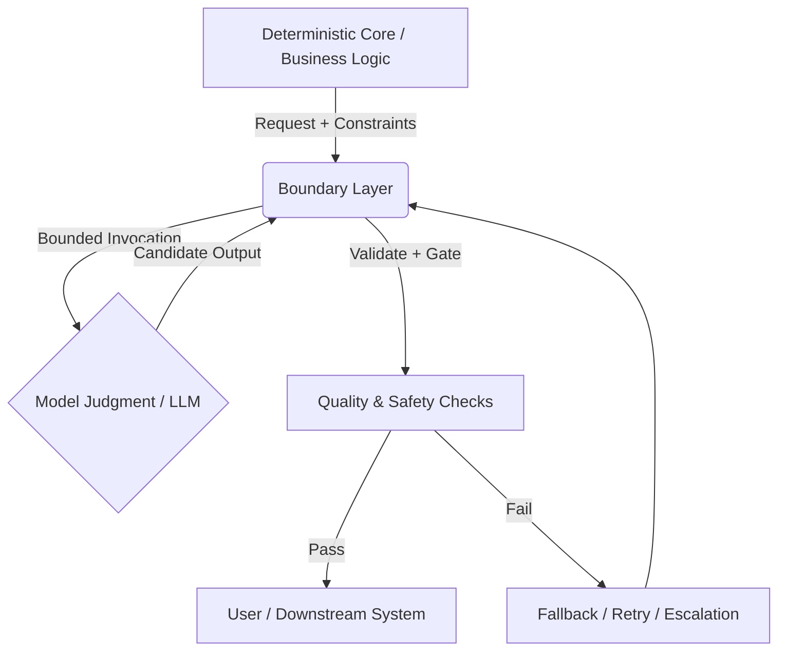

# Uncertainty Architecture (UA)
## Engineering at the AI–Code Boundary

> **Uncertainty Architecture** is a doctrine and pattern language for building software systems in which part of the system’s behavior is delegated to **non-deterministic model judgment** (LLMs, agentic components, tool-using policies), while the surrounding system remains **deterministic, inspectable, and safe**.
 
UA is not about eliminating uncertainty or making AI “deterministic.”  
It is about **containing uncertainty**: deciding where determinism must hold, where judgment is unavoidable, and how the interface between the two is engineered, observed, and corrected over time.

---

## Why UA Exists

Teams consistently fail with AI-enabled features for the same reasons:

- They treat model output as if it were a stable API response.
- They embed judgment inside prompts and mistake it for logic.
- They overfit to dashboards and metrics while missing real-world failures.
- They build “agentic” systems without clear boundaries, escalation paths, or fallbacks.

These failures are not caused by stochasticity itself. They occur when teams lack a clear **interface doctrine** between deterministic software and probabilistic judgment.

Uncertainty Architecture exists to fill that gap.

---

## What UA Is — and Is Not

### UA *is*:
- A shared way of **thinking**, **designing**, and **reviewing** systems at the AI–code boundary
- A collection of **interface patterns** for containment, evaluation, escalation, and fallback
- An **operational doctrine** grounded in real systems and real failure modes

### UA is *not*:
- An SDK or universal agent framework  
- A prompt-template pack  
- A single metric or eval that “solves alignment”  
- A compliance checklist or certification program  

UA does not prescribe a platform. It provides **conceptual tools** teams can adapt to their own architecture.

---

## What UA Covers

UA operates at three complementary levels:

### 1. Doctrine (How to Think)
- What model judgment is operationally — and what it is not
- Where formal specification ends and interpretation begins
- Why false rigor (over-specified metrics, brittle schemas) fails in practice

### 2. Patterns (How to Build)
- Boundary patterns between deterministic code and model judgment
- Containment mechanisms: guardrails, validation, retries, fallbacks
- Drift detection and structured review loops

### 3. Operating Model (How to Run)
- Roles and decision points teams actually need
- Release gates for probabilistic components
- Incident handling and “battle-scar” feedback

---

## Core Research & Chronology
The evolution of this framework has been documented through the following key publications:

• Dec 2025: Community Stress Test (Reddit)

https://www.reddit.com/r/learndatascience/s/zLnN4sYftb

• Dec 2025: Why AI Governance is Actually Control Theory

https://www.linkedin.com/pulse/uncertainty-architecture-why-ai-governance-actually-control-oborskyi-oqhpf/

• Nov 2025: Uncertainty Architecture: A Modern Approach

https://www.linkedin.com/pulse/uncertainty-architecture-modern-approach-designing-llm-oborskyi-keqbf/

• Jul 2025: Architecting Uncertainty: A Modern Guide

https://www.linkedin.com/pulse/architecting-uncertainty-modern-guide-llm-based-vitalii-oborskyi-0qecf/

---

## A Core Principle: Containment, Not Certainty

UA treats AI governance as an **engineering activity**: the design of feedback and containment mechanisms required to operate systems with non-deterministic components.

Control-theoretic ideas inform this work as practical engineering tools:
- feedback loops,
- instrumentation,
- correction mechanisms.

However, UA also recognizes a structural limit: many correctness targets in AI-enabled systems are **interpretive** (usefulness, clarity, appropriateness, policy intent). These cannot be fully reduced to a scalar metric.

For this reason, UA relies on **mixed evaluation**:
- quantitative signals where they are stable and meaningful,
- and structured human judgment where goals are inherently interpretive.

Metrics are treated as **operational instruments**, not exhaustive definitions of success.

---

## Deterministic Core and Model Judgment

UA makes an explicit distinction between:

- **Deterministic Core**  
  Business rules, invariants, data handling, authentication, auditing, safety constraints.

- **Model Judgment**  
  Interpretation, synthesis, classification under ambiguity, open-text generation, tool choice under uncertainty.

The value of UA lies in how these two regions are **connected**, not in attempting to collapse one into the other.

---

## The Boundary Layer (Control Plane Pattern)

UA describes a recurring architectural pattern often referred to here as a **boundary layer** (sometimes called a “control plane” in the literature). This is not a product or platform, but a **pattern vocabulary**.

The boundary layer is responsible for:
- mediating requests to model judgment,
- enforcing constraints and permissions,
- validating and gating outputs,
- routing retries, fallbacks, and escalation,
- maintaining versioning and auditability.

It exists to make judgment **visible, bounded, and correctable**.

---

## Evaluation as Instrumentation

UA treats evaluation as instrumentation rather than proof. Common instruments include:
- regression suites and golden scenarios,
- red-team and edge-case probes,
- production monitoring and cost signals,
- incident tracking and postmortems,
- qualitative review checkpoints.

No single instrument is sufficient. UA emphasizes **compositional sensing** over metric monoculture.

---

## Conceptual Diagram

---

## Repository Scope & Structure (Planned)

This repository is a **specification and doctrine project**, not a codebase.
It will evolve as a set of durable documents teams can adopt incrementally.

Planned sections:

* `/doctrine/`
  Core concepts and boundary thinking

* `/patterns/`
  Repeatable interface and containment patterns

* `/operating-model/`
  Roles, rituals, release gates, incident practices

* `/failure-modes/`
  Anti-patterns and real-world “battle scars”

* `/reference-architectures/`
  Worked examples (illustrative, not prescriptive)

---

## Community Discussion

High-bandwidth discussion and design review happens in the Collaborative Dynamics Discord server "Stunspot Prompting":

* [**🧰 uncertainty-architecture** — community kitchen for UA](https://discord.com/channels/1100933695986208849/1457956432287760605)

GitHub is the canonical home for doctrine and changes; Discord is where ideas are stress-tested before becoming documents.

---

## Status & Roadmap

UA is an active, evolving project.

* **Phase 1 — Spine:** scope, doctrine baseline, core distinctions (in progress)
* **Phase 2 — Patterns:** boundary patterns and failure modes
* **Phase 3 — Operating Model:** team practices that actually run
* **Phase 4 — Tooling (Optional):** small utilities, only if they serve the doctrine

The priority is durable clarity, not rapid tooling.

---

## Authors & Architects

**Vitalii Oborskyi** — Structure & Governance
Creator & Lead Architect
Focus: operational framing, governance practices, adoption scaffolding, and system-level clarity.

* Email: [oborskyivitalii@gmail.com](mailto:oborskyivitalii@gmail.com)
* LinkedIn: [https://www.linkedin.com/in/vitaliioborskyi/](https://www.linkedin.com/in/vitaliioborskyi/)
* GitHub: [https://github.com/oborskyivitalii](https://github.com/oborskyivitalii)

**Sam “stunspot” Walker** — Boundary Doctrine & System Patterns
Technical Co-Author
Focus: AI–code boundary placement, containment patterns, prompt-as-medium realism, and real-world failure modes.

* Email: [stunspot@collaborative-dynamics.com](mailto:stunspot@collaborative-dynamics.com)
* Discord: [Stunspot Prompting](https://discord.gg/bGN45ynQ) (Channel: [🧰 uncertainty-architecture](https://discord.com/channels/1100933695986208849/1457956432287760605) )

---

## Advisors

**Markus Kopko** — Governance & Standards Alignment

* LinkedIn: [https://www.linkedin.com/in/markuskleinpmp/](https://www.linkedin.com/in/markuskleinpmp/)

Additional contributors and reviewers will be credited as the work matures.

---

## Contributing

See `CONTRIBUTING.md` for workflow and expectations.

We especially welcome:

* failure reports and postmortems,
* boundary pattern proposals,
* critiques grounded in real systems,
* clarifications that improve precision.

---

## Licensing

* Documentation and specifications: **CC BY 4.0**
* Code and reference implementations (if added): **Apache 2.0**

See `LICENSING.md` for details.

