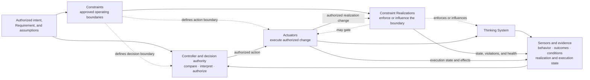

# Uncertainty Architecture (UA)

> **UA navigation**
>
> [UA Home](README.md) · [Specification](SPECIFICATION.md)
>
> **Lifecycle:** [Organization / boundaries](00-doctrine/nested-control-lifecycle.md#1-organizational-control-context) · [Project / architecture](01-patterns/project-control-architecture-and-viability-review.md) · [Delivery / release](01-patterns/thinking-system-review.md) · [Runtime / reassessment](00-doctrine/nested-control-lifecycle.md#4-runtime-operation-and-reassessment)
>
> **Explore:** [Doctrine](00-doctrine/) · [Patterns](01-patterns/) · [Control capabilities](02-ai-control-plane/) · [Reference architectures](03-reference-architectures/) · [Failure modes](04-failure-modes/) · [Research](content/research/index.md)

## Engineering at the AI–Code Boundary

**Uncertainty Architecture** is an open doctrine and pattern language for building and operating software in which part of runtime behavior is delegated to **probabilistic Model Judgment**, while consequential deterministic responsibilities, approved Constraints, evidence, decision rights, and corrective mechanisms remain explicit.

UA is designed primarily for small and medium-sized engineering organizations that need practical control without building a large governance bureaucracy.

## Why UA Exists

Traditional software is engineered primarily as explicitly encoded behavior:

```text
y = f(x)
```

A Thinking System delegates part of runtime interpretation, synthesis, planning, or path selection to a probabilistic model:

```text
y ~ P(y | x, context, model configuration)
```

Some consequential behavior is therefore generated during operation rather than fully enumerated in advance. This changes the controlled object itself.

UA complements product discovery, Agile, DevOps, QA, security, change management, and incident response with a project-to-runtime control lifecycle for model-mediated behavior.

Read [`Uncertainty in the Controlled Object`](00-doctrine/uncertainty-in-the-controlled-object.md).

## Two Orthogonal Models

### Where is a decision owned?

The [`Nested Control Lifecycle`](00-doctrine/nested-control-lifecycle.md) distinguishes:

1. [`Organizational control context`](00-doctrine/nested-control-lifecycle.md#1-organizational-control-context) — existing authoritative sources, shared capabilities, and decision rights; UA does not require a separate organizational governance file by default;
2. [`Project control architecture and viability`](01-patterns/project-control-architecture-and-viability-review.md) — project boundary, Project Constraint Architecture, viability, authorization, and reauthorization;
3. [`Delivery-level Thinking System Review`](01-patterns/thinking-system-review.md) — concrete realization, DoR, DoD, deployment-specific Release Gate, and local reassessment;
4. [`Runtime operation and reassessment`](00-doctrine/nested-control-lifecycle.md#4-runtime-operation-and-reassessment) — active realization, evidence, corrective action, and escalation to the decision level whose basis is invalidated.

### Which capability families make control operational?

The [`Control-Loop Capability Anatomy`](00-doctrine/control-loop-anatomy.md) distinguishes:

1. [`Constraints and their realizations`](02-ai-control-plane/01-constraints/) — approved boundaries plus the mechanisms that implement, enforce, or influence them;
2. [`Sensors and evidence`](02-ai-control-plane/02-sensors/) — observation of behavior, outcomes, realization state, and control health;
3. [`Controllers and decision authority`](02-ai-control-plane/03-controller/) — comparison, interpretation, and authorization;
4. [`Actuators and corrective action`](02-ai-control-plane/00-actuators/) — execution of authorized change.

A Constraint is an authoritative decision object, while a Constraint Realization is its operational mechanism. The decision levels are not capability layers. The capability families are not mandatory services.

## Core Control Model


```mermaid
flowchart LR
    R[Authorized intent,<br/>Requirement, and assumptions]
    K[Constraints<br/>approved operating boundaries]
    KR[Constraint Realizations<br/>enforce or influence the boundary]
    P[Thinking System]
    S[Sensors and evidence<br/>behavior · outcomes · conditions<br/>realization and execution state]
    C[Controller and decision authority<br/>compare · interpret · authorize]
    A[Actuators<br/>execute authorized change]

    R --> C
    R --> K
    K --> KR
    K -. defines decision boundary .-> C
    K -. defines action boundary .-> A
    KR -. enforces or influences .-> P
    KR -. may gate .-> A
    P --> S
    KR -->|state, violations, and health| S
    A -->|execution state and effects| S
    S --> C
    C -->|authorized action| A
    A --> P
    A -->|authorized realization change| KR
```

A **Constraint** is the approved boundary. A **Constraint Realization** is the mechanism implementing, enforcing, or influencing it. A **Controller** selects or authorizes action. An **Actuator** executes it.

A closed feedback loop can still be unsafe or over-authorized. Constraints and their realizations bound the space in which the loop may operate; they are not the feedback edge itself.

Canonical definitions live in:

- [`Control-Loop Capability Anatomy`](00-doctrine/control-loop-anatomy.md)
- [`Glossary`](00-doctrine/glossary.md)
- [`AI Control Plane`](02-ai-control-plane/)

## Practical SMB Path

UA uses two living review surfaces with different ownership.

### Project authorization

The [`Project Control Architecture and Viability Review`](01-patterns/project-control-architecture-and-viability-review.md) connects:

- business outcome and AI necessity;
- project boundary and material scenarios;
- one canonical Project Constraint Architecture;
- required realizations, Sensors, Controllers, Actuators, Human Authority, fallback, containment, rollback, compensation, and shutdown;
- evidence feasibility, capacity, and control economics;
- authorization, conditions, bounded research, redesign, deferral, escalation, or No-Go;
- a versioned delivery-inheritance baseline;
- project reauthorization.

Use the [`project review template`](01-patterns/project-control-architecture-and-viability-review-template.md).

### Delivery realization and release

The [`Thinking System Review`](01-patterns/thinking-system-review.md) applies the project boundary to one bounded system, feature, or material change through:

- implementation-level Judgment Nodes;
- the delivery Requirement and Operating Envelope;
- one canonical Constraint Realization Map;
- Definition of Ready;
- implementation or bounded experiment;
- Definition of Done;
- deployment-specific Release Gate;
- runtime evidence and reassessment.

Use the [`delivery review template`](01-patterns/thinking-system-review-template.md).

A successful demo is not project authorization. DoD is not release authorization. A Release Gate does not expand the project boundary. `No-Go` remains a valid engineering result.

## Constraint Engineering

Constraints may address structure, authority, states, data, context, resources, exposure, environment, dependencies, Human Authority, and probabilistic behavioral influence.

Hard or soft is a scoped claim about a Constraint together with its complete realized path, not an intrinsic property of policy text.

A **Hard Constraint** deterministically prevents or rejects violation within stated assumptions, subject, path, scope, and enforcement boundaries.

A prompt, natural-language policy, probabilistic evaluator, classifier, or model policy is not hard by itself.

When one source condition has different guarantee strengths across subjects, paths, or scopes, it should be split into separate Constraint records.

See:

- [`Constraint Capabilities`](02-ai-control-plane/01-constraints/)
- [`Constraint Realization Catalog`](02-ai-control-plane/01-constraints/constraint-realization-catalog.md)

Named technologies are examples, not requirements.

## Start Here

1. [`Specification boundary and conformance`](SPECIFICATION.md)
2. [`Uncertainty in the Controlled Object`](00-doctrine/uncertainty-in-the-controlled-object.md)
3. [`Control-Loop Capability Anatomy`](00-doctrine/control-loop-anatomy.md)
4. [`Nested Control Lifecycle`](00-doctrine/nested-control-lifecycle.md)
5. [`Canonical Glossary`](00-doctrine/glossary.md)
6. [`Project Control Architecture and Viability Review`](01-patterns/project-control-architecture-and-viability-review.md)
7. [`Thinking System Review`](01-patterns/thinking-system-review.md)
8. [`AI Control Plane`](02-ai-control-plane/)
9. [`Reference Architectures`](03-reference-architectures/)
10. [`Failure Modes and Anti-Patterns`](04-failure-modes/)

## Repository Structure

- [`00-doctrine/`](00-doctrine/) — foundational concepts and terminology.
- [`01-patterns/`](01-patterns/) — project review, Judgment Node Boundary, delivery review, and reusable patterns.
- [`02-ai-control-plane/`](02-ai-control-plane/) — distributed capability families:
  - [`00-actuators/`](02-ai-control-plane/00-actuators/)
  - [`01-constraints/`](02-ai-control-plane/01-constraints/)
  - [`02-sensors/`](02-ai-control-plane/02-sensors/)
  - [`03-controller/`](02-ai-control-plane/03-controller/)
- [`03-reference-architectures/`](03-reference-architectures/) — non-prescriptive applications.
- [`04-failure-modes/`](04-failure-modes/) — recurring loss-of-control mechanisms.
- [`content/research/`](content/research/) — research and framework traceability.
- [`content/history/`](content/history/) — chronology and preserved public context.
- [`content/raw/`](content/raw/) — source snapshots.

The AI Control Plane directory numbering is navigation only. It does not define an execution order or physical stack.

## What UA Is — and Is Not

UA is a shared architectural language, a project-to-runtime control lifecycle, a set of technical and socio-technical patterns, and an evolving tool-neutral specification.

UA is not an SDK, universal agent framework, prompt collection, single guardrail product, mandatory four-service topology, replacement SDLC, governance department, compliance certification, or claim that uncertainty can be eliminated.

## Status, Evidence, and Contributions

**Active specification development.** The current draft baseline connects the controlled-object doctrine, four capability families, project authorization, delivery realization and release, and runtime reassessment. A complete two-level worked application, real-team use, operational evidence, and further terminology validation remain open before a broader maturity claim. See [`ROADMAP.md`](ROADMAP.md).

UA keeps different kinds of evidence separate:

- [**Research**](content/research/) records sources, analysis, synthesis, and framework traceability.
- [**Public discussions and stress tests**](content/history/community-discussions.md) record critique, alternatives, and unresolved questions.
- [**Independent references and recognition**](content/history/external-recognition.md) record how third parties cited, interpreted, recommended, or used UA.
- [**Talks and presentations**](content/history/talks.md) record practitioner exposure without treating invitations as technical validation.
- The [**changelog**](CHANGELOG.md) records changes to repository and specification artifacts.

Visibility, recommendations, advisory relationships, invited talks, and synthesized examples are not treated as certification, institutional endorsement, formal adoption, or production evidence. The evidence policy and complete historical index are maintained in [`content/history/`](content/history/).

GitHub is the canonical home for doctrine and specification changes. Useful contributions include operational failure reports, worked applications, pattern proposals, critiques of terminology or control assumptions, evidence about Human Authority and control cost, and provenance corrections.

For contribution and review guidance:

- [`CONTRIBUTING.md`](CONTRIBUTING.md)
- [`AGENTS.md`](AGENTS.md)
- [`DOCUMENT-METADATA.md`](DOCUMENT-METADATA.md)
- [`content/research/review-process.md`](content/research/review-process.md)

## Authors and Maintainers

### Vitalii Oborskyi — Creator, Lead Architect, and Maintainer

Focus: operational framing, governance, delivery systems, adoption scaffolding, and system-level control.

- [LinkedIn](https://www.linkedin.com/in/vitaliioborskyi/)
- [GitHub](https://github.com/oborskyivitalii)

### Sam “stunspot” Walker — Technical Co-Author

Focus: AI–code boundary placement, containment patterns, prompt-as-medium realism, and real-world failure modes.

### Contributors and reviewers

Additional contributors and reviewers are credited through [Git history and the contributors graph](https://github.com/UncertaintyArchitectureGroup/uncertainty-architecture/graphs/contributors), merged pull requests, and attributed research or history records. Contribution guidance is maintained in [`CONTRIBUTING.md`](CONTRIBUTING.md).

## Advisors

### Markus Kopko — Strategic Advisor on Governance and Alignment

Focus: project-management standards, organizational alignment, and the operationalization of AI governance.

- [LinkedIn](https://www.linkedin.com/in/markuskleinpmp/)

### Otman Basir, Ph.D. — Academic Advisor

Professor in the Department of Electrical and Computer Engineering at the University of Waterloo and author of the Social Responsibility Stack. His role supports the connection between control-theoretic research and practical engineering governance.

- [LinkedIn](https://www.linkedin.com/in/otman-basir-ba1258178)

Advisory relationships are part of the project's operating context. They do not imply institutional endorsement, certification, or formal adoption of UA. Supporting public evidence and precise claim boundaries are recorded in [`content/history/external-recognition.md`](content/history/external-recognition.md).

## How to Cite

GitHub can generate APA and BibTeX citations from the repository's machine-readable [`CITATION.cff`](CITATION.cff). The following BibTeX entry is the human-readable repository citation:

```bibtex
@misc{oborskyi_walker2025uncertainty,
  author = {Oborskyi, Vitalii and Walker, Sam},
  title = {Uncertainty Architecture},
  year = {2025},
  publisher = {GitHub},
  url = {https://github.com/UncertaintyArchitectureGroup/uncertainty-architecture},
  note = {Open engineering specification for Thinking Systems}
}
```

Individual articles and publications should be cited using their own publication metadata rather than this repository-level entry.

## Licensing

This repository uses a dual-license model:

- documentation, specifications, architectural doctrine, diagrams, and operating-model material: CC BY 4.0;
- code, scripts, reference implementations, and executable artifacts: Apache 2.0.

See [`LICENSING.md`](LICENSING.md) for details.
