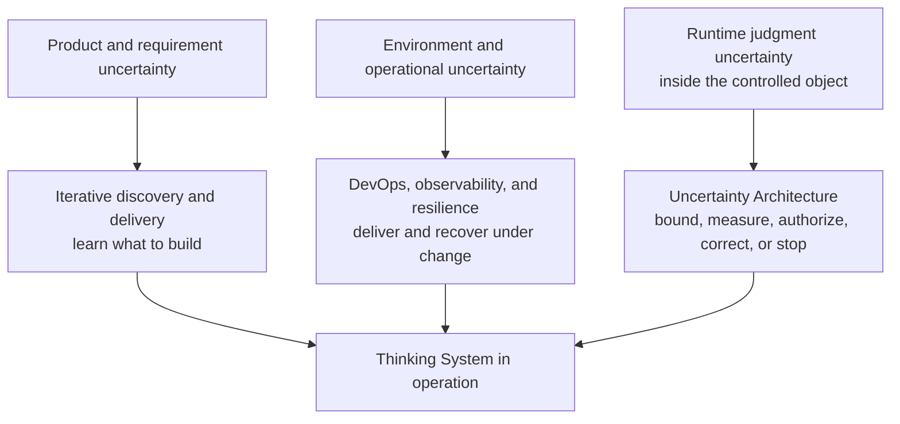
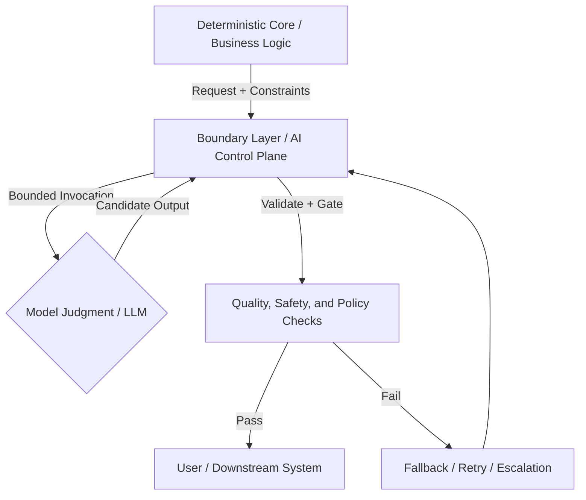
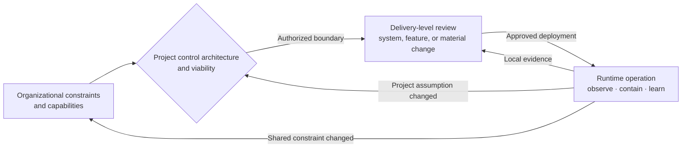

# Uncertainty Architecture (UA)

## Engineering at the AI–Code Boundary

**Uncertainty Architecture** is an open doctrine and pattern language for building and operating software in which part of the system's behavior is delegated to **non-deterministic model judgment**, while the surrounding system remains **deterministic, inspectable, and governable**.

UA is not about eliminating uncertainty or pretending that AI can be made fully deterministic. It is about **containing uncertainty**: deciding where determinism must hold, where judgment is unavoidable, and how the boundary between the two is engineered, observed, and corrected over time.

The project is designed primarily for small and medium-sized engineering organizations that need practical control without building a large governance bureaucracy.

## Why UA Exists

Traditional software is engineered primarily as explicitly encoded behavior:

```text
y = f(x)
```

A Thinking System delegates part of runtime interpretation, judgment, planning, or path selection to a probabilistic model:

```text
y ~ P(y | x, context, model configuration)
```

Each model-mediated execution selects one behavior from a space of plausible outcomes. The complete application still contains deterministic code, rules, permissions, data handling, and infrastructure, but part of its consequential behavior is now generated at runtime rather than fully enumerated in advance.

This changes the controlled object itself. Uncertainty no longer exists only outside the software—in requirements, product assumptions, users, infrastructure, or deployment environments. Part of it is produced inside the operating system through Model Judgment.

Different engineering disciplines remain necessary because they address different control problems:


```mermaid
flowchart TB
    P[Product and requirement uncertainty]
    A[Iterative discovery and delivery<br/>learn what to build]
    O[Environment and operational uncertainty]
    D[DevOps, observability, and resilience<br/>deliver and recover under change]
    J[Runtime judgment uncertainty<br/>inside the controlled object]
    U[Uncertainty Architecture<br/>bound, measure, authorize, correct, or stop]

    P --> A
    O --> D
    J --> U

    A --> S[Thinking System in operation]
    D --> S
    U --> S
```

Plan-driven methods reduce uncertainty through analysis and upfront planning. Agile and related iterative methods shorten the learning cycle when product knowledge changes. DevOps responds to operational variability through automation, observation, feedback, and recovery.

Thinking Systems introduce another problem: the deployed object itself continuously produces probabilistic judgment. Agile and DevOps do not automatically define where that judgment may act, which consequences are acceptable, which evidence is sufficient, who has authority to intervene, what control architecture is required, or whether its full cost leaves a viable business case.

UA supplies that missing control lifecycle. It connects project authorization, delivery-level review, runtime observation, correction, and reauthorization around model-mediated behavior. It complements existing engineering disciplines rather than replacing them.

Read the draft doctrine: [`Uncertainty in the Controlled Object`](00-doctrine/uncertainty-in-the-controlled-object.md).

## Start Here

- **Understand why the control problem changed:** [`00-doctrine/uncertainty-in-the-controlled-object.md`](00-doctrine/uncertainty-in-the-controlled-object.md)
- **See how the four control levels work together:** [`00-doctrine/nested-control-lifecycle.md`](00-doctrine/nested-control-lifecycle.md)
- **Read the specification boundary and status model:** [`SPECIFICATION.md`](SPECIFICATION.md)
- **Understand the core concepts:** [`00-doctrine/`](00-doctrine/)
- **Use the canonical vocabulary:** [`00-doctrine/glossary.md`](00-doctrine/glossary.md)
- **Apply reusable engineering patterns:** [`01-patterns/`](01-patterns/)
- **Decide whether the project has a viable control architecture:** [`01-patterns/project-control-architecture-and-viability-review.md`](01-patterns/project-control-architecture-and-viability-review.md)
- **Copy the project-level review template:** [`01-patterns/project-control-architecture-and-viability-review-template.md`](01-patterns/project-control-architecture-and-viability-review-template.md)
- **Run the delivery-level review flow:** [`01-patterns/thinking-system-review.md`](01-patterns/thinking-system-review.md)
- **Copy the delivery review template:** [`01-patterns/thinking-system-review-template.md`](01-patterns/thinking-system-review-template.md)
- **See one completed delivery-level review:** [`03-reference-architectures/worked-thinking-system-review-support-triage.md`](03-reference-architectures/worked-thinking-system-review-support-triage.md)
- **Design the control loop:** [`02-ai-control-plane/`](02-ai-control-plane/)
- **Review minimal placement architectures:** [`03-reference-architectures/judgment-placement-examples.md`](03-reference-architectures/judgment-placement-examples.md)
- **Review other concrete architectures:** [`03-reference-architectures/`](03-reference-architectures/)
- **Study recurring failure modes:** [`04-failure-modes/`](04-failure-modes/)
- **Trace the research behind UA:** [`content/research/`](content/research/)
- **See project direction:** [`ROADMAP.md`](ROADMAP.md)

## Suggested Reader Path

[`Glossary`](00-doctrine/glossary.md)
→ [`Uncertainty in the Controlled Object`](00-doctrine/uncertainty-in-the-controlled-object.md)
→ [`Nested Control Lifecycle`](00-doctrine/nested-control-lifecycle.md)
→ [`Requirements, Correctness, and Bugs`](00-doctrine/requirements-correctness-and-bugs.md)
→ [`Model Judgment Placement`](00-doctrine/model-judgment-placement.md)
→ [`Project Control Architecture and Viability Review`](01-patterns/project-control-architecture-and-viability-review.md)
→ [`Judgment Node Boundary`](01-patterns/judgment-node-boundary.md)
→ [`Thinking System Review`](01-patterns/thinking-system-review.md)
→ [`Judgment Placement Reference Architectures`](03-reference-architectures/judgment-placement-examples.md)
→ [`Worked Support Triage Review`](03-reference-architectures/worked-thinking-system-review-support-triage.md)

## The Core Shift

UA calls this broader class **Thinking Systems** (previously described in historical UA publications as **Behavioral Software** or **Behavioral Applications**):

- **Linear Software** follows explicitly coded paths.
- **Thinking Systems** delegate part of runtime interpretation, judgment, planning, or path selection to probabilistic models while retaining explicit deterministic boundaries and control.

Agentic systems are a higher-autonomy subset of Thinking Systems, not a synonym for the whole category.

Useful variance is part of the capability. Contextual interpretation, synthesis, and adaptive judgment are why the model is present. The engineering objective is not to crush the distribution into one exact output. It is to preserve the useful region while preventing, detecting, containing, and correcting behavior that violates the approved operating contract.

The architectural problem is therefore not only model quality. It is how probabilistic judgment is connected to business rules, permissions, data, Human Authority, release processes, monitoring, correction, project viability, and economic boundaries.

## Core Model

UA treats AI governance as an engineering control problem.

A functioning control loop requires at least:

- **Actuators** capable of materially shaping, constraining, changing, containing, or stopping behavior;
- **Sensors and evidence** that make relevant outputs, outcomes, drift, incidents, and operating conditions observable;
- **A Controller** with decision authority to interpret evidence and authorize corrective action.

These capabilities are necessary parts of control, not a formula that guarantees reliability. Their adequacy depends on consequences, uncertainty, autonomy, reversibility, evidence quality, feedback latency, and operating context.

This control loop surrounds a critical distinction:

- **Deterministic Core** — business rules, invariants, authentication, data handling, auditability, and safety constraints.
- **Model Judgment** — interpretation, synthesis, classification under ambiguity, open-ended generation, planning, and uncertain tool choice.

UA focuses on the boundary between these regions.


```mermaid
graph TD;
    A[Deterministic Core / Business Logic] -->|Request + Constraints| B[Boundary Layer / AI Control Plane];
    B -->|Bounded Invocation| C{Model Judgment / LLM};
    C -->|Candidate Output| B;
    B -->|Validate + Gate| D[Quality, Safety, and Policy Checks];
    D -->|Pass| E[User / Downstream System];
    D -->|Fail| F[Fallback / Retry / Escalation];
    F --> B;
```

## Nested Control Lifecycle

UA distinguishes four connected levels:

1. **Organizational control context** — shared constraints, capabilities, risk boundaries, and decision rights.
2. **Project control architecture and viability** — whether a proposed Thinking System has a credible, operable, and economically viable control architecture.
3. **Delivery-level review** — whether a bounded system, feature, or material change is ready, complete, and acceptable for a stated deployment context.
4. **Runtime control and reauthorization** — whether production evidence confirms the current decision or requires local correction, project reauthorization, narrowing, rollback, or shutdown.


```mermaid
flowchart LR
    O[Organizational constraints<br/>and capabilities]
    P{Project control architecture<br/>and viability}
    D[Delivery-level review<br/>system, feature, or material change]
    R[Runtime operation<br/>observe · contain · learn]

    O --> P
    P -->|Authorized boundary| D
    D -->|Approved deployment| R
    R -->|Local evidence| D
    R -->|Project assumption changed| P
    R -->|Shared constraint changed| O
```

The canonical [`Nested Control Lifecycle`](00-doctrine/nested-control-lifecycle.md) explains decision ownership, downward inheritance, upward evidence flow, reauthorization triggers, and the relationship between the lifecycle and AI Control Plane capabilities.

### Project level

The [`Project Control Architecture and Viability Review`](01-patterns/project-control-architecture-and-viability-review.md) maps the business outcome, intended Judgment and authority, material risk scenarios, required control capabilities, evidence feasibility, Human Authority, operational capacity, control economics, residual risk, project authorization, delivery inheritance, and reauthorization triggers.

Its [`project-level template`](01-patterns/project-control-architecture-and-viability-review-template.md) keeps the authorization decision and inherited baseline in one living artifact. `No-Go`, bounded research, redesign, deferral, and constrained authorization are valid outcomes.

### Delivery level

The [`Thinking System Review`](01-patterns/thinking-system-review.md) implements the delivery level for a bounded whole system, feature, or material change. It owns the model-mediated DoR, bounded experiment, DoD, deployment-specific Release Gate, and local reassessment.

Its [`delivery template`](01-patterns/thinking-system-review-template.md) links the project decision and refines implementation-level Judgment Nodes, Requirements, controls, evidence, and release scope without silently expanding project authority.

### Runtime level

Runtime evidence may remain a local delivery issue, invalidate a project assumption, or reveal that an organizational constraint or shared capability must change. The level of reassessment follows the decision whose assumptions were invalidated.

## What UA Is — and Is Not

UA is:

- a shared way of thinking about systems at the AI–code boundary;
- a set of patterns for containment, evaluation, escalation, fallback, and reassessment;
- an operational doctrine for governing probabilistic behavior;
- a project-to-runtime control lifecycle for consequential model-mediated work;
- a lightweight SMB-facing project authorization review;
- a lightweight SMB-facing delivery review for a bounded system, feature, or material change;
- a tool-neutral specification intended to evolve through research and implementation evidence.

UA is not:

- an SDK or universal agent framework;
- a prompt-template collection;
- a single metric or evaluation method;
- a replacement for product discovery, Agile, DevOps, QA, security, or incident response;
- a mandatory governance department or committee;
- a compliance certification;
- a claim that uncertainty can be removed from model behavior.

## Practical SMB Path

The default project-to-runtime path uses two living reviews with different ownership:

```text
Open the Project Control Architecture and Viability Review
→ map outcome, Judgment landscape, material risk, controls, evidence, capacity, and economics
→ authorize, condition, redirect to research, redesign, defer, escalate, or reject the AI path
→ pass one versioned project baseline to delivery reviews
→ run a Thinking System Review for each bounded system, feature, or material change
→ complete DoR, bounded experiment or implementation, DoD, and the Release Gate
→ operate, observe, and reassess at the local, project, or organizational level
```

The [`Nested Control Lifecycle`](00-doctrine/nested-control-lifecycle.md) explains why these are separate decisions and how runtime evidence routes back to the correct level.

The [`project review template`](01-patterns/project-control-architecture-and-viability-review-template.md) embeds the project decision, residual risk, control economics, delivery inheritance package, and reauthorization triggers. It does not require separate risk maps, responsibility matrices, financial records, governance-board protocols, or Project Launch Gate records when linked evidence and one review are sufficient.

The [`delivery review template`](01-patterns/thinking-system-review-template.md) embeds Judgment Node cards, responsibility bundles, evidence, residual risk, deployment scope, and the release decision. It does not require separate readiness records, completion packages, Judgment Node registries, responsibility matrices, governance-board protocols, or Release Decision Records.

A successful demo is not project authorization. A completed implementation is not release authorization. A release decision does not silently expand the project boundary. `No-Go` remains a valid architectural result.

Use the [`Judgment Placement Reference Architectures`](03-reference-architectures/judgment-placement-examples.md) to see how the same delivery review surface applies to Input Interpretation, Decision Logic, Output Mediation, and a composite system without turning those examples into mandatory topologies.

Then inspect the [`Worked Support Triage Review`](03-reference-architectures/worked-thinking-system-review-support-triage.md) to see one full illustrative delivery path from framing through bounded experimentation, DoD, residual risk, a human-supervised Release Gate, and reassessment. Its synthesized evidence is a teaching device, not a claim about a real production deployment or a set of UA-wide thresholds.

## Repository Structure

### Specification modules

- [`00-doctrine/`](00-doctrine/) — core concepts, the controlled-object shift, nested control lifecycle, terminology, requirement and diagnostic models, and Model Judgment placement.
- [`01-patterns/`](01-patterns/) — reusable technical and socio-technical controls, including project-level viability and authorization, Judgment Node boundaries, and the delivery-level Thinking System Review.
- [`02-ai-control-plane/`](02-ai-control-plane/) — actuators, sensors, controllers, Human Authority, and operating controls.
- [`03-reference-architectures/`](03-reference-architectures/) — worked, non-prescriptive architectural applications, including isolated placement examples and a completed illustrative delivery review.
- [`04-failure-modes/`](04-failure-modes/) — recurring technical and socio-technical failure modes.

The canonical boundary, status vocabulary, and conformance model are defined in [`SPECIFICATION.md`](SPECIFICATION.md).

### Supporting material

- [`content/research/`](content/research/) — research corpus, notes, provenance, analysis, synthesis, and research-to-framework traceability.
- [`content/history/`](content/history/) — project milestones, talks, discussions, independent references, and superseded process records.
- [`content/raw/`](content/raw/) — preserved source snapshots used for normalized research editions.
- [`ROADMAP.md`](ROADMAP.md) — current direction and future priorities.
- [`CHANGELOG.md`](CHANGELOG.md) — changes to repository and specification artifacts.
- [`CONTRIBUTING.md`](CONTRIBUTING.md) — contribution and review workflow.

### Navigation for Obsidian and AI tools

- [`DOCUMENT-METADATA.md`](DOCUMENT-METADATA.md) defines the controlled frontmatter fields and hierarchical `ua/...` tag vocabulary.
- [`AGENTS.md`](AGENTS.md) provides a tool-neutral repository map, authority order, four-level control context, reading strategies, and editing invariants for language models and coding agents.

These files improve navigation and retrieval. They are informative and do not create a second specification or change document authority.

## Evidence and Project History

UA keeps different kinds of evidence separate:

- [**Research**](content/research/) explains where ideas and claims originated and how they evolved.
- [**Public discussions and stress tests**](content/history/community-discussions.md) record critique, alternatives, unresolved questions, and external pressure on the concepts.
- [**Independent references and recognition**](content/history/external-recognition.md) record how third parties cited, interpreted, recommended, or used the work.
- [**Talks and presentations**](content/history/talks.md) record practitioner sessions and public presentations without treating invitations as technical validation.
- The [**changelog**](CHANGELOG.md) records changes to repository and specification artifacts.

This separation prevents visibility, attention, recommendations, advisory relationships, invited talks, or synthesized examples from being mistaken for technical validation, certification, institutional endorsement, formal adoption, or production evidence.

The evidence policy and complete historical index are maintained in [`content/history/`](content/history/).

## Current Status

**Active specification development.**

The repository now contains the connected project and delivery control spine:

- doctrine for the controlled-object shift and the nested four-level control lifecycle;
- a project-level Control Architecture and Viability Review with one working template;
- mixed Requirements, Model Judgment placement, and Judgment Node boundaries;
- one delivery-level Thinking System Review and template;
- four placement-focused reference architectures;
- one fully populated illustrative delivery review.

The next substantive application step is a two-level worked example showing how a project baseline is inherited by a delivery review and how runtime evidence can trigger project reauthorization. That should be followed by real-team application and evidence-driven refinement.

Risk and tolerance derivation, deeper control-economics methods, Human Authority design, failure modes, incident loops, and real-team validation remain active development areas.

See [`ROADMAP.md`](ROADMAP.md) for current sequencing.

## Community and Contributions

GitHub is the canonical home for doctrine and specification changes. Community discussion and early design review may happen elsewhere, but accepted changes must be represented in the repository.

Useful contributions include operational failure reports, pattern proposals, critiques of terminology or control assumptions, examples of escalation and evaluation design, and provenance corrections.

See [`CONTRIBUTING.md`](CONTRIBUTING.md).

## Authors, Maintainers, and Advisors

**Vitalii Oborskyi — Creator and Lead Architect**  
Operational framing, governance, delivery systems, adoption scaffolding, and system-level control. [LinkedIn](https://www.linkedin.com/in/vitaliioborskyi/) · [GitHub](https://github.com/oborskyivitalii)

**Sam “stunspot” Walker — Technical Co-Author**  
AI–code boundary placement, containment patterns, prompt-as-medium realism, and real-world failure modes.

**Markus Kopko — Strategic Advisor on Governance and Alignment**  
Project-management standards, organizational alignment, and operationalization of AI governance. [LinkedIn](https://www.linkedin.com/in/markuskleinpmp/)

**Otman Basir, Ph.D. — Academic Advisor**  
Professor of Intelligent Systems at the University of Waterloo and author of the Social Responsibility Stack. [LinkedIn](https://www.linkedin.com/in/otman-basir-ba1258178)

Advisory relationships are part of the project's operating context. They do not imply institutional endorsement, certification, or formal adoption of UA. Supporting public evidence and precise claim boundaries are recorded in [`content/history/external-recognition.md`](content/history/external-recognition.md).

## Citation

```bibtex
@misc{oborskyi_walker2025uncertainty,
  author = {Oborskyi, Vitalii and Walker, Sam},
  title = {Uncertainty Architecture: An Operational Model for AI Governance},
  year = {2025},
  publisher = {GitHub},
  howpublished = {\url{https://github.com/UncertaintyArchitectureGroup/uncertainty-architecture}}
}
```

## Licensing

This repository uses a dual-license model:

- documentation and specifications: CC BY 4.0;
- code and reference implementations: Apache 2.0.

See [`LICENSING.md`](LICENSING.md).
