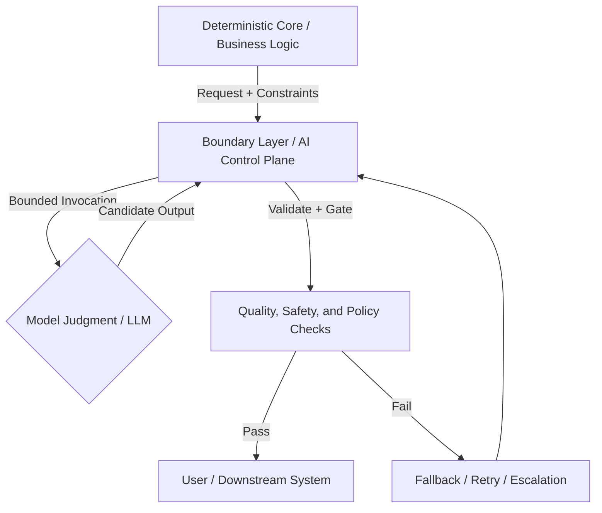

# Uncertainty Architecture (UA)

## Engineering at the AI–Code Boundary

**Uncertainty Architecture** is an open doctrine and pattern language for building and operating software in which part of the system's behavior is delegated to **non-deterministic model judgment**, while the surrounding system remains **deterministic, inspectable, and governable**.

UA is not about eliminating uncertainty or pretending that AI can be made fully deterministic. It is about **containing uncertainty**: deciding where determinism must hold, where judgment is unavoidable, and how the boundary between the two is engineered, observed, and corrected over time.

The project is designed primarily for small and medium-sized engineering organizations that need practical control without building a large governance bureaucracy.

## The Core Shift

Traditional software is mostly built from deterministic components and predefined execution paths. LLM-backed and agentic systems introduce components whose behavior remains probabilistic at runtime.

UA calls this broader class **Behavioral Software**:

- **Linear Software** follows explicitly coded paths.
- **Behavioral Software** pursues goals within constraints while selecting or generating parts of the path dynamically.

The architectural problem is therefore not only model quality. It is how probabilistic judgment is connected to business rules, permissions, data, human authority, release processes, monitoring, and correction.

## What UA Is — and Is Not

UA is:

- a shared way of thinking about systems at the AI–code boundary;
- a set of patterns for containment, evaluation, escalation, and fallback;
- an operational doctrine for governing probabilistic behavior;
- a tool-neutral specification intended to evolve through research and implementation evidence.

UA is not:

- an SDK or universal agent framework;
- a prompt-template collection;
- a single metric or evaluation method;
- a compliance certification;
- a claim that uncertainty can be removed from model behavior.

## Core Model

UA treats AI governance as an engineering control problem.

> **Reliable AI = Actuators + Sensors + Controller**

- **Actuators** shape and constrain behavior: prompts, schemas, policies, permissions, tools, model settings, and execution boundaries.
- **Sensors** detect deviation: evaluations, golden scenarios, runtime signals, incidents, qualitative review, and drift monitoring.
- **Controller** determines corrective action: release gates, ownership, escalation, rollback, retraining, prompt or policy changes, and human decision authority.

This control loop surrounds a critical distinction:

- **Deterministic Core** — business rules, invariants, authentication, data handling, auditability, safety constraints.
- **Model Judgment** — interpretation, synthesis, classification under ambiguity, open-ended generation, and uncertain tool choice.

UA focuses on the boundary between these regions.

## Conceptual Architecture


```mermaid
graph TD;
    A[Deterministic Core / Business Logic] -->|Request + Constraints| B[Boundary Layer / AI Control Plane];
    B -->|Bounded Invocation| C{Model Judgment / LLM};
    C -->|Candidate Output| B;
    B -->|Validate + Gate| D[Quality, Safety, and Policy Checks];
    D -->|Pass| E[User / Downstream System];
    D -->|Fail| F[Fallback / Retry / Escalation];
    F --> B;
```

## Repository Structure

### Normative framework

- [`00-doctrine/`](00-doctrine/) — core concepts, terminology, and boundary thinking.
- [`01-patterns/`](01-patterns/) — reusable containment and interface patterns.
- [`02-ai-control-plane/`](02-ai-control-plane/) — actuators, sensors, controllers, and operating controls.
- [`03-reference-architectures/`](03-reference-architectures/) — worked architectural applications.
- [`04-failure-modes/`](04-failure-modes/) — recurring technical and socio-technical failure modes.

### Supporting knowledge

- [`content/research/`](content/research/) — historical publications, research analysis, provenance, and research-to-framework traceability. Research material is non-normative until deliberately adopted into the specification.
- [`content/history/`](content/history/) — project timeline, public talks, and independent references. This area records history without treating attention, discussion, or invited presentations as proof of adoption.
- [`ROADMAP.md`](ROADMAP.md) — canonical project direction and future priorities.
- [`CHANGELOG.md`](CHANGELOG.md) — repository and specification-artifact changes only.
- [`CONTRIBUTING.md`](CONTRIBUTING.md) — contribution and review workflow.

### Operational assets

- [`assets/`](assets/) — diagrams and visual references.
- [`scripts/`](scripts/) — repository-maintenance automation.
- [`templates/`](templates/) — reusable contribution and specification templates.

## Current Status

**Active specification development.**

The current priority is to consolidate the research corpus into a coherent framework spine, clarify normative boundaries, and derive a practical SMB-facing artifact for mapping risks, required controls, and control cost.

Detailed status and sequencing are maintained in [`ROADMAP.md`](ROADMAP.md).

## Research and Project History

The repository intentionally separates three different records:

- **Research evolution** explains how ideas developed and where claims originated.
- **Project history** records publications, talks, and independent interpretations.
- **Changelog** records what changed in the repository and specification artifacts.

This separation avoids using release history as a marketing timeline and prevents external references from being mistaken for technical validation.

Start here:

- [Research Track](content/research/)
- [Project timeline](content/history/timeline.md)
- [Talks and presentations](content/history/talks.md)
- [Independent references and recognition](content/history/external-recognition.md)

## Community and Contributions

GitHub is the canonical home for doctrine and specification changes. Community discussion and early design review may happen elsewhere, but accepted changes must be represented in the repository.

Useful contributions include:

- operational failure reports and postmortems;
- pattern proposals grounded in real systems;
- critiques of terminology or control assumptions;
- examples of escalation, fallback, and evaluation design;
- corrections that improve provenance or precision.

See [`CONTRIBUTING.md`](CONTRIBUTING.md).

## Authors and Maintainers

### Vitalii Oborskyi — Creator and Lead Architect

Focus: operational framing, governance, delivery systems, adoption scaffolding, and system-level control.

- [LinkedIn](https://www.linkedin.com/in/vitaliioborskyi/)
- [GitHub](https://github.com/oborskyivitalii)

### Sam “stunspot” Walker — Technical Co-Author

Focus: AI–code boundary placement, containment patterns, prompt-as-medium realism, and real-world failure modes.

Additional contributors and reviewers are credited as the work matures.

## Advisory Context

The project has benefited from public discussion and advisory relationships across engineering, project-management standards, academia, and AI delivery. These relationships are documented carefully in [`content/history/external-recognition.md`](content/history/external-recognition.md).

An advisory relationship, recommendation, invited talk, repost, or conceptual convergence does not by itself imply adoption, certification, or organizational endorsement.

## How to Cite

```bibtex
@misc{oborskyi_walker2025uncertainty,
  author = {Oborskyi, Vitalii and Walker, Sam},
  title = {Uncertainty Architecture: An Operational Model for AI Governance},
  year = {2025},
  publisher = {GitHub},
  howpublished = {\url{https://github.com/UncertaintyArchitectureGroup/uncertainty-architecture}}
}
```

## Licensing

This repository uses a dual-license model:

- documentation and specifications: CC BY 4.0;
- code and reference implementations: Apache 2.0.

See [`LICENSING.md`](LICENSING.md) for details.
