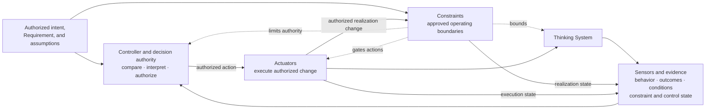

# Uncertainty Architecture (UA)

## Engineering at the AI–Code Boundary

**Uncertainty Architecture** is an open doctrine and pattern language for building and operating software in which part of the system's behavior is delegated to **non-deterministic Model Judgment**, while consequential deterministic responsibilities, Constraints, evidence, decision rights, and corrective mechanisms remain explicit.

UA is designed primarily for small and medium-sized engineering organizations that need practical control without building a large governance bureaucracy.

## Why UA Exists

Traditional software is engineered primarily as explicitly encoded behavior:

```text
y = f(x)
```

A Thinking System delegates part of runtime interpretation, synthesis, planning, or path selection to a probabilistic model:

```text
y ~ P(y | x, context, model configuration)
```

The complete application still contains deterministic code, rules, permissions, data handling, and infrastructure. The difference is that some consequential behavior is generated through runtime judgment rather than fully enumerated in advance.

This changes the controlled object itself. Uncertainty no longer exists only in requirements, users, infrastructure, or delivery assumptions. Part of it is produced inside the operating system through Model Judgment.

UA complements product discovery, Agile, DevOps, QA, security, change management, and incident response. It adds a project-to-runtime control lifecycle for model-mediated behavior.

Read the draft rationale: [`Uncertainty in the Controlled Object`](00-doctrine/uncertainty-in-the-controlled-object.md).

## Two Orthogonal Models

UA separates two questions.

### Where is a decision owned?

The [`Nested Control Lifecycle`](00-doctrine/nested-control-lifecycle.md) distinguishes:

1. organizational control context;
2. project control architecture and viability;
3. delivery-level Thinking System Review;
4. runtime control and reauthorization.

### Which functions make control operational?

The [`Control-Loop Capability Anatomy`](00-doctrine/control-loop-anatomy.md) distinguishes:

1. **Constraints** — approved operating boundaries;
2. **Sensors and evidence** — observation of behavior, outcomes, realization state, and control health;
3. **Controllers and decision authority** — comparison, interpretation, and authorization;
4. **Actuators and corrective action** — execution of authorized change.

The decision levels are not capability layers. The capabilities are not mandatory services.

## Core Control Model


```mermaid
flowchart LR
    R[Authorized intent,<br/>Requirement, and assumptions]
    K[Constraints<br/>approved operating boundaries]
    P[Thinking System]
    S[Sensors and evidence<br/>behavior · outcomes · conditions<br/>constraint and control state]
    C[Controller and decision authority<br/>compare · interpret · authorize]
    A[Actuators<br/>execute authorized change]

    R --> C
    R --> K
    K -. bounds .-> P
    K -. limits authority .-> C
    K -. gates actions .-> A
    P --> S
    K -->|realization state| S
    A -->|execution state| S
    S --> C
    C -->|authorized action| A
    A --> P
    A -->|authorized realization change| K
```

A **Constraint** is the approved boundary. A **Constraint Realization** is the mechanism implementing, enforcing, or influencing it. A **Controller** selects or authorizes action. An **Actuator** executes it.

A closed feedback loop can still be unsafe or over-authorized. Constraints bound the space in which the loop may operate; they are not the feedback edge itself.

For the complete definitions, use the doctrine and glossary rather than this landing page:

- [`Control-Loop Capability Anatomy`](00-doctrine/control-loop-anatomy.md)
- [`Glossary`](00-doctrine/glossary.md)
- [`AI Control Plane`](02-ai-control-plane/)

## Practical SMB Path

UA uses two living review surfaces with different ownership.

### 1. Project authorization

The [`Project Control Architecture and Viability Review`](01-patterns/project-control-architecture-and-viability-review.md) asks whether the proposed Thinking System has a credible and economically viable control architecture.

It connects:

- business outcome and AI necessity;
- project boundary and material scenarios;
- one canonical Project Constraint Architecture;
- required Sensors, Controllers, Actuators, Human Authority, fallback, containment, rollback, compensation, and shutdown;
- evidence feasibility and feedback latency;
- capacity and control economics;
- authorization, conditions, bounded research, redesign, deferral, escalation, or No-Go;
- a versioned baseline for delivery reviews;
- project reauthorization.

Use the [`project review template`](01-patterns/project-control-architecture-and-viability-review-template.md).

### 2. Delivery realization and release

The [`Thinking System Review`](01-patterns/thinking-system-review.md) applies the project boundary to one bounded system, feature, or material change.

It connects:

- implementation-level Judgment Nodes;
- the delivery Requirement and Operating Envelope;
- one canonical Constraint Realization Map;
- Definition of Ready;
- implementation or bounded experiment;
- Definition of Done;
- deployment-specific Release Gate;
- runtime evidence and reassessment.

Use the [`delivery review template`](01-patterns/thinking-system-review-template.md).

A successful demo is not project authorization. DoD is not release authorization. A Release Gate does not expand the project boundary. `No-Go` remains a valid engineering result.

## Constraint Engineering

Constraints may address:

- structure and interfaces;
- authority and actions;
- states and transactions;
- data and context;
- resources and exposure;
- environment and dependencies;
- Human Authority;
- probabilistic behavioral influence.

A **Hard Constraint** deterministically prevents or rejects violation within stated assumptions, scope, and enforcement boundaries.

A prompt, natural-language policy, probabilistic evaluator, or model safety classifier is not hard by itself.

Implementation mechanisms and examples are documented in:

- [`Constraint Capabilities`](02-ai-control-plane/01-constraints/)
- [`Constraint Realization Catalog`](02-ai-control-plane/01-constraints/constraint-realization-catalog.md)

Named technologies are examples, not requirements.

## Start Here

1. [`SPECIFICATION.md`](SPECIFICATION.md) — scope, status, conformance, and change control.
2. [`00-doctrine/uncertainty-in-the-controlled-object.md`](00-doctrine/uncertainty-in-the-controlled-object.md) — why the controlled object changed.
3. [`00-doctrine/control-loop-anatomy.md`](00-doctrine/control-loop-anatomy.md) — capability relationships.
4. [`00-doctrine/nested-control-lifecycle.md`](00-doctrine/nested-control-lifecycle.md) — decision ownership and reauthorization.
5. [`00-doctrine/glossary.md`](00-doctrine/glossary.md) — canonical terminology.
6. [`01-patterns/project-control-architecture-and-viability-review.md`](01-patterns/project-control-architecture-and-viability-review.md) — project decision.
7. [`01-patterns/thinking-system-review.md`](01-patterns/thinking-system-review.md) — delivery decision.
8. [`02-ai-control-plane/`](02-ai-control-plane/) — control capabilities.
9. [`03-reference-architectures/`](03-reference-architectures/) — non-prescriptive compositions.
10. [`04-failure-modes/`](04-failure-modes/) — recurring loss-of-control mechanisms.

## Repository Structure

### Specification modules

- [`00-doctrine/`](00-doctrine/) — foundational concepts, terminology, capability anatomy, Requirements, and lifecycle distinctions.
- [`01-patterns/`](01-patterns/) — project review, Judgment Node Boundary, delivery review, and reusable control patterns.
- [`02-ai-control-plane/`](02-ai-control-plane/) — distributed control capabilities:
  - [`00-actuators/`](02-ai-control-plane/00-actuators/)
  - [`01-constraints/`](02-ai-control-plane/01-constraints/)
  - [`02-sensors/`](02-ai-control-plane/02-sensors/)
  - [`03-controller/`](02-ai-control-plane/03-controller/)
- [`03-reference-architectures/`](03-reference-architectures/) — worked, non-prescriptive applications.
- [`04-failure-modes/`](04-failure-modes/) — reusable failure mechanisms.

The directory numbering inside the AI Control Plane is navigation only. It does not define a required execution order or physical stack.

### Supporting material

- [`content/research/`](content/research/) — research, provenance, synthesis, and framework traceability.
- [`content/history/`](content/history/) — chronology, talks, references, and preserved public context.
- [`content/raw/`](content/raw/) — source snapshots.
- [`ROADMAP.md`](ROADMAP.md) — current development direction.
- [`CHANGELOG.md`](CHANGELOG.md) — notable repository changes.
- [`AGENTS.md`](AGENTS.md) — operational protocol for AI-assisted contributors.

## What UA Is — and Is Not

UA is:

- a shared architectural language for Thinking Systems;
- a doctrine for deterministic responsibilities, probabilistic judgment, Constraints, evidence, authority, and corrective action;
- a project-to-runtime control lifecycle;
- a lightweight project authorization and delivery review approach;
- a tool-neutral open specification intended to evolve through research and implementation evidence.

UA is not:

- an SDK or universal agent framework;
- a prompt-template or guardrail collection;
- one policy engine, metric, evaluator, or vendor stack;
- a mandatory four-service topology;
- a replacement for product discovery, Agile, DevOps, QA, security, or incident response;
- a mandatory governance department;
- a compliance certification;
- a claim that uncertainty can be eliminated.

## Status

The repository is an evolving open specification. Documents declare their own status and maturity. Draft-normative content remains subject to review and application evidence.

See [`SPECIFICATION.md`](SPECIFICATION.md) for the authoritative status model and conformance boundary.

## Contributing

Start with:

- [`CONTRIBUTING.md`](CONTRIBUTING.md)
- [`AGENTS.md`](AGENTS.md) for AI-assisted work
- [`DOCUMENT-METADATA.md`](DOCUMENT-METADATA.md)
- [`content/research/review-process.md`](content/research/review-process.md)

Documentation is licensed under CC BY 4.0. Code, where present, is licensed under Apache 2.0.
